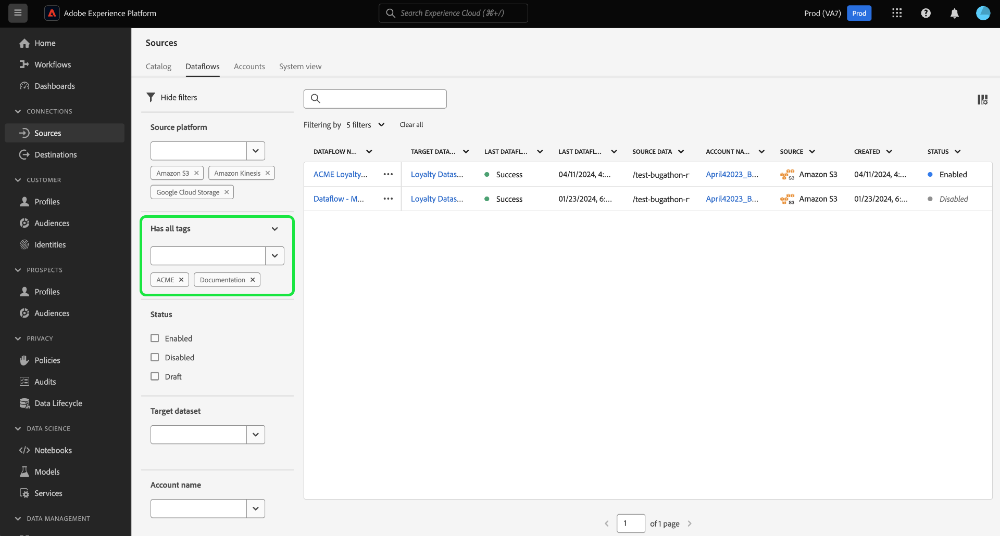
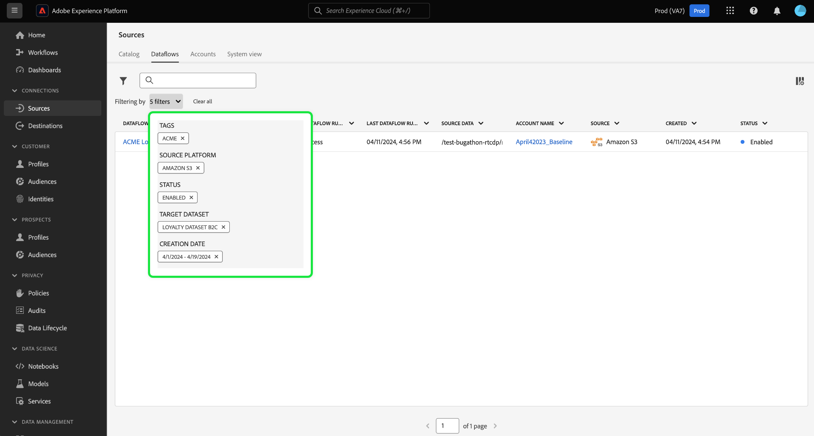
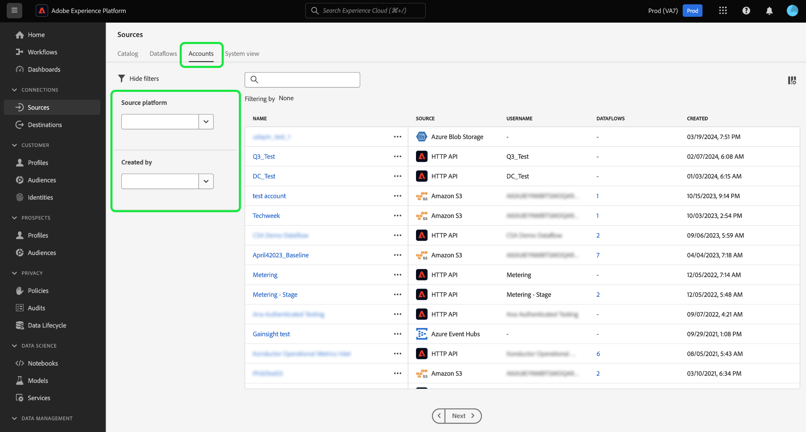

# Filtrar objetos de fontes na interface

Use as ferramentas de filtragem, pesquisa e ação em linha na interface do usuário do Adobe Experience Platform para simplificar seu fluxo de trabalho na [!UICONTROL Origens] espaço de trabalho

* Use os recursos de filtragem e pesquisa para navegar pelas contas de origem e fluxos de dados na organização.
* Use ações em linha para modificar as configurações aplicadas aos seus fluxos de dados e melhorar os fluxos de trabalho organizacionais. Você pode usar ações em linha para aplicar tags, configurar alertas ou criar trabalhos de assimilação sob demanda.

## Introdução

É útil compreender os seguintes recursos e conceitos de Experience Platform antes de trabalhar com as ferramentas de navegação por objetos no espaço de trabalho de origens:

* [Origens](../../home.md): use fontes no Experience Platform para assimilar dados de um aplicativo Adobe ou de uma fonte de dados de terceiros.
* [Tags administrativas](../../../administrative-tags/overview.md): use tags administrativas para aplicar palavras-chave de metadados a seus objetos e permitir que a pesquisa localize esse objeto no ecossistema de Experience Platform.
* [Alertas](../../../observability/home.md): use alertas para receber notificações que fornecem uma atualização sobre o status de objetos, como seus fluxos de dados de origens.
* [Fluxos de dados](../../../dataflows/home.md): Fluxos de dados são representações de trabalhos de dados que movem os dados pelo Experience Platform. Você pode usar o espaço de trabalho de origens para criar fluxos de dados que assimilam dados de uma determinada origem para o Experience Platform.
* [Conjuntos de dados](../../../catalog/datasets/user-guide.md): um conjunto de dados é uma construção de armazenamento e gerenciamento para uma coleção de dados, normalmente uma tabela, que contém um esquema (colunas) e campos (linhas).
* [Sandboxes](../../../sandboxes/home.md): use sandboxes no Experience Platform para criar partições virtuais entre as instâncias do Experience Platform e criar ambientes dedicados ao desenvolvimento ou produção.

## Filtrar fluxos de dados de origens {#filter-sources-dataflows}

Na interface do Experience Platform, selecione **[!UICONTROL Origens]** na navegação à esquerda e selecione **[!UICONTROL Fluxos de dados]** no cabeçalho superior.

Por padrão, o menu de filtro é exibido à esquerda da interface. Para ocultar o menu, selecione **[!UICONTROL Ocultar filtros]**.

Você pode filtrar seus fluxos de dados de origens pelos seguintes parâmetros:

| Filtro | Descrição |
| --- | --- |
| [Plataforma de origem](#filter-dataflows-by-source-platform) | Filtre seus fluxos de dados com base na origem com a qual foram criados. |
| [Tags](#filter-dataflows-by-tags) | Filtre seus fluxos de dados com base nas tags aplicadas a eles. |
| [Status](#filter-dataflows-by-status) | Filtre seus fluxos de dados com base em seus status atuais. |
| [Conjunto de dados de destino](#filter-dataflows-by-target-dataset) | Filtre seus fluxos de dados com base no conjunto de dados de destino com o qual foram criados. |
| [Nome da conta](#filter-dataflows-by-account-name) | Filtre seus fluxos de dados com base no nome da conta com a qual eles correspondem. |
| [Criado por](#filter-dataflows-by-user) | Filtre seus fluxos de dados com base em quem os criou. |
| [Data de criação](#filter-dataflows-by-creation-date) | Filtre seus fluxos de dados com base na data em que foram criados. |
| [Data de modificação](#filter-dataflows-by-modification-date) | Filtre seus fluxos de dados com base na data em que foram atualizados pela última vez. |

### Filtrar fluxos de dados por plataforma de origem {#filter-dataflows-by-source-platform}

Use o [!UICONTROL Plataforma de origem] para filtrar seus fluxos de dados por tipo de origem. Você pode digitar uma fonte específica ou usar o menu suspenso para ver uma lista de fontes no catálogo. Também é possível filtrar por várias fontes diferentes para uma determinada consulta. Por exemplo, você pode selecionar [!DNL Amazon S3], [!DNL Azure Data Lake Storage Gen2], e [!DNL Google Cloud Storage] para atualizar o catálogo e exibir somente os fluxos de dados criados com as fontes selecionadas.

### Filtrar fluxos de dados por tags {#filter-dataflows-by-tags}

Use o painel tags para filtrar seus fluxos de dados pelas respectivas tags.

Selecionar **[!UICONTROL Tem qualquer tag]** e selecione as tags que deseja filtrar usando o menu suspenso. Use essa configuração para filtrar fluxos de dados que tenham qualquer uma das tags selecionadas.

Selecionar **[!UICONTROL Tem todas as tags]** e selecione as tags que deseja filtrar usando o menu suspenso. Use essa configuração para filtrar fluxos de dados que tenham todas as tags selecionadas.

### Filtrar fluxos de dados por status {#filter-dataflows-by-status}

Você pode filtrar por status usando a variável [!UICONTROL Status] painel.

| Status | Descrição |
| --- | --- |
| Ativado | Selecionar **[!UICONTROL Ativado]** para filtrar sua visualização e exibir apenas os fluxos de dados ativos. |
| Desabilitado | Selecionar **[!UICONTROL Desabilitado]** para filtrar sua visualização e exibir somente fluxos de dados desativados. |
| Rascunho | Selecionar **[!UICONTROL Rascunho]** para filtrar sua visualização e exibir somente os fluxos de dados que estão no modo rascunho. |

### Filtrar fluxos de dados por conjunto de dados de destino {#filter-dataflows-by-target-dataset}

Selecionar **[!UICONTROL Conjunto de dados de destino]** para acessar um menu suspenso de todos os conjuntos de dados de destino. Em seguida, selecione um conjunto de dados de destino para filtrar sua visualização e exibir apenas os fluxos de dados que foram criados usando seus conjuntos de dados de destino especificados.

### Filtrar fluxos de dados por nome de conta {#filter-dataflows-by-account-name}

Selecionar **[!UICONTROL Nome da conta]** para acessar um menu suspenso de todas as contas. Em seguida, selecione uma conta para filtrar sua visualização e exibir os fluxos de dados criados pela conta selecionada.

### Filtrar fluxos de dados por usuário {#filter-dataflows-by-user}

Use o [!UICONTROL Criado por] painel para filtrar fluxos de dados pelo usuário que criou ou atualizou os fluxos de dados pela última vez. Selecione a lista suspensa e, em seguida, selecione o nome de usuário pelo qual filtrar seus fluxos de dados.

### Filtrar fluxos de dados por data de criação {#filter-dataflows-by-creation-date}

Você pode filtrar seus fluxos de dados pelas datas de criação. No [!UICONTROL Data de criação] , configure uma data de início e uma data de término para criar uma janela de intervalo de tempo e filtrar sua visualização para exibir somente os fluxos de dados criados nessa janela.

Você pode configurar o intervalo de tempo inserindo as datas de início e término. Como alternativa, selecione o ícone de calendário e use o calendário para configurar suas datas.

Você também pode seguir as mesmas etapas, mas filtrar os fluxos de dados pela última data de modificação, em vez da data de criação.

### Filtrar fluxos de dados por data de modificação {#filter-dataflows-by-modification-date}

Da mesma forma, você pode aplicar os mesmos princípios e filtrar seu fluxo de dados por suas datas de modificação. Use o **[!UICONTROL Data de modificação]** para configurar um intervalo de tempo específico e filtrar sua visualização para exibir somente os fluxos de dados que foram modificados durante esse período.

### Combinar filtros {#combine-filters}

É possível combinar diferentes filtros para ampliar ou restringir sua pesquisa. No exemplo abaixo, um filtro é aplicado para pesquisar por:

* Fluxos de dados criados usando o [!DNL Amazon S3] origem.
* Fluxos de dados que contêm o **[!DNL ACME]** tag.
* Fluxos de dados que estão habilitados no momento.
* Fluxos de dados criados usando o [!DNL Loyalty Dataset B2C] conjunto de dados.
* Fluxos de dados criados entre 1/4/2024 e 19/4/2024.

Para remover todos os filtros, selecione **[!UICONTROL Limpar tudo]**.

## Filtrar contas de origem {#filter-sources-accounts}

Na interface do Experience Platform, selecione [!UICONTROL Origens] na navegação à esquerda e selecione **[!UICONTROL Contas]** no cabeçalho superior. Você pode filtrar suas contas de origem com base na origem com a qual foram criadas ou no usuário que as criou.

## Pesquisar contas e fluxos de dados {#search-for-accounts-and-dataflows}

Você pode acelerar a eficiência usando a barra de pesquisa para navegar imediatamente para uma conta ou fluxo de dados específico.

>[!BEGINTABS]

>[!TAB Pesquisar fluxos de dados]

Use a barra de pesquisa no [!UICONTROL Fluxos de dados] página para encontrar um fluxo de dados específico. Você pode pesquisar um fluxo de dados usando seu nome ou descrição.

>[!TAB Pesquisar contas]

Use a barra de pesquisa no [!UICONTROL Contas] página para encontrar uma conta específica. É possível pesquisar uma conta usando seu nome ou descrição.

>[!ENDTABS]

## Ações embutidas para fluxos de dados de origens {#inline-actions-for-sources-dataflows}

Selecione as reticências (`...`) ao lado de um nome de fluxo de dados para obter uma lista de ações em linha que você pode usar para fazer modificações no seu fluxo de dados.

| Ações embutidas | Descrição |
| --- | --- |
| [!UICONTROL Editar programação] | Selecionar **[!UICONTROL Editar programação]** para atualizar a programação de assimilação do fluxo de dados. Um fluxo de dados que foi definido para assimilação única não pode ser editado. |
| [!UICONTROL Desativar fluxo de dados] | Selecionar **[!UICONTROL Desativar fluxo de dados]** para desativar uma execução de fluxo de dados. Essa opção não exclui o fluxo de dados. |
| [!UICONTROL Exibir no monitoramento] | Selecionar **[!UICONTROL Exibir no monitoramento]** para exibir as métricas e o status do seu fluxo de dados no painel de monitoramento. Para obter mais informações, leia o guia em [monitoramento de fluxos de dados de fontes](../../../dataflows/ui/monitor-sources.md). |
| [!UICONTROL Excluir] | Selecionar **[!UICONTROL Excluir]** para excluir seu fluxo de dados. |
| [!UICONTROL Executar sob demanda] | Selecionar **[!UICONTROL Executar sob demanda]** para acionar uma única iteração de uma execução de fluxo de dados. Para obter mais informações, leia o guia em [criação de uma execução de fluxo de dados sob demanda](../ui/on-demand-ingestion.md). |
| [!UICONTROL Assinar alertas] | Selecionar **[!UICONTROL Assinar alertas]** para exibir uma janela pop-up de alertas nos quais você pode se inscrever: <ul><li>Início da execução do fluxo de dados de origens: selecione esse alerta para receber uma notificação quando a execução do fluxo de dados por solicitação começar.</li><li>Êxito na execução do fluxo de dados de origens: selecione esse alerta para receber uma notificação quando a execução do fluxo de dados por demanda for concluída com êxito.</li><li>Falha na execução do fluxo de dados de origens: selecione esse alerta quando a execução do fluxo de dados sob demanda falhar devido a erros.</li></ul> Para obter mais informações, leia o guia em [assinatura de alertas para fluxos de dados de origens](../ui/alerts.md). |
| [!UICONTROL Adicionar ao pacote] | Selecionar **[!UICONTROL Adicionar ao pacote]** para adicionar seu fluxo de dados a um pacote e exportá-lo para uso em uma sandbox diferente. Durante essa etapa, é possível criar um novo pacote ou adicionar o fluxo de dados a um pacote existente. Para obter mais informações, leia o guia em [ferramentas de sandbox](../../../sandboxes/ui/sandbox-tooling.md). |
| [!UICONTROL Gerenciar tags] | Selecionar **[!UICONTROL Gerenciar tags]** para adicionar ou remover tags do fluxo de dados. Use tags para gerenciar taxonomias de metadados e classificar objetos de negócios para facilitar a descoberta e a categorização. Para obter mais informações, leia o guia em [gerenciamento de tags](../../../administrative-tags/ui/managing-tags.md). |

## Próximas etapas

Ao ler este documento, você aprendeu a navegar pelas páginas de fontes, contas e fluxos de dados. Para obter mais informações sobre fontes, leia a [visão geral das origens](../../home.md).