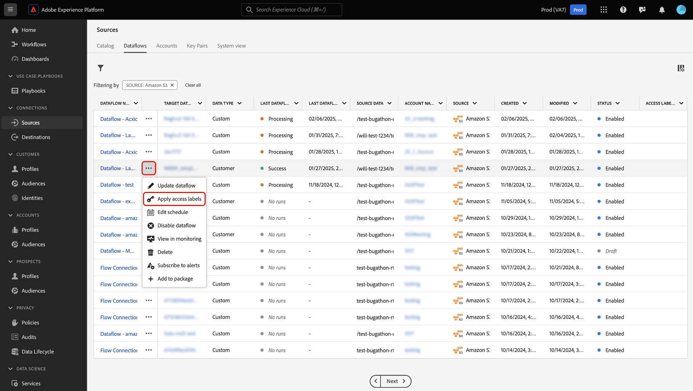
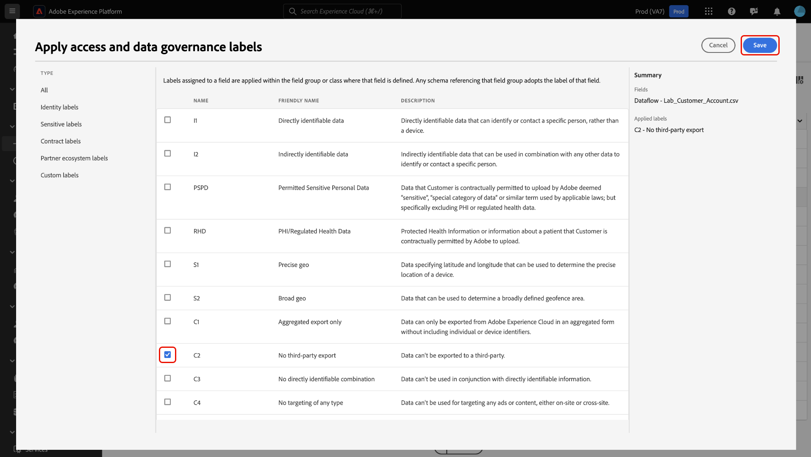

# Aplicar rótulos de acesso para gerenciar o acesso do usuário a fluxos de dados de origens na interface

Você pode usar as funcionalidades fornecidas pelo [controle de acesso baseado em atributos](../../../access-control/abac/overview.md) no Real-Time CDP para aplicar rótulos aos seus fluxos de dados de fontes. Com esse recurso, você pode garantir que apenas um subconjunto de usuários em sua organização tenha acesso a fluxos de dados de fontes específicas.

Ao adicionar um rótulo de acesso a um fluxo de dados específico, somente os usuários que têm acesso a uma função atribuída a esse rótulo podem exibir e editar esse fluxo de dados. Se um fluxo de dados de fontes não estiver marcado com rótulos, ele ficará visível para todos os usuários que pertencem à sua organização. Por exemplo, se você aplicar o rótulo C12 a um fluxo de dados, os usuários atribuídos a uma função que não tem o rótulo C12 não poderão exibir e editar o fluxo de dados com o rótulo C12.

Leia este guia para obter informações sobre como aplicar rótulos de acesso aos fluxos de dados de suas fontes usando a interface do usuário do Adobe Experience Platform.

## Introdução

Antes de trabalhar com rótulos de controle de acesso, primeiro familiarize-se com os recursos do controle de acesso baseado em atributos. Para obter mais informações, leia a seguinte documentação:

* [Visão geral do controle de acesso baseado em atributos](../../../access-control/abac/overview.md)
* [Guia completo do controle de acesso baseado em atributos](../../../access-control/abac/end-to-end-guide.md)
* [Gerenciar rótulos usando a interface de permissões](../../../access-control/abac/ui/labels.md)
* [Glossário de rótulos de uso de dados](../../../data-governance/labels/reference.md)

## Aplicar rótulos de acesso a fluxos de dados de origens

>[!NOTE]
>
>* Não é possível aplicar rótulos a uma execução de fluxo. No entanto, as execuções de fluxo herdam todos os rótulos que você aplica ao fluxo de dados principal.
>
>* Se você não tiver acesso de visualização a um fluxo de dados, também não poderá visualizar as execuções de fluxo correspondentes.

Para aplicar rótulos de acesso aos fluxos de dados de suas fontes, navegue até **[!UICONTROL Fontes]** > **[!UICONTROL Fluxos de Dados]** e localize o fluxo de dados ao qual você deseja atualizar e limitar o acesso do usuário.

Em seguida, selecione as reticências (`...`) na coluna [!UICONTROL Nome] e selecione **[!UICONTROL Aplicar rótulos de acesso]** para adicionar e gerenciar rótulos para o fluxo de dados selecionado.

A janela [!UICONTROL Aplicar rótulos de acesso e governança de dados] é exibida. Use essa janela para selecionar os rótulos que deseja aplicar ao fluxo de dados. Também é possível filtrar rótulos por tipo. Quando terminar, selecione **[!UICONTROL Salvar]**.

Depois de configurar com sucesso os rótulos de acesso ao seu fluxo de dados, qualquer usuário que não tenha acesso a esse rótulo não poderá mais recuperar o fluxo de dados. Você também pode usar a coluna [!UICONTROL Rótulos de Acesso] para exibir os rótulos aplicados a um determinado fluxo de dados.

## Próximas etapas

Agora você sabe como aplicar rótulos de acesso aos fluxos de dados de suas fontes. Agora é possível garantir que somente um grupo específico de usuários em sua organização possa acessar determinados fluxos de dados de fontes. Leia a documentação a seguir para obter mais informações:

* [Aplicar rótulos de acesso a fluxos de dados de origens na API](../api/labels.md)
* [Visão geral do controle de acesso](../../../access-control/home.md)