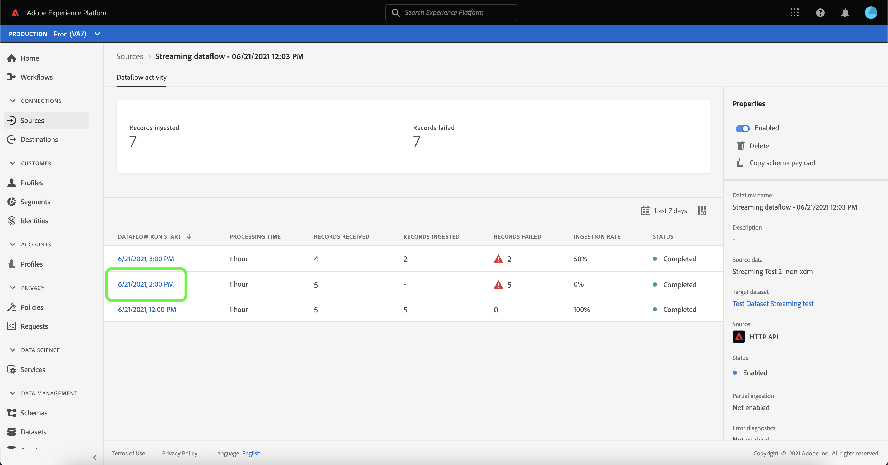

# Monitorar fluxos de dados para fontes de transmissão na interface do usuário

Este tutorial aborda as etapas para monitorar fluxos de dados para fontes de transmissão usando o espaço de trabalho [!UICONTROL Fontes].

## Introdução

Este tutorial requer uma compreensão funcional dos seguintes componentes do Adobe Experience Platform:

* [Fluxos de dados](../../../dataflows/home.md): Os fluxos de dados são uma representação de trabalhos de dados que movem dados pela Plataforma. Os fluxos de dados são configurados em diferentes serviços, ajudando a mover dados de conectores de origem para conjuntos de dados de destino, para [!DNL Identity] e [!DNL Profile] e para [!DNL Destinations].
   * [O fluxo de dados é executado](../../notifications.md): As execuções de fluxo de dados são trabalhos agendados recorrentes com base na configuração de frequência de fluxos de dados selecionados.
* [Fontes](../../home.md): O Experience Platform permite que os dados sejam assimilados de várias fontes, fornecendo a capacidade de estruturar, rotular e aprimorar os dados recebidos usando os serviços da plataforma.
* [Sandboxes](../../../sandboxes/home.md): O Experience Platform fornece sandboxes virtuais que particionam uma única instância da Platform em ambientes virtuais separados para ajudar a desenvolver aplicativos de experiência digital.

## Monitorar fluxos de dados para fontes de transmissão

Na interface do usuário da plataforma, selecione **[!UICONTROL Fontes]** na barra de navegação esquerda para acessar o espaço de trabalho [!UICONTROL Fontes]. A tela [!UICONTROL Catálogo] exibe uma variedade de fontes com as quais você pode criar uma conta.

Para exibir fluxos de dados existentes para fontes de transmissão, selecione **[!UICONTROL Fluxos de dados]** no cabeçalho superior.

A página [!UICONTROL Fluxos de dados] contém uma lista de todos os fluxos de dados existentes em sua organização, incluindo informações sobre seus dados de origem, nome da conta e status de execução do fluxo de dados.

Selecione o nome do fluxo de dados que deseja visualizar.

A tabela a seguir contém mais informações sobre os status de execução do fluxo de dados:

| Status | Descrição |
| ------ | ----------- |
| Concluído | O status `Completed` indica que todos os registros para a execução do fluxo de dados correspondente foram processados dentro do período de uma hora. Um status `Completed` ainda pode conter erros nas execuções do fluxo de dados. |
| Processamento | O status `Processing` indica que um fluxo de dados ainda não está ativo. Esse status geralmente é encontrado imediatamente após a criação de um novo fluxo de dados. |
| Erro | O status `Error` indica que o processo de ativação de um fluxo de dados foi interrompido. |

A página [!UICONTROL Atividade do Fluxo de Dados] exibe informações específicas no seu fluxo de dados de transmissão. O banner superior contém o número cumulativo de registros assimilados e os registros falharam em todas as suas execuções de fluxo de dados no intervalo de datas selecionado.

A metade inferior da página exibe informações sobre o número de registros recebidos, assimilados e com falha, por execução de fluxo. Cada execução de fluxo é registrada em uma janela por hora.

Cada execução de fluxo de dados individual mostra os seguintes detalhes:

* **[!UICONTROL Início]** da execução do fluxo de dados: A hora em que a execução do fluxo de dados começou.
* **[!UICONTROL Tempo]** de processamento: O tempo necessário para o processamento do fluxo de dados.
* **[!UICONTROL Registros recebidos]**: O número total de registros recebidos no fluxo de dados de um conector de origem.
* **[!UICONTROL Registros assimilados]**: A contagem total de registros assimilados no  [!DNL Data Lake].
* **[!UICONTROL Registros com falha]**: O número de registros que não foram assimilados  [!DNL Data Lake] devido a erros nos dados.
* **[!UICONTROL Taxa]** de assimilação: A taxa de sucesso dos registros assimilados no  [!DNL Data Lake]. Essa métrica é aplicável quando [!UICONTROL Assimilação parcial] está ativada.
* **[!UICONTROL Status]**: Representa o estado em que o fluxo de dados está: Concluído   ou  [!UICONTROL Processando].  Concluído significa que todos os registros para a execução de fluxo de dados correspondente foram processados dentro do período de uma hora.  Processamento significa que a execução do fluxo de dados ainda não foi concluída.

Por padrão, os dados exibidos contêm taxas de ingestão dos últimos sete dias. Selecione **[!UICONTROL Últimos 7 dias]** para ajustar o intervalo de tempo dos registros exibidos.

Uma janela pop-up do calendário é exibida, fornecendo opções para intervalos de tempo de ingestão alternativos. Selecione **[!UICONTROL Últimos 30 dias]** e selecione **[!UICONTROL Aplicar]**.

Para exibir os detalhes de uma execução específica do fluxo de dados, incluindo seus erros, selecione a hora de início da execução na lista.

A página [!UICONTROL Visão geral da execução do fluxo de dados] contém informações adicionais sobre o fluxo de dados, como a ID de execução do fluxo de dados correspondente, o conjunto de dados de destino e a ID da organização IMS.

Uma execução de fluxo com erros também contém o painel [!UICONTROL Dataflow run errors], que exibe o erro específico que levou à falha da execução, bem como a contagem total de registros que falharam.

## Próximas etapas

Ao seguir este tutorial, você usou com sucesso o espaço de trabalho [!UICONTROL Fontes] para monitorar seus fluxos de dados de transmissão e identificar os erros que resultaram em qualquer fluxo de dados com falha. Consulte os seguintes documentos para obter mais informações:

* [Visão geral das fontes](../../home.md)
* [Visão geral dos fluxos de dados](../../../dataflows/home.md)