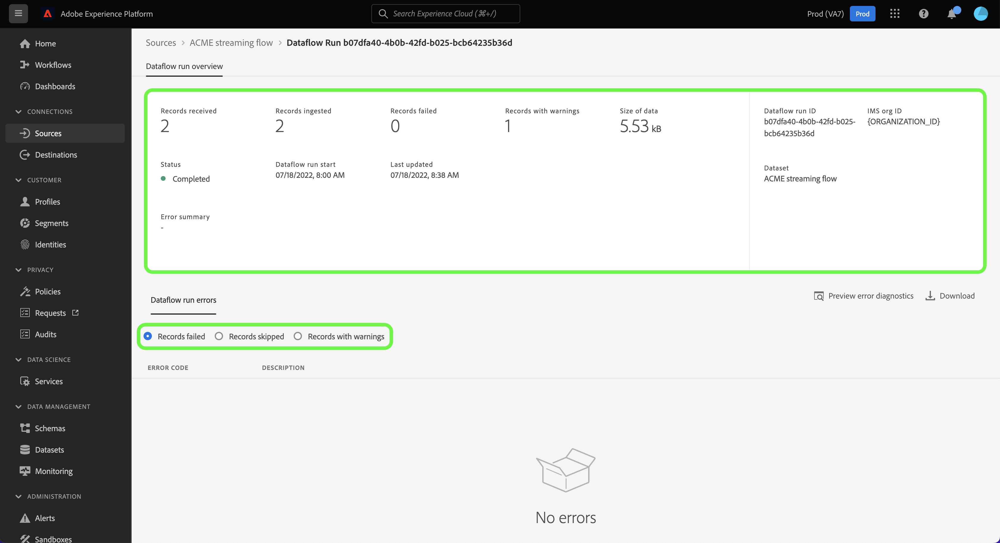

# Monitorar fluxos de dados para fontes de transmissão na interface do usuário

Este tutorial aborda as etapas para monitorar fluxos de dados para fontes de transmissão usando o [!UICONTROL Fontes] espaço de trabalho.

## Introdução

Este tutorial requer uma compreensão funcional dos seguintes componentes do Adobe Experience Platform:

* [Fluxos de dados](../../../dataflows/home.md): Os fluxos de dados são uma representação de trabalhos de dados que movem dados pela Plataforma. Os fluxos de dados são configurados em diferentes serviços, ajudando a mover dados de conectores de origem para conjuntos de dados de destino, para [!DNL Identity] e [!DNL Profile]e para [!DNL Destinations].
   * [Execuções do fluxo de dados](../../notifications.md): As execuções de fluxo de dados são trabalhos agendados recorrentes com base na configuração de frequência de fluxos de dados selecionados.
* [Fontes](../../home.md): O Experience Platform permite que os dados sejam assimilados de várias fontes, fornecendo a capacidade de estruturar, rotular e aprimorar os dados recebidos usando os serviços da plataforma.
* [Sandboxes](../../../sandboxes/home.md): O Experience Platform fornece sandboxes virtuais que particionam uma única instância da Platform em ambientes virtuais separados para ajudar a desenvolver aplicativos de experiência digital.

## Monitorar fluxos de dados para fontes de transmissão

Na interface do usuário da plataforma, selecione **[!UICONTROL Fontes]** na barra de navegação esquerda para acessar o [!UICONTROL Fontes] espaço de trabalho. O [!UICONTROL Catálogo] exibe uma variedade de fontes com as quais você pode criar uma conta.

Para exibir fluxos de dados existentes para fontes de transmissão, selecione **[!UICONTROL Fluxos de dados]** no cabeçalho superior.

O [!UICONTROL Fluxos de dados] contém uma lista de todos os fluxos de dados existentes em sua organização, incluindo informações sobre seus dados de origem, nome da conta e status de execução do fluxo de dados.

Selecione o nome do fluxo de dados que deseja visualizar.

A tabela a seguir contém mais informações sobre os status de execução do fluxo de dados:

| Status | Descrição |
| ------ | ----------- |
| Concluído | O `Completed` status indica que todos os registros para a execução do fluxo de dados correspondente foram processados dentro do período de uma hora. A `Completed` o status ainda pode conter erros nas execuções do fluxo de dados. |
| Sucesso | O `Success` status indica que todos os registros para a execução do fluxo de dados correspondente foram processados no período de uma hora e que não houve erros encontrados durante a execução do fluxo de dados. |
| Processamento | O `Processing` status indica que um fluxo de dados ainda não está ativo. Esse status geralmente é encontrado imediatamente após a criação de um novo fluxo de dados. |
| Erro | O `Error` status indica que o processo de ativação de um fluxo de dados foi interrompido. |
| Nenhuma execução | O `No runs` status indica que o fluxo de dados foi criado, mas nenhuma execução do fluxo de dados foi iniciada. |

O [!UICONTROL Atividade do fluxo de dados] exibe informações específicas no seu fluxo de dados de transmissão. O banner superior contém o número cumulativo de registros assimilados e os registros falharam em todas as suas execuções de fluxo de dados no intervalo de datas selecionado.

Por padrão, os dados exibidos contêm taxas de ingestão dos últimos sete dias. Selecionar **[!UICONTROL Últimos 7 dias]** para ajustar o período de tempo dos registros exibidos.

Uma janela pop-up do calendário é exibida, fornecendo opções para intervalos de tempo de ingestão alternativos. Você pode configurar o período de execução do fluxo de dados para exibir as execuções do fluxo dos sete dias anteriores ou dos últimos 30 dias. Como alternativa, você configura o calendário interativo para definir um período personalizado de sua escolha. Quando terminar, selecione **[!UICONTROL Aplicar]**.

A metade inferior da página exibe informações sobre o número de registros recebidos, assimilados e com falha, por execução de fluxo. Cada execução de fluxo é registrada em uma janela por hora.

### Métricas de execução do fluxo de dados {#dataflow-run-metrics}

>[!CONTEXTUALHELP]
>id="platform_sources_dataflow_records_received"
>title="Registros recebidos"
>abstract="A métrica Registros recebidos indica a contagem total de registros recebidos no fluxo de dados."
>text="Learn more in documentation"

>[!CONTEXTUALHELP]
>id="platform_sources_dataflow_records_ingested"
>title="Registros assimilados"
>abstract="A métrica Registros assimilados indica a contagem total de registros assimilados no lago de dados."
>text="Learn more in documentation"

>[!CONTEXTUALHELP]
>id="platform_sources_dataflow_records_failed"
>title="Falha nos registros"
>abstract="A métrica Registros com falha indica a contagem total de registros que não foram assimilados no lago de dados devido a erros nos dados."
>text="Learn more in documentation"

>[!CONTEXTUALHELP]
>id="platform_sources_dataflow_records_warnings"
>title="Registros com avisos"
>abstract="Os Registros com Avisos indicam a contagem total de registros assimilados com avisos de transformação do mapeador. Todos os erros de transformação do mapeador são relatados como avisos e linhas que são parcialmente assimiladas são consideradas bem-sucedidas com um aviso"
>text="Learn more in documentation"

Cada execução de fluxo de dados individual mostra os seguintes detalhes:

* **[!UICONTROL Início da execução do fluxo de dados]**: A hora em que a execução do fluxo de dados começou.
* **[!UICONTROL Tempo de processamento]**: O tempo necessário para o processamento do fluxo de dados.
* **[!UICONTROL Registros recebidos]**: O número total de registros recebidos no fluxo de dados de um conector de origem.
* **[!UICONTROL Registros assimilados]**: A contagem total de registros assimilados em [!DNL Data Lake].
* **[!UICONTROL Registros com avisos]**: A contagem total de registros com avisos que foram assimilados. Todos os erros de transformação do mapeador são relatados como avisos e linhas que são parcialmente assimiladas são rotuladas como `success` com um aviso. **Observação**: O suporte para assimilar registros com avisos só está disponível para fontes de transmissão.
* **[!UICONTROL Registros com Falha]**: O número de registros que não foram assimilados em [!DNL Data Lake] devido a erros nos dados.
* **[!UICONTROL Taxa de assimilação]**: A taxa de sucesso de registros assimilados em [!DNL Data Lake]. Essa métrica é aplicável quando [!UICONTROL Ingestão parcial] estiver ativado.
* **[!UICONTROL Status]**: Representa o estado em que o fluxo de dados está: ou [!UICONTROL Concluído] ou [!UICONTROL Processamento]. [!UICONTROL Concluído] significa que todos os registros para a execução do fluxo de dados correspondente foram processados no período de uma hora. [!UICONTROL Processamento] significa que a execução do fluxo de dados ainda não foi concluída.

O [!UICONTROL Visão geral da execução do fluxo de dados] contém informações adicionais sobre o fluxo de dados, como a ID de execução do fluxo de dados correspondente, o conjunto de dados de destino e a ID da organização.

Uma execução de fluxo com erros também contém a variável [!UICONTROL Erros de execução do fluxo de dados] , que exibe o erro específico que levou à falha da execução, bem como a contagem total de registros que falharam.

### Exibir registros com avisos {#warnings}

[!UICONTROL Registros com avisos] exibe uma lista de avisos de transformação do mapeador que ocorreram durante a execução do fluxo. As linhas que são parcialmente assimiladas são consideradas bem-sucedidas e são anexadas com avisos se algum erro de transformação do mapeador for encontrado.

Por padrão, todos os erros de transformação do mapeador são considerados avisos, exceto se forem um dos seguintes:

* Erros de sintaxe
* Referências a atributos que não existem
* Uma incompatibilidade dos tipos de dados XDM

Para visualizar o diagnóstico de erros, selecione **[!UICONTROL Visualizar diagnósticos de erro]**.

O [!UICONTROL Visualização do diagnóstico de erros] permite visualizar até 100 erros e/ou avisos relacionados à execução do fluxo de dados. Aqui, você também pode baixar o manifesto de falha de assimilação para obter mais informações, usando o [!DNL Data Access] API.

## Próximas etapas

Ao seguir este tutorial, você usou com sucesso a variável [!UICONTROL Fontes] espaço de trabalho para monitorar seus fluxos de dados de transmissão e identificar os erros que levaram a qualquer fluxo de dados com falha. Consulte os seguintes documentos para obter mais informações:

* [Visão geral das fontes](../../home.md)
* [Visão geral dos fluxos de dados](../../../dataflows/home.md)
