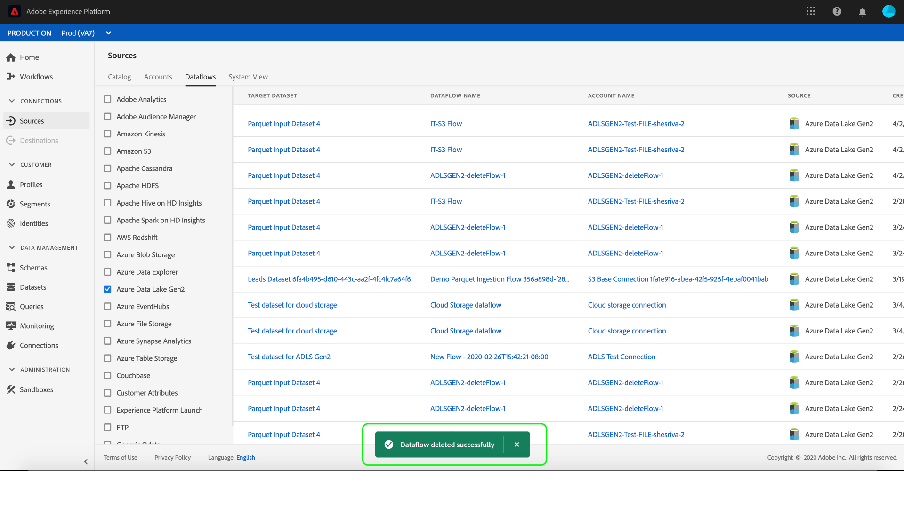

# Monitorar e excluir fluxos de dados

Os conectores de origem no Adobe Experience Platform fornecem a capacidade de assimilar dados de origem externa de forma programada. Este tutorial fornece etapas para a exibição de contas e fluxos de dados existentes na área de trabalho *[!UICONTROL Fontes]* . Este tutorial também fornece etapas para excluir fluxos de dados da área de trabalho *[!UICONTROL Fontes]* .

## Introdução

Este tutorial requer uma compreensão funcional dos seguintes componentes do Adobe Experience Platform:

- [Sistema](../../../xdm/home.md)do Experience Data Model (XDM): A estrutura padronizada pela qual [!DNL Experience Platform] organiza os dados de experiência do cliente.
   - [Noções básicas da composição](../../../xdm/schema/composition.md)do schema: Saiba mais sobre os elementos básicos dos schemas XDM, incluindo princípios-chave e práticas recomendadas na composição do schema.
   - [Tutorial](../../../xdm/tutorials/create-schema-ui.md)do Editor de Schemas: Saiba como criar schemas personalizados usando a interface do editor de Schemas.
- [Perfil](../../../profile/home.md)do cliente em tempo real: Fornece um perfil unificado e em tempo real para o consumidor, com base em dados agregados de várias fontes.

## Monitorar contas

Faça logon no [Adobe Experience Platform](https://platform.adobe.com) e selecione **[!UICONTROL Fontes]** na barra de navegação esquerda para acessar a área de trabalho *[!UICONTROL Fontes]* . A tela *[!UICONTROL Catálogo]* exibe várias fontes com as quais você pode criar contas e fluxos de dados. Cada fonte mostra o número de contas e fluxos de dados existentes associados a elas.

Selecione *[!UICONTROL Contas]* no cabeçalho superior para visualização contas existentes.

As páginas *[!UICONTROL Contas]* são exibidas. Nesta página há uma lista de contas visualizáveis, incluindo informações sobre a origem, o nome de usuário, o número de fluxos de dados e a data de criação.

Selecione o ícone de funil na parte superior esquerda para abrir a janela de classificação.

O painel de classificação permite acessar contas de uma fonte específica. Selecione a fonte com a qual deseja trabalhar e selecione a conta na lista à direita.

Na página *[!UICONTROL Contas]* , é possível visualização de uma lista de fluxos de dados existentes associados à conta acessada. Selecione o fluxo de dados que deseja visualização.

A tela *[!UICONTROL atividade]* Dataflow é exibida. Esta página exibe a taxa de mensagens que estão sendo consumidas na forma de um gráfico.

## Monitorar fluxos de dados

Os fluxos de dados podem ser acessados diretamente da página *[!UICONTROL Catálogo]* sem exibir *[!UICONTROL Contas]*. Selecione *[!UICONTROL Fluxos de dados]* no cabeçalho superior para visualização de uma lista de fluxos de dados existentes.

Uma lista de fluxos de dados existentes é exibida. Nesta página há uma lista de fluxos de dados visualizáveis, incluindo informações sobre sua fonte, nome de usuário, número de fluxos de dados e status. Selecione o ícone de funil na parte superior esquerda para classificar.

O painel de classificação é exibido. Selecione a fonte que deseja acessar no menu de rolagem e selecione o fluxo de dados na lista à direita.

A tela *[!UICONTROL atividade]* Dataflow é exibida. Esta página exibe a taxa de mensagens que estão sendo consumidas na forma de um gráfico.

Para obter mais informações sobre monitoramento de fluxos de dados e ingestão, consulte o tutorial sobre [monitoramento de fluxos de dados](../../../ingestion/quality/monitor-data-flows.md)de fluxo contínuo.

## Excluir um fluxo de dados

Você pode excluir os fluxos de dados que foram criados incorretamente ou que não são mais necessários acessando a tela de fluxos de dados. Localize o fluxo de dados que deseja excluir usando o ícone de funil de classificação e selecione o fluxo de dados para abrir o painel **[!UICONTROL Propriedades]** .

Para excluir um fluxo de dados, selecione **[!UICONTROL Excluir]** das propriedades na parte superior direita.

Uma mensagem de confirmação final é exibida. Selecione **[!UICONTROL Excluir]** para confirmar.

Após alguns instantes, uma caixa de confirmação verde é exibida na parte inferior da tela para confirmar a exclusão bem-sucedida.

Como alternativa, você pode excluir um fluxo de dados da tela *[!UICONTROL Contas]* . Localize a conta que deseja acessar usando o ícone de funil de classificação e selecione a conta na lista.

A página *[!UICONTROL Contas]* é exibida. Selecione o fluxo de dados que deseja excluir e selecione **[!UICONTROL Excluir]** no painel de propriedades para concluir o processo.

Siga as etapas de confirmação descritas acima para concluir o processo.

## Próximas etapas

Ao seguir este tutorial, você acessou com êxito contas e fluxos de dados existentes na área de trabalho *[!UICONTROL Fontes]* . Os dados recebidos agora podem ser usados por [!DNL Platform] serviços de downstream, como [!DNL Real-time Customer Profile] e [!DNL Data Science Workspace]. Consulte os seguintes documentos para obter mais detalhes:

- [Visão geral do Perfil do cliente em tempo real](../../../profile/home.md)
- [Visão geral da Análise do espaço de trabalho da Data Science](../../../data-science-workspace/home.md)