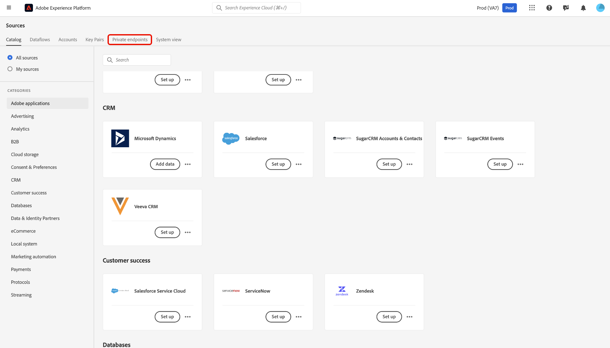
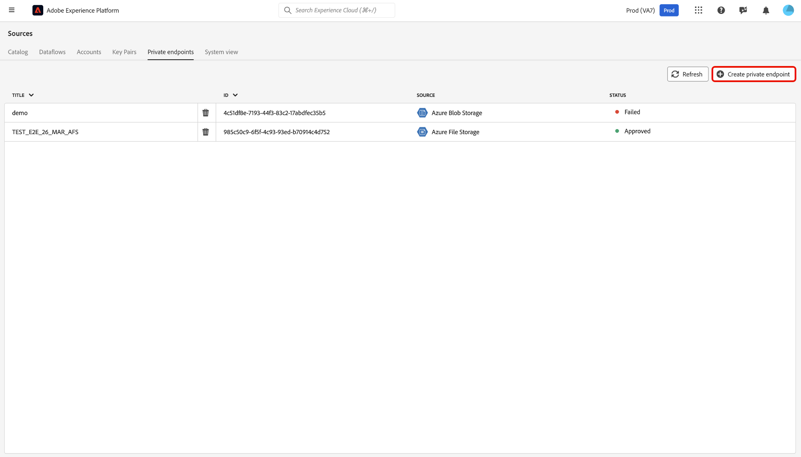

# Suporte a link privado para fontes na interface do usuário

>[!AVAILABILITY]
>
>Esse recurso está na versão beta e, no momento, é compatível apenas com as seguintes fontes:
>
>* [[!DNL Azure Blob Storage]](../../connectors/cloud-storage/blob.md)
>* [[!DNL ADLS Gen2]](../../connectors/cloud-storage/adls-gen2.md)
>* [[!DNL Azure File Storage]](../../connectors/cloud-storage/azure-file-storage.md)
>* [[!DNL Snowflake]](../../connectors/databases/snowflake.md)

Você pode usar o recurso Links privados para criar endpoints privados para que suas fontes da Adobe Experience Platform se conectem ao. Conecte com segurança suas fontes a uma rede virtual usando endereços IP privados, eliminando a necessidade de IPs públicos e reduzindo sua superfície de ataque. Simplifique a configuração da rede, eliminando a necessidade de configurações complexas de firewall ou tradução de endereço de rede, garantindo que o tráfego de dados atinja apenas os serviços aprovados.

Leia este guia para saber como você pode usar o espaço de trabalho de origens na interface do usuário do Experience Platform para criar e usar um endpoint privado.

## Criar um ponto de extremidade privado

Para começar a usar Links Privados, navegue até o catálogo *[!UICONTROL Fontes]* da interface do usuário do Experience Platform e selecione **[!UICONTROL Pontos de extremidade privados]** no menu de guias no espaço de trabalho de fontes.

Use a interface para exibir informações sobre pontos de extremidade privados existentes, como ID, fonte associada e status atual. Para criar um novo ponto de extremidade privado, selecione **[!UICONTROL Criar ponto de extremidade privado]**.

Em seguida, escolha a origem desejada e insira valores para as seguintes propriedades:

| Propriedade | Descrição |
| --- | --- |
| `name` | O nome do seu ponto de extremidade privado. |
| `subscriptionId` | A ID associada à sua assinatura do [!DNL Azure]. Para obter mais informações, leia o guia [!DNL Azure] em [recuperando sua assinatura e IDs de locatário de [!DNL Azure Portal]](https://learn.microsoft.com/en-us/azure/azure-portal/get-subscription-tenant-id). |
| `resourceGroupName` | O nome do seu grupo de recursos em [!DNL Azure]. Um grupo de recursos contém recursos relacionados para uma solução [!DNL Azure]. Para obter mais informações, leia o guia [!DNL Azure] em [gerenciando grupos de recursos](https://learn.microsoft.com/en-us/azure/azure-resource-manager/management/manage-resource-groups-portal). |
| `resourceGroup` | O nome do recurso. Em [!DNL Azure], um recurso se refere a instâncias como máquinas virtuais, aplicativos Web e bancos de dados. Para obter mais informações, leia o guia [!DNL Azure] em [noções básicas sobre o [!DNL Azure] gerenciador de recursos](https://learn.microsoft.com/en-us/azure/azure-resource-manager/management/overview). |
| `fqdns` | Os nomes de domínio totalmente qualificados para sua origem. **OBSERVAÇÃO**: esta propriedade é necessária somente ao usar a origem [!DNL Snowflake]. |

{style="table-layout:auto"}

Quando terminar, selecione **[!UICONTROL Enviar]**.

### Aprovar um endpoint privado

Um endpoint recém-criado permanece em um estado pendente até ser aprovado por um administrador.

Para aprovar uma solicitação de ponto de extremidade privado para as fontes [!DNL Azure Blob] e [!DNL Azure Data Lake Gen2], faça logon no [!DNL Azure Portal]. Na navegação à esquerda, selecione **[!DNL Data storage]**, vá para a guia **[!DNL Security + networking]** e escolha **[!DNL Networking]**. Em seguida, selecione **[!DNL Private endpoints]** para ver uma lista de pontos de extremidade privados associados à sua conta e seus estados de conexão atuais. Para aprovar uma solicitação pendente, selecione o ponto de extremidade desejado e clique em **[!DNL Approve]**.

## Criar uma conta com um ponto de extremidade privado

Navegue até o catálogo de origens e selecione uma origem que ofereça suporte a endpoints privados. Em seguida, crie uma nova conta com sua origem e, durante a autenticação da conta, selecione a opção **[!UICONTROL Ponto de extremidade privado]**. Forneça as credenciais de autenticação da origem e selecione **[!UICONTROL Conectar à origem]** Aguarde alguns minutos para que a conexão seja estabelecida.

>[!NOTE]
>
>Se a opção [!UICONTROL Ponto de extremidade privado] estiver habilitada, o Experience Platform verificará se existe um ponto de extremidade privado aprovado para a origem selecionada. Se nenhum endpoint aprovado for encontrado, você não poderá estabelecer uma conexão.

Em seguida, navegue até a interface [!UICONTROL Conta existente] da sua origem. Use essa interface para exibir uma lista das contas existentes e os status correspondentes. Você pode selecionar o ícone de filtro  para exibir apenas as contas que foram habilitadas para conexão com um ponto de extremidade privado.

Selecione a conta que deseja usar e habilite a **[!UICONTROL Criação Interativa]**. Este botão de alternância ativa a [!UICONTROL Criação Interativa], um recurso [!DNL Azure] que permite testar conexões, procurar listas de pastas e visualizar dados. É necessário habilitar a [!UICONTROL Criação Interativa] para conexões de ponto de extremidade privado. Observe que não é possível desativar esse botão manualmente; ele é desativado automaticamente após 60 minutos.

A [!UICONTROL Criação interativa] leva alguns minutos para ser habilitada. Depois que a configuração estiver habilitada, selecione **[!UICONTROL Avançar]** para prosseguir para a próxima etapa e selecione os dados que deseja assimilar.

## Próximas etapas

Agora que você criou um endpoint privado com êxito, poderá criar conexões de origem e fluxos de dados e assimilar dados usando endpoints privados. Leia os guias a seguir para obter informações sobre como criar fluxos de dados na interface do usuário do:

* [Criar um fluxo de dados para uma fonte de armazenamento na nuvem](../ui/dataflow/batch/cloud-storage.md)
* [Criar um fluxo de dados para uma origem de banco de dados](../ui/dataflow/databases.md)
