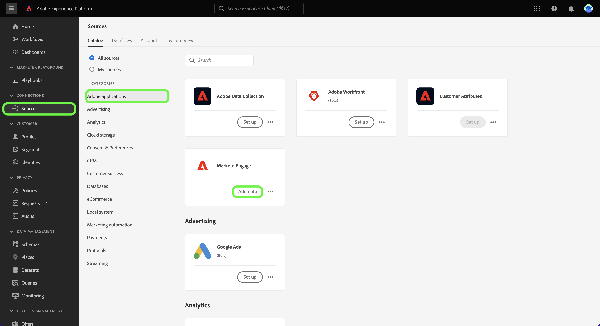
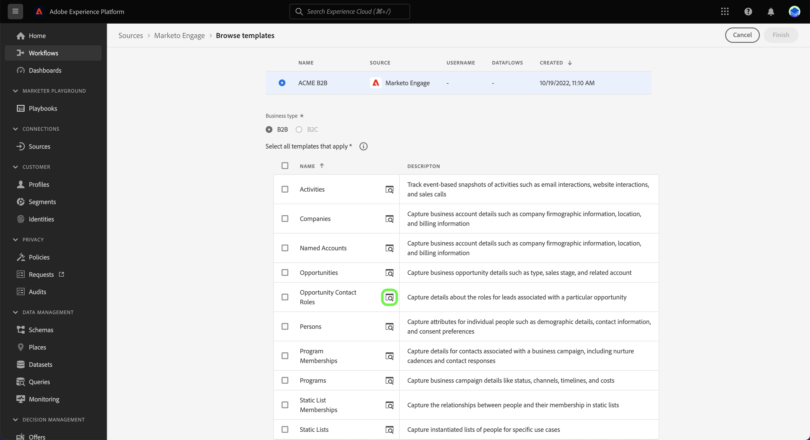

# Criar um fluxo de dados de origem usando modelos na interface {#create-a-sources-dataflow-using-templates-in-the-ui}

>[!CONTEXTUALHELP]
>id="platform_sources_marketo_mapping"
>title="Modelos para fontes na interface da Experience Platform"
>abstract="Os modelos incluem ativos gerados automaticamente, como esquemas, conjuntos de dados, identidades, regras de mapeamento, namespaces de identidade e fluxos de dados que você pode usar ao trazer dados de uma fonte para a Experience Platform. É possível atualizar ativos gerados automaticamente para personalização de acordo com seus casos de uso."

>[!IMPORTANT]
>
>Os modelos estão na versão beta e são compatíveis com as seguintes fontes:
>
>* [[!DNL Marketo Engage]](../../connectors/adobe-applications/marketo/marketo.md)
>* [[!DNL Microsoft Dynamics]](../../connectors/crm/ms-dynamics.md)
>* [[!DNL Salesforce]](../../connectors/crm/salesforce.md)
>
>A documentação e as funcionalidades estão sujeitas a alterações.

A Adobe Experience Platform fornece modelos pré-configurados que você pode usar para acelerar o processo de assimilação de dados. Os modelos incluem ativos gerados automaticamente, como esquemas, conjuntos de dados, identidades, regras de mapeamento, namespaces de identidade e fluxos de dados que você pode usar ao trazer dados de uma origem para a Experience Platform.

Com os modelos, é possível:

* Reduza o tempo de implantação da assimilação por meio da aceleração da criação de ativos modelados.
* Minimize os erros que podem ocorrer durante o processo manual de assimilação de dados.
* Atualize ativos gerados automaticamente em qualquer ponto para atender aos seus casos de uso.

O tutorial a seguir fornece etapas sobre como usar modelos na interface do usuário do Experience Platform.

## Introdução

Este tutorial requer uma compreensão funcional dos seguintes componentes do Experience Platform:

* [Fontes](../../home.md): o Experience Platform permite a assimilação de dados de várias fontes, ao mesmo tempo em que fornece a capacidade de estruturar, rotular e aprimorar os dados recebidos usando os serviços do Experience Platform.
* [[!DNL Experience Data Model (XDM)] Sistema](../../../xdm/home.md): a estrutura padronizada pela qual o Experience Platform organiza os dados de experiência do cliente.
* [Sandboxes](../../../sandboxes/home.md): a Experience Platform fornece sandboxes virtuais que particionam uma única instância do Experience Platform em ambientes virtuais separados para ajudar a desenvolver aplicativos de experiência digital.

## Usar modelos na interface da Experience Platform {#use-templates-in-the-platform-ui}

>[!CONTEXTUALHELP]
>id="platform_sources_templates_accounttype"
>title="Selecionar tipo de empresa"
>abstract="Selecione o tipo de empresa apropriado para seu caso de uso. O acesso pode variar dependendo da conta de assinatura da Real-time Customer Data Platform."
>additional-url="https://experienceleague.adobe.com/docs/experience-platform/rtcdp/intro/rtcdp-intro/overview.html?lang=pt-BR" text="Visão geral da Real-Time CDP"

Na interface do usuário do Experience Platform, selecione **[!UICONTROL Fontes]** na navegação à esquerda para acessar o espaço de trabalho [!UICONTROL Fontes] e ver um catálogo de fontes disponíveis no Experience Platform.

Use o menu *[!UICONTROL Categorias]* para filtrar fontes por categoria. Como alternativa, insira um nome de origem na barra de pesquisa para localizar uma origem específica do catálogo.

Vá para a categoria [!UICONTROL aplicativos Adobe] para ver o cartão de origem [!DNL Marketo Engage] e selecione [!UICONTROL Adicionar dados] para começar.

Uma janela pop-up é exibida, apresentando a opção de procurar modelos ou usar esquemas e conjuntos de dados existentes.

* **Procurar modelos**: os modelos de fontes criam esquemas, identidades, conjuntos de dados e fluxos de dados automaticamente com regras de mapeamento para você. Você pode personalizar esses ativos conforme necessário.
* **Usar meus ativos existentes**: assimile seus dados usando conjuntos de dados e esquemas existentes que você criou. Você também pode criar novos conjuntos de dados e esquemas, se necessário.

>[!NOTE]
>
>Os modelos podem gerar esquemas baseados em modelo automaticamente ao trabalhar com origens que exigem workflows de captura de dados de alteração ou suportam vários modelos de dados. Esses esquemas ativam os recursos do Data Mirror para sincronização de dados em tempo real.\
>Ao usar modelos com esquemas baseados em modelo, os ativos gerados automaticamente incluirão os campos obrigatórios chave primária, identificador de versão e identificador de carimbo de data e hora.\
>Para obter mais informações, consulte a [visão geral do Data Mirror](../../../xdm/data-mirror/overview.md) e a [referência técnica de esquemas baseados em modelo](../../../xdm/schema/model-based.md).

Para usar os ativos gerados automaticamente, selecione **[!UICONTROL Procurar modelos]** e **[!UICONTROL Selecionar]**.

### Autenticação

A etapa de autenticação é exibida, solicitando que você crie uma nova conta ou use uma conta existente.

>[!BEGINTABS]

>[!TAB Usar uma conta existente]

Para usar uma conta existente, selecione [!UICONTROL Conta existente] e, em seguida, selecione a conta que deseja usar na lista exibida.

>[!TAB Criar uma nova conta]

Para criar uma nova conta, selecione **[!UICONTROL Nova conta]** e forneça os detalhes da conexão de origem e as credenciais de autenticação da conta. Quando terminar, selecione **[!UICONTROL Conectar à origem]** e aguarde algum tempo para estabelecer a nova conexão.

>[!ENDTABS]

### Selecionar modelos

Com sua conta autenticada, agora é possível selecionar o modelo que deseja usar para o fluxo de dados.

+++[!DNL Marketo Engage] modelos
A tabela a seguir descreve os modelos disponíveis para a origem [!DNL Marketo Engage].

| [!DNL Marketo Engage] modelos | Descrição |
| --- | --- |
| Atividades | O modelo de Atividades captura instantâneos baseados em eventos de atividades, como interações por email, interações de site e chamadas de vendas. |
| Empresas | O modelo Empresas captura detalhes da conta comercial, como informações firmográficas, localização e informações de faturamento da empresa. |
| Contas Nomeadas | O modelo Contas Nomeadas captura detalhes de contas que foram determinadas como contas de destino a serem seguidas. |
| Oportunidades | O modelo de Oportunidades captura detalhes da oportunidade comercial, como tipo, estágio de vendas e contas relacionadas. |
| Funções do contato da oportunidade | O modelo Funções de contato da oportunidade captura detalhes sobre as funções para clientes potenciais associadas a uma oportunidade específica. |
| Pessoas | O modelo Pessoas captura atributos de pessoas individuais, como detalhes demográficos, informações de contato e preferências de consentimento. |
| Associações ao programa | O modelo de Associações de programa captura detalhes para contatos associados a uma campanha comercial, incluindo cadências de criação e respostas de contato. |
| Programas | O modelo Programas captura detalhes da campanha comercial como status, canais, linhas do tempo e custos. |
| Associações de Lista Estáticas | O modelo Associações de lista estática captura as relações entre as pessoas e suas associações em listas estáticas. |
| Listas Estáticas | O modelo Lista estática captura listas instanciadas de pessoas para casos de uso específicos. |

{style="table-layout:auto"}

+++

+++[!DNL Salesforce] modelos B2B
A tabela a seguir descreve os modelos B2B disponíveis para a origem [!DNL Salesforce].

| [!DNL Salesforce] modelos B2B | Descrição |
| --- | --- |
| Relação de contato da conta | O modelo de Relação de Contato de Conta captura a relação entre um contato e uma ou mais contas. |
| Contas | O modelo de Conta captura detalhes da conta comercial, como informações firmográficas, locais e informações de faturamento da empresa. |
| Membros da campanha | O modelo Membros da Campanha captura a relação entre um cliente potencial ou contato individual e uma campanha [!DNL Salesforce] específica. |
| Campanhas | O modelo Campanhas captura detalhes da conta de negócios, como informações firmográficas, localização e informações de faturamento da empresa. |
| Contatos | O modelo Contato captura atributos para contatos, como detalhes demográficos, informações de contato e entidades comerciais relacionadas. |
| Clientes potenciais | O modelo de Clientes potenciais captura atributos para clientes potenciais, como detalhes demográficos, informações de contato e entidades comerciais relacionadas. |
| Oportunidades | O modelo de Oportunidades captura detalhes da oportunidade comercial, como tipo, estágio de vendas e conta relacionada. |
| Funções do contato da oportunidade | O modelo Funções de contato da oportunidade captura detalhes sobre as funções para clientes potenciais associadas a uma oportunidade específica. |

{style="table-layout:auto"}

+++

+++[!DNL Salesforce] modelos B2C
A tabela a seguir descreve os modelos B2C disponíveis para a origem [!DNL Salesforce].

| [!DNL Salesforce] modelos B2C | Descrição |
| --- | --- |
| Contato | O modelo Contato captura atributos para contatos, como detalhes demográficos, informações de contato e entidades comerciais relacionadas. |
| Lead | O modelo de cliente potencial captura atributos para clientes potenciais, como detalhes demográficos, informações de contato e entidades comerciais relacionadas. |

{style="table-layout:auto"}

+++

+++[!DNL Microsoft Dynamics] modelos B2B
A tabela a seguir descreve os modelos B2B disponíveis para a origem [!DNL Microsoft Dynamics].

| [!DNL Microsoft Dynamics] modelos B2B | Descrição |
| --- | --- |
| Contas | O modelo de Conta captura detalhes da conta comercial, como informações firmográficas, locais e informações de faturamento da empresa. |
| Campanhas | O modelo Campanhas captura detalhes da conta de negócios, como informações firmográficas, localização e informações de faturamento da empresa. |
| Contatos | O modelo Contato captura atributos para contatos, como detalhes demográficos, informações de contato e entidades comerciais relacionadas. |
| Clientes potenciais | O modelo de Clientes potenciais captura atributos para clientes potenciais, como detalhes demográficos, informações de contato e entidades comerciais relacionadas. |
| Lista de marketing | O modelo de Lista de marketing captura um grupo de clientes existentes ou em potencial criado para uma campanha de marketing ou outros fins de vendas. |
| Membros da lista de marketing | Os Membros da Lista de marketing capturam os detalhes de qualquer tipo de registro de cliente, como clientes potenciais, contas ou contatos, em uma lista de marketing. |
| Oportunidades | O modelo de Oportunidades captura detalhes da oportunidade comercial, como tipo, estágio de vendas e conta relacionada. |
| Funções do contato da oportunidade | O modelo Funções de contato da oportunidade captura detalhes sobre as funções para clientes potenciais associadas a uma oportunidade específica. |

{style="table-layout:auto"}

+++

+++[!DNL Microsoft Dynamics] modelos B2C
A tabela a seguir descreve os modelos B2C disponíveis para a origem [!DNL Microsoft Dynamics].

| [!DNL Microsoft Dynamics] modelos B2C | Descrição |
| --- | --- |
| Contato | O modelo Contato captura atributos para contatos, como detalhes demográficos, informações de contato e entidades comerciais relacionadas. |
| Lead | O modelo de cliente potencial captura atributos para clientes potenciais, como detalhes demográficos, informações de contato e entidades comerciais relacionadas. |

{style="table-layout:auto"}

+++

Dependendo do tipo de negócio selecionado, uma lista de modelos é exibida. Selecione o ícone de visualização  ao lado do nome de um modelo para visualizar dados de amostra do modelo.

A janela de pré-visualização é exibida, permitindo explorar e inspecionar dados de amostra do seu modelo. Quando terminar, selecione **[!UICONTROL Obteve]**.

Em seguida, selecione o template que deseja usar na lista. Você pode selecionar vários modelos e criar vários fluxos de dados de uma só vez. No entanto, um template só pode ser usado uma vez por conta. Depois de selecionar seus modelos, selecione **[!UICONTROL Concluir]** e aguarde alguns momentos para os ativos serem gerados.

Se você selecionar um item ou itens parciais da lista de modelos disponíveis, todos os esquemas B2B e namespaces de identidade ainda serão gerados para garantir que os relacionamentos B2B entre esquemas sejam configurados corretamente.

>[!NOTE]
>
>Os modelos que já foram usados serão desativados a partir da seleção.

### Definir uma programação

As origens [!DNL Microsoft Dynamics] e [!DNL Salesforce] oferecem suporte ao agendamento de fluxos de dados.

Use a interface de programação para configurar uma programação de assimilação para seus fluxos de dados. Defina a frequência de assimilação como **Uma vez** para criar uma assimilação única.

Como alternativa, você pode definir a frequência de assimilação como **Minuto**, **Hora**, **Dia** ou **Semana**. Se você agendar seu fluxo de dados para várias assimilações, deverá definir um intervalo para estabelecer um intervalo de tempo entre cada assimilação. Por exemplo, uma frequência de assimilação definida como **Hora** e um intervalo definido como **15** significa que o fluxo de dados está agendado para assimilar dados a cada **15 horas**.

Durante esta etapa, você também pode habilitar o **preenchimento retroativo** e definir uma coluna para a assimilação incremental de dados. O preenchimento retroativo é usado para assimilar dados históricos, enquanto a coluna definida para assimilação incremental permite que novos dados sejam diferenciados dos dados existentes.

Após concluir a configuração do agendamento de assimilação, selecione **[!UICONTROL Concluir]**.

### Revisar ativos {#review-assets}

>[!CONTEXTUALHELP]
>id="platform_sources_templates_review"
>title="Revisar os ativos gerados automaticamente"
>abstract="Pode levar até cinco minutos para gerar todos os ativos. Se você optar por sair da página, receberá uma notificação para retornar depois que os ativos forem concluídos. Você pode revisar os ativos depois que eles são gerados e fazer configurações adicionais ao seu fluxo de dados a qualquer momento."

A página [!UICONTROL Revisar ativos do modelo] exibe os ativos gerados automaticamente como parte do modelo. Nesta página, você pode exibir os esquemas, conjuntos de dados, namespaces de identidade e fluxos de dados gerados automaticamente associados à conexão de origem. Pode levar até cinco minutos para gerar todos os ativos. Se você optar por sair da página, receberá uma notificação para retornar depois que os ativos forem concluídos. Você pode revisar os ativos depois que eles são gerados e fazer configurações adicionais ao seu fluxo de dados a qualquer momento.

Por padrão, os fluxos de dados gerados automaticamente são definidos como um estado de rascunho para permitir mais personalização em configurações, como regras de mapeamento ou frequências programadas. Selecione as reticências (`...`) ao lado do nome do fluxo de dados e selecione **[!UICONTROL Visualizar mapeamentos]** para ver os conjuntos de mapeamento criados para o fluxo de dados de rascunho.

Uma página de visualização é exibida, permitindo que você inspecione a relação de mapeamento entre os campos de dados de origem e os campos de esquema de destino. Depois de visualizar os mapeamentos do fluxo de dados. Selecione **[!UICONTROL Obteve.]**

Você pode atualizar seus fluxos de dados a qualquer momento após a execução. Selecione as reticências (`...`) ao lado do nome do fluxo de dados e selecione **[!UICONTROL Atualizar fluxo de dados]**. Você é levado para a página de fluxo de trabalho de origens, onde é possível atualizar os detalhes do fluxo de dados, incluindo configurações para assimilação parcial, diagnósticos de erro e notificações de alerta, bem como o mapeamento do fluxo de dados.

Você pode usar a visualização do editor de esquemas para atualizar o esquema gerado automaticamente. Consulte o guia em [usando o editor de esquemas](../../../xdm/tutorials/create-schema-ui.md) para obter mais informações.

>[!TIP]
>
>Você pode acessar o fluxo de dados de rascunho por meio da página de catálogo [!UICONTROL Fluxos de Dados] no espaço de trabalho de fontes. Selecione **[!UICONTROL Fluxos de dados]** no cabeçalho superior e selecione na lista o fluxo de dados que você deseja atualizar.
>
>

### Publicar seu fluxo de dados

Comece o processo de publicação navegando pelo fluxo de trabalho de origens. Depois de selecionar [!UICONTROL Atualizar fluxo de dados], você será direcionado para a etapa *[!UICONTROL Adicionar dados]* do fluxo de trabalho. Selecione **[!UICONTROL Avançar]** para continuar.

Em seguida, confirme os detalhes do fluxo de dados e defina as configurações para diagnósticos de erro, assimilação parcial e notificações de alerta. Quando terminar, selecione **[!UICONTROL Próximo]**.

>[!NOTE]
>
>Você pode selecionar **[!UICONTROL Salvar como rascunho]** a qualquer momento para parar e salvar as alterações feitas no fluxo de dados.

A etapa de mapeamento é exibida. Durante essa etapa, você pode reconfigurar as configurações de mapeamento do fluxo de dados. Para obter um guia abrangente sobre as funções de preparação de dados usadas para mapeamento, visite o [guia da interface do usuário de preparação de dados](../../../data-prep/ui/mapping.md).

Finalmente, revise os detalhes do seu fluxo de dados e selecione **[!UICONTROL Salvar e assimilar]** para publicar seu rascunho.

## Próximas etapas

Seguindo este tutorial, você criou fluxos de dados, bem como ativos como esquemas, conjuntos de dados e namespaces de identidade usando modelos. Para obter informações gerais sobre origens, visite a [visão geral das origens](../../home.md).

## Alertas e notificações {#alerts-and-notifications}

Os modelos são compatíveis com os Alertas do Adobe Experience Platform e você pode usar o painel de notificações para receber atualizações sobre o status dos ativos e também para navegar de volta para a página de revisão.

Selecione o ícone de notificação no cabeçalho superior da interface do usuário do Experience Platform e selecione o alerta de status para ver os ativos que deseja revisar.

Você pode atualizar as configurações de alerta de seus modelos para receber notificações por email e no Experience Platform sobre o status dos fluxos de dados. Para obter mais informações sobre como configurar alertas, leia o manual sobre [como assinar alertas para fluxos de dados de fontes](../ui/alerts.md).