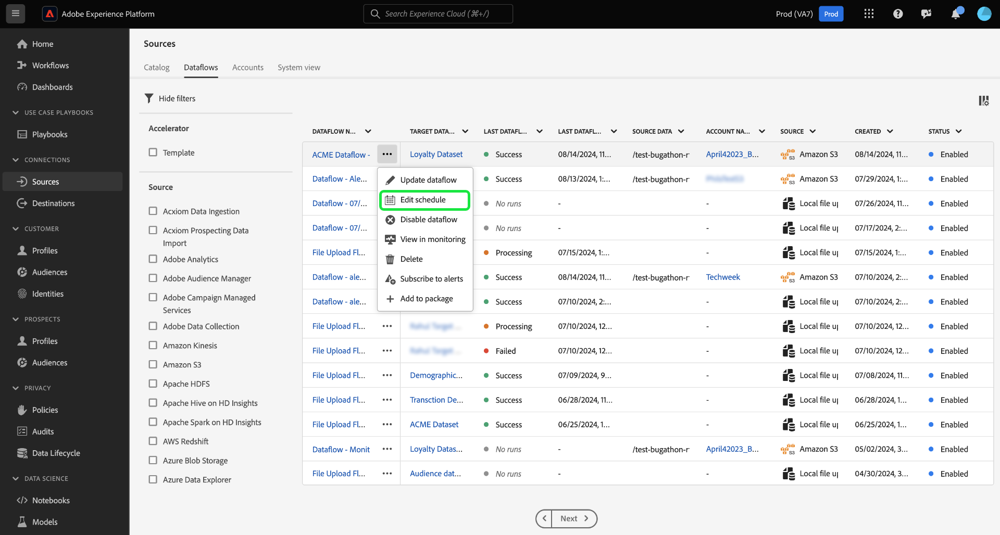

# Atualizar fluxos de dados na interface do

Leia este tutorial para obter etapas sobre como atualizar um fluxo de dados existente, incluindo suas configurações de agendamento e mapeamento, usando o espaço de trabalho de origens na interface do usuário do Adobe Experience Platform.

## Introdução

Este tutorial requer uma compreensão funcional dos seguintes componentes do Experience Platform:

* [Fontes](../../home.md): o Experience Platform permite a assimilação de dados de várias fontes, ao mesmo tempo em que fornece a capacidade de estruturar, rotular e aprimorar os dados recebidos usando os serviços do Experience Platform.
* [Sandboxes](../../../sandboxes/home.md): a Experience Platform fornece sandboxes virtuais que particionam uma única instância do Experience Platform em ambientes virtuais separados para ajudar a desenvolver aplicativos de experiência digital.

## Atualizar fluxos de dados {#update-dataflows}

>[!CONTEXTUALHELP]
>id="platform_sources_dataflows_daysRemaining"
>title="Expiração do conjunto de dados"
>abstract="Esta coluna indica o número de dias que o conjunto de dados de destino tem antes de expirar automaticamente. Haverá falha em um fluxo de dados se o conjunto de dados de destino expirar. Para evitar falhas em um fluxo de dados, certifique-se de que um conjunto de dados de destino esteja definido para expirar na data correta. Consulte a documentação para saber como atualizar datas de expiração."

Na interface do usuário do Experience Platform, selecione **[!UICONTROL Sources]** na navegação à esquerda e selecione **[!UICONTROL Dataflows]** no cabeçalho superior.

>[!TIP]
>
>Você pode classificar e filtrar seus fluxos de dados usando recursos de filtragem. Leia o manual sobre [filtragem de objetos de fontes na interface](./filter.md) para obter mais informações.

A página [!UICONTROL Dataflows] exibe uma lista de todos os fluxos de dados existentes na sua organização. Localize o fluxo de dados que você deseja atualizar e selecione as reticências (`...`) ao lado dele. Um menu suspenso é exibido, exibindo uma lista de opções que você pode escolher para fazer configurações adicionais ao seu fluxo de dados existente.

Para atualizar seu fluxo de dados, selecione **[!UICONTROL Update dataflow]**.

Você é levado ao fluxo de trabalho de origens, onde pode prosseguir para atualizar aspectos do fluxo de dados, incluindo seus detalhes na etapa [!UICONTROL Provide dataflow details].

### Atualizar mapeamento {#update-mapping}

>[!NOTE]
>
>O recurso de mapeamento de edição não tem suporte atualmente para as seguintes fontes: Adobe Analytics, Adobe Audience Manager, API HTTP e [!DNL Marketo Engage].

Durante esse processo, também é possível atualizar os conjuntos de mapeamento associados ao fluxo de dados.  A interface de mapeamento exibe o mapeamento existente do fluxo de dados e não um novo conjunto de mapeamentos recomendado. As atualizações de mapeamento são aplicadas apenas a execuções de fluxo de dados agendadas no futuro. Um fluxo de dados agendado para assimilação única não pode ter seus conjuntos de mapeamento atualizados.

Use a interface de mapeamento para modificar os conjuntos de mapeamento aplicados ao seu fluxo de dados. Para obter etapas abrangentes sobre como usar a interface de mapeamento, consulte o [guia da interface de preparação de dados](../../../data-prep/ui/mapping.md) para obter mais informações.

### Atualizar programação

Depois de atualizar os mapeamentos do fluxo de dados, você pode prosseguir para atualizar a programação de assimilação para assimilar o fluxo de dados com os novos dados de mapeamento. Você só pode atualizar a programação de assimilação de fluxos de dados configurados para assimilação em uma programação recorrente. Não é possível reagendar um fluxo de dados configurado para assimilação única.

Você também pode atualizar a programação de assimilação do fluxo de dados usando a opção de atualização em linha fornecida na página Fluxos de dados.

Na página de fluxos de dados, selecione as reticências (`...`) ao lado do nome do fluxo de dados e selecione **[!UICONTROL Edit schedule]** no menu suspenso exibido.

A caixa de diálogo **[!UICONTROL Edit schedule]** fornece opções para atualizar a frequência de assimilação e a taxa de intervalo do fluxo de dados. Depois de definir os valores atualizados de frequência e intervalo, selecione **[!UICONTROL Save]**.

Leia a seção a seguir para obter detalhes sobre como os agendamentos de assimilação semanais funcionam.

#### Noções básicas da programação de assimilação semanal {#weekly}

Quando você opta por definir seu fluxo de dados para execução semanal, o fluxo de dados é executado com base em um destes cenários:

* Se sua fonte de dados tiver sido criada, mas nenhum dado tiver sido assimilado ainda, o primeiro fluxo de dados semanal será executado sete dias após a data de criação da fonte. Esse intervalo de 7 dias sempre começa a partir de quando a origem foi criada, independentemente de quando você configurou o agendamento. Após a execução inicial, o fluxo de dados continuará a ser executado semanalmente, de acordo com o agendamento configurado.
* Se os dados da sua fonte tiverem sido assimilados anteriormente e você os agendar para assimilação semanal novamente, o próximo fluxo de dados será executado 7 dias após a assimilação bem-sucedida mais recente.

### Desativar fluxo de dados

Você pode desativar o fluxo de dados usando o mesmo menu suspenso. Para desabilitar o fluxo de dados, selecione **[!UICONTROL Disable dataflow]**.

Em seguida, selecione [!UICONTROL Disable] na janela pop-up exibida.

Se e quando você reativar esse fluxo de dados posteriormente, o Experience Platform agendará automaticamente as execuções de preenchimento retroativo para cobrir o período durante o qual o fluxo de dados foi desativado. Por exemplo, se o fluxo de dados foi configurado para ser executado por hora e foi desativado por 48 horas, após reativar esse fluxo de dados, o Experience Platform criará 48 execuções de preenchimento retroativo para processar os intervalos perdidos.

## Próximas etapas

Ao seguir este tutorial, você usou com êxito o espaço de trabalho [!UICONTROL Sources] para atualizar o agendamento de assimilação e os conjuntos de mapeamento do seu fluxo de dados.

Para obter etapas sobre como executar essas operações de forma programática usando a API [!DNL Flow Service], consulte o tutorial em [atualização de fluxos de dados usando a API de Serviço de Fluxo](../../tutorials/api/update-dataflows.md).
