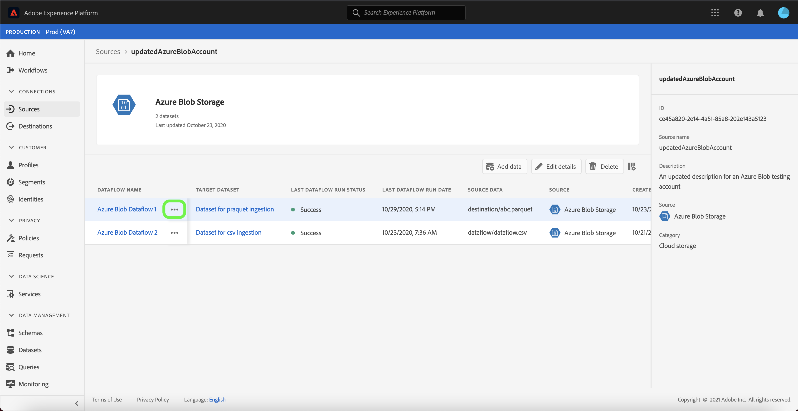

# Atualizar detalhes da conta na interface do usuário

Em algumas circunstâncias, pode ser necessário atualizar os detalhes de uma conta de origem existente. A área de trabalho [!UICONTROL Origens] oferece a você a capacidade de adicionar, editar e excluir detalhes de um lote existente ou conexão de fluxo contínuo, incluindo seu nome, descrição e credenciais.

A área de trabalho [!UICONTROL Origens] também oferece a capacidade de editar a programação de fluxos de dados em lote, permitindo que você atualize sua frequência de ingestão e taxa de intervalo.

Este tutorial fornece etapas para atualizar os detalhes e as credenciais de uma conta existente da área de trabalho [!UICONTROL Fontes], bem como para atualizar o agendamento de ingestão de um fluxo de dados.

## Introdução

Este tutorial requer uma compreensão funcional dos seguintes componentes do Adobe Experience Platform:

- [Fontes](../../home.md): O Experience Platform DNL permite que os dados sejam ingeridos de várias fontes e, ao mesmo tempo, fornece a você a capacidade de estruturar, rotular e aprimorar os dados recebidos usando os serviços da plataforma.
- [Caixas de proteção](../../../sandboxes/home.md): O Experience Platform DNL fornece caixas de proteção virtuais que particionam uma única instância da Plataforma em ambientes virtuais separados para ajudar a desenvolver e desenvolver aplicativos de experiência digital.

## Atualizar contas

Faça logon na [interface do usuário do Experience Platform](https://platform.adobe.com) e selecione **[!UICONTROL Fontes]** na navegação esquerda para acessar a área de trabalho [!UICONTROL Fontes]. Selecione **[!UICONTROL Contas]** do cabeçalho superior para visualização contas existentes.

A página **[!UICONTROL Accounts]** é exibida. Nesta página há uma lista de contas visualizáveis, incluindo informações sobre a origem, o nome de usuário, o número de fluxos de dados e a data de criação.

Selecione o ícone de filtro  na parte superior esquerda para iniciar o painel de classificação.

O painel de classificação fornece uma lista de todas as fontes. Você pode selecionar mais de uma fonte da lista para acessar uma seleção filtrada de contas associadas a fontes diferentes.

Selecione a fonte com a qual deseja trabalhar para ver uma lista de suas contas existentes. Depois de identificar a conta que deseja atualizar, selecione as elipses (`...`) ao lado do nome da conta.

Um menu suspenso é exibido, fornecendo opções para **[!UICONTROL Adicionar dados]**, **[!UICONTROL Editar detalhes]** e **[!UICONTROL Excluir]**. Selecione **[!UICONTROL Editar detalhes]** no menu para atualizar sua conta.

A caixa de diálogo **[!UICONTROL Editar detalhes da conta]** permite atualizar o nome, a descrição e as credenciais de autenticação de uma conta. Depois de atualizar as informações desejadas, selecione **[!UICONTROL Salvar]**.

Após alguns instantes, uma caixa de confirmação será exibida na parte inferior da tela para confirmar uma atualização bem-sucedida.

## Editar programação

Você pode editar o agendamento de ingestão de um fluxo de dados na página **[!UICONTROL Contas]**. Na lista de contas, selecione a conta que contém o fluxo de dados que você deseja reprogramar.

A página de fluxo de dados é exibida. Esta página contém uma lista de fluxos de dados existentes associados à conta selecionada. Selecione as elipses (`...`) ao lado do fluxo de dados que você deseja reprogramar.

Um menu suspenso é exibido, fornecendo opções para **[!UICONTROL Editar programação]**, **[!UICONTROL Ativar fluxo de dados]**, **[!UICONTROL Visualização no monitoramento]** e **[!UICONTROL Excluir]**. Selecione **[!UICONTROL Editar agendamento]** no menu.

A caixa de diálogo **[!UICONTROL Editar agendamento]** fornece opções para atualizar a frequência de ingestão e a taxa de intervalo do seu fluxo de dados. Depois de definir os valores de frequência e intervalo atualizados, selecione **[!UICONTROL Salvar]**.

| Agendamento | Descrição |
| ---------- | ----------- |
| Frequência | A frequência com que o fluxo de dados coletará dados. Os valores aceitáveis para a programação de frequência de edição de um fluxo de dados já existente incluem: `minute`, `hour`, `day` ou `week`. |
| Intervalo | O intervalo designa o período entre duas execuções consecutivas de fluxo. O valor do intervalo deve ser um número inteiro diferente de zero e deve ser maior ou igual a `15`. |

Após alguns instantes, uma caixa de confirmação será exibida na parte inferior da tela para confirmar uma atualização bem-sucedida.

## Próximas etapas

Ao seguir este tutorial, você usou com êxito a área de trabalho [!UICONTROL Fontes] para atualizar as informações da conta e editar sua programação de fluxo de dados.

Para obter etapas sobre como executar essas operações de forma programática usando a API [!DNL Flow Service], consulte o tutorial em [atualizando as informações de conexão usando a API de Serviço de Fluxo](../../tutorials/api/update.md).