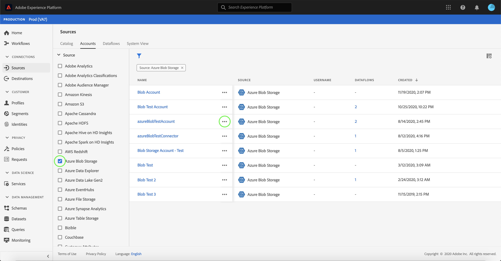

# Atualizar detalhes da conta na interface do usuário

Em algumas circunstâncias, pode ser necessário atualizar os detalhes de uma conta de fontes existente. O espaço de trabalho [!UICONTROL Fontes] fornece a capacidade de adicionar, editar e excluir detalhes de um lote ou conexão de transmissão existente, incluindo seu nome, descrição e credenciais.

O espaço de trabalho [!UICONTROL Fontes] também fornece a capacidade de editar a programação de fluxos de dados em lote, permitindo atualizar a frequência de assimilação e a taxa de intervalo.

Este tutorial fornece etapas para atualizar os detalhes e as credenciais de uma conta existente do espaço de trabalho [!UICONTROL Fontes], bem como atualizar o agendamento de assimilação de um fluxo de dados.

## Introdução

Este tutorial requer uma compreensão funcional dos seguintes componentes da Adobe Experience Platform:

- [Fontes](../../home.md): A Experience Platform permite que os dados sejam assimilados de várias fontes, além de fornecer a você a capacidade de estruturar, rotular e aprimorar os dados recebidos usando os serviços da plataforma.
- [Sandboxes](../../../sandboxes/home.md): A Experience Platform fornece sandboxes virtuais que particionam uma única instância da Platform em ambientes virtuais separados para ajudar a desenvolver aplicativos de experiência digital.

## Atualizar contas

Faça logon na [Interface do usuário da Experience Platform](https://platform.adobe.com) e selecione **[!UICONTROL Fontes]** no painel de navegação esquerdo para acessar o espaço de trabalho [!UICONTROL Fontes]. Selecione **[!UICONTROL Accounts]** no cabeçalho superior para visualizar as contas existentes.

A página **[!UICONTROL Contas]** é exibida. Nesta página, há uma lista de contas visualizáveis, incluindo informações sobre a origem, o nome de usuário, o número de fluxos de dados e a data de criação.

Selecione o ícone de filtro  na parte superior esquerda para iniciar o painel de classificação.

O painel de classificação fornece uma lista de todas as fontes. Você pode selecionar mais de uma fonte na lista para acessar uma seleção filtrada de contas associadas a diferentes fontes.

Selecione a fonte com a qual deseja trabalhar para ver uma lista de suas contas existentes. Depois de identificar a conta que deseja atualizar, selecione as reticências (`...`) ao lado do nome da conta.

Um menu suspenso é exibido, fornecendo opções para **[!UICONTROL Adicionar dados]**, **[!UICONTROL Editar detalhes]** e **[!UICONTROL Excluir]**. Selecione **[!UICONTROL Editar detalhes]** no menu para atualizar sua conta.

A caixa de diálogo **[!UICONTROL Editar detalhes da conta]** permite atualizar o nome, a descrição e as credenciais de autenticação de uma conta. Depois de atualizar as informações desejadas, selecione **[!UICONTROL Salvar]**.

Após alguns instantes, uma caixa de confirmação será exibida na parte inferior da tela para confirmar uma atualização bem-sucedida.

## Editar programação

Você pode editar o agendamento de assimilação de um fluxo de dados da página **[!UICONTROL Accounts]**. Na lista de contas, selecione a conta que contém o fluxo de dados que deseja reprogramar.

A página de fluxos de dados é exibida. Esta página contém uma lista de fluxos de dados existentes associados à conta selecionada. Selecione as elipses (`...`) ao lado do fluxo de dados que você deseja reprogramar.

Um menu suspenso é exibido, fornecendo opções para **[!UICONTROL Editar programação]**, **[!UICONTROL Ativar fluxo de dados]**, **[!UICONTROL Exibir no monitoramento]** e **[!UICONTROL Excluir]**. Selecione **[!UICONTROL Editar agenda]** no menu.

A caixa de diálogo **[!UICONTROL Editar programação]** fornece opções para atualizar a frequência de assimilação e a taxa de intervalo do fluxo de dados. Depois de definir os valores de frequência e intervalo atualizados, selecione **[!UICONTROL Save]**.

| Agendamento | Descrição |
| ---------- | ----------- |
| Frequência | A frequência com que o fluxo de dados coletará dados. Os valores aceitáveis para o agendamento de frequência de edição de um fluxo de dados já existente incluem: `minute`, `hour`, `day` ou `week`. |
| Intervalo | O intervalo designa o período entre duas execuções consecutivas de fluxo. O valor do intervalo deve ser um número inteiro diferente de zero e deve ser maior ou igual a `15`. |

Após alguns instantes, uma caixa de confirmação será exibida na parte inferior da tela para confirmar uma atualização bem-sucedida.

## Próximas etapas

Ao seguir este tutorial, você usou com sucesso o espaço de trabalho [!UICONTROL Fontes] para atualizar as informações da conta e editar o cronograma do fluxo de dados.

Para obter etapas sobre como executar essas operações programaticamente usando a API [!DNL Flow Service], consulte o tutorial em [atualizar informações de conexão usando a API do Serviço de Fluxo](../../tutorials/api/update.md).