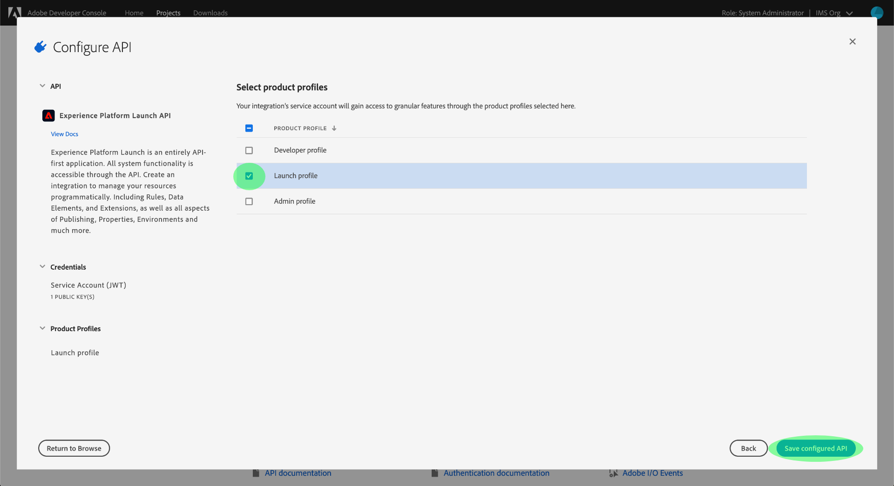

# Introdução à API do Reactor

Para usar a [API do reator](https://www.adobe.io/experience-platform-apis/references/reactor/), cada solicitação deve incluir os seguintes cabeçalhos de autenticação:

* `Authorization: Bearer {ACCESS_TOKEN}`
* `x-api-key: {API_KEY}`
* `x-gw-ims-org-id: {ORG_ID}`

Este guia mostra como usar o Adobe Developer Console a fim de coletar os valores de cada um desses cabeçalhos para que você possa começar a fazer chamadas à API do reator.

## Obter acesso de desenvolvedor à Adobe Experience Platform

A fim de gerar valores de autenticação para a API do reator, você deve ter acesso de desenvolvedor à Experience Platform. Para obter acesso de desenvolvedor, siga as etapas iniciais no [tutorial de autenticação da Experience Platform](https://www.adobe.com/go/platform-api-authentication-en). Depois de chegar à etapa “Gerar credenciais de acesso no Adobe Developer Console”, retorne a este tutorial para gerar as credenciais específicas da API do reator.

## Gerar credenciais de acesso

Usando o Adobe Developer Console, você deve gerar as três credenciais de acesso descritas a seguir:

* `{ORG_ID}`
* `{API_KEY}`
* `{ACCESS_TOKEN}`

Sua ID de organização IMS (`{ORG_ID}`) e a chave da API (`{API_KEY}`) podem ser reutilizadas em chamadas de API futuras depois de terem sido geradas. No entanto, seu token de acesso (`{ACCESS_TOKEN}`) é temporário e deve ser gerado novamente a cada 24 horas.

As etapas de geração desses valores são descritas em detalhes abaixo.

### Configuração única

Acesse o [Adobe Developer Console](https://www.adobe.com/go/devs_console_ui) e faça logon com seu Adobe ID. Depois, siga as etapas descritas no tutorial sobre como [criar um projeto vazio](https://www.adobe.io/apis/experienceplatform/console/docs.html#!AdobeDocs/adobeio-console/master/projects-empty.md) na documentação do Developer Console.

Depois de criar um projeto, selecione **Adicionar API** na tela **Visão geral do projeto**.


A tela **Adicionar uma API** é exibida. Selecione **API do Reactor da Experience Platform** na lista de APIs disponíveis antes de clicar em **Avançar**.


Na próxima tela, você será solicitado a criar uma credencial JSON Web Token (JWT). Para fazer isso, gere um novo par de chaves ou carregue sua própria chave pública. Para este tutorial, selecione a opção **Gerar um par de chaves** e selecione **Gerar par de chaves** no canto inferior direito.


A próxima tela confirma que o par de chaves foi gerado com êxito, e uma pasta compactada que contém um certificado público e uma chave privada é baixada automaticamente para seu computador. Essa chave privada é necessária em uma etapa posterior para gerar um token de acesso.

Clique em **Avançar** para continuar.


A próxima tela solicita que você selecione um ou mais perfis de produto para associar à integração com a API.

>[!NOTE]
>
>Os perfis de produtos são gerenciados por sua organização por meio da Adobe Admin Console e contêm conjuntos específicos de permissões para recursos granulares. Os perfis de produto e suas permissões só podem ser gerenciados por usuários com privilégios de administrador na organização. Se não tiver certeza sobre quais perfis de produto deve selecionar para a API, entre em contato com o administrador.

Selecione os perfis de produto desejados na lista e selecione **Salvar API configurada** para concluir o registro da API.



Depois que a API for adicionada ao projeto, a página do projeto será exibida novamente na página da API do Reactor da Experience Platform. Daqui, role para baixo até a seção **Conta de Serviço (JWT)**, que fornece as seguintes credenciais de acesso necessárias em todas as chamadas à API do Reactor:

* **ID DO CLIENTE**: a ID do cliente é a `{API_KEY}` necessária que deve ser informada no cabeçalho `x-api-key`.
* **ID DA ORGANIZAÇÃO**: a ID da organização é o valor `{ORG_ID}` que deve ser usado no cabeçalho `x-gw-ims-org-id`.


### Autenticação para cada sessão

Agora que você tem os valores `{API_KEY}` e `{ORG_ID}`, a etapa final é gerar um valor `{ACCESS_TOKEN}`.

>[!NOTE]
>
>Esses tokens expiram após 24 horas. Se você está usando essa integração para um aplicativo, convém obter o token de portador de forma programática por meio do aplicativo.

Você tem duas opções para gerar os tokens de acesso, dependendo do caso de uso:

* [Gerar tokens manualmente](#manual)
* [Gerar tokens de forma programática](#program)

#### Gerar tokens de acesso manualmente {#manual}

Abra em um editor de texto ou um navegador a chave privada baixada anteriormente e copie o conteúdo. Volte para o Developer Console e cole a chave privada na seção **Gerar token de acesso** na página da API do Reactor do projeto antes de selecionar **Gerar token**.


É gerado um novo token de acesso, e é fornecido um botão para copiá-lo para a área de transferência. Esse valor é usado para o cabeçalho `Authorization` necessário e deve ser fornecido no formato `Bearer {ACCESS_TOKEN}`.


#### Gerar tokens de acesso de forma programática {#program}

Se estiver usando a integração do para um aplicativo, você poderá gerar tokens de acesso de forma programática por meio de solicitações de API. Para fazer isso, você deve obter os seguintes valores:

* ID do cliente (`{API_KEY}`)
* Segredo do cliente (`{SECRET}`)
* Um JSON Web Token (`{JWT}`)

O ID do cliente e o segredo podem ser obtidos na página principal do projeto, conforme visto na [etapa anterior](#one-time-setup).


Para obter a credencial JWT, acesse **Conta de serviço (JWT)** na navegação à esquerda e selecione a guia **Gerar JWT**. Nessa página, em **Gerar JWT personalizada**, cole o conteúdo da chave privada na caixa de texto fornecida e selecione **Gerar token**.


O JWT gerado aparece abaixo quando o processamento é concluído, junto com um comando cURL de amostra que você poderá usar para testar o token, se desejar. Use o botão **Copiar** a fim de copiar o token para a área de transferência.


Depois de obter as credenciais, você pode integrar a chamada da API abaixo ao aplicativo para gerar tokens de acesso de forma programática.

**Solicitação**

A solicitação deve enviar uma carga `multipart/form-data`, fornecendo suas credenciais de autenticação, conforme mostrado a seguir:

```shell
curl -X POST \
  https://ims-na1.adobelogin.com/ims/exchange/jwt/ \
  -H 'Content-Type: multipart/form-data' \
  -F 'client_id={API_KEY}' \
  -F 'client_secret={SECRET}' \
  -F 'jwt_token={JWT}'
```

**Resposta**

Uma resposta bem-sucedida retorna um novo token de acesso, bem como o número de segundos restantes até a expiração dele.

```json
{
  "token_type": "bearer",
  "access_token": "{ACCESS_TOKEN}",
  "expires_in": 86399999
}
```

| Propriedade | Descrição |
| :-- | :-- |
| `access_token` | O valor do token de acesso recém-gerado. Esse valor é usado para o cabeçalho `Authorization` necessário e deve ser fornecido no formato `Bearer {ACCESS_TOKEN}`. |
| `expires_in` | O tempo restante até o token expirar, em milissegundos. Depois que um token expira, um novo deve ser gerado. |

{style=&quot;table-layout:auto&quot;}

## Próximas etapas

Seguindo as etapas deste tutorial, você deve ter um valor válido para `{ORG_ID}`, `{API_KEY}` e `{ACCESS_TOKEN}`. Agora é possível testar esses valores usando-os em uma solicitação de cURL simples para a API do Reactor.

Para começar, tente fazer uma chamada de API para [listar todas as empresas](./endpoints/companies.md#list).

>[!NOTE]
>
>Talvez você não tenha empresas em sua organização. Nesse caso, a resposta será o status HTTP 404 (Não encontrado). Desde que você não receba um erro 403 (Proibido), suas credenciais de acesso são válidas e estão funcionando.

Depois de confirmar que suas credenciais de acesso estão funcionando, continue explorando a outra documentação de referência da API para saber mais sobre os vários recursos da API.

## Recursos adicionais

Bibliotecas JWT e SDKs: [https://jwt.io/](https://jwt.io/)

Desenvolvimento da API Postman: [https://www.postman.com/](https://www.postman.com/)
