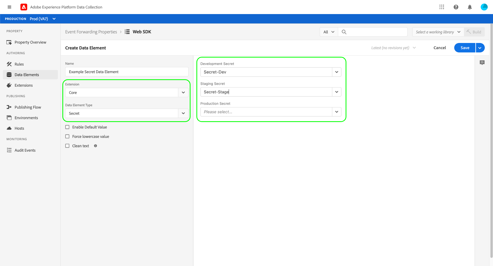

# Segredos na API do reator

Na API do reator, um segredo é um recurso que representa uma credencial de autenticação. Segredos são usados no encaminhamento de eventos para autenticação em outro sistema para troca de dados segura. Portanto, os segredos só podem ser criados nas propriedades de encaminhamento de eventos (propriedades cujas `platform` está definido como `edge`).

No momento, há três tipos secretos compatíveis indicados na variável `type_of` atributo:

| Tipo de segredo | Descrição |
| --- | --- |
| `token` | Uma única string de caracteres representando um valor de token de autenticação conhecido e compreendido por ambos os sistemas. |
| `simple-http` | Contém dois atributos de string para um nome de usuário e senha, respectivamente. |
| `oauth2-client_credentials` | Contém vários atributos para suportar a variável [OAuth](https://datatracker.ietf.org/doc/html/rfc6749) especificação de autenticação. O encaminhamento de eventos solicita as informações necessárias e, em seguida, lida com a renovação desses tokens para você em um intervalo especificado. |

{style=&quot;table-layout:auto&quot;}

Este guia fornece uma visão geral de alto nível de como configurar segredos para uso no encaminhamento de eventos. Para obter orientações detalhadas sobre como gerenciar segredos na API do Reator, incluindo o JSON da estrutura de um segredo, consulte [guia do endpoint de segredos](../endpoints/secrets.md).

## Credenciais

Cada segredo contém um `credentials` que mantém seus respectivos valores de credencial. When [criação de um segredo na API](../endpoints/secrets.md#create), cada tipo de segredo tem atributos obrigatórios diferentes, conforme mostrado nas seções abaixo:

* [`token`](#token)
* [simple-http`](#simple-http)
* [`oauth2-client_credentials`](#oauth2-client_credentials)
* [&quot;oauth2-google&quot;](#oauth2-google)

### `token` {#token}

Segredos com uma `type_of` valor de `token` requer apenas um único atributo em `credentials`:

| Atributo de credencial | Tipo de dados | Descrição |
| --- | --- | --- |
| `token` | String | Um token secreto que é entendido pelo sistema de destino. |

{style=&quot;table-layout:auto&quot;}

O token é armazenado como um valor estático e, portanto, o `expires_at` e `refresh_at` são definidas como `null` quando o segredo for criado.

### `simple-http` {#simple-http}

Segredos com uma `type_of` valor de `simple-http` requerem os seguintes atributos em `credentials`:

| Atributo de credencial | Tipo de dados | Descrição |
| --- | --- | --- |
| `username` | String | Um nome de usuário. |
| `password` | String | Uma senha. Esse valor não está incluído na resposta da API. |

{style=&quot;table-layout:auto&quot;}

Quando o segredo é criado, os dois atributos são trocados com uma codificação BASE64 de `username:password`. Após a troca, o segredo `expires_at` e `refresh_at` são definidas como `null`.

### `oauth2-client_credentials` {#oauth2-client_credentials}

Segredos com uma `type_of` valor de `oauth2-client_credentials` requerem os seguintes atributos em `credentials`:

| Atributo de credencial | Tipo de dados | Descrição |
| --- | --- | --- |
| `client_id` | String | A ID do cliente para a integração OAuth. |
| `client_secret` | String | O segredo do cliente para a integração OAuth. Esse valor não está incluído na resposta da API. |
| `token_url` | String | O URL de autorização da integração OAuth. |
| `refresh_offset` | Número inteiro | *(Opcional)* O valor, em segundos, para deslocar a operação de atualização. Se este atributo for omitido ao criar o segredo, o valor será definido como `14400` (quatro horas) por padrão. |
| `options` | Objeto | *(Opcional)* Especifica opções adicionais para a integração OAuth:<ul><li>`scope`: Uma string que representa a variável [Escopo do OAuth 2.0](https://oauth.net/2/scope/) para as credenciais.</li><li>`audience`: Uma string que representa uma [Token de acesso Auth0](https://auth0.com/docs/protocols/protocol-oauth2).</li></ul> |

Quando uma `oauth2-client_credentials` O segredo é criado ou atualizado, a variável `client_id` e `client_secret` e eventualmente `options`) são trocadas em uma solicitação de POST para `token_url`, de acordo com o fluxo de Credenciais do Cliente do protocolo OAuth.

>[!NOTE]
>
>Espera-se que o organismo de resposta do serviço de autorização seja compatível com o protocolo OAuth.

Se o serviço de autorização responder com `200 OK` e um corpo de resposta JSON, o corpo é analisado e o `access_token` é enviado para o ambiente de borda e `expires_in` é usada para calcular a variável `expires_at` e `refresh_at` atributos para o segredo. Se não houver associação de ambiente no segredo, `access_token` é descartado.

Uma troca de credenciais é considerada bem-sucedida sob as seguintes condições:

* `expires_in` é maior que `28800` (oito horas).
* `refresh_offset` é menor que o valor de `expires_in` minus `14400` (quatro horas). Por exemplo, se `expires_in` é `36000` (dez horas) e a variável `refresh_offset` é `28800` (oito horas), a troca é considerada uma falha porque `28800` é maior que `36000` - `14400` (`21600`).

Se a troca for bem-sucedida, o atributo de status do segredo será definido como `succeeded` e valores para `expires_at` e `refresh_at` são definidas:

* `expires_at` é a hora UTC atual mais o valor de `expires_in`.
* `refresh_at` é a hora UTC atual mais o valor de `expires_in`, menos o valor de `refresh_offset`. Por exemplo, se `expires_in` é `43200` (doze horas) e a `refresh_offset` é `14400` (quatro horas), a variável `refresh_at` propriedade seria definida como `28800` (oito horas) após a hora UTC atual.

Se a troca falhar por algum motivo, a variável `status_details` no `meta` atualizações de objeto com informações relevantes.

#### Atualizar um `oauth2-client_credentials` segredo

Se uma `oauth2-client_credentials` O segredo foi atribuído a um ambiente e seu status é `succeeded` (as credenciais foram trocadas com êxito), uma nova troca é executada automaticamente em `refresh_at`.

Se a troca for bem-sucedida, a variável `refresh_status` no `meta` objeto definido como `succeeded` while `expires_at`, `refresh_at`e `activated_at` são atualizadas adequadamente.

Se a troca falhar, a operação será tentada mais três vezes com a última tentativa, não mais do que duas horas antes do token de acesso expirar. Se todas as tentativas falharem, a variável `refresh_status_details` do `meta` atualizações de objeto com detalhes relevantes.

### `oauth2-google` {#oauth2-google}

Segredos com uma `type_of` valor de `oauth2-google` exige o seguinte atributo em `credentials`:

| Atributo de credencial | Tipo de dados | Descrição |
| --- | --- | --- |
| `scopes` | Matriz | Lista os escopos de produto do Google para autenticação. Os seguintes escopos são suportados:<ul><li>[Anúncios do Google](https://developers.google.com/google-ads/api/docs/oauth/overview): `https://www.googleapis.com/auth/adwords`</li><li>[Pub/Sub do Google](https://cloud.google.com/pubsub/docs/reference/service_apis_overview): `https://www.googleapis.com/auth/pubsub`</li></ul> |

Depois de criar o `oauth2-google` secreto, a resposta inclui um `meta.authorization_url` propriedade. Você deve copiar e colar esse URL em um navegador para concluir o fluxo de autenticação do Google.

#### Reautorizar uma `oauth2-google` segredo

O URL de autorização para um `oauth2-google` o segredo expira uma hora depois que o segredo é criado (conforme indicado por `meta.authorization_url_expires_at`). Após esse tempo, o segredo deve ser reautorizado para renovar o processo de autenticação.

Consulte a [guia do endpoint de segredos](../endpoints/secrets.md#reauthorize) para obter detalhes sobre como autorizar novamente uma `oauth2-google` secreta fazendo uma solicitação de PATCH para a API do reator.

## Relação ambiente

Ao criar um segredo, você deve especificar a variável [ambiente](../endpoints/environments.md) em que existirá. Os segredos são imediatamente implantados no ambiente em que são criados.

Um segredo só pode ser associado a um ambiente. Uma vez estabelecida a relação entre um segredo e um ambiente, o segredo não pode ser apagado do ambiente, e o segredo não pode ser associado a um ambiente diferente.

>[!NOTE]
>
>A única exceção a essa regra é se o ambiente em questão for excluído. Nesse caso, o relacionamento é limpo e o segredo pode ser atribuído a um ambiente diferente.

Depois que as credenciais de um segredo tiverem sido trocadas com sucesso, para que um segredo seja associado a um ambiente, o artefato exchange (a sequência de token de `token`, a string codificada em Base64 para `simple-http`ou o token de acesso para `oauth2-client_credentials`) é salva com segurança no ambiente .

Depois que o artefato de troca for salvo com sucesso no ambiente, o segredo `activated_at` está definido como a hora UTC atual e agora pode ser referenciado usando um elemento de dados. Consulte a [próxima seção](#referencing-secrets) para obter mais informações sobre como fazer referência a segredos.

## Fazendo referência a segredos {#referencing-secrets}

Para fazer referência a um segredo, você deve criar um elemento de dados do tipo &quot;[!UICONTROL Segredo]&quot; (fornecido pelo [[!UICONTROL Núcleo] extensão](../../extensions/client/core/overview.md)) em uma propriedade de encaminhamento de evento. Ao configurar esse elemento de dados, você será solicitado a indicar qual segredo usar para cada ambiente. Em seguida, você pode criar regras que fazem referência a um elemento de dados secreto, como no cabeçalho de uma chamada HTTP.

>[!NOTE]
>
>Para adicionar um elemento de dados secreto a uma biblioteca, você deve ter pelo menos um `succeeded` segredo associado ao ambiente no qual a biblioteca está sendo criada. Por exemplo, se uma biblioteca tiver um elemento de dados secreto que não tem um `succeeded` segredo configurado para o [!UICONTROL Segredo de armazenamento temporário] , tentar criar essa biblioteca no ambiente de preparo resultará em um erro.

No tempo de execução, o elemento de dados secretos é substituído pelo artefato de troca secreta correspondente salvo no ambiente .

## Próximas etapas

Este guia cobriu os fundamentos do trabalho com segredos na API do reator. Para obter detalhes sobre como gerenciar segredos usando chamadas de API, consulte o [guia do endpoint de segredos](../endpoints/secrets.md).
