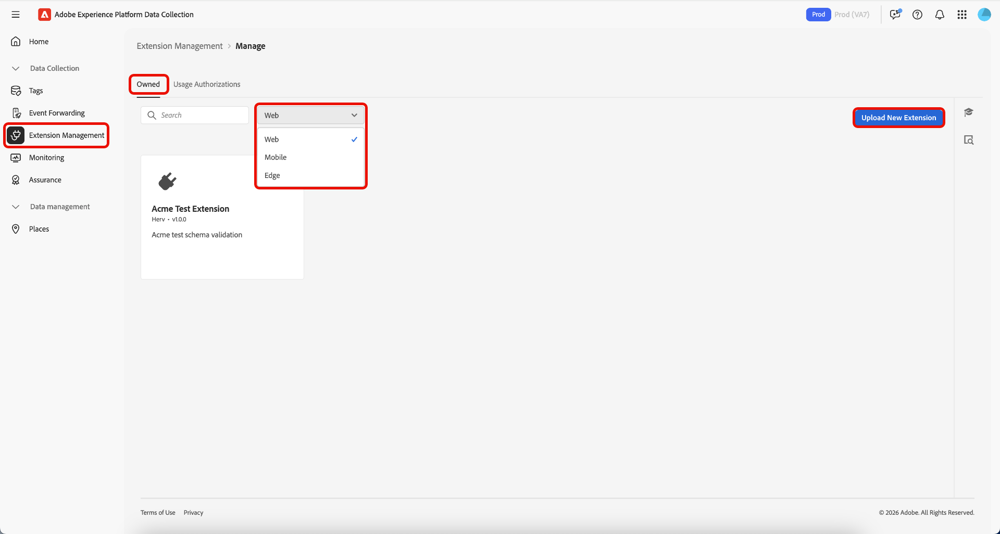
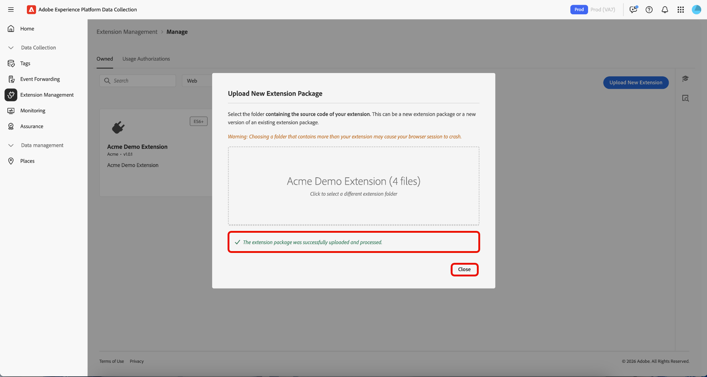
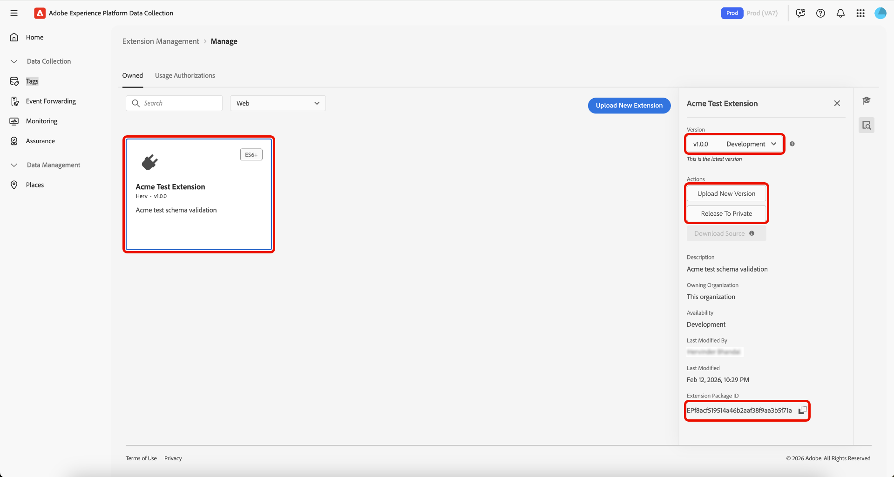
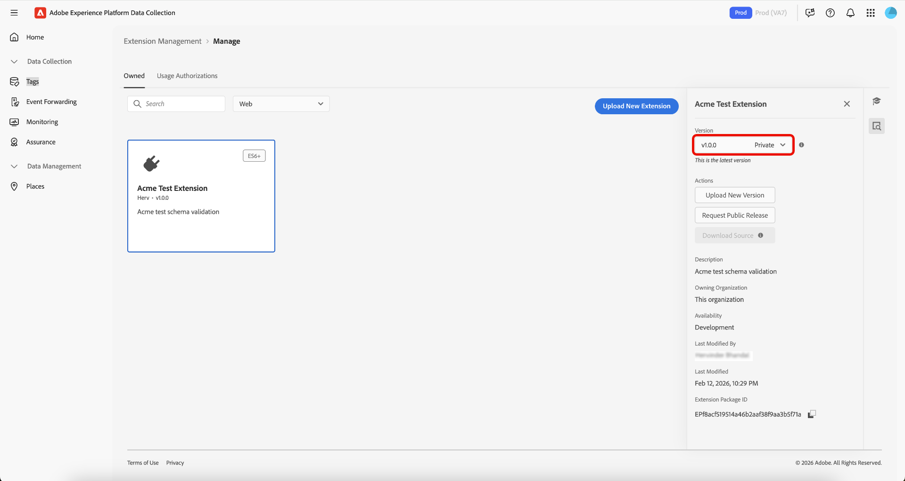

# Gerenciamento de extensões de tags

O Adobe Experience Platform permite gerenciar **[!UICONTROL Owned]** extensões. Você pode fazer upload de novas extensões, implantar novas versões e liberá-las para disponibilidade privada ou pública.

## Gerenciar uma extensão  {#manage-extension}

Depois de preparar o pacote de extensão localmente, use o **[!UICONTROL Extension Management]** na interface da Coleção de Dados para carregá-lo, validar o pacote e liberar versões por meio da disponibilidade do **Desenvolvimento**, **Particular** e **Pública**. Em seguida, você pode instalar a extensão em uma propriedade e usá-la para testes.

### Fazer upload de uma extensão {#upload-extension}

Para carregar uma extensão, navegue até a interface da Coleção de dados e selecione **[!UICONTROL Extension Management]** na navegação à esquerda. Aqui, selecione a guia **[!UICONTROL Owned]**. Essa guia mostra todas as extensões de sua propriedade ou de sua organização. Elas são separadas por plataforma e você pode ver quais extensões existem em cada plataforma (Web, Mobile e Edge) usando o menu suspenso. Selecione **[!UICONTROL Upload New Extension]**.

Na página **Carregar nova extensão**, selecione **[!UICONTROL Select Extension Folder]**, navegue até a pasta que contém sua extensão, selecione a pasta e **[!UICONTROL Upload]**.

Confirme o número de arquivos que serão carregados selecionando **[!UICONTROL Upload]**.

O número de arquivos que serão carregados é exibido, incluindo o nome da extensão e a versão. Você tem a opção de executar um **[!UICONTROL Dry Run]** que baixará um arquivo zip no computador local para inspeção. Selecione **[!UICONTROL Validate & Upload]**.

A confirmação de que sua extensão foi carregada e processada com êxito é exibida junto com sua **ID do Pacote de Extensão**. Selecione **[!UICONTROL Close]** para retornar à guia **[!UICONTROL Owned]**, onde sua extensão será exibida.

Você retornará à guia [!UICONTROL Owned], onde a extensão carregada será exibida.

>[!IMPORTANT]
>
>As extensões são carregadas na disponibilidade de **Desenvolvimento**. As extensões na disponibilidade do **Desenvolvimento** não podem ser compartilhadas até serem liberadas para a disponibilidade do **Particular**.

### Lançar uma extensão {#release-extension}

Para que a extensão fique disponível de forma privada, selecione-a e exiba o painel de informações à direita. Aqui você pode ver os seguintes detalhes da extensão:

* **Versão** - Mostra a versão mais recente e o estado em que ela está no momento. Você pode usar o menu suspenso para exibir o histórico de versões da extensão.
* **Ações** - Permite **[!UICONTROL Upload New Version]** da extensão e **[!UICONTROL Release To Private]**.
* **ID do Pacote de Extensão** - Exibido na parte inferior. Isso será alterado dependendo da versão selecionada.

Selecione **[!UICONTROL Release To Private]** e **[!UICONTROL Release To Private]** novamente para confirmar a versão.

A confirmação é recebida depois que a extensão é liberada com êxito para a disponibilidade **Private**. A disponibilidade atualizada pode ser vista no painel direito.

>[!NOTE]
>
>Depois que a extensão for liberada para **Private**, ela estará disponível para ser compartilhada com outras organizações.

Para liberar a extensão para disponibilidade **Pública**, selecione **[!UICONTROL Request Public Release]** no painel direito.

A tela **[!UICONTROL Release Extension Package]** fornece detalhes que serão necessários no formulário de solicitação, com uma opção para copiar os detalhes. Selecione **[!UICONTROL Go To Request Form]**.

Uma nova guia do navegador é aberta contendo o formulário de solicitação. Copie e cole as informações da tela **[!UICONTROL Release Extension Package]** nos campos relevantes. Envie o formulário preenchido para revisão. Você será notificado assim que a extensão for tornada pública.

## Compartilhar pacotes de extensão com outras organizações {#share-extension}

>[!NOTE]
>
>Os pacotes de extensão devem ter uma versão privada ou pública para serem compartilhados por meio de [!UICONTROL Usage Authorizations]. As versões marcadas como Disponibilidade de desenvolvimento não estão qualificadas para compartilhamento e não aparecerão na lista suspensa de autorização. Isso se aplica mesmo se uma versão anterior (por exemplo, 1.0.0) já tiver sido compartilhada. As versões mais recentes (por exemplo, 1.0.1) devem ser tornadas pelo menos privadas antes de serem autorizadas ou instaladas por organizações receptoras.
>
>Todas as orientações sobre o compartilhamento de pacotes de extensão privados também se aplicam se você optar posteriormente por tornar esses pacotes públicos. As mesmas considerações sobre visibilidade, controle de versão, segurança, compatibilidade, suporte e documentação permanecem relevantes, independentemente do status de disponibilidade do pacote.

**[!UICONTROL Usage Authorizations]** é um recurso poderoso que você pode usar para compartilhar com segurança pacotes de extensão privados com parceiros confiáveis sem torná-los disponíveis publicamente no catálogo de extensões. Use esse recurso para criar uma ponte segura entre organizações, permitindo que você aproveite o código de extensão personalizado umas das outras e, ao mesmo tempo, mantenha a privacidade e o controle sobre suas soluções proprietárias.

As organizações geralmente desenvolvem extensões especializadas adaptadas às suas necessidades comerciais exclusivas. Essas extensões podem conter lógica proprietária, integrações personalizadas ou configurações confidenciais que não devem ser disponibilizadas publicamente. As autorizações de uso resolvem esse desafio habilitando:

* **Compartilhamento seletivo**: compartilhe extensões privadas somente com organizações parceiras confiáveis.
* **Privacidade mantida**: mantenha o código de extensão confidencial fora do catálogo público.
* **Desenvolvimento colaborativo**: permitir que parceiros confiáveis se beneficiem de suas soluções personalizadas.
* **Acesso controlado**: mantenha o controle total sobre quem pode acessar e usar suas extensões privadas.

O processo de compartilhamento envolve dois participantes principais:

1. **Organização de compartilhamento**: a organização que possui e compartilha o pacote de extensão privado
2. **Organização recebedora**: a organização confiável que obtém acesso à extensão compartilhada

Quando uma versão privada é compartilhada, a organização de recebimento obtém acesso a essa versão específica, criando uma conexão direta entre as duas organizações. Se uma versão mais recente for posteriormente tornada privada, ela também estará disponível para a organização recebedora sem exigir etapas adicionais de sua parte.

### Criar uma autorização de uso de pacote de extensão {#package-usage-authorization}

Para compartilhar uma extensão, navegue até a interface da Coleção de dados e selecione **[!UICONTROL Extension Management]** na navegação à esquerda. Aqui, selecione a guia **[!UICONTROL Usage Authorizations]**.

Aqui, você vê uma lista de autorizações compartilhadas existentes organizadas em duas categorias:

* **Compartilhado com esta organização**: extensões que outras organizações compartilharam com você.
* **Compartilhado com outras organizações**: extensões que você compartilhou com outras organizações.

Selecione **[!UICONTROL Add Authorization]**.

![A guia [!UICONTROL Usage Authorizations] mostrando uma lista de extensões compartilhadas com esta organização, destacando [!UICONTROL Add Authorization]](../images/shared-extensions/add-authorization.png)

>[!IMPORTANT]
>
>Você deve obter o **`Organization ID`** da organização de destino, o proprietário da organização. Organizações não podem ser pesquisadas por nome.

Selecione o **[!UICONTROL Platform]** para o qual você deseja autorizar uma extensão na lista suspensa. Você pode compartilhar **[!UICONTROL Web]**, **[!UICONTROL Mobile]** e **[!UICONTROL Edge]** extensões.

Em seguida, selecione o **[!UICONTROL Extension]** que deseja compartilhar entre suas extensões disponíveis na lista suspensa. A lista exibe as extensões de propriedade da sua organização, juntamente com o status de disponibilidade. As extensões cuja versão mais recente está na disponibilidade de **Desenvolvimento** não aparecerão nesta lista.

Em seguida, insira a ID da organização receptora e selecione **[!UICONTROL Save]**.

![A página [!UICONTROL Create extension package usage authorization] mostrando uma extensão selecionada e a ID de organização da Adobe inserida, destacando [!UICONTROL Save]](../images/shared-extensions/save-authorization.png)

Você retornará à guia [!UICONTROL Usage Authorizations], na qual poderá ver a extensão na lista **[!UICONTROL Shared with other orgs]**. O status mostrará **Aguardando Aprovação** até que a organização recebedora aprove a autorização. Nesse momento, ela será atualizada para **Aprovada**.

![A guia [!UICONTROL Usage Authorizations] mostrando uma lista de extensões compartilhadas com outras organizações, destacando a nova autorização](../images/shared-extensions/new-authorization.png)

>[!TIP]
>
>Você também pode compartilhar extensões diretamente no **[!UICONTROL Extension Catalog]** selecionando o menu () no cartão de extensão e selecionando a opção de compartilhamento no menu.

Quando uma autorização está ativa, a extensão compartilhada exibe um emblema ***Compartilhamento*** no catálogo, indicando que está sendo compartilhado com outras organizações.

![A guia [!UICONTROL Catalog] mostrando a extensão compartilhada com o selo](../images/shared-extensions/sharing-badge.png)

### Autorizar e gerenciar extensões compartilhadas {#manage-shared-extension}

>[!NOTE]
>
>Como uma organização recebedora, você só pode aprovar ou rejeitar extensões compartilhadas. Não é possível gerenciar ou modificar os detalhes da autorização, pois eles são controlados pela organização de compartilhamento.

Para autorizar uma extensão compartilhada para sua organização, navegue até a interface da Coleção de dados e selecione **[!UICONTROL Extension Management]** na navegação à esquerda e, em seguida, selecione a guia **[!UICONTROL Usage Authorizations]**.

Você pode ver uma lista de extensões compartilhadas, incluindo aquelas **Aguardando Aprovação** na seção **[!UICONTROL Shared with this org]**. Selecione a extensão que você deseja aprovar e selecione **[!UICONTROL Approve]**.

![A guia [!UICONTROL Usage Authorizations] mostrando uma lista de extensões compartilhadas com esta organização com a extensão Aguardando Aprovação selecionada, destacando [!UICONTROL Approve]](../images/shared-extensions/approve-authorization.png)

>[!NOTE]
>
>Você também pode rejeitar uma solicitação na guia **[!UICONTROL Usage Authorizations]** se a extensão compartilhada não for mais exigida por sua organização.

Selecione **[!UICONTROL OK]** na caixa de diálogo **[!UICONTROL Authorization Usages]**.

![A caixa de diálogo [!UICONTROL Authorization Usages], destacando [!UICONTROL OK]](../images/shared-extensions/confirmation.png)

Você volta à guia [!UICONTROL Usage Authorizations], onde é possível ver que a extensão agora mostra o status **Aprovado**.

![A guia [!UICONTROL Usage Authorizations] mostrando uma lista de extensões compartilhadas com esta organização, destacando a extensão com o status Aprovado](../images/shared-extensions/approved-authorization.png)

Depois que a autorização é aprovada, a extensão é disponibilizada no catálogo e pode ser instalada e usada como qualquer outra extensão. A extensão compartilhada exibe um selo ***Recebimento*** indicando que é uma extensão compartilhada com você por outra organização.

![A guia [!UICONTROL Catalog] mostrando a extensão compartilhada com o selo &quot;Recebendo&quot;](../images/shared-extensions/receiving-badge.png)

### Revogação de autorizações {#revoke-authorization}

Como organização responsável, você pode excluir uma autorização a qualquer momento, independentemente de seu status atual (Aguardando aprovação, Rejeitada ou Aprovada).

**Se sua extensão nunca foi tornada pública:**

* Qualquer versão privada da organização de recebimento já instalada continuará a aparecer na lista de extensões instaladas.
* Se a organização receptora nunca tiver instalado sua extensão, ela não aparecerá mais em nenhum lugar na interface.

**Se sua extensão foi tornada pública:**

* Qualquer versão privada instalada pela organização receptora permanecerá visível na lista de extensões instaladas.
* Se nunca instalaram sua versão privada, ainda verão a versão pública mais recente no catálogo e poderão instalá-la.
* Eles também podem fazer downgrade da sua versão privada para a versão pública mais recente disponível, se desejado.

Ao revogar uma autorização, a organização receptora mantém determinados direitos para proteger suas implementações existentes:

* **Uso contínuo**: a organização de recebimento pode continuar usando qualquer versão privada que já tenha sido instalada, mesmo após você revogar o acesso.
* **Proteção de compilação**: se a organização de recebimento instalou sua v1.0.0 privada e você depois liberar uma v1.0.1 privada, ela não verá a versão mais recente, mas poderá continuar compilando com a v1.0.0 sem interrupções.
* **Atualizações futuras**: se você tornar sua extensão pública posteriormente (por exemplo, lançando a v2.0.0 publicamente), a organização recebedora poderá atualizar sua v1.0.0 privada diretamente para a nova v2.0.0 pública.

>[!IMPORTANT]
>
>A revogação da autorização não quebra compilações ou implementações existentes. As organizações de recebimento mantêm acesso a todas as versões privadas já instaladas para garantir a continuidade dos negócios.

## Próximas etapas {#next-steps}

Este documento demonstrou como usar o recurso de extensão compartilhado no Experience Platform. Para obter informações sobre desenvolvimento de extensão, consulte o [guia do usuário de desenvolvimento de extensão](./getting-started.md).

Para obter uma visão geral de alto nível do desenvolvimento de extensões no Experience Platform, consulte a [documentação de visão geral](./overview.md).
