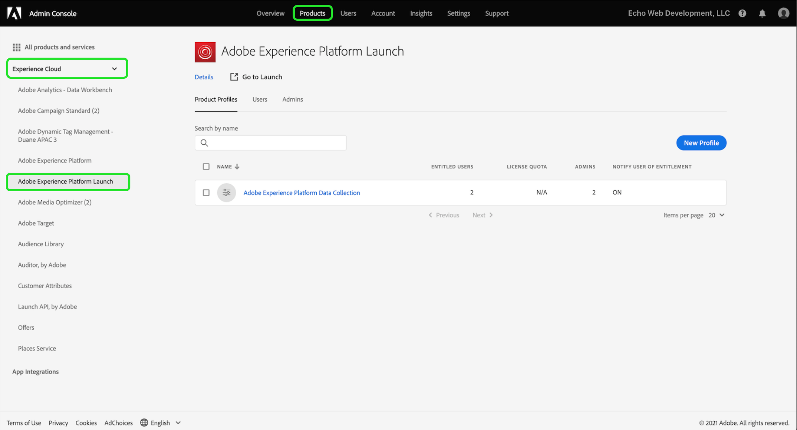

# Conceder acesso ao usuário

>[!NOTE]
>
>A Adobe Experience Platform Launch foi reformulada como um conjunto de tecnologias de coleta de dados no Adobe Experience Platform. Como resultado, várias alterações de terminologia foram implementadas na documentação do produto. Consulte o seguinte [documento](../../term-updates.md) para obter uma referência consolidada das alterações de terminologia.

Antes de começar a usar o extension_package, é necessário configurar os membros da equipe com contas de usuário e permissões. Isso é realizado no [Adobe Admin Console](https://adminconsole.adobe.com/).

Este documento fornece etapas para conceder acesso a tags no Adobe Experience Platform por meio do Admin Console.

## Pré-requisitos

Este guia considera que você seja um Administrador da organização, conforme designado pelo Admin Console. Se você precisar de informações adicionais sobre o Admin Console e a atribuição de funções, consulte os seguintes recursos:

* [Guia do usuário administrativo](https://helpx.adobe.com/br/enterprise/administering/user-guide.html?topic=/enterprise/administering/morehelp/introduction.ug.js): informações sobre tudo no Admin Console
* [Funções de administração corporativa](https://helpx.adobe.com/pt/enterprise/using/admin-roles.html): mais informações sobre os diferentes tipos de funções administrativas. Para o guia abaixo, vamos supor que você seja um Administrador da organização.

## Escolha sua organização

O administrador da sua organização do Adobe Experience Cloud deve fazer logon no [Admin Console](https://adminconsole.adobe.com/). A primeira tela é a visão geral.

Alguns de vocês podem ter acesso a mais de uma organização (Org). Para adicionar o recurso de tags à organização correta, selecione o nome da organização que você vê no canto superior direito da tela. Em seguida, escolha a Organização na qual você deseja usar as tags na lista suspensa.

## Criar um perfil de produto

Um perfil de produto é um grupo. Direitos individuais são atribuídos a perfis de produtos e qualquer usuário no perfil herdará esses direitos.

Escolha o link **[!UICONTROL Products]** na parte superior e **[!UICONTROL Experience Cloud]** à esquerda. Se você não tiver a interface do usuário da coleta de dados listada, os clientes devem entrar em contato com a equipe de conta e os parceiros devem enviar um email <ExchangeTechEC@adobe.com>.

A captura de tela acima mostra um perfil de exemplo, talvez você ainda não tenha um. Para criar um, selecione **[!UICONTROL Novo perfil]**. Na tela **Criar um novo perfil**, basta adicionar um **Nome do perfil** (Teste da coleta de dados, por exemplo) e um **Descrição** opcional, em seguida, selecionar **[!UICONTROL Salvar]**:

O perfil de produto foi adicionado à organização. Em seguida, adicione usuários ao perfil de produto.

## Atribuir usuários ao perfil do produto

Observe que o perfil de produto mostra zero para **ENTITLED USERS** e **ADMINS**. Selecione o nome do perfil de produto criado (teste da Coleta de dados no nosso exemplo).

Selecione a guia **[!UICONTROL Users]**. Aqui, você pode pesquisar usuários existentes do Adobe ID por email ou adicionar novos usuários a esse perfil de produto. Selecione **[!UICONTROL Adicionar link de usuário]**.

Insira um nome, grupo de usuários ou endereço de email no campo de texto apropriado. Recomenda-se incluir um nome e sobrenome, sempre que possível. Selecione **[!UICONTROL Save]** para adicionar o usuário.

Quando você tiver todos os usuários necessários neste perfil de produto, adicionaremos permissões a eles. Selecione a guia **[!UICONTROL Permissões]**. Na tela de permissões, você verá **[!UICONTROL Propriedades]**, **[!UICONTROL Direitos da empresa]** e **[!UICONTROL Direitos de propriedade]**. Selecione **[!UICONTROL Editar]**.

Para criar extensões, sua equipe deve ter no mínimo as seguintes permissões:

* &quot;Gerenciar propriedades&quot; do grupo da empresa.
* &quot;Gerenciar extensões&quot;, &quot;Gerenciar ambientes&quot; e &quot;Desenvolver&quot; no grupo de propriedades.

Você pode criar perfis de produto adicionais com direitos mais limitados posteriormente, se desejar, mas por enquanto, basta selecionar **[!UICONTROL + Adicionar todos]** para os **Direitos da empresa** e **Direitos de propriedade**. Selecione **[!UICONTROL Save]** em cada.

Até agora, escolhemos a organização apropriada, criamos um perfil de produto, adicionamos usuários ao perfil de produto e atribuímos permissões.

Isso conclui a configuração necessária no Admin Console. Você e os membros da sua equipe que foram configurados como usuários agora podem fazer logon [na interface do usuário da coleta de dados](https://launch.adobe.com/).

## Confirmar provisionamento

Depois que sua empresa for provisionada com acesso às tags e seus usuários forem configurados conforme descrito acima, você poderá acessar o ambiente de produção na [Interface do usuário de coleta de dados](https://launch.adobe.com/). Se você tiver sido provisionado para tags e tiver concluído as etapas do Admin Console acima, mas ainda não conseguir fazer logon na interface do usuário da coleta de dados, entre em contato com os representantes de suporte do Adobe.
