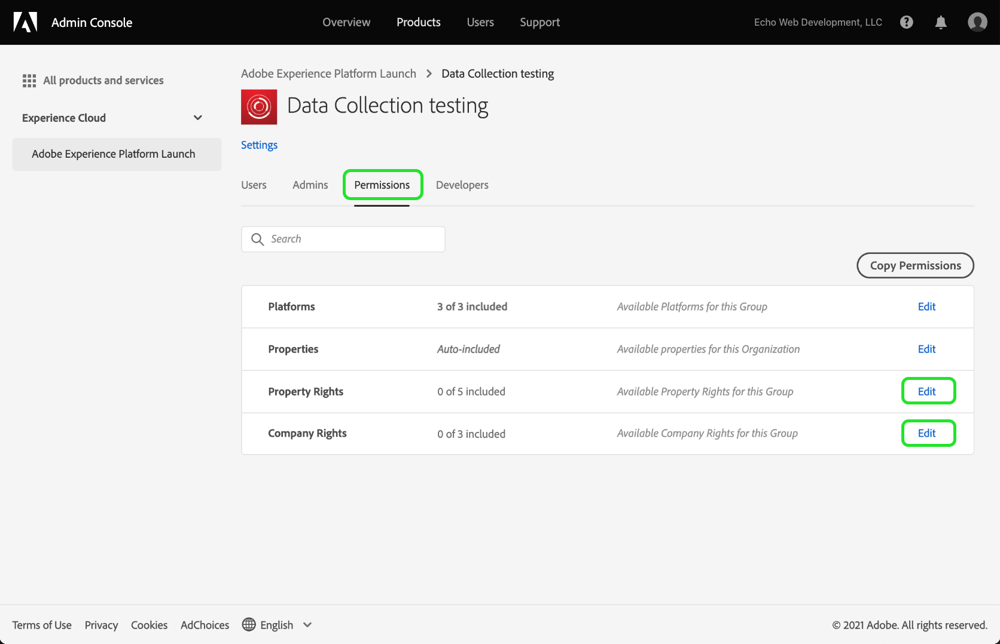
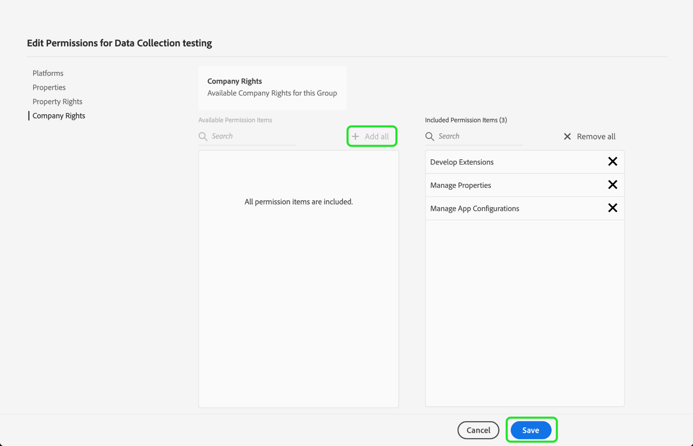

# Conceder acesso ao usuário

>[!NOTE]
>
>A Adobe Experience Platform Launch foi reformulada como um conjunto de tecnologias de coleta de dados no Adobe Experience Platform. Como resultado, várias alterações de terminologia foram implementadas na documentação do produto. Consulte o seguinte [documento](../../term-updates.md) para obter uma referência consolidada das alterações de terminologia.

Antes de começar a usar o extension_package, é necessário configurar os membros da equipe com contas de usuário e permissões. Isso é realizado no [Adobe Admin Console](https://adminconsole.adobe.com/).

Este documento fornece etapas para conceder acesso às tags na Adobe Experience Platform por meio do Admin Console.

## Pré-requisitos

Este guia considera que você seja um Administrador da organização, conforme designado pelo Admin Console. Se você precisar de informações adicionais sobre o Admin Console e a atribuição de funções, consulte os seguintes recursos:

* [Guia do usuário administrativo](https://helpx.adobe.com/br/enterprise/administering/user-guide.html?topic=/enterprise/administering/morehelp/introduction.ug.js): informações sobre tudo no Admin Console
* [Funções de administração corporativa](https://helpx.adobe.com/pt/enterprise/using/admin-roles.html): mais informações sobre os diferentes tipos de funções administrativas. Para o guia abaixo, vamos supor que você seja um Administrador da organização.

## Escolher sua organização

O administrador da sua organização do Adobe Experience Cloud deve fazer logon no [Admin Console](https://adminconsole.adobe.com/). A primeira tela é a visão geral.

Alguns usuários podem ter acesso a mais de uma organização (Org). Para adicionar o recurso de tags à organização correta, selecione o nome da organização que é exibido no canto superior direito da tela. Em seguida, escolha na lista suspensa a Organização na qual deseja usar as tags.

## Criar um perfil de produto

Um perfil de produto é um grupo. Direitos individuais são atribuídos a perfis de produtos e qualquer usuário no perfil herdará esses direitos.

Selecione o link **[!UICONTROL Produtos]** na parte superior e, em seguida, selecione **[!UICONTROL Experience Cloud]**, à esquerda. Se você não tiver a interface do usuário da coleta de dados listada, os clientes devem entrar em contato com a equipe de conta e os parceiros devem enviar um email <ExchangeTechEC@adobe.com>.

A captura de tela acima apresenta um perfil de exemplo, que talvez você ainda não tenha. Para criar um, selecione **[!UICONTROL Novo perfil]**. Na tela **Criar um novo perfil**, adicione um **Nome de perfil** (Teste da coleção de dados, por exemplo), e uma **Descrição** opcional. Em seguida, selecione **[!UICONTROL Salvar]**:

O perfil de produto foi adicionado à organização. Em seguida, adicione usuários ao perfil de produto.

## Atribuir usuários ao perfil de produto

Observe que o perfil de produto mostra zero para **USUÁRIOS AUTORIZADOS** e **ADMINISTRADORES**. Clique no nome do perfil de produto que você criou (teste de Coleção de dados, em nosso exemplo).

Selecione a guia **[!UICONTROL Usuários]**. Aqui você pode pesquisar usuários existentes do Adobe ID por email ou adicionar novos usuários a esse perfil de produto. Selecione **[!UICONTROL Adicionar link de usuário]**.

Insira um nome, um grupo de usuários ou um endereço de email no campo de texto apropriado. Recomenda-se incluir um nome e um sobrenome sempre que possível. Selecione **[!UICONTROL Salvar]** para adicionar o usuário.

Quando você tiver todos os usuários necessários nesse perfil de produto, adicionaremos permissões para eles. Selecione a guia **[!UICONTROL Permissões]**. Na tela de permissões, você verá **[!UICONTROL Propriedades]**, **[!UICONTROL Direitos de empresa]** e **[!UICONTROL Direitos de propriedade]**. Selecione **[!UICONTROL Editar]**.

Para criar extensões, sua equipe deve ter pelo menos as seguintes permissões:

* “Gerenciar propriedades” no grupo da empresa.
* “Gerenciar extensões”, “Gerenciar ambientes” e “Desenvolver” no grupo de propriedades.

Posteriormente, você poderá criar perfis de produto adicionais com direitos mais limitados, se desejar, mas, por enquanto, apenas selecione **[!UICONTROL + Adicionar todos]** para **Direitos de empresa** e **Direitos de propriedade**. Selecione **[!UICONTROL Salvar]** em cada etapa.

Até o momento, escolhemos a organização apropriada, criamos um perfil de produto, adicionamos usuários ao perfil de produto e atribuímos permissões.

Isso conclui as configurações necessárias do Admin Console. Agora, você e os membros de sua equipe que foram configurados como usuários podem fazer logon na [interface da Coleção de dados](https://launch.adobe.com/).

## Confirmar provisionamento

Depois que sua empresa for provisionada com acesso às tags e os usuários forem configurados conforme descrito acima, você deverá conseguir acessar o ambiente de produção por meio da [interface da Coleção de dados](https://launch.adobe.com/). Se você tiver sido provisionado com tags e tiver concluído as etapas do Admin Console acima, mas ainda não conseguir fazer logon na interface da Coleção de dados, entre em contato com os representantes do suporte da Adobe.
