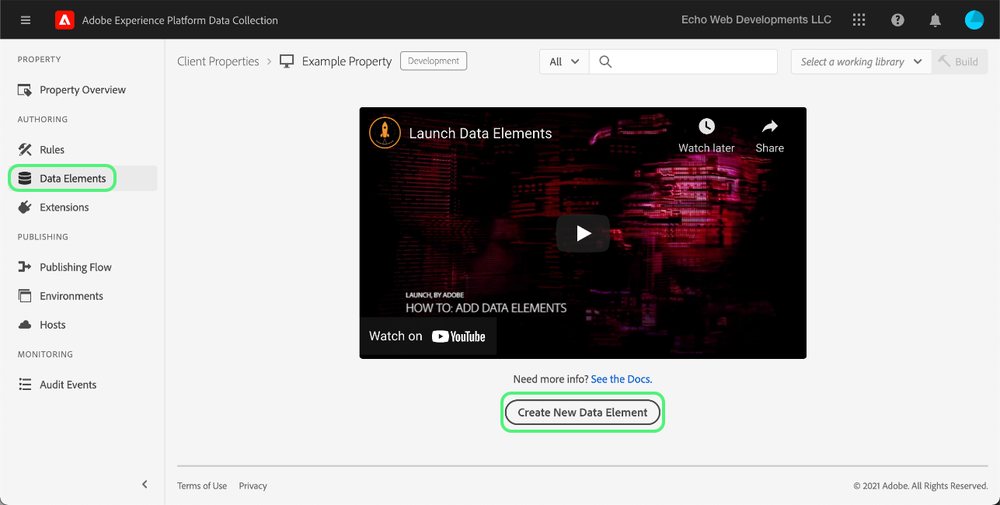
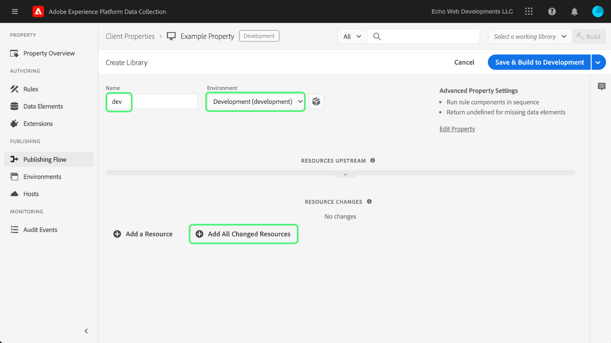
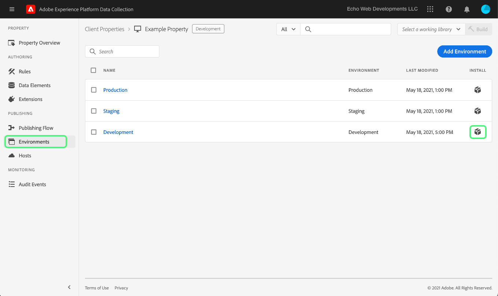
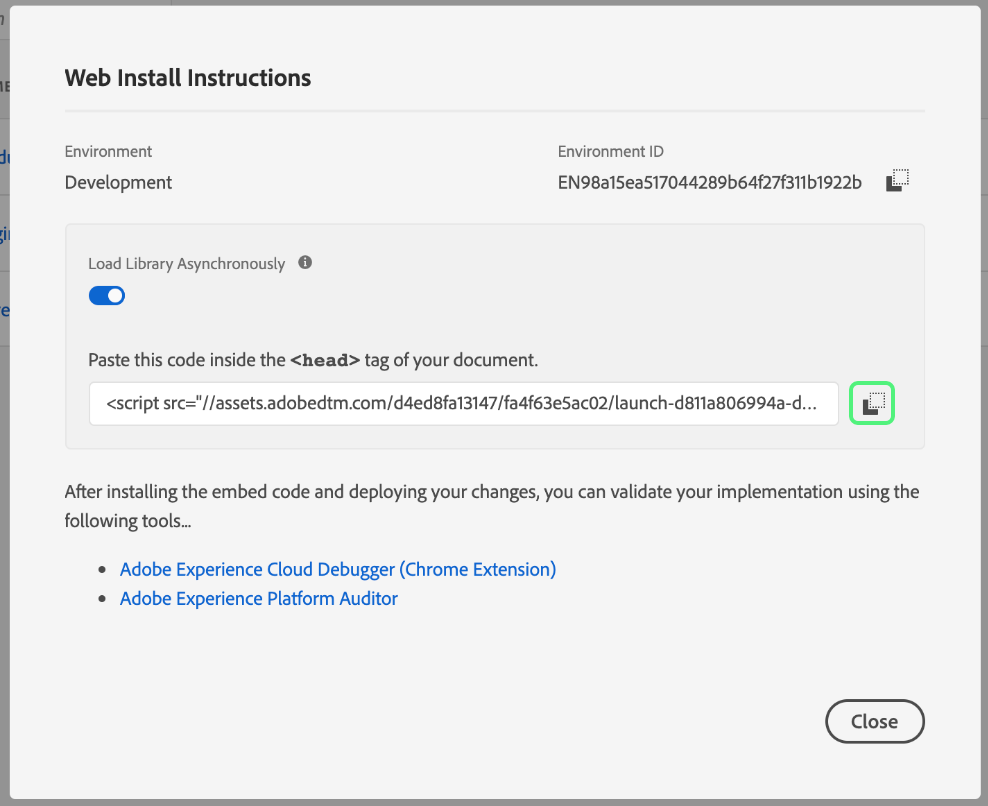

# Fazer upload e implementar testes completos

>[!NOTE]
>
>O Adobe Experience Platform Launch está sendo reformulado como um conjunto de tecnologias de coleção de dados na Experience Platform. Como resultado, várias alterações de terminologia foram implementadas na documentação do produto. Consulte o seguinte [documento](../../term-updates.md) para obter uma referência consolidada das alterações de terminologia.

Para testar extensões de tags no Adobe Experience Platform, use a API de tags e/ou as ferramentas de linha de comando para fazer upload dos pacotes de extensão. Em seguida, use a interface do usuário da coleta de dados para instalar o pacote de extensão em uma propriedade e exercer seus recursos dentro de uma biblioteca de tags e criação.

Este documento aborda como implementar testes completos para sua extensão.

>[!NOTE]
>
>Este guia pressupõe que você esteja usando o MacOS com Node.js e npm instalados e disponíveis.

## Validar sua extensão {#validate}

Quando a equipe estiver satisfeita com o desempenho da sua extensão e com os resultados que ela vê na ferramenta [Sandbox](https://www.npmjs.com/package/@adobe/reactor-sandbox#running-the-sandbox), você deverá estar pronto para fazer upload do seu pacote de extensão para as tags.

Antes de fazer upload, valide se os campos ou configurações necessários estão presentes. Por exemplo, revisando seu [manifesto de extensão](../manifest.md), sua [configuração de extensão](../configuration.md), suas [exibições](../web/views.md) e seus [módulos de biblioteca](../web/format.md) (no mínimo) é uma boa prática.

Um exemplo específico é o arquivo de logotipo: Adicione uma linha `"iconPath": "example.svg",` ao arquivo `extension.json` e inclua esse arquivo de imagem de logotipo no projeto. Esse é o caminho relativo para o ícone que será exibido para a extensão. Não deve começar com uma barra. Ele deve fazer referência a um arquivo SVG com uma extensão `.svg`. O SVG deve aparecer normalmente quando renderizado como quadrado e pode ser dimensionado pela interface do usuário. Consulte o artigo [Como dimensionar SVG](https://css-tricks.com/scale-svg/) para obter mais detalhes.

>[!NOTE]
>
>Para extensões públicas, inclua um item em seu `extension.json` com um link para sua lista do Exchange. Seu [manifesto de extensão](../manifest.md) deve incluir uma entrada como esta: `"exchangeUrl":"https://www.adobeexchange.com/experiencecloud.details.12345.html"` apontando para o URL da sua lista do Exchange.

## Criar uma integração do Adobe I/O {#integration}

Para usar a API ou as ferramentas de linha de comando, é necessário ter uma conta técnica com o Adobe I/O. Você deve criar a conta técnica no console de E/S e usar a ferramenta Uploader para fazer upload do pacote de extensão.

Para obter informações sobre como criar uma conta técnica para uso com tags no Adobe Experience Platform, consulte o guia [Access Tokens](https://developer.adobelaunch.com/api/guides/access_tokens/).

>[!IMPORTANT]
>
>Para criar uma integração no Adobe I/O, você deve ser um Administrador de organização da Experience Cloud ou um Desenvolvedor de organização da Experience Cloud.

Se não for possível criar uma Integração, é provável que você não tenha as permissões corretas. Isso exigirá que um Org Admin conclua as etapas para você ou atribua você como desenvolvedor.

## Fazer upload do pacote de extensão {#upload}

Agora que você tem credenciais, está pronto para testar seu pacote de extensão de ponta a ponta.

Quando você faz upload do pacote de extensão pela primeira vez, ele entra em um estado de `development`. Isso significa que ele só é visível para sua própria organização e somente com uma propriedade que foi marcada para desenvolvimento de extensão.

Use a linha de comando para executar o seguinte comando no diretório que contém o pacote .zip.

```bash
npx @adobe/reactor-uploader
```

`npx` permite baixar e executar um pacote npm sem instalá-lo na sua máquina. Essa é a maneira mais simples de executar o Uploader.

O Carregador exige que você insira várias informações. A ID de conta técnica, a chave de API e outros bits de informação podem ser recuperados do console do Adobe I/O. Navegue até a [página Integrações](https://console.adobe.io/integrations) no console do I/O. Selecione a Org correta na lista suspensa, encontre a integração correta e selecione **[!UICONTROL View]**.

- Qual é o caminho para sua chave privada? /path/to/private.key. Este é o local onde você salvou sua chave privada na etapa 2 acima.
- Qual é a sua ID organizacional? Copie e cole na página de visão geral do Console de E/S que você deixou aberta anteriormente.
- Qual é a sua ID de conta técnica? Copie e cole isso do Console de E/S.
- Qual é a sua chave de API? Copie e cole isso do Console de E/S.
- Qual é o segredo do cliente? Copie e cole isso do Console de E/S.
- Qual é o caminho para o extension_package do qual você deseja fazer upload? /path/to/extension_package.zip. Se você chamar o carregador do diretório que contém o pacote .zip, poderá selecioná-lo na lista em vez de digitar o caminho.

Seu pacote de extensão será carregado e o carregador fornecerá a ID do extension_package.

>[!NOTE]
>
>Observação: ao fazer upload ou aplicar patches, os pacotes de extensão são colocados em um estado pendente enquanto o sistema extrai o pacote de forma assíncrona e faz a implantação. Enquanto esse processo está em andamento, é possível pesquisar a ID `extension_package` para seu status usando a API e na interface do usuário da coleta de dados. Você verá um cartão de extensão no catálogo marcado como Pendente.

>[!NOTE]
>
>Se você planeja executar o carregador com frequência, colocar todas essas informações em cada vez pode ser um fardo. Também é possível passá-los como argumentos da linha de comando. Consulte a seção [Argumentos de linha de comando](https://www.npmjs.com/package/@adobe/reactor-uploader#command-line-arguments) dos documentos do NPM para obter mais informações.

## Criar uma propriedade de desenvolvimento {#property}

Depois de fazer logon na interface do usuário da coleta de dados, a tela Propriedades é exibida. Uma propriedade é um container para as tags que você deseja implantar e pode ser usada em um ou vários sites.


Você não verá nenhuma propriedade em sua tela na primeira vez que fizer logon. Selecione **Nova propriedade** para criar uma. Insira um nome e um URL. Use o URL do site de teste ou a página onde você testará sua extensão. Esse campo de domínio pode ser usado por algumas extensões ou por uma condição usando a extensão principal.

>[!NOTE]
>
>`localhost` não funcionará como um valor de URL. Em vez disso, use qualquer valor de modelo para testar se você está usando um URL `localhost`. Por exemplo, example.com

Para usar essa propriedade para testes de desenvolvimento de extensão, você deve expandir o **ADVANCED OPTIONS** e verificar se a caixa **Configurar para desenvolvimento de extensão** está marcada.


Selecione **Salvar** na parte inferior para salvar a nova propriedade.

A tela Propriedades é exibida. Selecione o nome da propriedade que você acabou de criar. A tela Visão geral da propriedade é exibida. Ele fornece links para cada área do sistema com os links de navegação global na coluna à esquerda.

## Instalar a extensão {#install-extension}

Para instalar sua extensão nessa propriedade, selecione o link **Extensões** nos links de navegação principais na coluna esquerda. A extensão **Core** é exibida na tela **Instalado**. A extensão principal contém toda a funcionalidade de gerenciamento de tags na coleta de dados.


Para adicionar sua extensão, selecione a guia **Catalog**.


O catálogo exibe ícones de cartão para cada extensão disponível. Se a sua extensão não for exibida no catálogo, verifique se concluiu as etapas acima nas seções Configuração e criação do pacote de extensão do Console de administração do Adobe. Seu pacote de extensão também pode aparecer como Pendente se a Platform não tiver concluído o processamento inicial.

Se você tiver seguido as etapas anteriores e ainda não vir um pacote de extensão Pendente ou Falha no catálogo, deverá verificar o status do seu pacote de extensão diretamente usando a API. Para obter informações sobre como fazer a chamada de API apropriada, leia [Buscar um ExtensionPackage](https://developer.adobelaunch.com/api/reference/1.0/extension_packages/fetch/) na documentação da API.

Após concluir o processamento do pacote de extensão, selecione **Instalar** na parte inferior do cartão.


A tela de configuração é aberta (se a extensão tiver uma). Adicione todas as informações necessárias para configurar a extensão e selecione **Salvar** na parte inferior. O exemplo de tela de configuração visto aqui usa a extensão Facebook, que requer uma ID de pixel.


Agora você deve ver a tela de extensões **Instaladas** com a extensão Principal e a sua extensão.


## Criar recursos para testar sua extensão {#resources}

As extensões fornecem novos recursos aos usuários do Adobe Experience Platform. Normalmente, são exibidos em Elementos de dados ou no Construtor de regras.

### Elementos de dados

A finalidade dos elementos de dados de tag é ajudar os usuários a persistirem os valores. Cada elemento de dados é um mapeamento ou ponteiro para dados de origem. Um único elemento de dados é uma variável cujo valor pode ser mapeado para sequências de consulta, URLs, valores de cookie, variáveis JavaScript e assim por diante. Selecione **Elementos de dados** na barra de navegação esquerda e **Criar novo elemento de dados**.



As extensões podem definir tipos de elementos de dados, se necessário, para que sua extensão funcione, ou simplesmente como uma conveniência para os usuários. Quando uma extensão fornece tipos de elementos de dados, eles são exibidos em uma lista suspensa para usuários na tela **Criar elemento de dados**:


Quando um usuário seleciona sua extensão da lista suspensa **Extension**, a lista suspensa **Data Element Type** é preenchida com qualquer tipo de elemento de dados fornecido pela extensão. O usuário pode mapear cada elemento de dados para seu valor de origem. Os elementos de dados podem ser usados ao criar regras no Evento de alteração de elemento de dados ou no Evento de código personalizado para acionar a execução de uma regra. Um elemento de dados também pode ser usado na Condição do elemento de dados ou em outras Condições, Exceções ou Ações em uma regra.

Depois que o elemento de dados é criado (o mapeamento é configurado), os usuários podem fazer referência aos dados de origem simplesmente referenciando o elemento de dados. Se a origem do valor mudar (novos projetos de site etc.) os usuários só precisam atualizar o mapeamento uma vez na interface do usuário da coleção de dados e todos os elementos de dados receberão automaticamente o novo valor de fonte.

### Regras

Selecione o link **Rules** na navegação à esquerda e, em seguida, **Create New Rule**.


Primeiro, insira um nome descritivo para a regra. A tela **Criar regra** é configurada como uma instrução `if-then`.


Se ocorrer um evento, as condições forem aprovadas e não houver exceções, a ação será acionada. Esse mesmo fluxo existe em extensões em que você pode criar ou aproveitar eventos, condições, exceções, elementos de dados ou ações.

Usando o exemplo de extensão do Facebook, adicione um evento para cada vez que uma página carregar no site de teste.


O `Window Loaded` **Tipo de evento** garante que, sempre que uma página for carregada no site de teste, essa regra será acionada. Selecione **Manter alterações**. Para este exemplo, ignore **Conditions** como a regra deve ser acionada para qualquer página no site de teste.

Em **AÇÕES** selecione **Adicionar**. A tela **Action Configuration** é exibida. Em seguida, você deve escolher a extensão à qual a regra deve ser aplicada e a ação a ser executada quando a regra for acionada. Selecione **Facebook Pixel** na lista suspensa **Extensão** e **Enviar visualização de página** na lista suspensa **Tipo de ação**. Selecione **Manter alterações** e **Salvar** na seguinte tela **Editar regra**.


Ao testar sua extensão, selecione quaisquer eventos, condições relevantes etc. fornecido pela sua extensão em qualquer número de regras.

## Publicar suas alterações {#publish}

Na navegação principal, selecione **Publicação** e, em seguida, selecione o link **Adicionar nova biblioteca**:


Uma biblioteca é um conjunto de instruções sobre como as extensões, os elementos de dados e as regras interagem entre si e com um site. As bibliotecas são compiladas em criações. Uma biblioteca pode conter quantas alterações o usuário quiser criar ou testar simultaneamente.

Na tela **Criar biblioteca**, adicione um nome no campo de texto **Nome**. As tags fornecem um ambiente de desenvolvimento padrão chamado **Desenvolvimento**. Selecione **Desenvolvimento** na lista suspensa **Ambiente**. Para simplificar, adicione todos os recursos disponíveis. Selecione **Adicionar todos os recursos alterados** e selecione **Salvar**.

>[!NOTE]
>
>Quando você adiciona um recurso a uma biblioteca, um instantâneo desse recurso nesse momento exato é criado e adicionado à biblioteca. Ao fazer alterações em seus recursos posteriormente (por exemplo, como resultado de correções que devem ser feitas), você também precisará atualizar a biblioteca para incluir as alterações mais recentes em seus recursos. O botão **Adicionar todos os recursos alterados** também é útil para essa finalidade.



Agora que todas as alterações foram incluídas na biblioteca recém-criada (chamada de **dev** no exemplo fornecido), selecione **Salvar e criar no desenvolvimento**.


Após a conclusão do processo de build, um indicador verde **success** é exibido ao lado do nome da biblioteca.


A biblioteca de tags agora é publicada e está disponível para uso. A página de teste deve usar a biblioteca recém-criada para testar o comportamento da página para o usuário final em um navegador.

## Instalar tags em um site de teste {#install-data-collection-tags}

As instruções de instalação estão disponíveis na guia Ambientes . Esta página exibe todos os ambientes disponíveis e também permite criar mais. À medida que a biblioteca foi publicada no ambiente de desenvolvimento, selecione o ícone de caixa na coluna **INSTALL** na linha **Development**.



A caixa de diálogo **Instruções de instalação da Web** para o ambiente de desenvolvimento é exibida. Selecione o ícone de cópia para copiar toda a tag `<script>`.



Conclua a instalação colocando essa única tag `<script>` na seção `<head>` do documento ou modelo do site. Em seguida, visite o site de teste para examinar o comportamento da biblioteca de tags publicada.

## Teste {#test}

Veja a seguir uma lista de comandos úteis do console para validar sua extensão na página de teste ou no site.

- `_satellite.setDebug(true);` habilitará o modo de depuração e as instruções de registro úteis de saída no console.
- O objeto `_satellite._container` contém informações úteis sobre a biblioteca implantada, incluindo detalhes sobre a Build, Elementos de dados, Regras e Extensões incluídas.

O objetivo desse teste é verificar a funcionalidade da biblioteca implantada e garantir que o pacote de extensão se comporte conforme esperado depois de ter sido compilado em uma biblioteca.

Quando você descobre alterações que precisam ser feitas no pacote de extensão, o processo de iteração é semelhante ao de desenvolvimento.

1. Faça alterações no código do projeto.
1. Valide as alterações com a ferramenta Sandbox.
1. Use a ferramenta Packager para criar um novo pacote .zip
1. Use a ferramenta Uploader para fazer upload do novo pacote .zip. O processo segue as mesmas instruções de antes em relação ao upload inicial. No entanto, você observará que, como já há um pacote de extensão desse nome no modo de desenvolvimento, esse novo pacote substituirá a versão mais antiga em vez de criar um novo.

   >[!NOTE]
   >
   >Os argumentos podem ser passados na linha de comando para economizar tempo, evitando a inserção repetida de credenciais. Para obter mais informações sobre isso, leia a [documentação do carregador de reator](https://www.npmjs.com/package/@adobe/reactor-uploader).
1. A etapa de instalação pode ser ignorada ao atualizar um pacote existente.
1. Modificar recursos - se a configuração de qualquer um dos componentes da extensão tiver sido alterada, será necessário atualizar esses recursos na interface do usuário da coleta de dados.
1. Adicione as alterações mais recentes à biblioteca e crie novamente.
1. Realize outra rodada de testes.

<!--
## Document {#document}

Your [exchange listing](./create-listing.md) is a great place for marketing and support information for your extension, but our tags [Help Docs](https://experienceleague.adobe.com/docs/launch/using/overview.html) are used every day by our customers. We encourage you to submit a pull request to [add your extension documentation](https://github.com/AdobeDocs/launch.en/blob/master/help/extension-reference/3rd-party-extensions.md) into the tags user docs. Open source docs for the win! 🚀
-->
