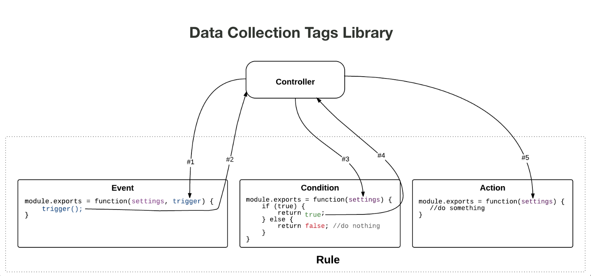

# Fluxo de extensão da Web

>[!NOTE]
>
>O Adobe Experience Platform Launch foi reformulado como um conjunto de tecnologias de coleta de dados na Adobe Experience Platform. Como resultado, várias alterações de terminologia foram implementadas na documentação do produto. Consulte o seguinte [documento](../../term-updates.md) para obter uma referência consolidada das alterações de terminologia.

Em extensões da Web, cada evento, condição, ação e tipo de elemento de dados tem uma visualização que permite aos usuários modificar as configurações e um módulo de biblioteca para agir de acordo com essas configurações definidas pelo usuário.

Como mostra o diagrama de alto nível a seguir, a visualização do tipo de evento da extensão será mostrada em um iframe no aplicativo integrado ao Adobe Experience Platform. O usuário usa a visualização para modificar as configurações, que são salvas no Experience Platform. Quando a biblioteca de tempo de execução de tag for criada, tanto o módulo da biblioteca de tipos de evento da extensão quanto as configurações definidas pelo usuário serão incluídos na biblioteca de tempo de execução. No tempo de execução, o Experience Platform injetará as configurações definidas pelo usuário no módulo da biblioteca.

No diagrama a seguir, é possível ver a conexão entre eventos, condições e ações no fluxo de processamento da regra.

O fluxo de processamento de regras contém as seguintes fases:

1. Os métodos `settings` e `trigger` são fornecidos ao módulo da biblioteca de eventos na inicialização.
1. Quando o módulo da biblioteca de eventos determina que o evento ocorreu, o módulo da biblioteca de eventos chama `trigger`.
1. As tags passam `settings` para os módulos de biblioteca de condições de regra, nos quais as condições são avaliadas.
1. Cada módulo de biblioteca de condições retorna se uma condição é avaliada como verdadeira.
1. Se todas as condições forem aprovadas, as ações da regra serão executadas.
