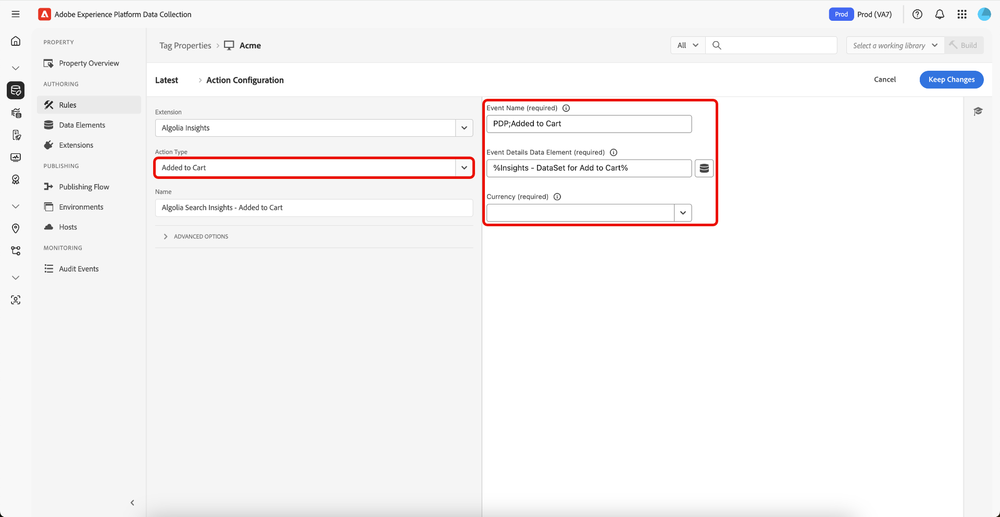

# Visão geral da extensão de marcas [!DNL Algolia]

A extensão de Tags do [!DNL Algolia] permite que os profissionais de marketing configurem facilmente regras que enviam dados de interação do usuário para o [!DNL Algolia], ajudando você a fornecer experiências de Pesquisa e Descoberta de IA mais personalizadas.

Essa extensão é alimentada por um recurso principal:

* **[!DNL Algolia]Insights**: captura e envia automaticamente eventos de interação do usuário para [!DNL Algolia], o que permite análises poderosas, experiências personalizadas e relevância de pesquisa aprimorada.

## Pré-requisitos {#prerequisites}

Você deve ter uma conta [!DNL Algolia] válida para usar esta extensão. Vá para a [[!DNL Algolia] página de inscrição](https://dashboard.algolia.com/users/sign_up) para criar uma conta caso ainda não tenha uma.

### Coletar detalhes de configuração necessários {#configuration-details}

Para conectar [!DNL Algolia] ao Adobe Experience Platform, você precisará das seguintes informações:

| Credencial | Descrição | Exemplo |
| --- | --- | --- |
| ID do aplicativo | A ID do Aplicativo pode ser encontrada na seção [Chaves de API](https://www.algolia.com/account/api-keys/all) do Painel [!DNL Algolia]. | 0ABCDEFG12 |
| Chave da API de pesquisa | Sua Chave de API de Pesquisa pode ser encontrada na seção [Chaves de API](https://www.algolia.com/account/api-keys/all) do seu Painel [!DNL Algolia]. | 1234a12345678901b1234567890c1ab1 |

## Instalar e configurar a extensão do Insights do [!DNL Algolia] {#install-configure}

Para instalar a extensão do [!DNL Algolia] Insights, navegue até a [!UICONTROL Interface da Coleção de Dados] e selecione **[!UICONTROL Marcas]** na navegação à esquerda. Aqui, selecione uma propriedade à qual adicionar a extensão ou crie uma nova propriedade.

Depois de selecionar ou criar a propriedade desejada, selecione **[!UICONTROL Extensões]** na navegação à esquerda e selecione a guia **[!UICONTROL Catálogo]**. Procure o cartão [!DNL Algolia] Insights e selecione **[!UICONTROL Instalar]**.


Na visualização de configuração exibida, você deve fornecer os seguintes detalhes:

| Propriedade | Descrição |
| --- | --- |
| [!UICONTROL Application ID] | Insira a [!UICONTROL ID do Aplicativo] coletada anteriormente na seção [detalhes de configuração](#configuration-details). |
| [!UICONTROL Chave de API de Pesquisa] | Insira a [!UICONTROL Chave da API de Pesquisa] coletada anteriormente na seção [detalhes de configuração](#configuration-details). |
| [!UICONTROL Nome do Índice] | O [!UICONTROL Nome do Índice] contém os Produtos ou Conteúdo.  Este índice será usado como padrão. |
| [!UICONTROL Elemento de Dados do Token do Usuário] | O elemento de dados que retornará o token do usuário. |
| [!UICONTROL Elemento de Dados do Token do Usuário Autenticado] | Definir o elemento de dados que retornará o token do usuário autenticado. |
| [!UICONTROL Moeda] | Selecione um tipo de moeda. O valor padrão está definido como `USD`. |


## [!DNL Algolia] tipos de ação de extensão do Insights {#action-types}

O [!DNL Algolia] oferece suporte a um conjunto de eventos padrão predefinidos, cada um com contextos e propriedades específicas. As ações disponíveis na extensão [!DNL Algolia] estão alinhadas a esses tipos de evento, facilitando a categorização e configuração dos eventos que você envia para o [!DNL Algolia] com base em seus tipos.

### Carregar Insights {#load-insights}

>[!NOTE]
>
>Na maioria dos casos, é recomendável carregar o [!DNL Algolia] Insights em cada página do site.

Adicione a ação **[!UICONTROL Carregar Insights]** à sua regra de marca sempre que fizer mais sentido para carregar Insights do [!DNL Algolia] com base no contexto da sua regra. Esta ação carrega a biblioteca `search-insights.js` na página.

Crie uma nova regra de tag ou abra uma existente. Defina as condições de acordo com suas necessidades e selecione **[!UICONTROL Algolia]** como a [!UICONTROL Extensão] e selecione **[!UICONTROL Carregar Insights]** como o [!UICONTROL Tipo de Ação].

| Propriedade | Descrição |
| --- | --- |
| [!UICONTROL Versão da Biblioteca Insight] | A versão do Insights do [!DNL Algolia]. O padrão é `2.13.0`. |
| [!UICONTROL Elemento de Dados de Recusa de Usuário] | O Elemento de dados que captura a preferência de rastreamento do usuário. |
| [!UICONTROL Usar Cookie de Token de Usuário] | Marque esta caixa para permitir que [!DNL Algolia] gere um cookie de Token de Usuário. Por padrão, esta opção está definida como `false`. |


### Clicado {#clicked}

Adicione a ação **[!UICONTROL Clicar]** à sua regra de marca para enviar eventos clicados para [!DNL Algolia]. Crie uma nova regra de tag ou abra uma existente. Defina as condições de acordo com suas necessidades e selecione **[!UICONTROL Algolia]** como a [!UICONTROL Extensão] e selecione **[!UICONTROL Clicados]** como o [!UICONTROL Tipo de Ação].

| Propriedade | Descrição |
| --- | --- |
| [!UICONTROL Nome do Evento] | O Nome do evento que pode ser usado para refinar ainda mais este evento de clique. |
| [!UICONTROL Elemento de Dados de Detalhes do Evento] | O elemento de dados retorna detalhes do evento, incluindo: <ul><li>`indexName`</li><li>`objectIDs`</li><li>`queryID` (opcional)</li><li>`position` (opcional)</li></ul> |
| [!UICONTROL Elemento de dados da ID do registro] | A ID do Registro é usada como uma chave para os dados do evento armazenados no armazenamento do navegador durante um evento `click`. Por padrão, o URL da página serve como a ID do registro. Para substituir esse comportamento, use essa propriedade para fornecer um elemento de dados que retorne a ID de registro como uma string. |

>[!NOTE]
>
>Se `queryID` e `position` forem incluídos, o evento será classificado como **IDs de objeto clicado após a Pesquisa**. Caso contrário, ele será classificado como um evento de **IDs de objeto clicado**.
>&#x200B;><br>
>&#x200B;>Se o Elemento de Dados não fornecer um `indexName`, o **Nome de Índice Padrão** será usado quando o evento for enviado.


Para obter mais informações sobre categorias de evento, consulte as [IDs de objeto clicadas após a pesquisa](https://www.algolia.com/doc/api-reference/api-methods/clicked-object-ids-after-search/)
e guias de [IDs de objeto clicado](https://www.algolia.com/doc/api-reference/api-methods/clicked-object-ids/).

### Convertido {#converted}

Adicione a ação **[!UICONTROL Convertido]** à sua regra de marcas para enviar eventos convertidos para [!DNL Algolia]. Crie uma nova regra de tag ou abra uma existente. Defina as condições de acordo com suas necessidades, selecione **[!UICONTROL Algólia]** como a [!UICONTROL Extensão] e selecione **[!UICONTROL Convertidos]** como o [!UICONTROL Tipo de Ação].

| Propriedade | Descrição |
| --- | --- |
| [!UICONTROL Nome do Evento] | O Nome do Evento que será usado para refinar ainda mais este evento **convert**. |
| [!UICONTROL Elemento de Dados de Detalhes do Evento] | O elemento de dados retorna detalhes do evento, incluindo: <ul><li>`indexName`</li><li>`objectIDs`</li><li>`queryID` (opcional)</li></ul> |
| [!UICONTROL Desabilitar Remoção de Dados do Evento] | Em um evento de conversão, os dados do evento são removidos do armazenamento. Se esses dados forem necessários para eventos de conversão subsequentes, desative o processo de remoção para garantir que os dados do evento permaneçam disponíveis. |
| [!UICONTROL Elemento de dados da ID do registro] | A ID do registro é usada como uma chave para pesquisar os dados do evento armazenados no armazenamento do navegador. O URL da página é a ID de registro padrão. Para substituir esse comportamento, use essa propriedade para fornecer um elemento de dados que retorne a ID de registro como uma string. |

>[!NOTE]
>
>Se o Elemento de Dados contiver `queryId`, o evento será classificado como **Convertido após a Pesquisa**. Caso contrário, será classificado como um evento **Converted**.
>&#x200B;><br>
>&#x200B;>Se o Elemento de Dados não fornecer um `indexName`, o **Nome de Índice Padrão** será usado quando o evento for enviado.


Para obter mais informações sobre as categorias de evento, consulte os guias [IDs de objeto convertido após a pesquisa](https://www.algolia.com/doc/api-reference/api-methods/converted-object-ids-after-search/) e [IDs de objeto convertido](https://www.algolia.com/doc/api-reference/api-methods/converted-object-ids/).

### Adicionado ao carrinho {#added-to-cart}

Adicione a ação **[!UICONTROL Adicionado ao carrinho]** à sua regra de tag para enviar eventos adicionados ao carrinho para [!DNL Algolia]. Crie uma nova regra de tag ou abra uma existente. Defina as condições de acordo com suas necessidades e selecione **[!UICONTROL Algolia]** como a [!UICONTROL Extensão] e selecione **[!UICONTROL Adicionado ao carrinho]** como o [!UICONTROL Tipo de Ação].

| Propriedade | Descrição |
| --- | --- |
| [!UICONTROL Nome do Evento] | O Nome do Evento que será usado para refinar ainda mais este evento **convert**. |
| [!UICONTROL Elemento de Dados de Detalhes do Evento] | O elemento de dados retorna detalhes do evento, incluindo: <ul><li>`indexName`</li><li>`objectIDs`</li><li>`objectData`<ul><li>`queryID` (opcional)</li><li>`price`</li><li>`quantity`</li><li>`discount`</li></ul></li><li>`queryID` (opcional)</li></ul>. |
| [!UICONTROL Moeda] | Selecione um tipo de moeda. O valor padrão está definido como `USD`. |

>[!NOTE]
>
>Se o Elemento de Dados contiver `queryId`, o evento será classificado como **Adicionado às IDs de objeto do carrinho após a Pesquisa**. Caso contrário, será classificado como um evento **Adicionado às IDs de objeto do carrinho**.
>&#x200B;><br>
>&#x200B;>Se o Elemento de Dados não fornecer um `indexName`, o **Nome de Índice Padrão** será usado quando o evento for enviado.
>&#x200B;><br>
>&#x200B;>Se os Elementos de dados padrão não atenderem aos seus requisitos, um Elemento de dados personalizado poderá ser criado para retornar os detalhes do evento desejado.



Para obter mais informações sobre as categorias de eventos, consulte os guias [Adicionado às IDs de objeto do carrinho após a pesquisa](https://www.algolia.com/doc/api-reference/api-methods/added-to-cart-object-ids-after-search/) e [Adicionado às IDs de objeto do carrinho](https://www.algolia.com/doc/api-reference/api-methods/added-to-cart-object-ids/).

### Comprado {#purchased}

Adicione a ação **[!UICONTROL Comprado]** à sua regra de marca para enviar eventos comprados para [!DNL Algolia]. Crie uma nova regra de tag ou abra uma existente. Defina as condições de acordo com suas necessidades, selecione **[!UICONTROL Algólia]** como [!UICONTROL Extensão] e **[!UICONTROL Comprado]** como [!UICONTROL Tipo de Ação].

| Propriedade | Descrição |
| --- | --- |
| [!UICONTROL Nome do Evento] | O Nome do Evento que será usado para refinar ainda mais este evento **compra**. |
| [!UICONTROL Elemento de Dados de Detalhes do Evento] | O elemento de dados retorna detalhes do evento, incluindo: <ul><li>`indexName`</li><li>`objectIDs`</li><li>`objectData`<ul><li>`queryID` (opcional)</li><li>`price`</li><li>`quantity`</li><li>`discount`</li></ul></li><li>`queryID` (opcional)</li></ul>. |
| [!UICONTROL Moeda] | Selecione um tipo de moeda. O valor padrão está definido como `USD`. |

>[!NOTE]
>
>Se o Elemento de Dados contiver `queryId`, o evento será classificado como **IDs de objeto comprado após a Pesquisa**. Caso contrário, será classificado como um evento **IDs de objeto compradas**.
>&#x200B;><br>
>&#x200B;>Se o Elemento de Dados não fornecer um `indexName`, o **Nome de Índice Padrão** será usado quando o evento for enviado.
>&#x200B;><br>
>&#x200B;>Se os Elementos de dados padrão não atenderem aos seus requisitos, um Elemento de dados personalizado poderá ser criado para retornar os detalhes do evento desejado.


Para obter mais informações sobre categorias de evento, consulte as [IDs de objeto compradas após a pesquisa](https://www.algolia.com/doc/api-reference/api-methods/purchased-object-ids-after-search/)
e guias de [IDs de objeto comprado](https://www.algolia.com/doc/api-reference/api-methods/purchased-object-ids/).

### Exibido {#viewed}

Adicione a ação **[!UICONTROL Visualizado]** à sua regra de marca para enviar eventos comprados para [!DNL Algolia]. Crie uma nova regra de tag ou abra uma existente. Defina as condições de acordo com suas necessidades e selecione **[!UICONTROL Algolia]** como a [!UICONTROL Extensão] e **[!UICONTROL Visualizada]** como o [!UICONTROL Tipo de Ação].

| Propriedade | Descrição |
| --- | --- |
| [!UICONTROL Nome do Evento] | O Nome do Evento que será usado para refinar este evento **exibir**. |
| [!UICONTROL Elemento de Dados de Detalhes do Evento] | O elemento de dados retorna detalhes do evento, incluindo: <ul><li>`indexName`</li><li>`objectIDs`</li></ul> |

>[!NOTE]
>
>Se o Elemento de Dados não fornecer um `indexName`, o **Nome de Índice Padrão** será usado ao enviar o evento.


Para obter mais informações sobre o evento de exibição, consulte o guia [IDs de objeto visualizadas](https://www.algolia.com/doc/api-reference/api-methods/viewed-object-ids/).

## Elementos de dados da extensão do Insights do [!DNL Algolia] {#data-elements}

O [!DNL Algolia] oferece suporte a um conjunto de elementos de dados predefinidos, cada um com contextos e propriedades específicas. As seções a seguir descrevem os elementos de dados disponíveis na extensão do Insights do [!DNL Algolia].

### DataSet {#dataset}

O Elemento de Dados DataSet recupera dados associados a elementos HTML, que são usados em [!DNL Algolia] ações.

| Propriedade | Descrição |
| --- | --- |
| [!UICONTROL Nome da Div/Classe do Elemento de Ocorrência] | O Nome do Elemento HTML e/ou Nome da Classe CSS contendo os atributos do conjunto de dados incluindo `data-insights-object-id` e, opcionalmente, `data-insights-query-id` e `data-insights-position` no Elemento HTML. |
| [!UICONTROL Nome do Índice, Elemento Div/Nome da Classe] | O Nome do Elemento HTML e/ou o Nome da Classe CSS que tem os atributos do conjunto de dados (`data-indexname`) no Elemento HTML. |
| [!UICONTROL Elemento de dados da ID da consulta] | A ID da consulta é recuperada do conjunto de dados no elemento HTML. Para substituir esse comportamento, use essa propriedade para fornecer um elemento de dados que retorne a ID da consulta como uma string. |
| [!UICONTROL Elemento de Dados de IDs de Objetos] | As IDs de objeto são recuperadas do conjunto de dados no elemento do HTML. Para substituir esse comportamento, use essa propriedade para fornecer um elemento de dados que retorne as IDs de objeto como uma matriz. |
| [!UICONTROL Elemento de Dados de Posições] | As Posições são recuperadas do conjunto de dados no elemento HTML. Para substituir esse comportamento, use essa propriedade para fornecer um elemento de dados que retornará as Posições como uma matriz. |
| [!UICONTROL Elemento de Dados do Nome do Índice] | O Nome do índice é recuperado do conjunto de dados no elemento HTML. Para substituir esse comportamento, use essa propriedade para fornecer um elemento de dados que retornará o Nome do índice como uma string. |


Esse elemento de dados retorna:

```javascript
{
  timestamp,
  queryID,
  indexName,
  objectIDs,
  positions
}
```

Um exemplo de HTML que contém um conjunto de dados:

```html
<div data-indexname="acme_master_default_products" class="instant-search-comp__hits">
  <div class="hit-card"
    data-insights-object-id="${hit.objectID}"
    data-insights-position="${hit.__position}"
    data-insights-query-id="${hit.__queryID}">
    <h4 class="hit-name">...</h4>   
  </div>
</div>
```

### Sequência de consulta {#query-string}

O Elemento de Dados da Cadeia de Caracteres de Consulta extrai dados da cadeia de caracteres de consulta da URL a serem usados em [!DNL Algolia] ações.

| Propriedade | Descrição |
| --- | --- |
| [!UICONTROL Nome do Parâmetro da ID do Objeto] | O nome do parâmetro de consulta que contém a ID do Objeto. |
| [!UICONTROL Nome do Parâmetro do Nome do Índice] | O nome do parâmetro de consulta que contém o Nome do Índice. |
| [!UICONTROL Nome do parâmetro da ID da consulta] | O nome do parâmetro de consulta que contém a ID da consulta. |
| [!UICONTROL Nome do Parâmetro da Posição] | O nome do parâmetro de consulta que contém a Posição. |


Esse elemento de dados retorna:

```javascript
{
  timestamp,
  queryID,
  indexName,
  objectIDs
}
```

Um exemplo de HTML que contém parâmetros de consulta.

```
<a href="product.html?objectID=${hit.objectID}&queryID=${hit.__queryID}&indexName=${indexName}&position=${hit.position}">Read More</a>
```

### Armazenamento {#storage}

O Elemento de Dados de Armazenamento recupera dados do Armazenamento de Sessão para uso em ações [!DNL Algolia].

Este elemento de dados recupera detalhes do evento do Armazenamento da sessão. Nenhuma configuração é necessária. Os dados são adicionados automaticamente durante a ação de evento *click* e removidos durante a ação de evento *convert*.

| Propriedade | Descrição |
| --- | --- |
| [!UICONTROL Elemento de dados da ID do registro] | A ID do registro é usada como uma chave para pesquisar os dados do evento armazenados no armazenamento do navegador. O URL da página é a ID de registro padrão. Para substituir esse comportamento, use essa propriedade para fornecer um elemento de dados que retorne a ID de registro como uma string. |


Esse elemento de dados retorna o que está armazenado no Armazenamento da sessão.

```javascript
{
  timestamp,
  queryID,
  indexName,
  objectIDs
}
```

## Clicado ou convertido após a pesquisa {#clicked-converted-after-search}

Os eventos *Clicados após a Pesquisa* ou *Convertidos após a Pesquisa* exigem um `queryId`, e `position` também é necessário para *Clicados após a Pesquisa*. Estas propriedades estão disponíveis quando o sinalizador `insights` está habilitado nos parâmetros de consulta de Pesquisa Instantânea e/ou Preenchimento Automático. Consulte os seguintes recursos para saber como configurar o Insights para o seu site:

* [Configurando Insights no Preenchimento Automático](https://www.algolia.com/doc/ui-libraries/autocomplete/api-reference/autocomplete-js/autocomplete/#param-insights)
* [Configurando Insights no InstantSearch.js](https://www.algolia.com/doc/guides/building-search-ui/events/js/#set-the-insights-option-to-true)
* [Introdução aos eventos de clique e conversão](https://www.algolia.com/doc/guides/sending-events/implementing/how-to/sending-events-backend/)
* [Envio [!DNL Algolia] Eventos de Insights](https://www.algolia.com/doc/ui-libraries/autocomplete/guides/sending-algolia-insights-events/)
* [[!DNL Algolia] Iniciar Repositório GitHub de Extensão](https://github.com/algolia/algolia-launch-extension)
* [Documentação do InstantSearch.js](https://www.algolia.com/doc/guides/building-search-ui/what-is-instantsearch/js/)
* [[!DNL Algolia] Documentação da API do Insights](https://www.algolia.com/doc/rest-api/insights/)
* [Repositório de Código da Extensão do Algolia Launch](https://github.com/algolia/algolia-launch-extension)

## Próximas etapas {#next-steps}

Este guia abordou como enviar dados para [!DNL Algolia] usando a extensão de tag [!DNL Algolia Insights]. Se você pretende enviar eventos do lado do servidor para o [!DNL Algolia], agora é possível prosseguir para instalar e configurar a [[!DNL Conversions API] extensão de encaminhamento de eventos](../../server/algolia/overview.md).

Para obter mais informações sobre tags na Experience Platform, consulte a [visão geral das tags](../../../home.md).
