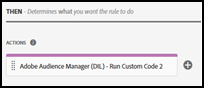

# Visão geral da extensão do Adobe Audience Manager

>[!NOTE]
>
>O Adobe Experience Platform Launch foi reformulado como um conjunto de tecnologias de coleta de dados na Adobe Experience Platform. Como resultado, várias alterações de terminologia foram implementadas na documentação do produto. Consulte o seguinte [documento](../../../term-updates.md) para obter uma referência consolidada das alterações de terminologia.

Com a extensão de tag do Audience Manager, é possível integrar o código DIL usado pelo Audience Manager com suas propriedades na Adobe Experience Platform.

Use essa referência para obter informações sobre as opções disponíveis ao usar esta extensão para criar uma regra.

>[!NOTE]
>
>Essa extensão não deve ser usada para o encaminhamento de eventos de dados do Adobe Analytics. Para encaminhamento de eventos, use a [extensão do Adobe Analytics](../analytics/overview.md).

## Configurar a extensão do Adobe Audience Manager

Se a extensão do Adobe Audience Manager ainda não tiver sido instalada, abra a propriedade e selecione **[!UICONTROL Extensions > Catalog]**, passe o mouse sobre a extensão do Adobe Audience Manager e selecione **[!UICONTROL Install]**.

Para configurar a extensão, abra a guia [!UICONTROL Extensions], passe o mouse sobre a extensão e selecione **[!UICONTROL Configure]**.

### Configurações de DIL

Defina as configurações de DIL. As opções de configuração disponíveis são as seguintes:

#### Versão DIL

Mostra a versão da Biblioteca de integração de dados (DIL).

Esta configuração não pode ser alterada.

#### Excluir caminhos específicos

Se o URL corresponder a qualquer um dos caminhos excluídos, a extensão não será carregada.

Selecione **[!UICONTROL Add Path]** para especificar um URL excluído.

Habilite o Regex se o URL for uma expressão regular.

#### Usar o módulo DIL do Site Catalyst

O [módulo do SiteCatalyst](https://experiencecloud.adobe.com/resources/help/pt_BR/aam/r_dil_sc_init.html) funciona com DIL para enviar elementos de tags do Analytics para o Audience Manager.

Use o Editor de códigos para configurar o arquivo siteCatalyst.init.

Também é possível criar uma nota com informações sobre essa configuração.

#### Usar o módulo DIL do Google Analytics

Habilite o [módulo do Google Analytics](https://experiencecloud.adobe.com/resources/help/pt_BR/aam/dil-google-universal-analytics.html).

#### Propriedades de inicialização DIL.create

Adicione as propriedades de inicialização usadas pelo [DIL.create](https://experiencecloud.adobe.com/resources/help/pt_BR/aam/r_dil_create.html) e a subpropriedade namespace para o [objeto visitorService](https://experiencecloud.adobe.com/resources/help/pt_BR/aam/r_dil_visitor_service.html). Dois casos de uso de exemplo são incluídos nos comentários do código, no Editor de código.

Selecione **[!UICONTROL Choose an Item]** para adicionar outras propriedades.

Passe o mouse sobre os ícones &quot;i&quot; para saber o que cada propriedade faz. Você pode encontrar mais informações sobre as propriedades na [documentação do DIL do Audience Manager](https://experiencecloud.adobe.com/resources/help/pt_BR/aam/r_dil_create.html).

Selecione **[!UICONTROL Save]** quando terminar de configurar a extensão.

## Tipos de ação de extensão do Adobe Audience Manager

Este tópico descreve os tipos de ação disponíveis na extensão do Audience Manager.

A extensão do Adobe Audience Manager fornece as seguintes ações na porção Then de uma regra:

### Executar código personalizado

Execute o código personalizado configurado no Editor de código.

Digite o código desejado no Editor de código e forneça um nome para o código. Esse código ficará disponível na porção Then do construtor de regras.

Também é possível adicionar uma observação com informações sobre a configuração.
