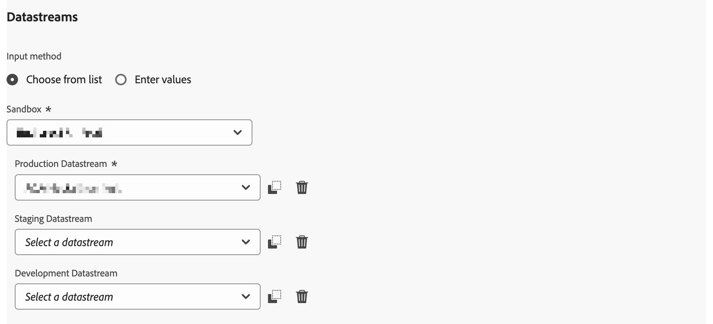

# Visão geral da extensão do Adobe Content Analytics

A extensão de tag [!DNL Adobe Content Analytics] permite o rastreamento de eventos relacionados a conteúdo em um site. A extensão envia dados de conteúdo (experiências e ativos) para uma sequência de dados no Adobe Experience Cloud a partir das propriedades da Web por meio do Experience Platform Edge Network.

A extensão permite transmitir dados de evento relacionados a conteúdo específicos para o Experience Platform, para que você possa usá-los nos relatórios de análise de conteúdo no Customer Journey Analytics.

Este documento explica como configurar a extensão de tag na interface do usuário de tags.

## Instalar a extensão de tag do Adobe Content Analytics {#install}

A extensão de tag do Adobe Content Analytics é instalada automaticamente como parte da propriedade de tag criada automaticamente ao usar o [assistente de configuração guiada do Content Analytics](https://experienceleague.adobe.com/en/docs/analytics-platform/using/content-analytics/configuration/guided).

<!--
### Manual installation

In case of a manual configuration, the Adobe Content Analytics tag extension needs a property to be installed on. If you have not done so already, see the documentation on [creating a tag property](https://experienceleague.adobe.com/en/docs/platform-learn/implement-in-websites/configure-tags/create-a-property).

After you have created a property or when you select the property created using the [Content Analytics guided configuration wizard](https://experienceleague.adobe.com/en/docs/analytics-platform/using/content-analytics/configuration/guided), open the property and select the **[!UICONTROL Extensions]** tab on the left side bar.

Select the **[!UICONTROL Catalog]** tab. From the list of available extensions, find the **[!DNL Adobe Content Analytics]** extension and select **[!UICONTROL Install]**.

After selecting **[!UICONTROL Install]**, you must configure the Adobe Content Analytics tag extension and save the configuration.
-->

<!--
## Configure schema

The [Content Analytics guided configuration wizard](https://experienceleague.adobe.com/en/docs/analytics-platform/using/content-analytics/configuration/guided) automatically populates the proper value for the **[!UICONTROL Tenant Schema Name]**. 

>[!WARNING]
>
>Do not modify the value for **[!UICONTROL Tenant Schema Name]**.

-->

## Configurar datastreams

O [assistente de configuração guiada do Content Analytics](https://experienceleague.adobe.com/en/docs/analytics-platform/using/content-analytics/configuration/guided) seleciona automaticamente o valor correto para a **[!UICONTROL Sandbox]** e a **[!UICONTROL Sequência de Dados de Produção]**. Opcionalmente, você pode configurar uma **[!UICONTROL Sequência de Dados de Preparo]** e uma **[!UICONTROL Sequência de Dados de Desenvolvimento]** adicionais.

Você pode substituir os valores selecionados automaticamente para **[!UICONTROL Sandbox]** e **[!UICONTROL Sequência de dados de produção]** caso queira usar o Content Analytics em uma sandbox diferente e com sequências de dados diferentes. Ao fazer isso, você pode selecionar uma sandbox e sequências de dados nos menus suspensos disponíveis ou selecionar **[!UICONTROL Inserir valores]** e inserir uma ID de sequência de dados personalizada para cada ambiente.

>[!IMPORTANT]
>
>Ao configurar outra sandbox e fluxos de dados, verifique se
>
>* a sandbox selecionada ainda não está associada a outra configuração do Content Analytics e
>* qualquer sequência de dados selecionada tem o serviço Experience Platform configurado com um conjunto de dados de eventos do Content Analytics experience habilitado.

Consulte o guia em [datastreams](../../../../datastreams/overview.md) para saber como configurar um datastream.

## Configurar a captura e a definição da experiência

Na seção **[!UICONTROL Captura e definição de experiência]**, você pode habilitar **[!UICONTROL Incluir experiências]** para incluir experiências ao coletar dados para o Content Analytics.

1. Habilitar **[!UICONTROL Incluir experiências]**.
1. Opcionalmente. especifique os parâmetros como o conteúdo é renderizado em seu site. Os parâmetros são zero ou mais combinações de uma **[!UICONTROL expressão regular de domínio]** e **[!UICONTROL parâmetros de consulta]**.
   1. Insira uma **[!UICONTROL Expressão regular de domínio]**, por exemplo `^(?!.*\b(store|help|admin)\b)`.
   1. Especifique uma lista separada por vírgulas de **[!UICONTROL Parâmetros de consulta]**, por exemplo `outdoors, patio, kitchen`.
Use  para excluir parâmetros individuais ou **[!UICONTROL Limpar tudo]** para excluir todos os parâmetros.
1. Selecione **[!UICONTROL Remover]** se desejar remover uma combinação de expressão regular de domínio e parâmetros de consulta.
1. Selecione **[!UICONTROL Adicionar Regex]** se quiser adicionar outra combinação de uma expressão regular e parâmetros de consulta.

## Configurar a filtragem de eventos

Na seção **[!UICONTROL Filtragem de Eventos]**, você pode modificar as expressões regulares para filtrar **[!UICONTROL URLs de Páginas]** e **[!UICONTROL URLs de Assets]** ao coletar dados para o Content Analytics. As expressões regulares definidas no [assistente de configuração guiada do Content Analytics](https://experienceleague.adobe.com/en/docs/analytics-platform/using/content-analytics/configuration/guided) são preenchidas automaticamente.

### Exemplos

* Você deseja excluir todas as páginas de documentação do Content Analytics. Usar a seguinte expressão regular: `^(?!.*documentation).*`
* Você deseja excluir todas as imagens de logotipo do JPEG e do SVG do Content Analytics. Usar a seguinte expressão regular: `^(?!.*(logo\.jpg|)).*$`

Você pode usar **[!UICONTROL Testar Regex]** para testar sua expressão regular no **[!UICONTROL Testador de Expressão Regular]**.

