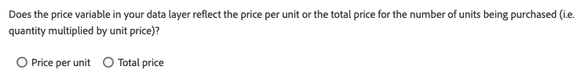

# Visão geral da extensão de string do produto Adobe Analytics

A variável dos produtos `products` acompanha a forma como usuários interagem com os produtos de seu site. Por exemplo, a variável `products` pode rastrear quantas vezes um produto é exibido, adicionado ao carrinho, passado pelo checkout e adquirido. Ela também pode rastrear a eficácia relativa de categorias de comercialização de seu site.

A variável `products` deve ser sempre definida juntamente com um evento bem-sucedido.

A extensão [!DNL Adobe Analytics Product String Builder] define automaticamente a variável `products` para você, fazendo o loop pela camada de dados, capturando todos os dados de produto necessários e formatando-a na sintaxe apropriada mostrada abaixo. Não é mais necessário gravar e manter o JavaScript personalizado para executar essas ações complexas.

## Sintaxe da variável products

```bash
Category;Product;Quantity;Price;eventN=X|eventN2=X2;eVarN=merch_category|eVarN2=merch_category2
```

Para obter a documentação completa, visite [Produtos](https://experienceleague.adobe.com/docs/analytics/implementation/vars/page-vars/products.html?lang=pt-BR).

## Instruções de extensão

### Configuração de ação

Adicione a ação &quot;String de produto do Adobe Analytics - Definir s.products&quot; à regra.


### Configuração dos dados padrão do produto

Em seguida, defina as variáveis de camada de dados. Depois de configurar a ação conforme descrito na etapa anterior, a seguinte tela é exibida:


Para cada ponto de dados que deseja incluir na string do produto, insira o caminho para a variável de camada de dados apropriada.

Por exemplo, se sua camada de dados estiver estruturada desta forma:

```json
digitalData = {
  "transaction": {
    "item": [{
      "productInfo": {
        "productName": "My Product"
      }
    }]
  }
};
```

Digite o seguinte caminho no campo &quot;Variável de ID/nome do produto&quot; para capturar a variável `productName`:

```json
digitalData.transaction.item.productInfo.productName
```

>[!NOTE]
>
>Se estiver usando um elemento de dados para preencher o campo, ele deverá ser configurado usando o tipo de elemento de dados Constante ou Código personalizado e deverá retornar o caminho acima como um literal de string.

### Tipo de preço

O parâmetro `price` na string [!DNL Adobe Analytics] do produto deve refletir o preço total do número de unidades compradas, não o preço unitário, desse produto. Ao habilitar o campo Preço na ação de extensão, você deve especificar se a camada de dados expõe o preço total ou o preço unitário. Ao usar o preço unitário, a extensão [!DNL Adobe Analytics Product String] multiplica automaticamente o preço unitário pela quantidade para obter o preço total e definir a string do produto corretamente.



### Eventos personalizados e eVars de comercialização


Se sua implementação usar eventos personalizados ou eVars de comercialização, siga estas etapas:

1. Selecione o botão **[!UICONTROL Add]** associado.
1. Escolha o evento ou eVar que precisa definir na lista suspensa.
1. Insira o caminho para a variável de camada de dados apropriada usando a mesma sintaxe descrita acima.

### Sequência de ação

Essa ação deve ser acompanhada por uma ação &quot;Adobe Analytics - Definir variáveis&quot; que define os eventos bem-sucedidos correspondentes, bem como uma ação &quot;Adobe Analytics - Enviar beacon&quot;. A sequência correta de ações está ilustrada abaixo.


### Exigências

* Uma [camada de](https://theblog.adobe.com/data-layers-buzzword-best-practice/) dados baseada em objetos com variáveis para todos os dados relacionados ao produto (como ID do produto, quantidade, preço). Essa extensão não funciona com camadas de dados baseadas em matriz.
* A extensão [Adobe Analytics](../analytics/overview.md) deve ser instalada.
