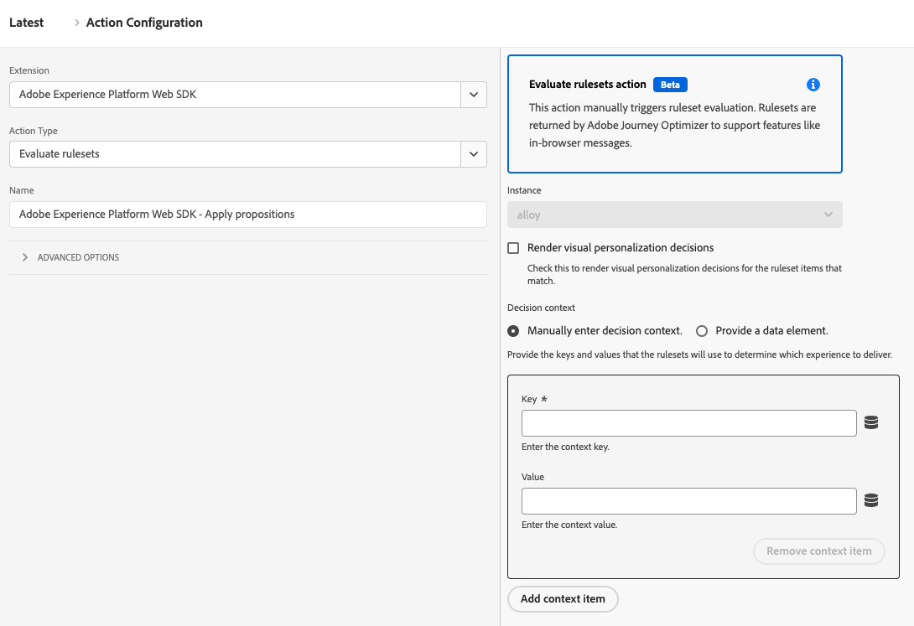

# Avaliar conjuntos de regras

O tipo de ação **[!UICONTROL Evaluate rulesets]** permite acionar manualmente avaliações de conjuntos de regras. Os conjuntos de regras são retornados pelo Adobe Journey Optimizer para oferecer suporte a recursos como mensagens no navegador.

1. Faça logon em [experience.adobe.com](https://experience.adobe.com) usando suas credenciais da Adobe ID.
1. Navegue até **[!UICONTROL Data Collection]** > **[!UICONTROL Tags]**.
1. Selecione a propriedade de tag desejada.
1. Navegue até **[!UICONTROL Rules]** e selecione a regra desejada.
1. Em [!UICONTROL Actions], selecione uma ação existente ou crie uma ação.
1. Defina o campo suspenso [!UICONTROL Extension] como **[!UICONTROL Adobe Experience Platform Web SDK]** e defina [!UICONTROL Action type] como **[!UICONTROL Evaluate rulesets]**.

## Campos disponíveis

Esse tipo de ação é compatível com as seguintes opções:

* **[!UICONTROL Render visual personalization decisions]**: uma caixa de seleção que, quando habilitada, renderiza decisões de personalização visual para os itens do conjunto de regras correspondentes.
* **[!UICONTROL Decision context]**: um mapa de valor chave que é usado ao avaliar conjuntos de regras do Adobe Journey Optimizer para a tomada de decisão no dispositivo. Você pode fornecer o contexto de decisão manualmente ou por meio de um elemento de dados.
