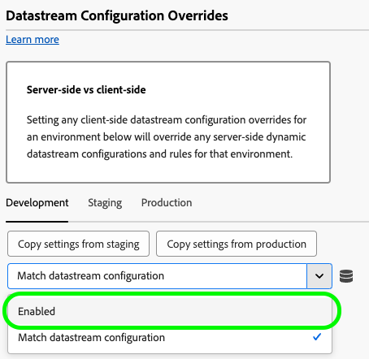
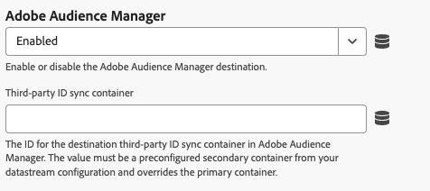
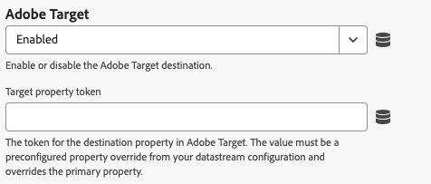

# Configurações de substituição de configuração da sequência de dados

As substituições de fluxos de dados permitem definir configurações adicionais para seus fluxos de dados, que são transmitidos para a Edge Network por meio da Web SDK. Esse recurso ajuda você a acionar condicionalmente diferentes comportamentos de sequência de dados sem criar uma nova sequência de dados ou modificar as configurações existentes.

1. Faça logon em [experience.adobe.com](https://experience.adobe.com) usando suas credenciais da Adobe ID.
1. Navegue até **[!UICONTROL Data Collection]** > **[!UICONTROL Tags]**.
1. Selecione a propriedade de tag desejada.
1. Navegue até **[!UICONTROL Extensions]** e selecione **[!UICONTROL Configure]** no cartão [!UICONTROL Adobe Experience Platform Web SDK].
1. Role até a seção **[!UICONTROL Datastream configuration overrides]**.

Criar uma substituição de configuração da sequência de dados é um processo de duas etapas:

1. Primeiro, você deve definir a substituição da configuração da sequência de dados ao [configurar uma sequência de dados](/help/datastreams/configure.md) na interface dos fluxos de dados. Consulte [Substituições de configuração de sequência de dados](/help/datastreams/overrides.md) na documentação de sequências de dados para obter instruções sobre como configurar substituições.
1. Depois de configurar a substituição do fluxo de dados na interface do usuário de fluxos de dados, você pode configurar a extensão de tag.

As substituições de fluxo de dados devem ser configuradas com base no ambiente. Os ambientes de desenvolvimento, armazenamento temporário e produção têm substituições separadas. Você pode copiar as configurações de substituição entre qualquer ambiente desejado:

Por padrão, as substituições de configuração da sequência de dados são desabilitadas. A opção **[!UICONTROL Match datastream configuration]** é selecionada por padrão.

Para habilitar substituições de sequência de dados na extensão de marca, selecione **[!UICONTROL Enabled]** no menu suspenso.

Depois de habilitar as sobreposições de configuração do fluxo de dados, você pode configurar as sobreposições para cada serviço descrito abaixo. Essas configurações de substituição de sequência de dados substituem todas as configurações e regras de sequência de dados do lado do servidor para o ambiente selecionado.

## Adobe Analytics

Substitua o roteamento de dados para o serviço Adobe Analytics.

* **[!UICONTROL Enabled]** / **[!UICONTROL Disabled]**: Habilitar ou desabilitar o roteamento de dados para o Adobe Analytics.
* **[!UICONTROL Report suites]**: as IDs dos conjuntos de relatórios de destino no Adobe Analytics. O valor deve ser uma substituição pré-configurada do conjunto de relatórios (ou uma lista separada por vírgulas de conjuntos de relatórios) da configuração do fluxo de dados. Essa configuração substitui os conjuntos de relatórios principais.
* **[!UICONTROL Add Report Suite]**: Selecione esta opção para adicionar outros conjuntos de relatórios.

## Adobe Audience Manager

Substitua o roteamento de dados para o Adobe Audience Manager.

* **[!UICONTROL Enabled]** / **[!UICONTROL Disabled]**: Habilitar ou desabilitar o roteamento de dados para o Adobe Audience Manager.
* **[!UICONTROL Third-party ID sync container]**: a ID do contêiner de sincronização de ID de terceiros no Audience Manager. O valor deve ser um contêiner secundário pré-configurado da configuração da sequência de dados e substitui o contêiner primário.

## Adobe Experience Platform

Substitua o roteamento de dados para o Adobe Experience Platform.

* **[!UICONTROL Enabled]** / **[!UICONTROL Disabled]**: Habilitar ou desabilitar o roteamento de dados para o Adobe Experience Platform.
* **[!UICONTROL Event dataset]**: a identificação do conjunto de dados do evento de destino na Adobe Experience Platform. O valor deve ser um conjunto de dados secundário pré-configurado na configuração do fluxo de dados.
* **[!UICONTROL Offer Decisioning]**: Habilite ou desabilite o roteamento de dados para o serviço [!DNL Offer Decisioning].
* **[!UICONTROL Edge Segmentation]**: Habilite ou desabilite o roteamento de dados para o serviço [!DNL Edge Segmentation].
* **[!UICONTROL Personalization Destinations]**: Habilitar ou desabilitar o roteamento de dados para destinos de personalização.
* **[!UICONTROL Adobe Journey Optimizer]**: Habilitar ou desabilitar o roteamento de dados para [!DNL Adobe Journey Optimizer].

## Encaminhamento de eventos do lado do servidor do Adobe

Substitua o roteamento de dados para o serviço Adobe Server-Side Event Forwarding.

* **[!UICONTROL Enabled]** / **[!UICONTROL Disabled]**: Habilitar ou desabilitar o roteamento de dados para o serviço Adobe Server-Side Event Forwarding.

## Adobe Target {#target}

Substitua o roteamento de dados para o Adobe Target.

* **[!UICONTROL Enabled]** / **[!UICONTROL Disabled]**: Habilitar ou desabilitar o roteamento de dados para o Adobe Target.
