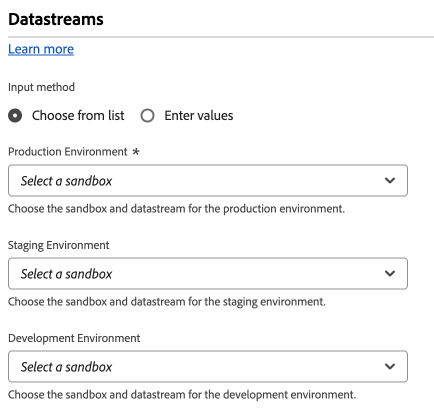

# Definições de configuração da sequência de dados

Esta seção de configuração permite determinar para qual [sequência de dados](/help/datastreams/overview.md) você deseja enviar dados. **Uma ID de sequência de dados é necessária para todos os dados enviados para a Edge Network.**

1. Faça logon em [experience.adobe.com](https://experience.adobe.com) usando suas credenciais da Adobe ID.
1. Navegue até **[!UICONTROL Data Collection]** > **[!UICONTROL Tags]**.
1. Selecione a propriedade de tag desejada.
1. Navegue até **[!UICONTROL Extensions]** e selecione **[!UICONTROL Configure]** no cartão [!UICONTROL Adobe Experience Platform Web SDK].
1. Role até a seção **[!UICONTROL Datastreams]**.

Ao selecionar sequências de dados, você pode fazer isso para cada [ambiente](/help/tags/ui/publishing/environments.md) ([!UICONTROL Development], [!UICONTROL Staging] e [!UICONTROL Production]). Esses campos são importantes quando você deseja separar dados enviados entre ambientes de desenvolvimento, de preparo e de produção. Ele permite um fluxo de trabalho conveniente, no qual você não precisa se preocupar em enviar dados para o fluxo de dados errado, desde que você instale o carregador de tag correto em cada ambiente.

Você pode preencher IDs de fluxo de dados usando um dos seguintes métodos:

* **[!UICONTROL Choose from list]**: cada ambiente contém dois menus suspensos, que permitem selecionar a sandbox e a sequência de dados para o ambiente selecionado. Os valores em cada menu suspenso dependem das [sequências de dados](/help/datastreams/overview.md) configuradas em cada [sandbox](/help/sandboxes/ui/overview.md).

* **[!UICONTROL Enter values]**: Como alternativa ao uso de menus suspensos para selecionar a sequência de dados desejada, você pode especificar manualmente a ID da sequência de dados desejada diretamente. Cada ambiente permite inserir diretamente uma ID de sequência de dados ou preencher este campo usando um [elemento de dados](/help/tags/ui/managing-resources/data-elements.md).
