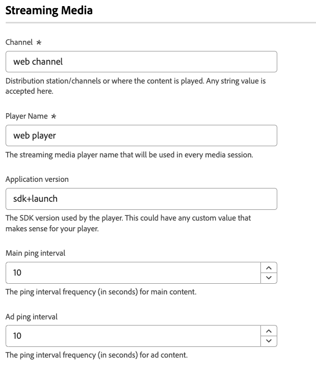

# Definições de configuração de mídia de streaming

O recurso de coleção de mídia ajuda a coletar dados relacionados a sessões de mídia, como reprodução de mídia, pausas, conclusões e outros eventos relacionados. Depois de coletados, é possível enviar esses dados para o Adobe Experience Platform ou Adobe Analytics para gerar relatórios. Esse recurso fornece uma solução abrangente para rastrear e entender o comportamento de consumo de mídia no site.

1. Faça logon em [experience.adobe.com](https://experience.adobe.com) usando suas credenciais da Adobe ID.
1. Navegue até **[!UICONTROL Data Collection]** > **[!UICONTROL Tags]**.
1. Selecione a propriedade de tag desejada.
1. Navegue até **[!UICONTROL Extensions]** e selecione **[!UICONTROL Configure]** no cartão [!UICONTROL Adobe Experience Platform Web SDK].
1. Role até a seção **[!UICONTROL Streaming media]**.

## Pré-requisitos

Para usar o componente de mídia de transmissão do Web SDK, você deve atender aos seguintes pré-requisitos:

* Verifique se você tem acesso ao Adobe Experience Platform ou Adobe Analytics.
* Habilite a opção **[[!UICONTROL Media Analytics]](/help/datastreams/configure.md#advanced-options)** para a sequência de dados que você está usando.
* Certifique-se de que o esquema usado pelo fluxo de dados inclua os campos de esquema Coleção de mídia.
* Configure o recurso Mídia de transmissão na extensão de tag do Web SDK, conforme mostrado nesta página.

## [!UICONTROL Channel]

O nome do canal onde a coleção de mídia ocorre. Por exemplo, `Video channel`. Qualquer valor de string é válido.

## [!UICONTROL Player Name]

O nome do reprodutor de mídia que sua propriedade usa para reprodução de mídia.

## [!UICONTROL Application Version]

A versão do aplicativo de reprodutor de mídia que sua propriedade usa para reprodução de mídia.

## [!UICONTROL Main ping interval]

A frequência dos pings para o conteúdo principal, em segundos. O valor padrão é `10`. Os valores podem variar de `10` a `50` segundos. Se nenhum valor for especificado, o valor padrão será usado ao usar [sessões rastreadas automaticamente](/help/collection/js/commands/createmediasession.md#automatic).

## [!UICONTROL Ad ping interval]

A frequência dos pings para o conteúdo do anúncio, em segundos. O valor padrão é `10`. Os valores podem variar de `1` a `10` segundos. Se nenhum valor for especificado, o valor padrão será usado ao usar [sessões rastreadas automaticamente](/help/collection/js/commands/createmediasession.md#automatic).
