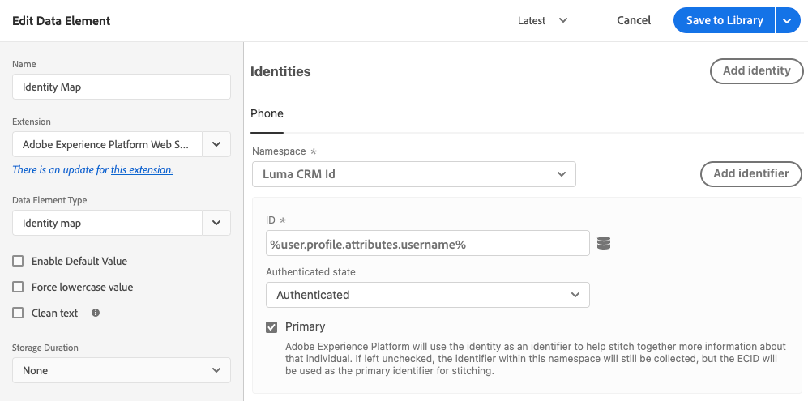

# Tipos de elementos de dados

Depois de definir seus [tipos de ação](action-types.md) na [extensão de tag do SDK da Web da Adobe Experience Platform](web-sdk-extension-configuration.md), você deve configurar seus tipos de elementos de dados. Esta página descreve os tipos de elementos de dados disponíveis.

## Mapa de identidade {#identity-map}

Um mapa de identidade permite estabelecer identidades para o visitante da página da Web. Um mapa de identidade consiste em namespaces, como `CRMID`, `Phone` ou `Email`, com cada namespace contendo um ou mais identificadores. Por exemplo, se o indivíduo em seu site tiver fornecido dois números de telefone, o namespace do telefone deverá conter dois identificadores.

No elemento de dados [!UICONTROL Mapa de identidade], você fornecerá as seguintes informações para cada identificador:

* **[!UICONTROL ID]**: o valor que identifica o visitante. Por exemplo, se o identificador pertence ao namespace _phone_, a [!UICONTROL ID] pode ser _555-555-5555_. Normalmente, esse valor é derivado de uma variável do JavaScript ou de algum outro dado da sua página, portanto, é melhor criar um elemento de dados que faça referência aos dados da página e, em seguida, fazer referência ao elemento de dados no campo [!UICONTROL ID] no elemento de dados [!UICONTROL Mapa de identidade]. Se, ao ser executado na página, o valor da ID for qualquer coisa menos uma string preenchida, o identificador será removido automaticamente do mapa de identidade.
* **[!UICONTROL Estado autenticado]**: uma seleção que indica se o visitante está autenticado.
* **[!UICONTROL Principal]**: uma seleção que indica se o identificador deve ser usado como o identificador principal do indivíduo. Se nenhum identificador for marcado como principal, a ECID será usada como o identificador principal.

>[!TIP]
>
>A Adobe recomenda enviar identidades que representam uma pessoa, como `Luma CRM Id` como a identidade principal.
>
>Se o mapa de identidade contiver o identificador de pessoa (por exemplo, `Luma CRM Id`), o identificador de pessoa se tornará o identificador principal. Caso contrário, `ECID` se tornará a identidade principal.

Você não deve fornecer um [!DNL ECID] ao criar um mapa de identidade. Ao usar o SDK, um [!DNL ECID] é gerado automaticamente no servidor e incluído no mapa de identidade.

O elemento de dados do mapa de identidade é frequentemente usado em conjunto com o [[[!UICONTROL tipo de elemento de dados]](#xdm-object) do objeto XDM] e o [[!UICONTROL tipo de ação Definir consentimento]](action-types.md#set-consent).

Leia mais sobre o [Adobe Experience Platform Identity Service](../../../../identity-service/home.md).

## Objeto XDM {#xdm-object}

A formatação dos dados para o XDM é mais fácil com o elemento de dados do objeto XDM. Ao abrir esse elemento de dados pela primeira vez, selecione a sandbox e o esquema corretos da Adobe Experience Platform. Após selecionar o esquema, você verá a estrutura dele, que pode ser facilmente preenchida.

Observe que quando você abre determinados campos do esquema, como `web.webPageDetails.URL`, alguns itens são coletados automaticamente. Embora vários itens sejam coletados automaticamente, você pode substituir qualquer item, se necessário. Todos os valores podem ser preenchidos manualmente ou usando outros elementos de dados.

>[!NOTE]
>
>Preencha apenas as informações que você está interessado em coletar. Tudo o que não for preenchido será omitido quando os dados forem enviados para as soluções.

## Variable {#variable}

Você pode criar objetos de carga usando o elemento de dados **[!UICONTROL Variável]**. Há suporte para os objetos [!UICONTROL XDM] e [!UICONTROL Data].

* Ao selecionar [!UICONTROL XDM], selecione a [!UICONTROL Sandbox] e o [!UICONTROL Esquema] desejados.
* Ao selecionar [!UICONTROL Dados], selecione as soluções desejadas. As soluções disponíveis são [!UICONTROL Adobe Analytics] e [!UICONTROL Adobe Target].

Depois de criar esse elemento de dados, você pode usar a ação [Atualizar variável](./action-types.md#update-variable) para modificá-lo. Quando estiver pronto, você poderá incluir este elemento de dados na ação [Enviar evento](./action-types.md#send-event) para enviar dados para uma sequência de dados.

## Media: Qualidade da experiência {#quality-experience}

Um elemento de dados **[!UICONTROL Qualidade da experiência]** é útil ao enviar eventos de streaming de mídia para a Adobe Experience Platform. Você pode adicionar esse elemento ao criar uma sessão de mídia e os seguintes eventos de mídia conterão dados atualizados de Qualidade da experiência.

## Próximas etapas {#next-steps}

Saiba mais sobre casos de uso específicos, como [acessar a ECID](accessing-the-ecid.md).
