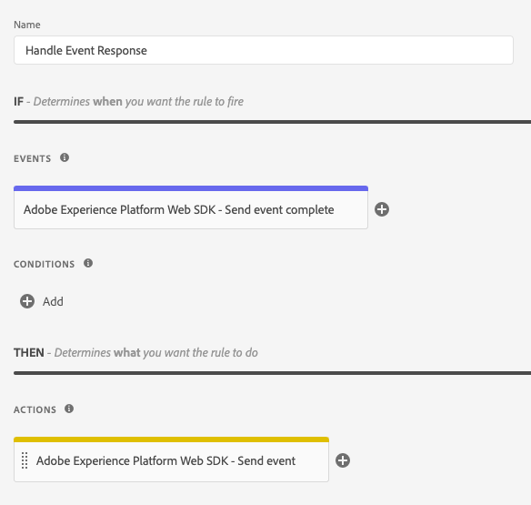

# Tipos de evento

Esta página descreve os tipos de evento do Adobe Experience Platform fornecidos pela extensão de tag do Adobe Experience Platform Web SDK. Eles são usados para [regras de compilação](https://experienceleague.adobe.com/docs/platform-learn/data-collection/tags/build-rules.html?lang=pt-BR) e não devem ser confundidos com o campo `eventType` no objeto [`xdm`](/help/collection/js/commands/sendevent/xdm.md).

## Gancho de monitoramento acionado {#monitoring-hook-triggered}

O Adobe Experience Platform Web SDK inclui ganchos de monitoramento que podem ser usados para monitorar vários eventos do sistema. Essas ferramentas são úteis para desenvolver suas próprias ferramentas de depuração e capturar logs do Web SDK.

Para obter detalhes completos sobre quais parâmetros cada evento de gancho de monitoramento contém, consulte a [documentação de ganchos de monitoramento do Web SDK](/help/collection/js/monitoring-hooks.md).


A extensão de tag do Web SDK é compatível com os seguintes ganchos de monitoramento:

* **[!UICONTROL onInstanceCreated]**: este evento de gancho de monitoramento é disparado quando você cria com êxito uma nova instância do Web SDK.
* **[!UICONTROL onInstanceConfigured]**: este evento de gancho de monitoramento é disparado pelo Web SDK quando o comando [`configure`](/help/collection/js/commands/configure/overview.md) é resolvido com êxito
* **[!UICONTROL onBeforeCommand]**: este evento de gancho de monitoramento é disparado pelo Web SDK antes da execução de qualquer outro comando. Você pode usar esse gancho de monitoramento para recuperar as opções de configuração de um comando específico.
* **[!UICONTROL onCommandResolved]**: este evento de gancho de monitoramento é disparado antes de resolver a promessa de comando. Você pode usar essa função para ver as opções de comando e o resultado.
* **[!UICONTROL onCommandRejected]**: Esse evento de gancho de monitoramento é disparado quando uma promessa de comando é rejeitada e contém informações sobre a causa do erro.
* **[!UICONTROL onBeforeNetworkRequest]**: este evento de gancho de monitoramento é disparado antes da execução de uma solicitação de rede.
* **[!UICONTROL onNetworkResponse]**: este evento de gancho de monitoramento é disparado quando o navegador recebe uma resposta.
* **[!UICONTROL onNetworkError]**: este evento de gancho de monitoramento é disparado quando a solicitação de rede falha.
* **[!UICONTROL onBeforeLog]**: esse evento de gancho de monitoramento é disparado antes que o Web SDK registre qualquer item no console.
* **[!UICONTROL onContentRendering]**: Esse evento de gancho de monitoramento é disparado pelo componente `personalization` e ajuda a depurar a renderização do conteúdo de personalização. Esse evento pode ter status diferentes:
   * `rendering-started`: indica que o Web SDK está prestes a renderizar apresentações. Antes que o Web SDK comece a renderizar um escopo de decisão ou uma exibição, no objeto `data` você pode ver as propostas que serão renderizadas pelo componente `personalization` e o nome do escopo.
   * `no-offers`: indica que nenhuma carga foi recebida para os parâmetros solicitados.
   * `rendering-failed`: indica que o Web SDK falhou ao renderizar uma proposta.
   * `rendering-succeeded`: indica que a renderização foi concluída para um escopo de decisão.
   * `rendering-redirect`: indica que o Web SDK executará uma apresentação de redirecionamento.
* **[!UICONTROL onContentHiding]**: este evento de gancho de monitoramento é disparado quando um estilo pré-ocultação é aplicado ou removido.


## [!UICONTROL Send event complete]

Normalmente, sua propriedade teria uma ou mais regras usando a ação [[!UICONTROL Send event]](actions/send-event.md) para enviar eventos ao Adobe Experience Platform Edge Network. Cada vez que um evento é enviado para o Edge Network, uma resposta é retornada ao navegador com dados úteis. Sem o tipo de evento [!UICONTROL Send event complete], você não teria acesso a esses dados retornados.

Para acessar os dados retornados, crie uma regra separada e adicione um evento [!UICONTROL Send event complete] à regra. Esta regra é disparada sempre que uma resposta bem-sucedida é recebida do servidor como resultado de uma ação [!UICONTROL Send event].

Quando um evento [!UICONTROL Send event complete] aciona uma regra, ele fornece dados retornados do servidor que podem ser úteis para realizar determinadas tarefas. Normalmente, você adicionará uma ação [!UICONTROL Custom code] (da extensão [!UICONTROL Core]) à mesma regra que contém o evento [!UICONTROL Send event complete]. Na ação [!UICONTROL Custom code], seu código personalizado terá acesso a uma variável nomeada `event`. Esta variável `event` conterá os dados retornados do servidor.

Sua regra para lidar com dados retornados do Edge Network pode ser semelhante a:



Abaixo estão alguns exemplos de como executar determinadas tarefas usando a ação [!UICONTROL Custom code] nesta regra.

### Renderizar manualmente o conteúdo personalizado

Na ação Código personalizado, que está na regra para manipular dados de resposta, você pode acessar propostas de personalização que foram retornadas do servidor. Para fazer isso, você digitaria o seguinte código personalizado:

```javascript
var propositions = event.propositions;
```

Se `event.propositions` existir, é uma matriz contendo objetos de proposta de personalização. As propostas incluídas no array são determinadas, em grande parte, pela forma como o evento foi enviado ao servidor.

Para este primeiro cenário, considere que você não marcou a caixa de seleção [!UICONTROL Render decisions] e não forneceu nenhum [!UICONTROL decision scopes] dentro da ação [!UICONTROL Send event] responsável por enviar o evento.


Neste exemplo, a matriz `propositions` contém apenas apresentações relacionadas ao evento que são elegíveis para renderização automática.

A matriz `propositions` pode ser semelhante a este exemplo:

```json
[
  {
    "id": "AT:eyJhY3Rpdml0eUlkIjoiMTI3MDE5IiwiZXhwZXJpZW5jZUlkIjoiMCJ9",
    "scope": "__view__",
    "items": [
      {
        "id": "11223344",
        "schema": "https://ns.adobe.com/personalization/dom-action",
        "data": {
          "content": "<h2 style=\"color: yellow\">An HTML proposition.</h2>",
          "selector": "#hero",
          "type": "setHtml"
        },
        "meta": {}
      }
    ],
    "renderAttempted": false
  },
  {
    "id": "AT:PyJhY3Rpdml0eUlkIjoiMTI3MDE5IiwiZXhwZXJpZW5jZUlkIjoiMCJ8",
    "scope": "__view__",
    "items": [
      {
        "id": "11223345",
        "schema": "https://ns.adobe.com/personalization/dom-action",
        "data": {
          "content": "<h2 style=\"color: yellow\">Another HTML proposition.</h2>",
          "selector": "#sidebar",
          "type": "setHtml"
        },
        "meta": {}
      }
    ],
    "renderAttempted": false
  }
]
```

Ao enviar o evento, a caixa de seleção [!UICONTROL Render decisions] não estava marcada, portanto, o SDK não tentou renderizar automaticamente qualquer conteúdo. No entanto, o SDK ainda recuperou automaticamente o conteúdo elegível para renderização automática e forneceu-o para renderização manual, se desejar. Observe que cada objeto de proposta tem sua propriedade `renderAttempted` definida como `false`.

Se você tivesse marcado a caixa de seleção [!UICONTROL Render decisions] ao enviar o evento, o SDK teria tentado renderizar qualquer proposta qualificada para renderização automática. Como consequência, cada objeto de proposta teria sua propriedade `renderAttempted` definida como `true`. Não haveria necessidade de renderizar manualmente essas apresentações nesse caso.

Até agora, você só acessou um conteúdo de personalização qualificado para renderização automática (por exemplo, qualquer conteúdo criado no Visual Experience Composer do Adobe Target). Para recuperar qualquer conteúdo de personalização _não_ qualificado para renderização automática, solicite o conteúdo fornecendo escopos de decisão usando o campo [!UICONTROL Decision scopes] na ação [!UICONTROL Send event]. Um escopo é uma cadeia de caracteres que identifica uma proposta específica que você deseja recuperar do servidor.

A ação [!UICONTROL Send event] seria semelhante a:


Neste exemplo, se propostas forem encontradas no servidor que corresponde ao escopo `salutation` ou `discount`, elas serão retornadas e incluídas na matriz `propositions`. Esteja ciente de que as propostas qualificadas para renderização automática continuarão a ser incluídas na matriz `propositions`, independentemente de como você configurar os campos [!UICONTROL Render decisions] ou [!UICONTROL Decision scopes] na ação [!UICONTROL Send event]. A matriz `propositions`, neste caso, seria semelhante a este exemplo:

```json
[
  {
    "id": "AT:cZJhY3Rpdml0eUlkIjoiMTI3MDE5IiwiZXhwZXJpZW5jZUlkIjoiMCJ2",
    "scope": "salutation",
    "items": [
      {
        "schema": "https://ns.adobe.com/personalization/json-content-item",
        "data": {
          "id": "4433221",
          "content": {
            "salutation": "Welcome, esteemed visitor!"
          }
        },
        "meta": {}
      }
    ],
    "renderAttempted": false
  },
  {
    "id": "AT:FZJhY3Rpdml0eUlkIjoiMTI3MDE5IiwiZXhwZXJpZW5jZUlkIjoiMCJ0",
    "scope": "discount",
    "items": [
      {
        "schema": "https://ns.adobe.com/personalization/html-content-item",
        "data": {
          "id": "4433222",
          "content": "<div>50% off your order!</div>",
          "format": "text/html"
        },
        "meta": {}
      }
    ],
    "renderAttempted": false
  },
  {
    "id": "AT:eyJhY3Rpdml0eUlkIjoiMTI3MDE5IiwiZXhwZXJpZW5jZUlkIjoiMCJ9",
    "scope": "__view__",
    "items": [
      {
        "id": "11223344",
        "schema": "https://ns.adobe.com/personalization/dom-action",
        "data": {
          "content": "<h2 style=\"color: yellow\">An HTML proposition.</h2>",
          "selector": "#hero",
          "type": "setHtml"
        },
        "meta": {}
      }
    ],
    "renderAttempted": false
  },
  {
    "id": "AT:PyJhY3Rpdml0eUlkIjoiMTI3MDE5IiwiZXhwZXJpZW5jZUlkIjoiMCJ8",
    "scope": "__view__",
    "items": [
      {
        "id": "11223345",
        "schema": "https://ns.adobe.com/personalization/dom-action",
        "data": {
          "content": "<h2 style=\"color: yellow\">Another HTML proposition.</h2>",
          "selector": "#sidebar",
          "type": "setHtml"
        },
        "meta": {}
      }
    ],
    "renderAttempted": false
  }
]
```

Nesse ponto, é possível renderizar o conteúdo da proposta conforme você julgar necessário. Neste exemplo, a proposta que corresponde ao escopo `discount` é uma proposta de HTML criada usando o Experience Composer baseado em formulário do Adobe Target. Suponha que você tenha um elemento na página com a ID `daily-special` e deseje renderizar o conteúdo da proposta `discount` no elemento `daily-special`. Faça o seguinte:

1. Extrair apresentações do objeto `event`.
1. Execute um loop em cada proposta, procurando pela proposta com um escopo de `discount`.
1. Se encontrar uma proposta, percorra cada item na proposta, procurando o item que seja conteúdo do HTML. (É melhor verificar do que supor.)
1. Se você encontrar um item com conteúdo HTML, localize o elemento `daily-special` na página e substitua seu HTML pelo conteúdo personalizado.

Seu código personalizado dentro da ação [!UICONTROL Custom code] pode aparecer da seguinte maneira:

```javascript
var propositions = event.propositions;

var discountProposition;
if (propositions) {
  // Find the discount proposition, if it exists.
  for (var i = 0; i < propositions.length; i++) {
    var proposition = propositions[i]; 
    if (proposition.scope === "discount") {
      discountProposition = proposition;
      break;
    }
  }
}

var discountHtml;
if (discountProposition) {
  // Find the item from proposition that should be rendered.
  // Rather than assuming there a single item that has HTML
  // content, find the first item whose schema indicates
  // it contains HTML content.
  for (var j = 0; j < discountProposition.items.length; j++) {
    var discountPropositionItem = discountProposition.items[i]; 
    if (discountPropositionItem.schema === "https://ns.adobe.com/personalization/html-content-item") {
      discountHtml = discountPropositionItem.data.content;
      break;
    }
  }
}

if (discountHtml) {
  // Discount HTML exists. Time to render it.
  var dailySpecialElement = document.getElementById("daily-special");
  dailySpecialElement.innerHTML = discountHtml;
}
```

### Acesso aos tokens de resposta do Adobe Target

O conteúdo do Personalization retornado do Adobe Target inclui [tokens de resposta](https://experienceleague.adobe.com/docs/target/using/administer/response-tokens.html), que são detalhes sobre a atividade, a oferta, a experiência, o perfil do usuário, as informações geográficas e muito mais. Esses detalhes podem ser compartilhados com ferramentas de terceiros ou usados para depuração. Os tokens de resposta podem ser configurados na interface do usuário do Adobe Target.

Na ação Código personalizado, que está na regra para manipular dados de resposta, você pode acessar propostas de personalização que foram retornadas do servidor. Para fazer isso, digite o seguinte código personalizado:

```javascript
var propositions = event.propositions;
```

Se `event.propositions` existir, é uma matriz contendo objetos de proposta de personalização. Consulte [Renderizar manualmente o conteúdo personalizado](#manually-render-personalized-content) para obter mais informações sobre o conteúdo de `result.propositions`.

Suponha que você deseje coletar todos os nomes de atividades de todas as propostas que foram renderizadas automaticamente pelo SDK da Web e enviá-las para uma única matriz. Em seguida, você pode enviar o array único para terceiros. Nesse caso, grave o código personalizado dentro da ação [!UICONTROL Custom code] em:

1. Extrair apresentações do objeto `event`.
1. Execute um loop em cada proposta.
1. Determine se o SDK renderizou a proposta.
1. Nesse caso, percorra cada item na proposta.
1. Recupere o nome da atividade da propriedade `meta`, que é um objeto que contém tokens de resposta.
1. Transfira o nome da atividade para um storage.
1. Envie os nomes da atividade para terceiros.

```javascript
var propositions = event.propositions;
if (propositions) {
  var activityNames = [];
  propositions.forEach(function(proposition) {
    if (proposition.renderAttempted) {
      proposition.items.forEach(function(item) {
        if (item.meta) {
          // item.meta contains the response tokens.
          var activityName = item.meta["activity.name"];
          // Ignore duplicates
          if (activityNames.indexOf(activityName) === -1) {
            activityNames.push(activityName);  
          }
        }
      });
    }
  });
  // Now that activity names are in an array,
  // you can send them to a third party or use
  // them in some other way.
}
```

## [!UICONTROL Subscribe ruleset items] {#subscribe-ruleset-items}

O tipo de evento **[!UICONTROL Subscribe ruleset items]** permite assinar cartões de conteúdo do Adobe Journey Optimizer para uma superfície. Sempre que os conjuntos de regras forem avaliados, o retorno de chamada fornecido para esse comando receberá um objeto de resultado com propostas que contêm os dados do cartão de conteúdo.


Esse tipo de evento oferece suporte às seguintes propriedades configuráveis:

* **[!UICONTROL Schemas]**: uma matriz de esquemas para a qual você deseja assinar cartões de conteúdo. Você pode inserir os esquemas manualmente ou fornecendo um elemento de dados.
* **[!UICONTROL Surfaces]**: uma matriz de superfícies nas quais você deseja assinar cartões de conteúdo. Você pode inserir as superfícies manualmente ou fornecendo um elemento de dados.
