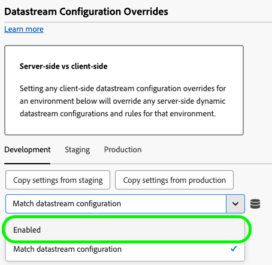

# Configurar a extensão de tag do Web SDK

A extensão de tag [!DNL Web SDK] envia dados para a Adobe Experience Cloud das propriedades da Web por meio da Experience Platform Edge Network.

A extensão permite transmitir dados para o Experience Platform, sincronizar identidades, processar sinais de consentimento do cliente e coletar automaticamente dados de contexto.

Este documento explica como configurar a extensão de tag na interface do usuário de tags.

## Instalar a extensão de tag do Web SDK {#install}

A extensão de tag do Web SDK precisa de uma propriedade para ser instalada. Se ainda não tiver feito isso, consulte a documentação sobre [criação de uma propriedade de marca](https://experienceleague.adobe.com/docs/platform-learn/implement-in-websites/configure-tags/create-a-property.html?lang=pt-BR).

Após criar uma propriedade, abra-a e selecione a guia **[!UICONTROL Extensões]** na barra lateral esquerda.

Selecione a guia **[!UICONTROL Catálogo]**. Na lista de extensões disponíveis, localize a extensão [!DNL Web SDK] e selecione **[!UICONTROL Instalar]**.

Depois de selecionar **[!UICONTROL Instalar]**, você deve configurar a extensão de marca do Web SDK e salvar a configuração.

>[!NOTE]
>
>A extensão de tag só é instalada depois de salvar a configuração. Consulte as próximas seções para saber como configurar a extensão de tag.

## Criar um build personalizado do Web SDK {#custom-build}

A biblioteca do Web SDK inclui vários módulos para vários recursos, como personalização, identidade, rastreamento de links e muito mais. Dependendo dos casos de uso, talvez você só precise de recursos específicos em vez da biblioteca inteira. A criação de um build personalizado do Web SDK permite selecionar apenas os módulos necessários, reduzindo o tamanho da biblioteca e melhorando o desempenho.

Ao criar uma build personalizada do Web SDK, ela é usada por todas as instâncias do Web SDK.

>[!IMPORTANT]
>
>A desativação dos componentes do Web SDK pode interromper a implementação existente. Cada vez que desabilitar um componente, certifique-se de testar sua implementação completamente para garantir que todas as funcionalidades necessárias estejam funcionando como esperado.
>&#x200B;>Quando você desativa um componente, não pode mais editar as configurações desse componente.

Para criar um build personalizado do Web SDK usando a extensão de tag da Web SDK, siga as etapas abaixo.

1. Na página de configuração da extensão de tag, expanda a seção **[!UICONTROL Componentes de compilação personalizados]**.
1. Ative ou desative os componentes de acordo com suas necessidades. Você pode selecionar entre os seguintes componentes:
   * **[!UICONTROL Coletor de atividade]**: este componente habilita a coleta automática de links e o rastreamento de Activity Map.
   * **[!UICONTROL Advertising]**: este componente inclui todo o código JavaScript necessário para o Adobe Advertising. Ele também adiciona configurações do [!UICONTROL Adobe Advertising] na seção [!UICONTROL Instâncias do SDK] e uma configuração do [!UICONTROL Advertising] nas regras de marca para definir como os dados de publicidade são usados para medição de atribuição.
   * **[!UICONTROL Públicos-alvo]**: esses componentes permitem a integração do Audience Manager, incluindo URL e destinos baseados em cookies, e sincronizações de ID.
   * **[!UICONTROL Consentimento]**: este componente habilita integrações de consentimento. A desabilitação desse componente desabilita os seguintes elementos:
      * [Definir tipo de ação de consentimento](action-types.md#set-consent)
   * **[!UICONTROL Contexto]**: este componente habilita a coleta automática de dados de contexto.
   * **[!UICONTROL Mesclagem de eventos]**: _Obsoleto_. A desabilitação desse componente desabilita os seguintes elementos:
      * Elemento de dados [ID de mesclagem de eventos](action-types.md#data)
      * **[!UICONTROL Redefinir tipo de ação da ID de mesclagem de eventos]**
   * **[!UICONTROL Ponte do Media Analytics]**: esse componente habilita o Edge Network Streaming Media usando a interface do Media Analytics. A desabilitação desse componente desabilita os seguintes elementos:
      * [Obter tipo de ação do Media Analytics Tracker](action-types.md#get-media-analytics-tracker)
   * **[!UICONTROL Personalization]**: este componente habilita as integrações do Adobe Target e do Adobe Journey Optimizer. A desabilitação desse componente desabilita os seguintes elementos:
      * [Aplicar tipo de ação](action-types.md) de propostas
   * **[!UICONTROL Mecanismo de regras]**: esse componente habilita a decisão no dispositivo do Adobe Journey Optimizer. A desabilitação desse componente desabilita os seguintes elementos:
      * [Avaliar tipo de ação de conjuntos de regras](action-types.md#evaluate-rulesets)
      * [Assinar itens do conjunto de regras](event-types.md#subscribe-ruleset-items) tipo de evento
   * **[!UICONTROL Mídia de streaming]**: este componente habilita a Mídia de Streaming do Edge Network. A desabilitação desse componente desabilita os seguintes elementos:
      * Tipo de ação [Enviar evento de mídia](action-types.md#send-media-event)

## Definir configurações de instância {#general}

As opções de configuração na parte superior da página informam à Adobe Experience Platform para onde rotear os dados e quais configurações usar no servidor.

* **[!UICONTROL Nome]**: a extensão do Adobe Experience Platform Web SDK dá suporte a várias instâncias na página. O nome é usado para enviar dados para várias organizações com uma configuração de tag. O nome padrão da instância é `alloy`. No entanto, é possível alterar o nome da instância para qualquer nome de objeto JavaScript válido.
* **[!UICONTROL ID de organização IMS]**: a ID da organização para a qual você deseja que os dados sejam enviados na Adobe. Na maioria das vezes, use o valor padrão preenchido automaticamente. Quando houver várias instâncias na página, preencha esse campo com o valor da segunda organização para a qual deseja enviar dados.
* **[!UICONTROL Domínio do Edge]**: o domínio do qual a extensão envia e recebe dados. A Adobe recomenda usar um domínio próprio (CNAME) para essa extensão. O domínio padrão de terceiros funciona em ambientes de desenvolvimento, mas não é adequado para ambientes de produção. As instruções sobre como configurar um CNAME primário estão listadas [aqui](https://experienceleague.adobe.com/docs/core-services/interface/ec-cookies/cookies-first-party.html?lang=pt-BR).
* **[!UICONTROL Adobe Advertising]**: disponível quando o componente `Advertising` é selecionado. Configurações somente para organizações com Adobe Advertising DSP:
   * **[!UICONTROL Adobe Advertising DSP]**: habilita o rastreamento de view-through.
   * **[!UICONTROL Anunciantes]**: Disponível quando o [!UICONTROL Adobe Advertising DSP] está habilitado. Os anunciantes para os quais ativar o rastreamento de view-through.
   * **[!UICONTROL ID5 ID do parceiro]**: opcional. Disponível quando o [!UICONTROL Adobe Advertising DSP] está habilitado. ID do parceiro ID5 da sua organização. Essa configuração permite que o Web SDK colete IDs universais ID5.
   * **[!UICONTROL Caminho de JavaScript RampID]**: opcional. Disponível quando o [!UICONTROL Adobe Advertising DSP] está habilitado. O caminho para o código JavaScript [!DNL LiveRamp RampID] da sua organização (`ats.js`).  Esta configuração permite que o Web SDK colete [!DNL RampID] IDs universais.

## Definir configurações de sequência de dados {#datastreams}

Essa seção permite selecionar os fluxos de dados que devem ser usados para cada um dos três ambientes disponíveis (produção, preparo e desenvolvimento).

Quando uma solicitação é enviada para a Edge Network, uma ID de sequência de dados é usada para fazer referência à configuração do lado do servidor. Você pode atualizar a configuração sem precisar fazer alterações de código no site.

Consulte o guia em [datastreams](../../../../datastreams/overview.md) para saber como configurar um datastream.

Você pode escolher uma sequência de dados nos menus suspensos disponíveis ou selecionar **[!UICONTROL Inserir valores]** e inserir uma ID de sequência de dados personalizada para cada ambiente.

## Definir configurações de privacidade {#privacy}

Esta seção permite configurar como o Web SDK lida com sinais de consentimento do usuário do seu site. Especificamente, ela permite selecionar o nível padrão de consentimento assumido de um usuário se nenhuma outra preferência de consentimento explícito tiver sido fornecida.

O nível de consentimento padrão não é salvo no perfil do usuário.

| [!UICONTROL Nível de consentimento padrão] | Descrição |
| --- | --- |
| [!UICONTROL Entrada] | Colete eventos que ocorrem antes de o usuário fornecer preferências de consentimento. |
| [!UICONTROL Saída] | Descartar eventos que ocorrem antes de o usuário fornecer preferências de consentimento. |
| [!UICONTROL Pendente] | Enfileirar eventos que ocorrem antes de o usuário fornecer preferências de consentimento. Quando as preferências de consentimento são fornecidas, os eventos são coletados ou descartados, dependendo das preferências fornecidas. |
| [!UICONTROL Fornecido pelo elemento de dados] | O nível de consentimento padrão é determinado por um elemento de dados separado que você define. Ao usar essa opção, você deve especificar o elemento de dados usando o menu suspenso fornecido. |

>[!TIP]
>
>Use **[!UICONTROL Desativado]** ou **[!UICONTROL Pendente]** se você precisar de consentimento explícito do usuário para suas operações comerciais.

## Definir configurações de identidade {#identity}

Esta seção permite definir o comportamento do Web SDK quando se trata de lidar com a identificação do usuário.

* **[!UICONTROL Migrar ECID da VisitorAPI]**: esta opção é habilitada por padrão. Quando este recurso está habilitado, o SDK pode ler os cookies `AMCV` e `s_ecid` e definir o cookie `AMCV` usado pelo [!DNL Visitor.js]. Esse recurso é importante ao migrar para o Web SDK, pois algumas páginas ainda podem estar usando o [!DNL Visitor.js]. Essa opção permite que o SDK continue usando o mesmo [!DNL ECID] para que os usuários não sejam identificados como dois usuários separados.
* **[!UICONTROL Usar cookies de terceiros]**: quando esta opção é habilitada, o Web SDK tenta armazenar um identificador de usuário em um cookie de terceiros. Se for bem-sucedido, o usuário será identificado como um único usuário durante a navegação em vários domínios, em vez de ser identificado como um usuário separado em cada domínio. Se essa opção estiver ativada, o SDK ainda poderá não conseguir armazenar o identificador do usuário em um cookie de terceiros se o navegador não for compatível com cookies de terceiros ou tiver sido configurado pelo usuário para não permitir cookies de terceiros. Nesse caso, o SDK armazena apenas o identificador no domínio próprio.

  >[!IMPORTANT]
  >&#x200B;>Cookies de terceiros não são compatíveis com a funcionalidade [ID de dispositivo próprio](../../../../web-sdk/identity/first-party-device-ids.md) no Web SDK.
  >&#x200B;>Você pode usar IDs de dispositivo primário ou cookies de terceiros, mas não pode usar ambos os recursos simultaneamente.
  >

## Definir configurações de personalização {#personalization}

Esta seção permite configurar como você deseja ocultar determinadas partes de uma página enquanto o conteúdo personalizado é carregado. Isso garante que seus visitantes vejam apenas a página personalizada.

* **[!UICONTROL Migrar o Target da at.js para a Web SDK]**: use esta opção para permitir que o [!DNL Web SDK] leia e grave os cookies herdados `mbox` e `mboxEdgeCluster` usados pelas bibliotecas da at.js `1.x` ou `2.x`. Isso ajuda a manter o perfil do visitante ao mover de uma página que usa o Web SDK para uma página que usa bibliotecas do at.js `1.x` ou `2.x` e vice-versa.

### Estilo pré-ocultação {#prehiding-style}

O editor de estilo pré-ocultação permite definir regras CSS personalizadas para ocultar seções específicas de uma página. Quando a página é carregada, o Web SDK usa esse estilo para ocultar as seções que precisam ser personalizadas, recupera a personalização e desoculta as seções de página personalizadas. Dessa forma, seus visitantes visualizam as páginas já personalizadas, sem ver o processo de recuperação da personalização.

### Pré-ocultação de trecho {#prehiding-snippet}

O trecho pré-ocultação é útil quando a biblioteca do Web SDK é carregada de forma assíncrona. Nessa situação, para evitar oscilação, recomendamos ocultar o conteúdo antes que a biblioteca do Web SDK seja carregada.

Para usar o trecho pré-ocultação, copie-o e cole-o dentro do elemento `<head>` da sua página.

>[!IMPORTANT]
>
>Ao usar o trecho pré-ocultação, a Adobe recomenda usar a mesma regra [!DNL CSS] usada pelo [estilo pré-ocultação](#prehiding-style).

## Definir configurações da coleção de dados {#data-collection}

Gerenciar definições de configuração da coleta de dados. Configurações semelhantes na biblioteca JavaScript estão disponíveis usando o comando [`configure`](/help/web-sdk/commands/configure/overview.md).

* **[!UICONTROL Ativado antes do retorno de chamada de envio do evento]**: uma função de retorno de chamada para avaliar e modificar a carga enviada para o Adobe. Use a variável `content` na função de retorno de chamada para modificar a carga. Este retorno de chamada é a marca equivalente a [`onBeforeEventSend`](/help/web-sdk/commands/configure/onbeforeeventsend.md) na biblioteca JavaScript.
* **[!UICONTROL Coletar cliques internos em links]**: uma caixa de seleção que permite a coleta de dados de rastreamento de links internos no seu site ou propriedade. Quando você ativa essa caixa de seleção, as opções de agrupamento de eventos são exibidas:
   * **[!UICONTROL Nenhum agrupamento de eventos]**: os dados de rastreamento de links são enviados para a Adobe em eventos separados. Os cliques em links enviados em eventos separados podem aumentar o uso contratual dos dados enviados para o Adobe Experience Platform.
   * **[!UICONTROL Agrupamento de eventos usando o armazenamento de sessão]**: armazena dados de rastreamento de link no armazenamento de sessão até o próximo evento de página. Na página a seguir, os dados de rastreamento de link armazenados e os dados de exibição de página são enviados ao Adobe ao mesmo tempo. A Adobe recomenda ativar essa configuração ao rastrear links internos.
   * **[!UICONTROL Agrupamento de eventos usando objeto local]**: armazena dados de rastreamento de link em um objeto local até o próximo evento de página. Se um visitante navega para uma nova página, os dados de rastreamento de link são perdidos. Essa configuração é mais benéfica no contexto de aplicativos de página única.

  Ao escolher o agrupamento de eventos com armazenamento de sessão ou um objeto local e enviar dados para a Real-Time CDP, Customer Journey Analytics, Adobe Journey Optimizer ou Mix Modeler, você deve atualizar as regras de marcação. Certifique-se de que cada evento de exibição de página mapeie explicitamente o nome da página (como uma sequência) e o valor de exibição da página (como um número inteiro, normalmente 1) para o objeto XDM antes de enviar os dados para o Adobe.

  Se estiver enviando dados para o Adobe Analytics, esses valores serão incluídos automaticamente e nenhuma configuração adicional será necessária.

* **[!UICONTROL Coletar cliques em links externos]**: uma caixa de seleção que habilita a coleta de links externos.
* **[!UICONTROL Coletar cliques no link de download]**: uma caixa de seleção que habilita a coleção de links de download.
* **[!UICONTROL Qualificador de link de download]**: uma expressão regular que qualifica uma URL de link como um link de download.
* **[!UICONTROL Filtrar propriedades de cliques]**: uma função de retorno de chamada para avaliar e modificar propriedades relacionadas a cliques antes da coleção. Esta função é executada antes do [!UICONTROL Ativado antes do retorno de chamada do envio de evento].
* **Configurações de contexto**: colete automaticamente informações do visitante, que preenchem campos XDM específicos para você. Você pode escolher **[!UICONTROL Todas as informações de contexto padrão]** ou **[!UICONTROL Informações de contexto específicas]**. É a marca equivalente a [`context`](/help/web-sdk/commands/configure/context.md) na biblioteca JavaScript.
   * **[!UICONTROL Web]**: coleta informações sobre a página atual.
   * **[!UICONTROL Dispositivo]**: coleta informações sobre o dispositivo do usuário.
   * **[!UICONTROL Ambiente]**: coleta informações sobre o navegador do usuário.
   * **[!UICONTROL Inserir contexto]**: coleta informações sobre a localização do usuário.
   * **[!UICONTROL Dicas de agente-usuário de alta entropia]**: coleta informações mais detalhadas sobre o dispositivo do usuário.

>[!TIP]
>
>O campo **[!UICONTROL Ativado antes do link clicar em enviar]** é um retorno de chamada obsoleto visível apenas para propriedades que já o têm configurado. É a marca equivalente a [`onBeforeLinkClickSend`](/help/web-sdk/commands/configure/onbeforelinkclicksend.md) na biblioteca JavaScript. Use o retorno de chamada **[!UICONTROL Filtrar propriedades de clique]** para filtrar ou ajustar dados de clique, ou use a **[!UICONTROL Ativar antes de enviar o retorno de chamada]** para filtrar ou ajustar a carga geral enviada para a Adobe. Se o retorno de chamada **[!UICONTROL Propriedades de clique de Filtro]** e o retorno de chamada **[!UICONTROL Ativado antes do envio de cliques em links]** estiverem definidos, somente o retorno de chamada **[!UICONTROL Propriedades de clique de Filtro]** será executado.

## Definir configurações de coleção de mídia {#media-collection}

O recurso de coleção de mídia ajuda a coletar dados relacionados a sessões de mídia no site.

Os dados coletados podem incluir informações sobre reprodução de mídia, pausas, conclusões e outros eventos relacionados. Depois de coletados, é possível enviar esses dados para a Adobe Experience Platform e/ou Adobe Analytics para gerar relatórios. Esse recurso fornece uma solução abrangente para rastrear e entender o comportamento de consumo de mídia no site.

* **[!UICONTROL Canal]**: o nome do canal onde ocorre a coleção de mídia. Exemplo: `Video channel`.
* **[!UICONTROL Nome do player]**: o nome do reprodutor de mídia.
* **[!UICONTROL Versão do Aplicativo]**: a versão do aplicativo do reprodutor de mídia.
* **[!UICONTROL Intervalo de ping principal]**: Frequência de pings para o conteúdo principal, em segundos. O valor padrão é `10`. Os valores podem variar de `10` a `50` segundos.  Se nenhum valor for especificado, o valor padrão será usado ao usar [sessões rastreadas automaticamente](../../../../web-sdk/commands/createmediasession.md#automatic).
* **[!UICONTROL Intervalo de ping do anúncio]**: Frequência de pings para o conteúdo do anúncio, em segundos. O valor padrão é `10`. Os valores podem variar de `1` a `10` segundos. Se nenhum valor for especificado, o valor padrão será usado ao usar [sessões rastreadas automaticamente](../../../../web-sdk/commands/createmediasession.md#automatic)

## Configurar substituições de sequência de dados {#datastream-overrides}

As substituições de sequência de dados permitem definir configurações adicionais para suas sequências de dados, que são transmitidas para a rede de borda por meio do SDK da Web.

Isso ajuda a acionar comportamentos de sequência de dados diferentes dos tradicionais sem criar uma nova sequência de dados ou modificar as configurações existentes.

Criar uma substituição de configuração da sequência de dados é um processo de duas etapas:

1. Primeiro, você deve definir as substituições de configuração da sequência na [página de configuração da sequência de dados](/help/datastreams/configure.md).
2. Em seguida, você deve enviar as substituições para a Edge Network por meio de um comando do Web SDK ou usando a extensão de tag do Web SDK.

Consulte a [documentação de substituições de configuração](/help/datastreams/overrides.md) da sequência de dados para obter instruções detalhadas sobre como substituir configurações da sequência de dados.

Como alternativa à transmissão de sobreposições por meio de um comando do Web SDK, você pode configurar as sobreposições na tela de extensão de tag mostrada abaixo.

>[!IMPORTANT]
>
> As substituições de fluxo de dados devem ser configuradas com base no ambiente. Os ambientes de desenvolvimento, armazenamento temporário e produção têm substituições separadas. Você pode copiar as configurações entre elas usando as opções dedicadas mostradas na tela abaixo.

Por padrão, a substituição da configuração da sequência de dados está desativada. A opção **[!UICONTROL Corresponder configuração da sequência de dados]** está selecionada por padrão.

Para habilitar substituições de sequência de dados na extensão de marca, selecione **[!UICONTROL Habilitado]** no menu suspenso.

Depois de habilitar as sobreposições de configuração do fluxo de dados, você pode configurar as sobreposições para cada serviço descrito abaixo.

As configurações de substituição de sequência de dados abaixo substituirão todas as configurações e regras de sequência de dados do lado do servidor para o ambiente selecionado.

### Adobe Analytics {#analytics}

Use as configurações desta seção para substituir o roteamento de dados para o serviço Adobe Analytics.

* **[!UICONTROL Habilitado]** / **[!UICONTROL Desabilitado]**: use este menu suspenso para habilitar ou desabilitar o roteamento de dados para o serviço Adobe Analytics.
* **[!UICONTROL Conjuntos de relatórios]**: as IDs dos conjuntos de relatórios de destino no Adobe Analytics. O valor deve ser uma substituição pré-configurada do conjunto de relatórios (ou uma lista separada por vírgulas de conjuntos de relatórios) da configuração do fluxo de dados. Essa configuração substitui os conjuntos de relatórios principais.
* **[!UICONTROL Adicionar Conjunto de Relatórios]**: selecione essa opção para adicionar outros conjuntos de relatórios.

### Adobe Audience Manager {#audience-manager}

Use as configurações desta seção para substituir o roteamento de dados para o serviço Adobe Audience Manager.

* **[!UICONTROL Habilitado]** / **[!UICONTROL Desabilitado]**: use este menu suspenso para habilitar ou desabilitar o roteamento de dados para o serviço Adobe Audience Manager.
* **[!UICONTROL Contêiner de sincronização de ID de terceiros]**: a ID do contêiner de sincronização de ID de terceiros de destino no Audience Manager. O valor deve ser um contêiner secundário pré-configurado da configuração da sequência de dados e substitui o contêiner primário.

### Adobe Experience Platform {#experience-platform}

Use as configurações desta seção para substituir o roteamento de dados para o serviço Adobe Experience Platform.

* **[!UICONTROL Habilitado]** / **[!UICONTROL Desabilitado]**: use este menu suspenso para habilitar ou desabilitar o roteamento de dados para o serviço Adobe Experience Platform.
* **[!UICONTROL Conjunto de dados do evento]**: a identificação do conjunto de dados do evento de destino na Adobe Experience Platform. O valor deve ser um conjunto de dados secundário pré-configurado na configuração do fluxo de dados.
* **[!UICONTROL Offer Decisioning]**: use este menu suspenso para habilitar ou desabilitar o roteamento de dados para o serviço [!DNL Offer Decisioning].
* **[!UICONTROL Segmentação do Edge]**: use este menu suspenso para habilitar ou desabilitar o roteamento de dados para o serviço [!DNL Edge Segmentation].
* **[!UICONTROL Destinos do Personalization]**: use este menu suspenso para habilitar ou desabilitar o roteamento de dados para destinos de personalização.
* **[!UICONTROL Adobe Journey Optimizer]**: use este menu suspenso para habilitar ou desabilitar o roteamento de dados para o serviço [!DNL Adobe Journey Optimizer].

### Encaminhamento de eventos do lado do servidor do Adobe {#ssf}

Use as configurações desta seção para substituir o roteamento de dados para o serviço Adobe Server-Side Event Forwarding.

* **[!UICONTROL Habilitado]** / **[!UICONTROL Desabilitado]**: use este menu suspenso para habilitar ou desabilitar o roteamento de dados para o serviço Adobe Server-Side Event Forwarding.

### Adobe Target {#target}

Use as configurações desta seção para substituir o roteamento de dados para o serviço Adobe Target.

* **[!UICONTROL Habilitado]** / **[!UICONTROL Desabilitado]**: use este menu suspenso para habilitar ou desabilitar o roteamento de dados para o serviço Adobe Target.

## Definir configurações avançadas

Use o campo **[!UICONTROL caminho base do Edge]** se precisar alterar o caminho base usado para interagir com o Edge Network. Isso não deve exigir atualização, mas no caso de você participar em um beta ou alfa, a Adobe pode solicitar que você altere esse campo.

