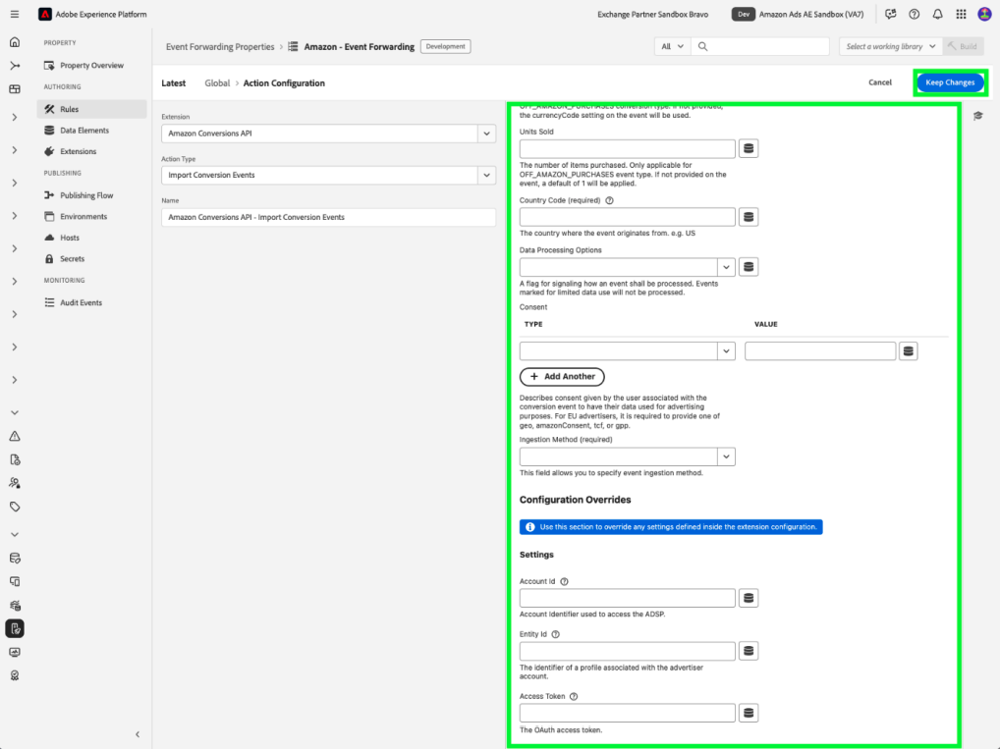

# Visão geral da extensão de API de eventos da Web do [!DNL Amazon]

A extensão de API de conversões [!DNL Amazon] cria uma conexão direta entre os dados de marketing do servidor de um anunciante e [!DNL Amazon]. Ele permite que os anunciantes avaliem a eficácia da campanha independentemente do local de conversão e otimizem as campanhas de acordo. Essa extensão fornece atribuição completa, confiabilidade de dados e entrega otimizada.

## [!DNL Amazon] pré-requisitos {#prerequisites}

Antes de instalar e configurar a extensão de API de Conversões do [!DNL Amazon], conclua as seguintes etapas de pré-requisito para garantir a autenticação e o acesso aos dados adequados:

### Criar um segredo e um elemento de dados {#secret}

Crie um novo [!DNL Amazon] [segredo de encaminhamento de eventos](../../../ui/event-forwarding/secrets.md) e forneça a ele um nome exclusivo que signifique o membro de autenticação. Ele será usado para autenticar a conexão com sua conta, mantendo o valor seguro.

Em seguida, [crie um elemento de dados](../../../ui/managing-resources/data-elements.md#create-a-data-element) usando a extensão [!UICONTROL Core] e um tipo de elemento de dados [!UICONTROL Secret] para fazer referência ao segredo `Amazon` que você acabou de criar.

### Coletar detalhes de configuração necessários {#configuration-details}

Para conectar o Experience Platform a [!DNL Amazon], insira os seguintes detalhes:

| Tipo de chave | Descrição |
| --- | --- |
| ID da Conta | O identificador exclusivo da conta [!DNL Amazon]. |
| ID da entidade | O identificador de um perfil associado à conta do anunciante. Isso pode ser encontrado na URL do portal do Campaign Manager, com o prefixo `entity`. |
| Token de acesso | O token de acesso sem expiração do seu aplicativo, que é usado para autenticação na API [!DNL Amazon] via OAuth. Consulte a [documentação da API do Amazon sobre autenticação](https://developer.amazon.com/docs/app-porting/device-messaging-fit-obtain-api-key.html) para obter orientação. |

## Instalar e configurar a extensão [!DNL Amazon] {#install-configure}

Siga estas etapas para instalar e configurar a extensão de API de Conversões do [!DNL Amazon]:

1. Crie ou edite uma propriedade de encaminhamento de eventos.
2. Navegue até **Extensões** no painel de navegação esquerdo e selecione a extensão [!DNL Amazon] na guia Catálogo.
3. Selecione **Instalar**.

   

4. Configure a extensão com os seguintes detalhes:
   - **Token de acesso**: seu segredo do elemento de dados que contém o token OAuth 2.

     

   - **ID da entidade**: sua ID da entidade (encontrada na URL do portal do Campaign Manager com o prefixo &quot;entity&quot;).

     

5. Selecione **Salvar** para concluir a configuração.

## Configurar uma regra de encaminhamento de eventos {#config-rule}

Depois que todos os seus elementos de dados estiverem configurados, crie regras de encaminhamento de eventos para determinar quando e como seus eventos serão enviados para [!DNL Amazon].

1. Navegue até **Regras** e crie uma nova regra de encaminhamento de eventos.
2. Em **Ações**, selecione **Extensão da API de Conversões do Amazon**.
3. Defina o **Tipo de ação** como **Importar eventos de conversão**.

   

### Configurar dados do evento de conversão {#conversion-event-data}

Os dados do evento de conversão são essenciais para rastrear as interações do usuário e medir a eficiência de suas campanhas. Ao encaminhar esses dados para o [!DNL Amazon], você pode obter insights sobre o comportamento do usuário, otimizar suas campanhas e garantir uma atribuição precisa para conversões.

A tabela abaixo descreve as principais propriedades necessárias para configurar e encaminhar dados do evento de conversão:

| Entrada | Descrição | Obrigatório | Exemplo |
| --- | --- | --- | --- |
| `name` | O nome do evento importado. | Sim | `My Event Name` |
| `eventType` | O tipo de evento padrão do Amazon associado ao evento e usado para o relatório. | Sim | `Add to Shopping Cart` |
| `eventActionSource` | A plataforma de origem do evento. | Sim | `WEBSITE` |
| `clientDedupeId` | O `id` especificado pelo anunciante para o evento de conversão. Para eventos com o mesmo `clientDedupeId`, somente o primeiro evento é retido e todos os eventos subsequentes são descartados. | Opcional | `3234A398932` |
| `timestamp` | O carimbo de data e hora relatado de quando o evento ocorreu. O carimbo de data e hora pode ser de até 7 dias antes do envio de um evento. Os dados com mais de 7 dias não serão processados. | Sim | `2023-05-08T14:04:28Z` |
| `matchKeys` | Matriz que representa os tipos/valores de identificador de cliente e dispositivo a serem usados para atribuição a eventos de tráfego. | Sim | — |
| `matchKeys > type` | O tipo de identificador usado para atribuição. | Sim | — |
| `matchKeys > value` | O valor do identificador usado para atribuição. | Sim | Lista de valores de identificador com hash SHA-256 do cliente que executou o evento. |
| `value` | O valor do evento. | Opcional | `5` ou `0.99` |
| `currencyCode` | O código de moeda associado ao `value` do evento no formato ISO-4217. Aplicável somente para o tipo de evento Compras fora do Amazon. Se não for fornecido, a configuração do código de moeda na definição de conversão será usada. | Opcional | `USD`, `EUR`, `GBP` etc. |
| `unitsSold` | O número de itens comprados. Aplicável somente para o tipo de evento Compras fora do Amazon. Se não for fornecido no evento de conversão, um padrão de `1` será aplicado. | Opcional | — |
| `countryCode` | Este valor baseia-se na norma ISO 3166-1 alpha-2, códigos de países de duas letras definidos na norma ISO 3166-1, parte do padrão ISO 3166 publicado pela Organização Internacional de Normalização (ISO), para representar países, territórios dependentes e áreas especiais de interesse geográfico. | Sim | — |
| `dataProcessingOptions` | Indica o consentimento do usuário para o uso de dados de publicidade. | Opcional | LIMITED_DATA_USE |

- Selecione **[!UICONTROL Manter alterações]** para salvar a regra.

## Desduplicação de eventos {#deduplication}

A desduplicação é essencial para garantir relatórios precisos e evitar contagens de conversão infladas ao usar a Tag do Advertising [!DNL Amazon] (AAT) e a extensão de API de Conversões [!DNL Amazon] para rastrear os mesmos eventos.

### Quando a desduplicação é necessária?

- **Obrigatório**: se o mesmo evento estiver sendo enviado do cliente (AAT) e do servidor (API de conversões).
- **Não obrigatório**: se tipos de eventos distintos estiverem sendo enviados do cliente e do servidor sem nenhuma sobreposição.

### Como habilitar a desduplicação

Para habilitar a desduplicação, inclua o campo `clientDedupeId` em cada evento compartilhado. Esse identificador exclusivo permite que o [!DNL Amazon] diferencie eventos do lado do cliente e do lado do servidor e evite entradas duplicadas.

Ao configurar adequadamente a desduplicação, é possível garantir que seus dados de otimização permaneçam precisos e que seus relatórios não sejam afetados negativamente.

Para obter mais detalhes, consulte o [Guia de Eliminação de Duplicação de Eventos da Amazon](https://advertising.amazon.com/).

## Próximas etapas {#next-steps}

Este guia aborda como configurar e enviar eventos de conversão para o [!DNL Amazon] usando a extensão de API de Conversões do [!DNL Amazon]. Para obter mais informações sobre os recursos de encaminhamento de eventos do [!DNL Adobe Experience Platform], consulte a [visão geral do encaminhamento de eventos](../../../ui/event-forwarding/overview.md).

Para obter mais detalhes sobre como depurar sua implementação usando o Depurador da Experience Platform e a ferramenta de Monitoramento de encaminhamento de eventos, leia a [Visão geral da Adobe Experience Platform Debugger](/help/debugger/home.md) e as [Atividades do monitor](../../../ui/event-forwarding/monitoring.md) no encaminhamento de eventos.
