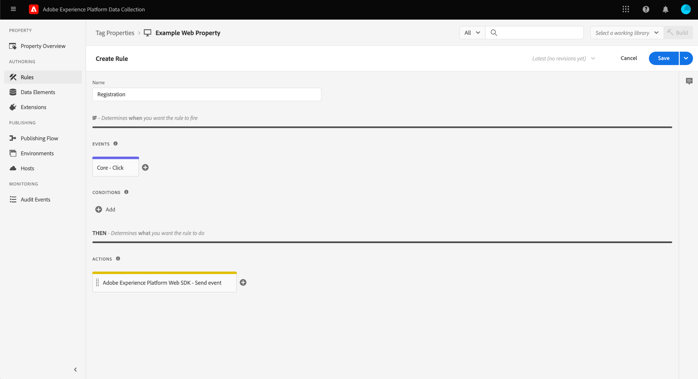
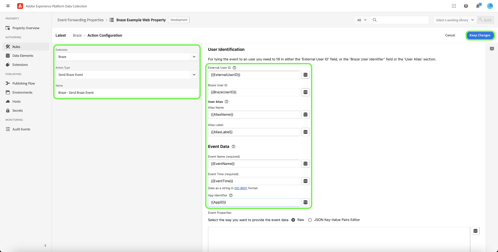

# [!DNL Braze Track Events API] extensão de encaminhamento de eventos

[[!DNL Braze]](https://www.braze.com) é uma plataforma de engajamento do cliente que alimenta as interações centradas no cliente entre consumidores e marcas em tempo real. Usando [!DNL Braze], você pode fazer o seguinte:

* Forneça dados (como mensagens de marketing) aos usuários alvos com base em sua preferência de idioma, preferência de local e muito mais, para aumentar as taxas de conversão e oferecer suporte a objetivos comerciais principais.
* Envie mensagens personalizadas aos clientes em vários canais, incluindo email, notificações por push e mensagens no aplicativo, na hora certa e em seus idiomas preferidos.
* Direcione usuários específicos para campanhas de marketing e promocionais para aumentar o número de clientes recorrentes.
* Estude o comportamento e os padrões do usuário para direcionar públicos-alvo específicos com mensagens personalizadas, o que pode ajudar a aumentar a receita.

O [!DNL Braze Track Events API] [encaminhamento de eventos](../../../ui/event-forwarding/overview.md) A extensão permite aproveitar os dados capturados na Rede de borda do Adobe Experience Platform e enviá-los para [!DNL Braze] na forma de eventos do lado do servidor usando o [[!DNL Braze User Identify]](https://www.braze.com/docs/api/endpoints/user_data/post_user_identify) e [[!DNL Braze User Track]](https://www.braze.com/docs/api/endpoints/user_data/post_user_track) APIs.

Este documento aborda os casos de uso da extensão, como instalá-la nas bibliotecas de encaminhamento de eventos e como empregar seus recursos em um encaminhamento de eventos [regra](../../../ui/managing-resources/rules.md).

## Casos de uso

Essa extensão deve ser usada se você quiser usar dados da Edge Network em [!DNL Braze] para aproveitar seus recursos de análise e direcionamento do cliente.

Por exemplo, considere uma organização de varejo que tem uma presença multicanal (site e dispositivo móvel) e está capturando entrada transacional ou conversacional como dados de evento de seu site e plataformas móveis. Usar vários [tag](../../../home.md) , esses dados são enviados para a Edge Network em tempo real. Daqui, o [!DNL Braze] a extensão de encaminhamento de evento envia automaticamente os eventos relevantes para o [!DNL Braze] do lado do servidor.

Depois que os dados forem enviados, as equipes de análise da organização poderão aproveitar [!DNL Braze's] recursos para processar os conjuntos de dados e derivar insights de negócios para gerar gráficos, painéis ou outras visualizações para informar as partes interessadas da empresa. Consulte a [[!DNL Braze] clientes](https://www.braze.com/customers) para obter mais detalhes sobre os vários casos de uso da plataforma.

## [!DNL Braze] pré-requisitos e medidas de proteção {#prerequisites}

Você deve ter um [!DNL Braze] para utilizar as suas tecnologias. Se você não tiver uma conta, navegue até o [Página Introdução](https://www.braze.com/get-started/) on [!DNL Braze] para se conectar a [!DNL Braze Sales] e inicie o processo de criação de conta.

### Medidas de proteção de API

A extensão usa dois de [!DNL Braze]As APIs do e seus limites são descritos abaixo:

| API | Limites de taxa |
| --- | --- |
| [!DNL User Track] | 50.000 solicitações por minuto.  Consulte a [[!DNL User Track] Documentação da API](https://www.braze.com/docs/api/endpoints/user_data/post_user_track#rate-limit) para obter detalhes. |
| [!DNL User Identify] | 20.000 solicitações por minuto.  Consulte a [[!DNL User Identify] Documentação da API](https://www.braze.com/docs/api/endpoints/user_data/post_user_identify#rate-limit) para obter detalhes. |

>[!NOTE]
>
>Consulte o guia em [[!DNL Braze] Limites da API](https://www.braze.com/docs/api/api_limits/) para mais pormenores sobre os limites impostos.

### Noções básicas sobre o ciclo de vida do perfil do usuário

[!DNL Braze] cria perfis de usuário anônimos usando o identificador exclusivo, `deviceId`, definido por [!DNL Braze]. Depois que um usuário é identificado fornecendo uma ID de usuário, um perfil de usuário identificado é criado.

Na primeira instância de atribuição de um `external_id` para um perfil de usuário desconhecido, todos os dados de perfil de usuário existentes e quaisquer eventos anônimos são migrados para o novo perfil de usuário. Os perfis de usuário anônimos que compartilham o mesmo `deviceId` também recebem alias para o perfil de usuário identificado.

[!DNL Braze] mesclará e preservará todos os dados associados ao perfil somente alias. No entanto, quaisquer dados de usuário anônimos subsequentes serão órfãos. Consulte a [!DNL Braze] páginas de documentação em [perfis de usuário identificados](https://www.braze.com/docs/user_guide/data_and_analytics/user_data_collection/user_profile_lifecycle/#identified-user-profiles) e [práticas recomendadas de coleta de dados](https://www.braze.com/docs/user_guide/data_and_analytics/user_data_collection/best_practices/#overview) para obter mais informações.

### Pontos de dados faturáveis

Envio de atributos personalizados adicionais para [!DNL Braze] pode aumentar a sua [!DNL Braze] consumo de ponto de dados. Consulte seu [!DNL Braze] gerente de conta antes de enviar atributos personalizados adicionais. Consulte a [!DNL Braze] documentação sobre [pontos de dados faturáveis](https://www.braze.com/docs/user_guide/onboarding_with_braze/data_points/#billable-data-points) para obter mais informações.

### Obter detalhes de configuração necessários {#configuration-details}

Para conectar a rede Edge à [!DNL Braze], são necessárias as seguintes entradas:

| Tipo de chave | Descrição | Exemplo |
| --- | --- | --- |
| [!DNL Braze] Instância | O endpoint REST associado à variável [!DNL Braze] conta. Consulte a [!DNL Braze] documentação sobre [instâncias](https://www.braze.com/docs/user_guide/administrative/access_braze/braze_instances) para orientação. | `rest.iad-03.braze.com` |
| Chave de API | O [!DNL Braze] Chave da API associada à [!DNL Braze] conta.  Consulte a [!DNL Braze] documentação sobre [Chave de API REST](https://www.braze.com/docs/api/basics/#rest-api-key) para orientação. | `YOUR-BRAZE-REST-API-KEY` |

## Pré-requisitos do Experience Cloud

Esta seção aborda as etapas de pré-requisito no Experience Cloud para todas as implementações. Dependendo das necessidades de implementação individuais, pode ser útil configurar as seguintes construções antes de configurar a extensão:

1. A [schema](../../../../xdm/schema/composition.md) para descrever a estrutura dos dados que você está assimilando no Experience Cloud
1. A [datastream](https://experienceleague.adobe.com/docs/platform-learn/data-collection/event-forwarding/set-up-a-datastream.html) para rotear os dados recebidos para os aplicativos apropriados do Adobe Experience Cloud
1. A [conjunto de dados](https://experienceleague.adobe.com/docs/platform-learn/tutorials/data-ingestion/create-datasets-and-ingest-data.html?lang=pt-BR) para armazenar os dados coletados

Para todas as implementações, o seguinte é obrigatório no Experience Cloud:

1. [Criar um segredo](#create-a-secret)
1. [Configurar propriedades da tag](#set-up-tag-properties)
1. [Adicionar elementos de dados nas propriedades da tag](#add-data-elements-within-tag-properties)
1. [Adicionar regras nas propriedades de tags](#add-rules-within-tag-properties)

### Criar um segredo

Crie um novo [segredo de encaminhamento de evento](../../../ui/event-forwarding/secrets.md) e defina o valor como [[!DNL Braze] Chave da API](#configuration-details). Isso será usado para autenticar a conexão com sua conta enquanto mantém o valor protegido.

### Configurar propriedades da tag

[Criar uma propriedade de tag](https://experienceleague.adobe.com/docs/platform-learn/implement-in-websites/configure-tags/create-a-property.html?lang=en) ou escolha uma propriedade existente para editar. Essa propriedade será configurada para coletar as estruturas de dados necessárias para [!DNL Braze] como são trazidos para a Rede de borda antes de serem enviados usando o encaminhamento de eventos.

### Adicionar elementos de dados nas propriedades da tag

Se seu site usar a variável [!DNL Braze] SDK, você deve [criar um elemento de dados](../../../ui/managing-resources/data-elements.md) que usa a variável **[!UICONTROL Cookie]** tipo (fornecido pelo [[!UICONTROL Núcleo] extensão de tag](../../client/core/overview.md)) para que a variável [!DNL Braze] `deviceId` pode ser lido do cookie.

O **[!UICONTROL Nome do cookie]** deve corresponder ao valor [!DNL Braze] nome do cookie do site. O nome deve ter um formato semelhante a `ab.storage.deviceId.{BRAZE_PROJECT_TOKEN_FOR_WEBSITE}`. Selecione **[!UICONTROL Salvar]** ao concluir.

Para o segundo elemento de dados, defina o tipo como **[!UICONTROL Objeto XDM]** (do [Extensão do Adobe Experience Platform Web SDK](../../client/sdk/overview.md)) e a mapeie para o schema criado anteriormente. À medida que você mapeia os dados, certifique-se de que o valor da variável `deviceId` elemento de dados (que contém a variável [!DNL Braze] `deviceId` do cookie) é referenciado como um valor em um dos campos do esquema.

>[!NOTE]
>
>Se o site não estiver executando o [!DNL Braze] SDK, uma Adobe Experience Cloud ID (ECID) será usada como fallback `deviceId` valor a ser transmitido com o evento enviado para [!DNL Braze].

Dependendo do seu cenário, pode ser necessário criar outro elemento de dados que possa ser usado para mapear para o nome do evento no esquema. Isso pode ser feito usando o **[!UICONTROL Constante]** tipo fornecido pelo [!UICONTROL Núcleo] extensão.

### Adicionar regras nas propriedades de tags

A etapa final antes de instalar o [!DNL Braze] é criar uma tag [regra](../../../ui/managing-resources/rules.md) (ou várias regras de tags) que são acionadas para os eventos de identificação do usuário que estão sendo rastreados, como logons, inscrições, registros e assim por diante.

Ao configurar o **[!UICONTROL Eventos]** para a regra, selecione os tipos de evento apropriados que acionarão a regra. Um exemplo de um evento que aciona a regra de logon em um clique do usuário é mostrado abaixo:

Finalmente, ao selecionar a variável **[!UICONTROL Ações]** para a regra, selecione o **[!UICONTROL Enviar evento]** tipo de ação fornecido pela extensão do SDK da Web. Em **[!UICONTROL Dados XDM]**, selecione o [!UICONTROL Objeto XDM] tipo de dados criado por você [before](#add-data-elements-within-tag-properties).

## Instalar e configurar o [!DNL Braze] extensão {#install}

Para instalar a extensão, [criar uma propriedade de encaminhamento de evento](../../../ui/event-forwarding/overview.md#properties) ou escolha uma propriedade existente para editar.

Selecionar **[!UICONTROL Extensões]** no painel de navegação esquerdo. No **[!UICONTROL Catálogo]** guia , selecione **[!UICONTROL Instalar]** no cartão para o [!DNL Braze] extensão.

![Instale o [!DNL Braze] extensão.](../../../images/extensions/server/braze/install-extension.png)

Na próxima tela, insira o seguinte [valores de configuração](#configuration-details) de que você já se reuniu [!DNL Braze]:

* **[!UICONTROL URL do Rest Endpoint]**: Você pode inserir o valor de [!DNL Braze] URL do ponto de extremidade rest como texto simples na entrada fornecida.
* **[!UICONTROL Chave da API]**: Selecione o [elemento de dados secretos](#create-a-secret) que você criou anteriormente, que contém o [!DNL Braze] Chave da API.

Selecione **[!UICONTROL Salvar]** ao concluir.

![O [!DNL Braze] página de configuração da extensão.](../../../images/extensions/server/braze/configure-extension.png)

## Configurar elementos de dados do encaminhamento de eventos

Depois de instalar e configurar a extensão, a próxima etapa é criar elementos de dados de encaminhamento de eventos que capturarão as construções de dados necessárias que serão enviadas para o [!DNL Braze].

### Crie um `deviceId` elemento de dados

Se seu site estiver configurado com a variável [!DNL Braze] SDK, você já definiu um [elemento de dados secretos](#add-data-elements-within-tag-properties) que contém a variável [!DNL Braze] `deviceId` na propriedade da tag. Agora, você deve configurar um elemento de dados separado em encaminhamento de evento que aponte para esse valor quando for enviado no formato XDM.

Ao criar o elemento de dados, selecione **[!UICONTROL Núcleo]** para a extensão e selecione **[!UICONTROL Caminho]** para o tipo de elemento de dados. Para o valor , insira o caminho de notação de pontos no `deviceId` como existe no esquema. Selecione **[!UICONTROL Salvar]** ao concluir.

### Crie um `EventName` elemento de dados

Na propriedade de encaminhamento do evento, crie um elemento de dados que use a variável **[!UICONTROL Caminho]** do **[!UICONTROL Núcleo]** extensão. Para o valor , insira o caminho de notação de pontos no nome do evento, como ele existe em seu esquema.

### Criar elementos de dados para eventos e compras

O [[!DNL Braze User Track] API](https://www.braze.com/docs/api/endpoints/user_data/post_user_track) O suporta duas ações distintas: custom [events](https://www.braze.com/docs/api/objects_filters/event_object/#what-is-the-event-object) e [compras](https://www.braze.com/docs/api/objects_filters/purchase_object/#what-is-a-purchase-object). A API também é compatível [atributos](https://www.braze.com/docs/api/objects_filters/user_attributes_object/) que correspondem a [!DNL Braze] pontos de dados.

Os elementos de dados para `deviceId` e `EventName` são necessários para eventos personalizados e compras, mas há elementos de dados adicionais que podem ser incluídos para qualquer tipo de evento. Eles estão listados abaixo.

>[!NOTE]
>
>Todos os elementos de dados listados abaixo devem usar a variável **[!UICONTROL Caminho]** digite para que possam mapear para campos específicos no esquema, como descrito na **Caminho do esquema** coluna.

#### Eventos personalizados

| [!DNL Braze] key | Caminho do esquema | Descrição | Obrigatório |
| --- | --- | --- | --- |
| [!DNL Braze] ID do dispositivo | `arc.event.xdm._extconndev.brazeDeviceId` | `deviceId` identifica o usuário que realizou o evento. `deviceId` deve ser especificado em cada evento, pois é crucial para [!DNL Braze] para executar a análise. | Sim |
| Tipo de evento | `arc.event.xdm._extconndev.event_Type` | O nome do evento. | Sim |
| Identificador do usuário | `arc.event.xdm._extconndev.userId` | O email ou a ID de logon do usuário, se disponível. |  |
| ID do aplicativo | `arc.event.xdm._extconndev.appId` | Uma string que indica onde o evento foi acionado. |  |
| Campos de evento | `arc.event.xdm._extconndev.event_Properties` | Um objeto JSON que representa todos os atributos sobre o evento. |  |

{style="table-layout:auto"}

#### Compras

| [!DNL Braze] key | Caminho do esquema | Descrição | Obrigatório |
| --- | --- | --- | --- |
| [!DNL Braze] ID do dispositivo | `arc.event.xdm._extconndev.brazeDeviceId` | `deviceId` identifica o usuário que realizou o evento. `deviceId` deve ser especificado em cada evento, pois é crucial para [!DNL Braze] para executar a análise. | Sim |
| Tipo de evento | `arc.event.xdm._extconndev.event_Type` | O nome do evento. | Sim |
| Identificador do usuário | `arc.event.xdm._extconndev.userId` | O email ou a ID de logon do usuário, se disponível. |  |
| ID do aplicativo | `arc.event.xdm._extconndev.appId` | Uma string que indica onde o evento foi acionado. |  |
| Identificação do produto | `arc.event.xdm._extconndev.product_Id` | Um identificador para a compra, como UPC, ISBN, categoria de produto ou nome de produto. | Sim |
| Moeda | `arc.event.xdm._extconndev.currency` | A moeda usada para a compra, em [Formato de código ISO 4217](https://www.iso.org/iso-4217-currency-codes.html). | Sim |
| Preço | `arc.event.xdm._extconndev.price` | O valor da compra em números. | Sim |
| Quantidade | `arc.event.xdm._extconndev.quantity` | A quantidade de produto comprada. | Sim |
| Campos adicionais | `arc.event.xdm._extconndev.event_Properties` | Um objeto JSON que representa atributos adicionais sobre o evento. Consulte a [[!DNL Braze] documentação](https://www.braze.com/docs/user_guide/onboarding_with_braze/data_points/#billable-data-points) para obter detalhes sobre quais pontos de dados são faturados. |  |

{style="table-layout:auto"}

## Configurar regras de encaminhamento de eventos

Depois que todos os elementos de dados estiverem configurados, você poderá começar a criar regras de encaminhamento de eventos que determinam quando e como seus eventos e compras personalizados serão enviados para o [!DNL Braze].

Como a variável [!DNL Braze User Track] A API suporta eventos e compras personalizados como duas ações separadas; você deve criar pelo menos duas regras para que [!DNL Braze's] a análise de cada um pode ser aproveitada adequadamente.

Como resultado, a variável [!DNL Braze] A extensão permite adicionar os seguintes tipos de ação às regras:

* **[!UICONTROL Evento Brasileiro]**
* **[!UICONTROL Evento de compra do Brasil]**

>[!IMPORTANT]
>
>Você deve ter pelo menos uma regra com um tipo de ação de **[!UICONTROL Evento Brasileiro]**. Sem essa regra, a Rede de borda não enviará eventos para o [!DNL Braze].

### Crie um [!DNL Track Event] regra {#tracking-rule}

Comece a criar uma nova regra na propriedade de encaminhamento de eventos. Em **[!UICONTROL Condições]**, adicione um **[!UICONTROL Comparação de valores]** tipo de condição (fornecido pelo [!UICONTROL Núcleo] para verificar que `EventName` não é `Purchase`. Isso garantirá que os eventos sejam enviados com a carga de objeto correta para a variável [!DNL Braze] API.

Em **[!UICONTROL Ações]**, adicione uma nova ação e defina a extensão para **[!UICONTROL Bico]**. Em seguida, defina o tipo de ação como **[!UICONTROL Evento Brasileiro]** para enviar eventos de rede do Adobe Experience Edge para [!DNL Braze].

A partir daqui, você deve mapear a variável **[!UICONTROL Nome do evento]** para a propriedade de nome do evento de entrada, bem como o campo **[!UICONTROL Hora do evento]**. Outros campos opcionais incluem [!UICONTROL ID de usuário externo], [!UICONTROL ID de usuário do Brasil], [!UICONTROL Rótulo de alias], [!UICONTROL Nome do alias]e [!UICONTROL Identificador do aplicativo].

>[!NOTE]
>
>O **[!UICONTROL Evento Brasileiro]** a ação requer apenas uma **[!UICONTROL Nome do evento]** e **[!UICONTROL Hora do evento]** a ser especificado, mas você deve incluir o máximo possível de informações nos campos restantes. Para obter detalhes sobre o [!DNL Braze] objeto de evento, consulte a [documentação oficial](https://www.braze.com/docs/api/objects_filters/event_object/).

Uma vez [!UICONTROL Evento Brasileiro] for adicionada à regra, você também poderá incluir uma **[!UICONTROL Compra do Brasil]** se o evento que você está rastreando for um evento de compra. Um exemplo de configuração para a ação de compra é mostrado abaixo:

>[!NOTE]
>
>Para obter detalhes sobre o [!DNL Braze] objeto de compra, consulte a [documentação oficial](https://www.braze.com/docs/api/objects_filters/purchase_object/).

O [!DNL Track Event] for concluída e deverá ser semelhante à imagem abaixo. Selecionar **[!UICONTROL Salvar]** para adicionar a regra à biblioteca.

>[!IMPORTANT]
>
>Se seu site estiver usando a variável [!DNL Braze] SDK, você pode continuar para a próxima etapa de [como validar seus dados no [!DNL Braze]](#validate). Se você não estiver usando a variável [!DNL Braze] SDK, você deve [criar uma regra de rastreamento de identidade separada](#create-an-identity-tracking-rule) assegurar que os eventos e `deviceId` são enviados para [!DNL Braze] quando ocorre um evento de identificação de usuário.

### Criar uma regra de rastreamento de identidade

Se você não estiver usando a variável [!DNL Braze SDK], a próxima etapa é criar outra regra que use a variável **[!UICONTROL Evento Brasileiro]** e **[!UICONTROL Alias do Brasil]** tipos de ação. Essa regra garante que, sempre que um evento de identificação de usuário ocorrer no site (como logon, inscrição, registro etc.), os eventos apropriados e `deviceId` são enviados para [!DNL Braze].

Comece a definir uma nova regra para rastrear eventos de identidade. Neste exemplo, uma regra está sendo definida especificamente para um evento de registro.

Semelhante ao [!DNL Track Event] regra, sob **[!UICONTROL Condições]**, inclua um **[!UICONTROL Comparação de valores]** tipo de condição que verifica `EventName` igual `Registration`. Isso garante que esse evento só seja acionado para eventos de registro.

![Configuração de ação para [!DNL Braze] tipos de ação Alias e Identifique.](../../../images/extensions/server/braze/ef-registration-condition.png)

Para garantir que [!DNL Braze] pode mesclar automaticamente as identidades do usuário, é necessário adicionar os seguintes tipos de ação à regra, ambos fornecidos pelo [!DNL Braze] extensão:

* **[!UICONTROL Evento Brasileiro]**
* **[!UICONTROL Evento Alias Brasileiro]**

Configure o **[!UICONTROL Evento Brasileiro]** da mesma forma que a [regra de rastreamento de evento](#tracking-rule), incluindo o máximo possível de informações nos campos fornecidos.

![Configure o [!DNL Braze] Ação do evento](../../../images/extensions/server/braze/registration-braze-event.png)

O  **[!UICONTROL Evento Alias Brasileiro]** a ação requer uma [identificador do usuário](https://www.braze.com/docs/api/objects_filters/aliases_to_identify)e você pode fornecer uma [identificador de aplicativo](https://www.braze.com/docs/api/identifier_types/) se for caso disso.

![Configure o [!DNL Braze] Ação de alias](../../../images/extensions/server/braze/registration-braze-alias.png)

Depois que ambas as ações forem adicionadas à regra, selecione **[!UICONTROL Salvar]** para adicionar a regra à biblioteca de trabalho. A partir daqui, você pode criar a biblioteca em um de seus ambientes para validar se ela está funcionando conforme o esperado.

![Ambos [!DNL Braze] são adicionadas à regra](../../../images/extensions/server/braze/registration-rule-complete.png)

## Validar dados no [!DNL Braze] {#validate}

Se a coleção de eventos e [!DNL Adobe Experience Platform] a integração foi bem-sucedida, você verá os eventos no [!DNL Braze] console ao [visualizar perfis de usuário](https://www.braze.com/docs/user_guide/engagement_tools/segments/user_profiles/). Especificamente, os novos dados de evento enviados para o [!DNL Braze] é refletida na variável [!DNL Purchases] seção de um usuário específico [guia visão geral](https://www.braze.com/docs/user_guide/engagement_tools/segments/user_profiles/#overview-tab).

## Próximas etapas

Este guia cobriu como enviar eventos de conversão para o [!DNL Braze] utilizando o encaminhamento de eventos. Para obter mais detalhes sobre aplicativos downstream de dados de eventos enviados para o [!DNL Braze], consulte o [documentação oficial](https://www.braze.com/docs).

Para obter mais informações sobre os recursos de encaminhamento de eventos no Experience Platform, consulte o [visão geral do encaminhamento de eventos](../../../ui/event-forwarding/overview.md).