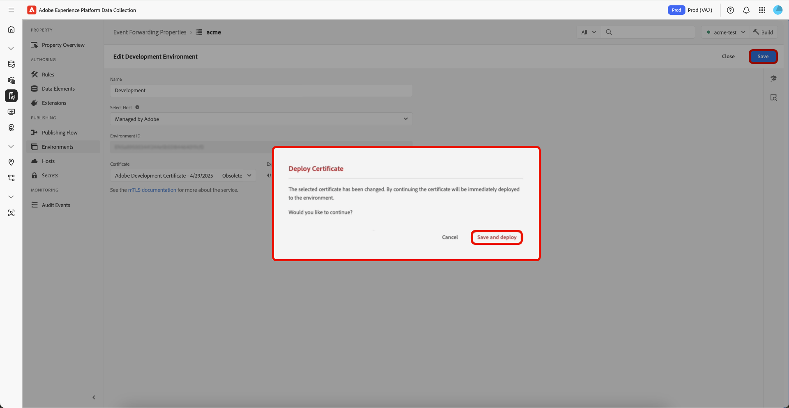

# Visão geral da Segurança da Camada de Transporte Mútuo ([!DNL mTLS])

Associe os certificados da Segurança da Camada de Transporte Mútuo ([!DNL mTLS]) no [!UICONTROL Environments UI] para assumir o controle da segurança da sua extensão. O certificado [!DNL mTLS] é uma credencial digital que comprova a identidade de um servidor ou cliente em comunicações seguras. Quando você usa a API de Serviço [!DNL mTLS], esses certificados ajudam a verificar e criptografar suas interações com o Adobe Experience Platform Event Forwarding. Esse processo não só protege seus dados, mas também garante que cada conexão seja de um parceiro confiável.

## Implementar [!DNL mTLS] em um novo ambiente {#implement-mtls}

Configure o ambiente de Encaminhamento de eventos para garantir que as builds da biblioteca sejam implantadas corretamente na rede de borda. Durante a configuração, você pode selecionar a opção de hospedagem que melhor se adapta às suas necessidades de implantação. Um certificado [!DNL mTLS] também é adicionado automaticamente ao seu novo ambiente para comunicação segura.

Para criar um novo ambiente, selecione a guia **[!UICONTROL Environments]** no painel esquerdo das propriedades de Encaminhamento de Eventos e selecione **[!UICONTROL Add Environment]**.

![Propriedades de encaminhamento de eventos mostrando ambientes existentes, destacando [!UICONTROL Add Environment].](../../../images/extensions/server/cloud-connector/add-environment.png)

Na próxima página, selecione o ambiente que deseja usar para esta configuração. Três ambientes estão disponíveis:

>[!NOTE]
>
>Uma propriedade é limitada a um ambiente de desenvolvimento, de preparo e de produção.

| Ambiente | Descrição |
| --- | --- |
| Desenvolvimento | O ambiente de desenvolvimento é para os membros da equipe testarem bibliotecas ou alterações no Encaminhamento de eventos. |
| Armazenamento temporário | O ambiente de preparo é opcional e permite que os membros aprovados da equipe testem e aprovem uma biblioteca antes que ela seja publicada. |
| Produção | O ambiente de produção é usado para dados de produção em tempo real. |

![A tela de seleção do ambiente, destacando [!UICONTROL Select] para Desenvolvimento.](../../../images/extensions/server/cloud-connector/select-environment.png)

Na página **[!UICONTROL Create Environment]**, digite um **[!UICONTROL Name]** e selecione ***Adobe Managed*** no menu suspenso **[!UICONTROL Select Host]**. O **[!UICONTROL Certificate]** é ***adicionado automaticamente***. Finalmente, selecione **[!UICONTROL Save]**.

![A página Criar Ambiente de Desenvolvimento, destacando [!UICONTROL Name], [!UICONTROL Select Host] e [!UICONTROL Save].](../../../images/extensions/server/cloud-connector/create-environment.png)

O ambiente foi criado com êxito, e você retornará à guia **[!UICONTROL Environments]**, que exibe seu novo ambiente.

![A guia [!UICONTROL Environments], destacando o ambiente de Desenvolvimento.](../../../images/extensions/server/cloud-connector/new-environment-created.png)

## Exibir detalhes do certificado do ambiente {#view-certificate}

Para exibir os detalhes do certificado de um ambiente, selecione a guia **[!UICONTROL Environments]** no painel esquerdo das propriedades de Encaminhamento de eventos e, em seguida, selecione o ambiente para exibir os detalhes.

Os detalhes do certificado a seguir são exibidos:

| Nome do campo | Descrição |
| --- | --- |
| Certificado | Detalhes do certificado, que incluem:<ul><li>**Nome**: o nome do certificado.</li><li>**Data de criação**: a data de criação do certificado.</li><li>**Status**: o status atual do certificado:<ul><li>**Atual**: o certificado está sendo usado ativamente.</li><li>**Obsoleto**: o certificado não está em uso, mas ainda não expirou. Ele ainda poderá ser selecionado para uso.</li><li>**Expirado**: o certificado expirou, está esmaecido e não está mais disponível para uso.</li></ul></ul> |
| Expira | Data em que o certificado expirará. |
| Variable Name | O nome da variável do certificado. |
| Status | O status atual do certificado:<ul><li>**Implantado**: o certificado foi implantado com êxito e está ativo.</li><li>**Implantando**: o certificado está em processo de implantação.</li><li>**Precisa da Implantação**: este status aparece quando um certificado obsoleto é selecionado.</li></ul> |

![A página Editar Ambiente de Desenvolvimento, destacando [!UICONTROL Certificate] detalhes.](../../../images/extensions/server/cloud-connector/certificate-details.png)

### Selecionar e implantar um certificado obsoleto {#deploy-obsolete-certificate}

Para usar um certificado obsoleto, navegue até a guia **[!UICONTROL Environments]** no painel esquerdo das propriedades do Encaminhamento de eventos e selecione o ambiente para exibir os detalhes.

![A guia [!UICONTROL Environments], destacando o ambiente de Desenvolvimento.](../../../images/extensions/server/cloud-connector/new-environment-created.png)

Na lista suspensa **[!UICONTROL Certificate]**, selecione um certificado obsoleto e, em seguida, **[!UICONTROL Save]**.

![A página Editar Ambiente de Desenvolvimento, destacando a lista suspensa [!UICONTROL Certificate] com certificado obsoleto e Salvar realçada.](../../../images/extensions/server/cloud-connector/obsolete-certificate.png)

Para implantar o certificado, selecione **[!UICONTROL Save and deploy]** no diálogo **[!UICONTROL Deploy Certificate]**.

## Próximas etapas {#next-steps}

Este documento demonstrou como criar um ambiente para sua propriedade de encaminhamento de eventos, adicionar um certificado e usar um certificado obsoleto. Para obter mais informações sobre os [!DNL mTLS] certificados, consulte [[!DNL mTLS] Visão geral da API de Serviço](../../../../data-governance/mtls-api/overview.md)

Para saber como usar certificados [!DNL mTLS] nas regras de Encaminhamento de Eventos, consulte a [Visão geral da extensão do Cloud Connector](../cloud-connector/overview.md#mtls-rules).
