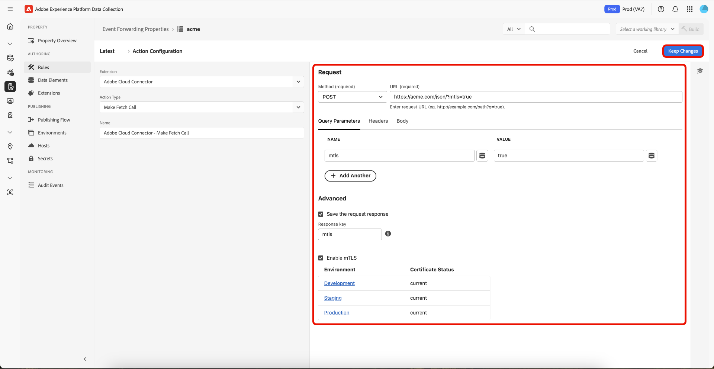

# Visão geral da extensão do Cloud Connector

>[!NOTE]
>
>O Adobe Experience Platform Launch foi reformulado como um conjunto de tecnologias de coleta de dados na Adobe Experience Platform. Como resultado, várias alterações de terminologia foram implementadas na documentação do produto. Consulte o seguinte [documento](../../../term-updates.md) para obter uma referência consolidada das alterações de terminologia.

A extensão de encaminhamento de eventos do Cloud Connector permite criar solicitações HTTP personalizadas para enviar ou recuperar dados de um destino. A extensão do Cloud Connector é como ter o Postman na Adobe Experience Platform Edge Network e pode ser usada para enviar dados a um terminal que ainda não tem uma extensão dedicada.

Use essa referência para obter informações sobre as opções disponíveis ao usar esta extensão para criar uma regra.

## Tipo de ação da extensão Cloud Connector

Esta seção descreve o tipo de ação Enviar dados disponível na extensão do Adobe Experience Platform Cloud Connector.

### Tipo de solicitação

Para selecionar o tipo de solicitação exigido pelo ponto de extremidade, selecione o tipo apropriado na lista suspensa [!UICONTROL Request Type].

| Método | Descrição |
|---|---|
| [GET](https://developer.mozilla.org/pt-BR/docs/Web/HTTP/Methods/GET) | Solicita uma representação do recurso especificado. As solicitações que usam o GET devem recuperar apenas dados. |
| [POST](https://developer.mozilla.org/pt-BR/docs/Web/HTTP/Methods/POST) | Envia uma entidade para o recurso especificado, causando, muitas vezes, uma alteração no estado ou efeitos colaterais no servidor. |
| [PUT](https://developer.mozilla.org/pt-BR/docs/Web/HTTP/Methods/PUT) | Substitui todas as representações atuais do recurso de direcionamento pela carga da solicitação. |
| [PATCH](https://developer.mozilla.org/pt-BR/docs/Web/HTTP/Methods/PATCH) | Aplica modificações parciais a um recurso. |
| [DELETE](https://developer.mozilla.org/pt-BR/docs/Web/HTTP/Methods/DELETE) | Exclui o recurso especificado. |

### URL do ponto terminal

No campo de texto próximo ao menu suspenso do Tipo de solicitação, digite o URL do ponto de extremidade para o qual você está enviando dados.

### Parâmetros de consulta, cabeçalhos e configuração de corpo

Use cada uma dessas guias (Parâmetros de consulta, Cabeçalhos e Elementos de dados do corpo) para controlar quais dados são enviados a determinado ponto de extremidade.

#### Parâmetros de consulta

Defina uma chave e um valor para cada par de valor-chave que você deseja enviar como um parâmetro de string de consulta. Para inserir manualmente um elemento de dados, use a tokenização de elemento de dados com chave para o encaminhamento de eventos. Para referenciar o valor de um elemento de dados chamado &quot;siteSection&quot; como uma chave ou valor, digite `{{siteSection}}`. Ou selecione o elemento de dados criado anteriormente, selecionando-o no menu suspenso.

Para adicionar parâmetros de consulta, selecione **[!UICONTROL Add Another]**.

#### Cabeçalhos

Defina uma chave e um valor para cada par de valor-chave que você deseja enviar como cabeçalho. Para inserir manualmente um elemento de dados, use a tokenização de elemento de dados com chave para o encaminhamento de eventos. Para referenciar o valor de um elemento de dados chamado &quot;pageName&quot; como uma chave ou valor, digite `{{pageName}}`. Ou selecione o elemento de dados criado anteriormente, selecionando-o no menu suspenso.

Para adicionar cabeçalhos, selecione **[!UICONTROL Add Another]**.

A tabela a seguir lista os cabeçalhos predefinidos. Você não está limitado a esses cabeçalhos e pode adicionar seus próprios cabeçalhos personalizados, se necessário, mas eles são disponibilizados para sua conveniência.

>[!NOTE]
>
>Para obter informações mais detalhadas sobre esses cabeçalhos, visite [https://developer.mozilla.org/pt-BR/docs/Web/HTTP/Headers](https://developer.mozilla.org/pt-BR/docs/Web/HTTP/Headers).

| Header | Descrição |
|---|---|
| [A-IM](https://developer.mozilla.org/pt-BR/docs/Web/HTTP/Headers/Accept) | |
| [Accept](https://developer.mozilla.org/pt-BR/docs/Web/HTTP/Headers/Accept) | |
| [Accept-Charset](https://developer.mozilla.org/pt-BR/docs/Web/HTTP/Headers/Accept-Charset) | |
| [Accept-Encoding](https://developer.mozilla.org/pt-BR/docs/Web/HTTP/Headers/Accept-Encoding) | |
| [Accept-Language](https://developer.mozilla.org/pt-BR/docs/Web/HTTP/Headers/Accept-Language) | |
| [Accept-Datetime](https://developer.mozilla.org/pt-BR/docs/Web/HTTP/Headers/Accept) | Transmitido por um agente do usuário para indicar que deseja acessar um estado anterior de um recurso original. Para esse fim, o cabeçalho `Accept-Datetime` é transmitido em uma solicitação HTTP emitida em relação a um TimeGate para um recurso original, e seu valor indica a data e hora do estado anterior desejado do recurso original. |
| Access-Control-Request-Headers | Usado pelos navegadores ao emitir uma [solicitação de comprovação](https://developer.mozilla.org/en-US/docs/Glossary/preflight_request), para informar ao servidor quais [cabeçalhos HTTP](https://developer.mozilla.org/pt-BR/docs/Web/HTTP/Headers) o cliente pode enviar quando a solicitação real é feita. |
| Método de solicitação de controle de acesso | Usado pelos navegadores ao emitir uma [solicitação de comprovação](https://developer.mozilla.org/en-US/docs/Glossary/preflight_request), para informar ao servidor qual [método HTTP](https://developer.mozilla.org/pt-BR/docs/Web/HTTP/Methods) será usado quando a solicitação real for feita. Esse cabeçalho é necessário porque a solicitação de comprovação é sempre [OPÇÃO](https://developer.mozilla.org/pt-BR/docs/Web/HTTP/Methods/OPTIONS) e não usa o mesmo método que a solicitação real. |
| Autorização | Contém as credenciais para autenticar um agente-usuário com um servidor. |
| [Controle de cache](https://developer.mozilla.org/pt-BR/docs/Web/HTTP/Headers/Cache-Control) | Diretivas para mecanismos de armazenamento em cache tanto em solicitações quanto em respostas. |
| [Conexão](https://developer.mozilla.org/en-US/docs/Web/HTTP/Headers/Connection) | Controla se a conexão de rede permanece aberta após a conclusão da transação atual. |
| [Tamanho do conteúdo](https://developer.mozilla.org/pt-BR/docs/Web/HTTP/Headers/Content-Length) | O tamanho do recurso, em número decimal de bytes. |
| [Tipo de conteúdo](https://developer.mozilla.org/pt-BR/docs/Web/HTTP/Headers/Content-Type) | Indica o tipo de mídia do recurso. |
| Cookie | Contém [cookies HTTP](https://developer.mozilla.org/pt-BR/docs/Web/HTTP/Cookies) armazenados e previamente enviados pelo servidor com o cabeçalho [`Set-Cookie`](https://developer.mozilla.org/pt-BR/docs/Web/HTTP/Headers/Set-Cookie). |
| Data | O cabeçalho HTTP geral contém a data e a hora em que a mensagem foi originada. |
| [DNT](https://developer.mozilla.org/pt-BR/docs/Web/HTTP/Headers/DNT) | Expressa a preferência de rastreamento do usuário. |
| Expectativa | Indica as expectativas que precisam ser atendidas pelo servidor para lidar corretamente com a solicitação. |
| Encaminhado | Contém informações dos [servidores proxy reversos](https://developer.mozilla.org/en-US/docs/Web/HTTP/Proxy_servers_and_tunneling) que são alteradas ou perdidas quando um proxy está envolvido no caminho da solicitação. |
| De | Contém um endereço de email da Internet para um usuário humano que controla o agente do usuário solicitante. |
| Host | Especifica o host e o número da porta do servidor para o qual a solicitação está sendo enviada. |
| Se-Correspondência | |
| Se-Modificado-Desde | |
| [Se-Nenhuma-Correspondência](https://developer.mozilla.org/pt-BR/docs/Web/HTTP/Headers/If-None-Match) | |
| [Se-Intervalo](https://developer.mozilla.org/pt-BR/docs/Web/HTTP/Headers/If-Range) | |
| [Se-Inalterado-Desde](https://developer.mozilla.org/pt-BR/docs/Web/HTTP/Headers/If-Unmodified-Since) | |
| [Máx-Encaminhados](https://developer.mozilla.org/pt-BR/docs/Web/HTTP/Headers/If-Unmodified-Since) | |
| [Origem](https://developer.mozilla.org/pt-BR/docs/Web/HTTP/Headers/Origin) | |
| [Pragma](https://developer.mozilla.org/pt-BR/docs/Web/HTTP/Headers/Pragma) | Cabeçalho específico da implementação que pode ter vários efeitos em qualquer lugar na cadeia de solicitação-resposta. Usado para compatibilidade com versões anteriores com caches HTTP/1.0 nos quais o cabeçalho Cache-Control ainda não está presente. |
| [Autorização de proxy](https://developer.mozilla.org/pt-BR/docs/Web/HTTP/Headers/Proxy-Authorization) |  |
| [Intervalo](https://developer.mozilla.org/pt-BR/docs/Web/HTTP/Headers/Range) | Indica a parte de um documento que o servidor deve retornar. |
| [Referer](https://developer.mozilla.org/pt-BR/docs/Web/HTTP/Headers/Referer) | O endereço da página da Web anterior na qual foi seguido um link para a página solicitada no momento. |
| TE | Especifica as codificações de transferência que o agente do usuário está disposto a aceitar. (Você pode chamá-lo informalmente de `Accept-Transfer-Encoding`, o que é mais intuitivo.) |
| Atualização | O documento RFC relevante para o campo de cabeçalho [`Upgrade` é RFC 7230, seção 6.7](https://tools.ietf.org/html/rfc7230#section-6.7). O padrão estabelece regras para se atualizar ou alterar para um protocolo diferente na conexão atual de cliente, servidor e protocolo de transporte. Por exemplo, esse padrão de cabeçalho permite que um cliente mude de HTTP 1.1 para HTTP 2.0, pressupondo que o servidor decida reconhecer e implementar o campo de cabeçalho `Upgrade`. Nenhuma das partes é obrigada a aceitar os termos especificados no campo de cabeçalho `Upgrade`. Ele pode ser usado nos cabeçalhos do cliente e do servidor. Se o campo de cabeçalho `Upgrade` for especificado, o remetente também DEVERÁ enviar o campo de cabeçalho `Connection` com a opção `upgrade` especificada. |
| [User-Agent](https://developer.mozilla.org/pt-BR/docs/Web/HTTP/Headers/User-Agent) | Contém uma string característica que permite que os pares de protocolo de rede identifiquem o tipo de aplicativo, o sistema operacional, o fornecedor ou a versão de software do agente de usuário do software solicitante. |
| [Via](https://developer.mozilla.org/pt-BR/docs/Web/HTTP/Headers/Via) | Adicionados por proxies, tanto encaminhados quanto reversos, e podem aparecer nos cabeçalhos de solicitação e nos cabeçalhos de resposta. |
| [Aviso](https://developer.mozilla.org/pt-BR/docs/Web/HTTP/Headers/Warning) | Informações gerais de aviso sobre possíveis problemas. |
| X-CSRF-Token | |
| X-Requested-With | |

#### Corpo como JSON

Defina uma chave e um valor para cada par de valor-chave que você desejar enviar no corpo da solicitação. Para inserir manualmente um elemento de dados, use a tokenização de elemento de dados com chave para o encaminhamento de eventos. Para referenciar o valor de um elemento de dados chamado &quot;appSection&quot; como uma chave ou valor, digite `{{appSection}}`. Ou selecione o elemento de dados criado anteriormente, selecionando-o no menu suspenso.

Para adicionar outros pares de valor-chave, selecione **[!UICONTROL Add Another]**.

#### Corpo como bruto

Defina uma chave e um valor para cada par de valor-chave que você desejar enviar no corpo da solicitação. Para inserir manualmente um elemento de dados, use a tokenização de elemento de dados com chave para o encaminhamento de eventos. Para referenciar o valor de um elemento de dados chamado &quot;appSection&quot; como uma chave ou valor, digite `{{appSection}}`. Ou selecione o elemento de dados criado anteriormente, selecionando-o no menu suspenso. Você pode adicionar um ou mais elementos de dados.

### Avançado

As ações nas regras no encaminhamento de eventos são executadas sequencialmente. Pode haver situações em que você deseje recuperar dados de uma origem externa que não esteja presente no evento recebido do cliente e, em seguida, tomar essa resposta e transformar ou enviar esses dados a um destino final em uma ação subsequente, em uma única regra. A opção &quot;Salvar a resposta da solicitação&quot; na seção avançada permite isso.

Para salvar o corpo da resposta de um ponto de extremidade, marque a caixa **[!UICONTROL Save the request response]** e defina uma chave de resposta no campo de texto.

Se você tiver definido a chave de resposta como `productDetails`, faça referência a esses dados em um elemento de dados e, em seguida, faça referência a esse elemento de dados em uma ação subsequente na mesma regra. Para criar um elemento de dados que faça referência a `productDetail`, crie um elemento de dados do tipo `path` e insira o seguinte caminho:

```Json
arc.ruleStash.[EXTENSION-NAME-HERE].responses.[RESPONSE-KEY-HERE] 

arc.ruleStash.adobe-cloud-connector.reponses.productDetails 
```

## Adicione uma regra de Segurança da Camada de Transporte Mútuo ([!DNL mTLS]) à biblioteca de Encaminhamento de Eventos {#mtls-rules}

O certificado [!DNL mTLS] é uma credencial digital que comprova a identidade de um servidor ou cliente em comunicações seguras. Quando você usa a API de Serviço [!DNL mTLS], esses certificados ajudam a verificar e criptografar suas interações com o Adobe Experience Platform Event Forwarding. Esse processo não só protege seus dados, mas também garante que cada conexão seja de um parceiro confiável.

### Instalar a extensão do Adobe Cloud Connector {#install}

Para instalar a extensão, [crie uma propriedade de encaminhamento de eventos](../../../ui/event-forwarding/overview.md#properties) ou selecione uma propriedade existente para editar.

Selecione **[!UICONTROL Extensions]** no painel esquerdo. Na guia **[!UICONTROL Catalog]**, selecione o cartão **[!UICONTROL Adobe Cloud Connector]** e, em seguida, **[!UICONTROL Install]**.

![O catálogo de extensões que mostra a instalação do destaque do cartão de extensão [!DNL Adobe Cloud Connector].](../../../images/extensions/server/cloud-connector/install-extension.png)

### Configurar uma regra de encaminhamento de eventos {#rule}

>[!NOTE]
>
>Para configurar uma regra para usar o [!DNL mTLS], você deve ter o Adobe Cloud Connector versão 1.2.4 ou posterior instalado.

Depois de instalar a extensão, você pode criar uma regra de Encaminhamento de Eventos que use o [!DNL mTLS] e adicioná-la à biblioteca.

Crie uma nova [regra](../../../ui/managing-resources/rules.md) de encaminhamento de eventos na propriedade de encaminhamento de eventos. Forneça um nome para a regra e, em **[!UICONTROL Actions]**, adicione uma nova ação e defina a extensão como **[!UICONTROL Adobe Cloud Connector]**. Em seguida, selecione **[!UICONTROL Make Fetch Call]** para o **[!UICONTROL Action Type]**.


Depois de fazer a seleção, controles adicionais aparecerão para configurar o método e o destino para a solicitação [!DNL mTLS]. Para habilitar o uso de certificados ativos nos ambientes, selecione **[!UICONTROL Enable in [!DNL mTLS]]** e **[!UICONTROL Keep Changes]** para salvar a regra.



Sua nova regra está pronta. Selecione **[!UICONTROL Save to Library]** e **[!UICONTROL Build]** para implantá-lo. A solicitação [!DNL mTLS] agora está ativa e disponível em sua biblioteca.


## Próximas etapas

Este guia abordou como configurar regras mTLS no encaminhamento de eventos. Para obter mais detalhes sobre como configurar mTLS para um ambiente, consulte o [guia de Segurança da Camada de Transporte Mútuo ([!DNL mTLS])](../cloud-connector/mtls.md).

Para obter mais informações sobre os recursos de encaminhamento de eventos do Experience Platform, consulte a [visão geral do encaminhamento de eventos](../../../ui/event-forwarding/overview.md).
