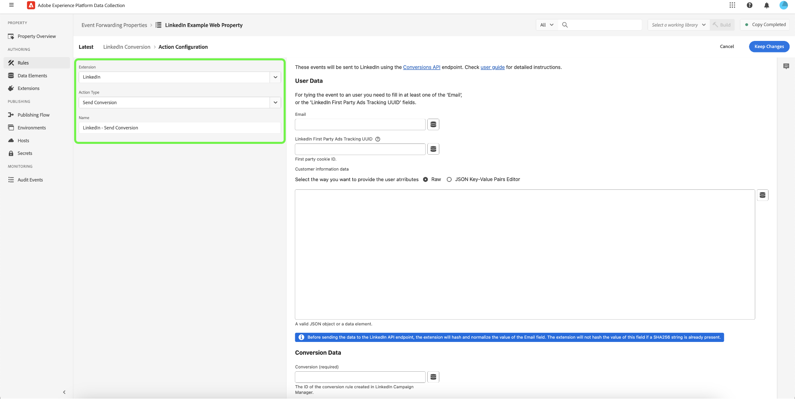

# Extensão da API de conversões do [!DNL LinkedIn]

[[!DNL LinkedIn Conversions API]](https://learn.microsoft.com/en-us/linkedin/marketing/integrations/ads-reporting/conversions-api) é uma ferramenta de rastreamento de conversão que cria uma conexão direta entre os dados de marketing do servidor de um anunciante e o [!DNL LinkedIn]. Isso permite que os anunciantes avaliem a eficácia de suas campanhas de marketing [!DNL LinkedIn], independentemente do local da conversão, e utilizem essas informações para impulsionar a otimização da campanha. A extensão [!DNL LinkedIn Conversions API] pode ajudar a fortalecer o desempenho e reduzir o custo por ação com atribuição mais completa, confiabilidade aprimorada dos dados e melhor otimização da entrega.

## Pré-requisitos {#prerequisites}

Você deve [criar uma regra de conversão](https://www.linkedin.com/help/lms/answer/a1657171) em sua conta [!DNL LinkedIn Campaign Manager]. A [!DNL Adobe] recomenda incluir &quot;CAPI&quot; no início do nome da regra de conversa para separá-lo de outros tipos de regras de conversão que você possa ter configurado.

### Criar um segredo e um elemento de dados

Crie um novo [!DNL LinkedIn] [segredo de encaminhamento de eventos](../../../ui/event-forwarding/secrets.md) e forneça a ele um nome exclusivo que signifique o membro de autenticação. Ele será usado para autenticar a conexão com sua conta, mantendo o valor seguro.

Em seguida, [crie um elemento de dados](../../../ui/managing-resources/data-elements.md#create-a-data-element) usando a extensão [!UICONTROL Core] e um tipo de elemento de dados [!UICONTROL Secret] para fazer referência ao segredo `LinkedIn` que você acabou de criar.

## Instalar e configurar a extensão [!DNL LinkedIn] {#install}

Para instalar a extensão, [crie uma propriedade de encaminhamento de eventos](../../../ui/event-forwarding/overview.md#properties) ou selecione uma propriedade existente para editar.

Selecione **[!UICONTROL Extensões]** na navegação à esquerda. Na guia **[!UICONTROL Catálogo]**, selecione a extensão **[!UICONTROL LinkedIn]** e selecione **[!UICONTROL Instalar]**.

![O catálogo de extensões que mostra a instalação do destaque do cartão de extensão [!DNL LinkedIn].](../../../images/extensions/server/linkedin/install-extension.png)

Na próxima tela, insira a senha do elemento de dados criado anteriormente no campo `Access Token`. A senha do elemento de dados conterá seu token OAuth 2 do [!DNL LinkedIn]. Selecione **[!UICONTROL Salvar]** ao concluir.

![A página de configuração de extensão [!DNL LinkedIn] com o campo [!UICONTROL Token de Acesso] e [!UICONTROL Salvar] realçados.](../../../images/extensions/server/linkedin/configure-extension.png)

## Criar uma regra [!DNL Send Conversion] {#tracking-rule}

Depois que todos os seus elementos de dados estiverem configurados, você poderá começar a criar regras de encaminhamento de eventos que determinam quando e como seus eventos serão enviados para [!DNL LinkedIn].

Crie uma nova [regra](../../../ui/managing-resources/rules.md) de encaminhamento de eventos na propriedade de encaminhamento de eventos. Em **[!UICONTROL Ações]**, adicione uma nova ação e defina a extensão como **[!UICONTROL LinkedIn]**. Em seguida, selecione **[!UICONTROL Enviar Conversão]** para o **[!UICONTROL Tipo de Ação]**.

Após a seleção, controles adicionais são exibidos para configurar ainda mais o evento. Selecione **[!UICONTROL Manter alterações]** para salvar a regra.

**[!UICONTROL Dados do usuário]**

| Entrada | Descrição |
| --- | --- |
| [!UICONTROL Email] | Endereço de email do contato associado ao evento de conversão. O valor do email será codificado pelo código de extensão em SHA256, a menos que o valor fornecido já seja uma string SHA256. |
| [!UICONTROL UUID de Rastreamento de Anúncios Primários do LinkedIn] | Esta é uma ID de cookie primário. Os anunciantes precisam habilitar o rastreamento de conversão aprimorado de [[!DNL LinkedIn Campaign Manager]](https://www.linkedin.com/help/lms/answer/a423304/enable-first-party-cookies-on-a-linkedin-insight-tag) para ativar cookies primários que anexam um parâmetro de ID de clique `li_fat_id` às URLs de clique. |
| [!UICONTROL Dados de informações do cliente] | Esse campo contém um objeto JSON com atributos extras que serão enviados junto com a mensagem.  Na opção **[!UICONTROL Raw]**, você pode colar o objeto JSON diretamente no campo de texto fornecido ou selecionar o ícone de elemento de dados () para selecionar de uma lista de elementos de dados existentes para representar os dados.  Você também pode usar a opção **[!UICONTROL Editor de pares de valores-chave JSON]** para adicionar manualmente cada par de valores-chave por meio de um editor de interface do usuário. Cada valor pode ser representado por uma entrada bruta, ou um elemento de dados pode ser selecionado. Os valores de chave aceitos são: `firstName`, `lastName`, `companyName`, `title` e `country`. |

{style="table-layout:auto"}

![A seção [!DNL User Data] que mostra exemplos de entrada de dados nos campos.](../../../images/extensions/server/linkedin/configure-extension-user-data.png)

**[!UICONTROL Dados de conversão]**

| Entrada | Descrição |
| --- | --- |
| [!UICONTROL Conversão] | A ID da regra de conversão criada no [LinkedIn Campaign Manager](https://www.linkedin.com/help/lms/answer/a1657171). Selecione a regra de conversão para obter a ID e, em seguida, copie a ID da URL do navegador (por exemplo, `/campaignmanager/accounts/508111232/conversions/15588877`) como `/conversions/<id>`. |
| [!UICONTROL Tempo de conversão] | Cada carimbo de data e hora em milissegundos em que o evento de conversão aconteceu.    Observação: se a origem registrar o carimbo de data/hora de conversão em segundos, insira 000 no final para transformá-lo em milissegundos. |
| [!UICONTROL Moeda] | Código de moeda em formato ISO. |
| [!UICONTROL Valor] | Valor da conversão em sequência decimal (por exemplo, &quot;100,05&quot;). |
| [!UICONTROL ID do Evento] | A ID exclusiva gerada pelos anunciantes para indicar cada evento. Este campo é opcional e é usado para [desduplicação](https://learn.microsoft.com/en-us/linkedin/marketing/conversions/deduplication?view=li-lms-2024-02). |

{style="table-layout:auto"}

![A seção [!DNL Conversion Data] mostrando dados de exemplo nos campos.](../../../images/extensions/server/linkedin/configure-extension-conversions-data.png)

**[!UICONTROL Substituições de configuração]**

>NOTA
>
>O campo [!UICONTROL Substituições de Configuração] permite que um usuário defina um token de acesso [!DNL LinkedIn] diferente em cada regra, permitindo que cada regra use um token de acesso que possa ter acesso a contas de anúncio [!DNL LinkedIn] diferentes.

| Entrada | Descrição |
| --- | --- |
| [!UICONTROL Token de acesso] | O token de acesso [!DNL LinkedIn]. |

![A seção [!DNL Configuration Overrides] mostrando a entrada de dados de exemplo no campo.](../../../images/extensions/server/linkedin/configure-extension-configuration-override.png)

## Próximas etapas

Este guia abordou como enviar dados para [!DNL LinkedIn] usando a extensão de encaminhamento de eventos [!DNL LinkedIn Conversions API]. Para obter mais informações sobre os recursos de encaminhamento de eventos do [!DNL Adobe Experience Platform], leia a [visão geral do encaminhamento de eventos](../../../ui/event-forwarding/overview.md).

Para obter detalhes sobre como depurar sua implementação usando o Depurador de Experience Platform e a ferramenta de Monitoramento de Encaminhamento de Eventos, leia a [Visão geral de Adobe Experience Platform Debugger](../../../../debugger/home.md) e [Monitorar atividades no encaminhamento de eventos](../../../ui/event-forwarding/monitoring.md).
