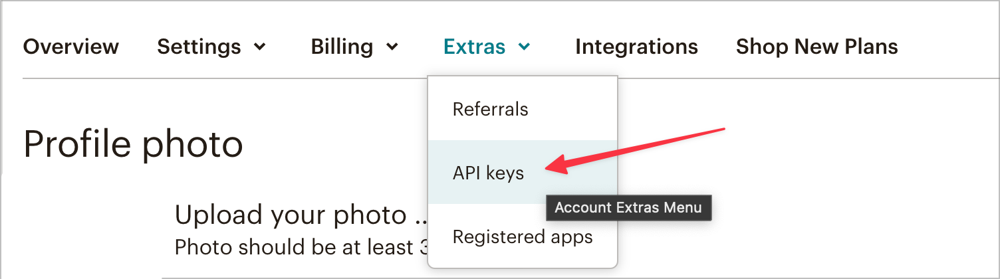

# Visão geral da extensão de encaminhamento de eventos do Mailchimp

>[!NOTE]
>  
>O Adobe Experience Platform Launch foi reformulado como um conjunto de tecnologias de coleção de dados na Adobe Experience Platform. Como resultado, várias alterações de terminologia foram implementadas na documentação do produto. Consulte o seguinte [documento](https://experienceleague.adobe.com/docs/experience-platform/tags/term-updates.html) para obter uma referência consolidada das alterações de terminologia.

O Mailchimp [encaminhamento de eventos](../../../ui/event-forwarding/overview.md) A extensão envia eventos para a API de marketing do Mailchimp que podem acionar emails para campanhas de marketing, jornadas ou transações do Mailchimp.

Este documento aborda como definir a extensão e configurar regras usando a ação Adicionar evento.

## Pré-requisitos

Este documento supõe que você esteja familiarizado com os produtos Mailchimp relevantes aproveitados pela extensão. Para obter mais informações, consulte a documentação de ajuda do Mailchimp para [campanhas](https://mailchimp.com/help/getting-started-with-campaigns/), [jornadas](https://mailchimp.com/help/about-customer-journeys/), e [transações](https://mailchimp.com/help/transactional/).

Uma conta do Mailchimp é necessária para usar esta extensão. Você pode se inscrever para uma conta [aqui](https://login.mailchimp.com/signup/). No painel de contas do Mailchimp, anote os seguintes valores para uso neste guia:

- Seu prefixo de domínio do Mailchimp
- Sua chave de API
- A ID do público-alvo
- O endereço de email padrão &quot;de&quot;

Dependendo do seu plano de conta do Mailchimp, você pode ter acesso limitado às ferramentas de Jornada ao cliente do Mailchimp.

>[!TIP]
>  
>Se você estiver usando automações do Mailchimp, como emails transacionais ou Jornadas do cliente, as etapas e telas poderão ser um pouco diferentes daquelas listadas aqui. No entanto, você ainda precisa das mesmas informações para usar essa extensão, conforme descrito acima. Consulte a [Centro de ajuda do Mailchimp](https://mailchimp.com/help/) para obter detalhes sobre cada um desses valores para sua conta e plano específicos.

### Prefixo do domínio

Depois de fazer logon no Mailchimp e acessar a exibição do Painel, a barra de endereços do navegador deve exibir um URL como `https://us11.admin.mailchimp.com` ou apenas `us11.admin.mailchimp.com`. Neste exemplo, o prefixo `us11` é apenas um espaço reservado e seu valor será diferente. Registre seu URL com seu prefixo para uma etapa posterior.

### Chave de API

Para localizar a chave de API da sua conta, selecione o ícone do perfil na interface do usuário do Mailchimp e, em seguida, selecione **Perfil**. Você deve ver um URL como `https://us11.admin.mailchimp.com/account/profile/` mas com **seu** prefixo em vez de `us11`.

Selecionar **Extras**, depois **Chaves de API**:

Em **Suas chaves de API**, você pode escolher uma chave existente ou selecionar **Criar Uma Chave** para criar um novo. Você pode criar uma nova chave para usar especificamente com essa extensão. Copie a chave de API e salve-a para uma etapa posterior. Para obter mais detalhes, consulte a documentação do Mailchimp sobre como [gerar sua chave de API](https://mailchimp.com/developer/marketing/guides/quick-start/#generate-your-api-key).

### ID de público-alvo e endereço do remetente

Selecionar **Público** na navegação à esquerda, **Painel de público-alvo**. Em seguida, selecione o público-alvo que deseja usar com essa extensão. Para saber mais, consulte o documento Mailchimp em [criação de um público](https://mailchimp.com/help/create-audience/).

Com seu público criado e selecionado, selecione **Gerenciar público-alvo** selecione **Configurações**. Esta tela mostra várias configurações para o seu público-alvo.

Na parte inferior da tela Configurações, você deverá ver `Unique id for audience [audience name]` onde `[audience name]` é o nome do público-alvo real. Copie a ID de público-alvo e salve-a para uma etapa posterior.

Selecionar **Nome e padrões do público-alvo** e confirmar que **Padrão do endereço de email** tem o valor correto para suas campanhas. Observe que a ID de público-alvo também está listada na parte superior desta página e tem o mesmo valor copiado na última etapa.

## Automações do Mailchimp

Dependendo do seu plano do Mailchimp e se você usa emails transacionais, Jornadas do cliente ou outras automações do Mailchimp, suas configurações específicas de jornada podem variar.

>[!IMPORTANT]
>  
>O nome do evento que você escolheu para acionar sua automação ou jornada no Mailchimp é o mesmo nome de evento que deve ser enviado com essa extensão. Observe o nome do evento na automação do Mailchimp e salve-o para uma etapa posterior.

## Instalação e configuração

Esta seção lista as etapas para instalar e configurar a extensão. Para salvar com segurança a chave de API do Mailchimp, você deve usar o encaminhamento de eventos [segredos](../../../ui/event-forwarding/secrets.md).

### Criar um segredo e um elemento de dados

Em uma propriedade de encaminhamento de eventos, [criar um [!UICONTROL Token] segredo](../../../ui/event-forwarding/secrets.md#token) chamado `Mailchimp API Key`.

Em seguida, [criar um elemento de dados](../../../ui/managing-resources/data-elements.md#create-a-data-element) usando o [!UICONTROL Núcleo] extensão e um [!UICONTROL Segredo] tipo de elemento de dados para fazer referência ao `Mailchimp API Key` segredo que acabou de criar. Enter `Mailchimp Token` como o nome do elemento de dados.

### Instalação e configuração da extensão do 

Na mesma propriedade de encaminhamento de eventos, selecione **[!UICONTROL Extensões],** depois **[!UICONTROL Catálogo]** para exibir as extensões disponíveis para instalação. Aqui, pesquise a extensão Mailchimp e selecione **[!UICONTROL Instalar]**.

A tela de configuração é exibida. Em **[!UICONTROL Nome de Domínio de Prefixo do Servidor Mailchimp]**, insira o domínio que você copiou anteriormente da sua conta do Mailchimp, incluindo o prefixo de domínio exclusivo.

>[!IMPORTANT]
>
>Não incluir `http://` ou `https://` neste campo.

Em **[!UICONTROL Token do Mailchimp]**, selecione o ícone de elemento de dados e escolha o `Mailchimp Token` elemento de dados criado anteriormente. Selecionar **[!UICONTROL Salvar]** para salvar as alterações.

A extensão agora está instalada e configurada para uso na propriedade.

## Coleta de dados

Ao usar essa extensão em uma [regra](../../../ui/managing-resources/rules.md), há vários valores de dados que a extensão envia para o Mailchimp com cada evento. Para uma implementação típica, é possível configurar o [Extensão SDK da Web do Adobe Experience Platform](../../client/sdk/overview.md) para enviar esses dados ao [!DNL Platform Edge Network] para uso pela extensão na propriedade de encaminhamento de eventos.

Os dados necessários para essa extensão podem ser enviados do SDK da Web como dados XDM ou dados não XDM. Consulte a documentação para saber mais sobre [envio de dados XDM](../../../../edge/fundamentals/tracking-events.md#sending-non-xdm-data).

Por exemplo, se um cliente fizer uma compra ou se registrar para um evento em seu site, você poderá enviar um email de confirmação por meio do Mailchimp com essa extensão. Depois de enviar as informações necessárias do SDK da Web para a Rede de borda, a extensão acionará o email com o Mailchimp.

### Elementos de dados

A captura de tela na seção anterior mostra os dados que você pode enviar com cada evento desta extensão para o Mailchimp. Depois de configurar o SDK da Web para enviar esses dados para a Rede de borda, você pode criar elementos de dados na propriedade de encaminhamento de eventos para que a extensão possa acessar esses valores.

A tabela abaixo fornece mais detalhes para cada valor possível.

| Nome | Exemplo de caminho | Tipo | Descrição | Obrigatório | Limites |
|:---|:---:|:---:|:---|:---:|:---|
| `email` | `arc.event.xdm._tenant.emailId`  ou  `arc.event.data._tenant.emailId` | String | O endereço que recebe o email | **Sim** | Deve existir no Público do Mailchimp |
| `listId` | `arc.event.xdm._tenant.listId`  ou  `arc.event.data._tenant.listid` | String | ID de público | **Sim** | Deve corresponder a uma ID de público-alvo existente |
| `name` | `arc.event.xdm._tenant.name`  ou  `arc.event.data._tenant.name` | String | O nome do evento | **Sim** | 2-30 caracteres de comprimento |
| `properties` | `arc.event.xdm._tenant.properties`  ou  `arc.event.data._tenant.properties` | Objeto | Uma lista opcional de propriedades no formato JSON com detalhes sobre o evento | Não |  |
| `isSyncing` | `arc.event.xdm._tenant.isSyncing`  ou  `arc.event.data._tenant.isSyncing` | booleano | Eventos criados com `is_syncing` definir como `true` **não** automações de acionador | Não |  |
| `occurredAt` | `arc.event.xdm._tenant.occuredAt`  ou `arc.event.data._tenant.occuredAt` | String | Um carimbo de data e hora ISO 8601 de quando o evento ocorreu | Não |  |

{style="table-layout:auto"}

>[!IMPORTANT]
>  
>A variável **Exemplo de caminho** os valores acima são somente exemplos. Os nomes dos campos e [caminhos](../../../ui/event-forwarding/overview.md#data-element-path) as referências nesses elementos de dados podem ser diferentes na propriedade, dependendo de como você nomeou e configurou o SDK da Web nas etapas acima.

Na propriedade de encaminhamento de eventos, você pode criar um elemento de dados para cada um dos campos descritos acima. Depois de criado, você pode fazer referência aos elementos de dados na [!UICONTROL Adicionar evento] ação dessa extensão.

Agora você pode usar essa extensão e a ação Adicionar evento para acionar emails do Mailchimp para seus públicos.

## Validação de dados

Ao trabalhar com extensões de encaminhamento de eventos, a variável [Adobe Experience Platform Debugger](https://chrome.google.com/webstore/detail/adobe-experience-platform/bfnnokhpnncpkdmbokanobigaccjkpob) é muito útil. Na seção Logs, em Logs de borda, você pode ver as solicitações feitas pelas regras de encaminhamento de eventos depois que elas são acionadas. As capturas de tela a seguir mostram uma solicitação que está sendo feita à API do Mailchimp pela extensão.

No painel do Mailchimp, na exibição Feed de atividades do seu Público ou Membro de público, uma lista de eventos é fornecida para esse Público ou Membro de público. Ele deve corresponder aos eventos enviados pela extensão e mostrar todos os dados opcionais enviados, juntamente com o email ou a campanha recebida. Consulte a [Guias de ajuda do Mailchimp Automation](https://mailchimp.com/help/automation/) para obter mais detalhes.
