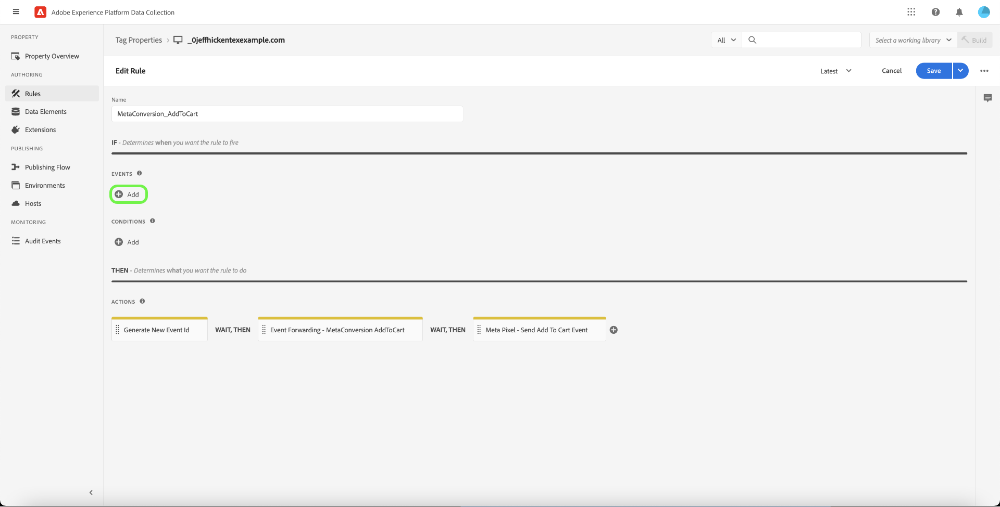

# Visão geral da extensão do [!DNL Meta Conversions API]

O [[!DNL Meta Conversions API]](https://developers.facebook.com/docs/marketing-api/conversions-api/) permite conectar seus dados de marketing do lado do servidor às tecnologias do [!DNL Meta] para otimizar o direcionamento de seus anúncios, reduzir o custo por ação e medir os resultados. Eventos estão vinculados a uma ID do [[!DNL Meta Pixel]](https://developers.facebook.com/docs/meta-pixel/) e são processados de maneira semelhante aos eventos do lado do cliente.

Usando a extensão [!DNL Meta Conversions API], você pode aproveitar os recursos da API em suas regras de [encaminhamento de eventos](../../../ui/event-forwarding/overview.md) para enviar dados para [!DNL Meta] do Adobe Experience Platform Edge Network. Este documento aborda como instalar a extensão e usar seus recursos em uma [regra](../../../ui/managing-resources/rules.md) de encaminhamento de eventos.

## Demonstração

O vídeo a seguir tem como objetivo ajudá-lo a entender o [!DNL Meta Conversions API].

>[!VIDEO](https://unlockmarketingdata.com/video-meta-conversions-api)

## Pré-requisitos

É altamente recomendável usar [!DNL Meta Pixel] e [!DNL Conversions API] para compartilhar e enviar os mesmos eventos do lado do cliente e do lado do servidor, respectivamente, pois isso pode ajudar a recuperar eventos que não foram selecionados por [!DNL Meta Pixel]. Antes de instalar a extensão [!DNL Conversions API], consulte o guia na [[!DNL Meta Pixel] extensão](../../client/meta/overview.md) para obter etapas sobre como integrá-la nas implementações de tags do lado do cliente.

>[!NOTE]
>
>A seção sobre [desduplicação de eventos](#deduplication), apresentada posteriormente neste documento, aborda as etapas para garantir que o mesmo evento não seja usado duas vezes, pois pode ser recebido do navegador e do servidor.

Para usar a extensão [!DNL Conversions API], você deve ter acesso ao encaminhamento de eventos e ter uma conta [!DNL Meta] válida com acesso a [!DNL Ad Manager] e [!DNL Event Manager]. Especificamente, você deve copiar a ID de um [[!DNL Meta Pixel]](https://www.facebook.com/business/help/952192354843755?id=1205376682832142) existente (ou [criar um novo [!DNL Pixel]](https://www.facebook.com/business/help/952192354843755)) para que a extensão possa ser configurada para sua conta.

>[!INFO]
>
>Se você estiver planejando usar esta extensão com dados de aplicativo móvel ou se também trabalhar com dados de evento offline em suas campanhas do [!DNL Meta], será necessário criar seu conjunto de dados por meio de um aplicativo existente e selecionar **Criar a partir de uma ID de pixel** quando solicitado. Consulte o artigo [Decida qual opção de criação de conjunto de dados é adequada para sua empresa](https://www.facebook.com/business/help/5270377362999582?id=490360542427371) para obter detalhes. Consulte o documento [API de Conversões para Eventos de Aplicativo](https://developers.facebook.com/docs/marketing-api/conversions-api/app-events) para obter todos os parâmetros de rastreamento de aplicativo obrigatórios e opcionais.

## Instalar a extensão

Para instalar a extensão [!DNL Meta Conversions API], navegue até a interface da Coleção de Dados ou a interface do Experience Platform e selecione **[!UICONTROL Event Forwarding]** na navegação à esquerda. Aqui, selecione uma propriedade à qual adicionar a extensão ou crie uma nova propriedade.

Depois de selecionar ou criar a propriedade desejada, selecione **[!UICONTROL Extensions]** na navegação à esquerda e, em seguida, selecione a guia **[!UICONTROL Catalog]**. Procure o cartão [!UICONTROL Meta Conversions API] e selecione **[!UICONTROL Install]**.

![A opção [!UICONTROL Install] está sendo selecionada para a extensão [!UICONTROL Meta Conversions API] na interface da Coleção de Dados.](../../../images/extensions/server/meta/install.png)

Na exibição de configuração exibida, você deve fornecer a ID do [!DNL Pixel] copiada anteriormente para vincular a extensão à sua conta. Você pode colar a ID diretamente na entrada ou usar um elemento de dados.

Você também precisa fornecer um token de acesso para usar o [!DNL Conversions API] especificamente. Consulte a documentação [!DNL Conversions API] em [gerando um token de acesso](https://developers.facebook.com/docs/marketing-api/conversions-api/get-started#access-token) para obter etapas sobre como obter esse valor.

Quando terminar, selecione **[!UICONTROL Save]**

![A ID [!DNL Pixel] fornecida como um elemento de dados na exibição de configuração de extensão.](../../../images/extensions/server/meta/configure.png)

A extensão é instalada e agora você pode empregar seus recursos nas regras de encaminhamento de eventos.

## Integração com a extensão do Facebook e Instagram {#facebook}

A integração usando a extensão do Facebook e Instagram permite que você se autentique rapidamente em sua conta comercial do Meta. Em seguida, o [!UICONTROL Pixel ID] e a API de Conversões do Meta [!UICONTROL Access Token] são preenchidos automaticamente, facilitando a instalação e a configuração da API de Conversões do Meta.

Um prompt de caixa de diálogo para autenticar no Facebook e no Instagram é exibido ao instalar a extensão [!UICONTROL Meta Conversions API].

![A página de instalação [!UICONTROL Meta Conversions API Extension] destacando [!UICONTROL Connect to Meta].](../../../images/extensions/server/meta/mbe-extension-install.png)

Um prompt de diálogo para autenticar no Facebook e no Instagram também é exibido na interface do usuário do workflow de início rápido no encaminhamento de eventos.

![O destaque da interface do fluxo de trabalho de início rápido [!UICONTROL Connect to Meta].](../../../images/extensions/server/meta/mbe-extension-quick-start.png)

## Integração com a Pontuação de correspondência de qualidade do evento (EMQ) {#emq}

A integração com a Pontuação de correspondência de qualidade do evento (EMQ) permite visualizar facilmente a eficácia da implementação ao mostrar pontuações da EMQ. Essa integração minimiza a alternância de contexto e ajuda a melhorar o sucesso das implementações da API de conversões do Meta. Essas pontuações de evento aparecem na tela de configuração [!UICONTROL Meta Conversions API extension].

![A página de configuração [!UICONTROL Meta Conversions API Extension] destacando [!UICONTROL View EMQ Score].](../../../images/extensions/server/meta/emq-score.png)

## Integração com o LiveRamp (Alpha) {#alpha}

[!DNL LiveRamp] clientes que têm a solução de tráfego autenticado (ATS) do [!DNL LiveRamp] implantada em seus sites podem optar por compartilhar RampIDs como um parâmetro de informações do cliente. Trabalhe com a equipe de conta do [!DNL Meta] para participar do programa Alpha para este recurso.

![A página de configuração [!UICONTROL Rule] do encaminhamento de eventos do Meta destacando [!UICONTROL Partner Name (alpha)] e [!UICONTROL Partner ID (alpha)].](../../../images/extensions/server/meta/live-ramp.png)

## Configurar uma regra de encaminhamento de eventos {#rule}

Esta seção aborda como usar a extensão [!DNL Conversions API] em uma regra de encaminhamento de eventos genérica. Na prática, você deve configurar várias regras para enviar todos os [eventos padrão](https://developers.facebook.com/docs/meta-pixel/reference) aceitos via [!DNL Meta Pixel] e [!DNL Conversions API]. Para dados de aplicativos móveis, consulte os campos obrigatórios, os campos de dados de aplicativos, os parâmetros de informações do cliente e os detalhes de dados personalizados [aqui](https://developers.facebook.com/docs/marketing-api/conversions-api/app-events).

>[!NOTE]
>
>Os eventos devem ser [enviados em tempo real](https://www.facebook.com/business/help/379226453470947?id=818859032317965) ou o mais próximo possível do tempo real para uma melhor otimização da campanha publicitária.

Comece a criar uma nova regra de encaminhamento de eventos e configure as condições conforme desejado. Ao selecionar as ações para a regra, selecione **[!UICONTROL Meta Conversions API Extension]** para a extensão e **[!UICONTROL Send Conversions API Event]** para o tipo de ação.

![O tipo de ação [!UICONTROL Send Page View] que está sendo selecionado para uma regra na interface da Coleção de Dados.](../../../images/extensions/server/meta/select-action.png)

São exibidos controles que permitem configurar os dados do evento que serão enviados para [!DNL Meta] por meio de [!DNL Conversions API]. Essas opções podem ser inseridas diretamente nas entradas fornecidas ou você pode selecionar elementos de dados existentes para representar os valores. As opções de configuração são divididas em quatro seções principais, conforme descrito abaixo.

| Seção de configuração | Descrição |
| --- | --- |
| [!UICONTROL Server Event Parameters] | Informações gerais sobre o evento, incluindo o momento em que ocorreu e a ação de origem que o acionou. Consulte a documentação do desenvolvedor [!DNL Meta] para obter mais informações sobre os [parâmetros de evento padrão](https://developers.facebook.com/docs/marketing-api/conversions-api/parameters/server-event) aceitos pelo [!DNL Conversions API].  Se você estiver usando [!DNL Meta Pixel] e [!DNL Conversions API] para enviar eventos, certifique-se de incluir um **[!UICONTROL Event Name]** (`event_name`) e **[!UICONTROL Event ID]** (`event_id`) com cada evento, já que esses valores são usados para a [desduplicação de eventos](#deduplication).  Você também tem a opção de **[!UICONTROL Enable Limited Data Use]** para ajudar a cumprir as opções de não participação do cliente. Consulte a documentação [!DNL Conversions API] em [opções de processamento de dados](https://developers.facebook.com/docs/marketing-apis/data-processing-options/) para obter detalhes sobre este recurso. |
| [!UICONTROL Customer Information Parameters] | Dados de identidade do usuário usados para atribuir o evento a um cliente. Alguns desses valores devem ser transformados em hash antes de serem enviados para a API.  Para garantir uma boa conexão de API comum e uma alta qualidade de correspondência de eventos (EMQ), é recomendável enviar todos os [parâmetros de informações de clientes aceitos](https://developers.facebook.com/docs/marketing-api/conversions-api/parameters/customer-information-parameters) juntamente com eventos de servidor. Esses parâmetros também devem ser [priorizados com base em sua importância e impacto no EMQ](https://www.facebook.com/business/help/765081237991954?id=818859032317965). |
| [!UICONTROL Custom Data] | Dados adicionais a serem usados para otimização de entrega de anúncios, fornecidos no formato de um objeto JSON. Consulte a [[!DNL Conversions API] documentação](https://developers.facebook.com/docs/marketing-api/conversions-api/parameters/custom-data) para obter mais informações sobre as propriedades aceitas para este objeto.  Se estiver enviando um evento de compra, você deve usar esta seção para fornecer os atributos necessários `currency` e `value`. |
| [!UICONTROL Test Event] | Esta opção é usada para verificar se sua configuração está fazendo com que os eventos de servidor sejam recebidos por [!DNL Meta] conforme esperado. Para usar esse recurso, marque a caixa de seleção **[!UICONTROL Send as Test Event]** e forneça um código de evento de teste de sua escolha na entrada abaixo. Depois que a regra de encaminhamento de eventos for implantada, se você tiver configurado a extensão e a ação corretamente, deverá ver as atividades que aparecem na exibição **[!DNL Test Events]** em [!DNL Meta Events Manager]. |

{style="table-layout:auto"}

Quando terminar, selecione **[!UICONTROL Keep Changes]** para adicionar a ação à configuração de regra.

![[!UICONTROL Keep Changes] sendo selecionado para a configuração da ação.](../../../images/extensions/server/meta/keep-changes.png)

Quando estiver satisfeito com a regra, selecione **[!UICONTROL Save to Library]**. Finalmente, publique um novo encaminhamento de eventos [build](../../../ui/publishing/builds.md) para habilitar as alterações feitas na biblioteca.

## Desduplicação de eventos {#deduplication}

Conforme mencionado na [seção de pré-requisitos](#prerequisites), é recomendável usar a extensão de tag [!DNL Meta Pixel] e a extensão de encaminhamento de eventos [!DNL Conversions API] para enviar os mesmos eventos do cliente e do servidor em uma configuração redundante. Isso pode ajudar a recuperar eventos que não foram coletados por uma extensão ou outra.

Se você estiver enviando tipos de evento diferentes do cliente e do servidor sem sobreposição entre os dois, a desduplicação não será necessária. No entanto, se qualquer evento for compartilhado por [!DNL Meta Pixel] e [!DNL Conversions API], você deve garantir que esses eventos redundantes sejam desduplicados para que seus relatórios não sejam afetados negativamente.

Ao enviar eventos compartilhados, verifique se você está incluindo uma ID e um nome de evento em cada evento enviado do cliente e do servidor. Quando vários eventos com a mesma ID e o mesmo nome são recebidos, o [!DNL Meta] emprega automaticamente várias estratégias para desduplicá-los e manter os dados mais relevantes. Consulte a documentação do [!DNL Meta] sobre a [desduplicação para [!DNL Meta Pixel] e [!DNL Conversions API] eventos](https://www.facebook.com/business/help/823677331451951?id=1205376682832142) para obter detalhes sobre esse processo.

## Fluxo de trabalho de início rápido: Extensão da API de conversões do Meta (Beta) {#quick-start}

>[!IMPORTANT]
>
>* O recurso de início rápido está disponível para clientes que compraram o pacote Real-Time CDP Prime e Ultimate. Entre em contato com o representante da Adobe para obter mais informações.
>* Esse recurso é para novas implementações e atualmente não é compatível com a instalação automática de extensões e configurações em tags existentes e propriedades de encaminhamento de eventos.

>[!NOTE]
>
>Qualquer cliente existente pode usar os workflows de início rápido para criar uma implementação de referência que pode ser usada para o seguinte:
>
>* Use-a como o início de uma implementação totalmente nova.
>* Aproveite-a como uma implementação de referência que pode ser examinada para ver como ela foi configurada e replicar em suas implementações de produção atuais.

O recurso de início rápido ajuda a configurar com facilidade e eficiência a API de conversões do Meta e as extensões Meta Pixel. Essa ferramenta automatiza várias etapas executadas nas tags da Adobe e no encaminhamento de eventos, reduzindo significativamente o tempo de configuração.

Esse recurso instala e configura automaticamente as extensões da API de conversões do Meta e do Meta Pixel em uma propriedade de encaminhamento de eventos e tags recém-geradas automaticamente com as regras e os elementos de dados necessários. Além disso, ele também instala e configura automaticamente o Experience Platform Web SDK e o Datastream. Por fim, o recurso de início rápido publica automaticamente a biblioteca no URL designado em um ambiente de desenvolvimento, o que permite a coleta de dados do lado do cliente e o encaminhamento de eventos do lado do servidor em tempo real por meio do encaminhamento de eventos e do Experience Platform Edge Network.

O vídeo a seguir fornece uma introdução ao recurso de início rápido.

>[!VIDEO](https://video.tv.adobe.com/v/3416939?quality=12&learn=on)

### Instalar o recurso de início rápido

>[!NOTE]
>
>Esse recurso foi projetado para ajudar você a começar a implementar o encaminhamento de eventos. Ele não fornecerá uma implementação completa e totalmente funcional que acomode todos os casos de uso.

Essa configuração instala automaticamente as extensões API de conversões do Meta e Meta Pixel. Essa implementação híbrida é recomendada pela Meta para coletar e encaminhar conversões de eventos no lado do servidor.
O recurso de configuração rápida foi projetado para ajudar os clientes a começar a usar uma implementação de encaminhamento de eventos, e não tem como objetivo fornecer uma implementação completa e totalmente funcional que acomode todos os casos de uso.

Para instalar o recurso, selecione **[!UICONTROL Get Started]** para **[!DNL Send Conversions Data to Meta]** na página Coleção de dados da Adobe Experience Platform **[!UICONTROL Home]**.

Insira seu **[!UICONTROL Domain]** e selecione **[!UICONTROL Next]**. Esse domínio será usado como uma convenção de nomenclatura para suas propriedades geradas automaticamente de Tags e Encaminhamento de eventos, regras, elementos de dados, sequências de dados e assim por diante.

Na caixa de diálogo **[!UICONTROL Initial Setup]**, digite seus **[!UICONTROL Meta Pixel ID]**, **[!UICONTROL Meta Conversion API Access Token]** e **[!UICONTROL Data Layer Path]** e selecione **[!UICONTROL Next]**.

Aguarde alguns minutos para que o processo de instalação inicial seja concluído e selecione **[!UICONTROL Next]**.

Na caixa de diálogo **[!UICONTROL Add Code on Your Site]**, copie o código fornecido usando a função de cópia  e cole-o no `<head>` do site de origem. Depois de implementado, selecione **[!UICONTROL Start Validation]**

A caixa de diálogo [!UICONTROL Validation Results] exibe os resultados de implementação da extensão do Meta. Selecione **[!UICONTROL Next]**. Você também pode ver resultados de validação adicionais selecionando o link **[!UICONTROL Assurance]**.

A exibição da tela **[!UICONTROL Next Steps]** confirma a conclusão da instalação. Aqui, você tem a opção de otimizar sua implementação adicionando novos eventos, que são mostrados na próxima seção.

Se não quiser adicionar mais eventos, selecione **[!UICONTROL Close]**.

#### Adição de eventos adicionais

Para adicionar novos eventos, selecione **[!UICONTROL Edit Your Tags Web Property]**.

Selecione a regra que corresponde ao metaevento que você deseja editar. Por exemplo, **MetaConversion_AddToCart**.

>[!NOTE]
>
>Se não houver nenhum evento, essa regra não será executada. Isso é verdadeiro para todas as regras, com a regra **MetaConversion_PageView** sendo a exceção.

Para adicionar um evento, selecione **[!UICONTROL Add]** sob o cabeçalho [!UICONTROL Events].

Selecione [!UICONTROL Event Type]. Neste exemplo, selecionamos o evento [!UICONTROL Click] e o configuramos para disparar quando o **.botão adicionar ao carrinho** estiver selecionado. Selecione **[!UICONTROL Keep Changes]**.

O novo evento foi salvo. Selecione **[!UICONTROL Select a working library]** e selecione a biblioteca para a qual você deseja compilar.

Em seguida, selecione a lista suspensa ao lado de **[!UICONTROL Save to Library]** e selecione **[!UICONTROL Save to Library and Build]**. Isso publicará a alteração na biblioteca.

Repita essas etapas para qualquer outro evento de meta conversão que deseje configurar.

#### Configuração da camada de dados {#configuration}

>[!IMPORTANT]
>
>A maneira como você atualiza essa camada de dados global depende da arquitetura do site. Um aplicativo de página única será diferente de um aplicativo de renderização do lado do servidor. Também há a possibilidade de que você seja totalmente responsável pela criação e atualização desses dados dentro do produto de Tags. Em todas as instâncias, a camada de dados precisará ser atualizada entre a execução de cada `MetaConversion_* rules`. Se você não atualizar os dados entre regras, também poderá se deparar com um caso em que esteja enviando dados obsoletos do último `MetaConversion_* rule` no `MetaConversion_* rule` atual.

Durante a configuração, você foi perguntado onde está a camada de dados. Por padrão, seria `window.dataLayer.meta` e, dentro do objeto `meta`, seus dados seriam esperados, como mostrado abaixo.

É importante entender isso, pois cada regra `MetaConversion_*` usa essa estrutura de dados para transmitir os dados relevantes à extensão [!DNL Meta Pixel] e ao [!DNL Meta Conversions API]. Consulte a documentação em [eventos padrão](https://developers.facebook.com/docs/meta-pixel/reference#standard-events) para obter mais informações sobre quais dados são necessários para os diferentes metaeventos.

Por exemplo, se você quiser usar a regra `MetaConversion_Subscribe`, será necessário atualizar `window.dataLayer.meta.currency`, `window.dataLayer.meta.predicted_ltv` e `window.dataLayer.meta.value` de acordo com as propriedades de objeto descritas na documentação em [eventos padrão](https://developers.facebook.com/docs/meta-pixel/reference#standard-events).

Veja abaixo um exemplo do que precisaria ser executado em um site para atualizar a camada de dados antes da execução da regra.

Por padrão, o `<datalayerpath>.conversionData.eventId` será gerado aleatoriamente pela ação &quot;Gerar nova ID de evento&quot; em qualquer um dos `MetaConversion_* rules`.

Para obter uma referência local de como a camada de dados deve ser exibida, você pode abrir o editor de código personalizado no elemento de dados `MetaConversion_DataLayer` na propriedade.

## Próximas etapas

Este guia abordou como enviar dados de eventos do lado do servidor para o [!DNL Meta] usando a extensão [!DNL Meta Conversions API]. A partir daqui, é recomendável expandir sua integração conectando mais [!DNL Pixels] e compartilhando mais eventos, quando aplicável. Siga qualquer um dos procedimentos a seguir para melhorar ainda mais o desempenho dos seus anúncios:

* Conecte qualquer outro [!DNL Pixels] que ainda não esteja conectado a uma integração [!DNL Conversions API].
* Se você estiver enviando determinados eventos exclusivamente por meio do [!DNL Meta Pixel] no lado do cliente, envie esses mesmos eventos para o [!DNL Conversions API] também no lado do servidor.

Consulte a documentação do [!DNL Meta] sobre [práticas recomendadas para o [!DNL Conversions API]](https://www.facebook.com/business/help/308855623839366?id=818859032317965) para obter mais orientações sobre como implementar efetivamente sua integração. Para obter mais informações sobre tags e encaminhamento de eventos no Adobe Experience Cloud, consulte a [visão geral das tags](../../../home.md).
