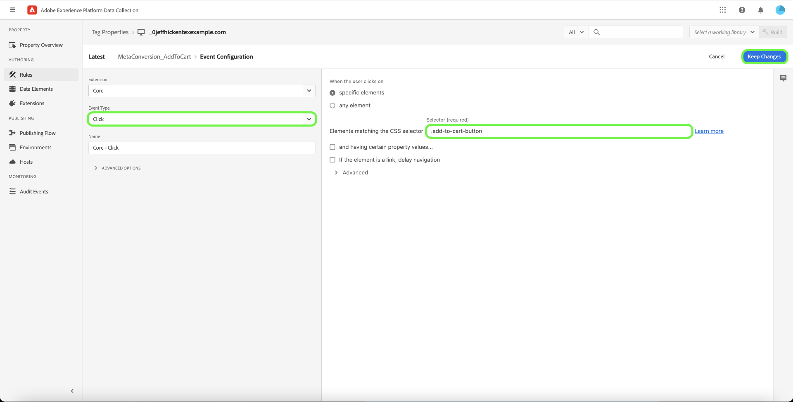

# [!DNL Meta Conversions API] visão geral da extensão

O [[!DNL Meta Conversions API]](https://developers.facebook.com/docs/marketing-api/conversions-api/) permite conectar seus dados de marketing do lado do servidor ao [!DNL Meta] para otimizar o direcionamento de anúncios, diminuir o custo por ação e medir os resultados. Os eventos estão vinculados a um [[!DNL Meta Pixel]](https://developers.facebook.com/docs/meta-pixel/) ID e são processados de maneira semelhante aos eventos do lado do cliente.

Usar o [!DNL Meta Conversions API] , você pode aproveitar os recursos da API em sua [encaminhamento de eventos](../../../ui/event-forwarding/overview.md) regras para enviar dados para [!DNL Meta] da rede de borda Adobe Experience Platform. Este documento aborda como instalar a extensão e usar seus recursos em um encaminhamento de evento [regra](../../../ui/managing-resources/rules.md).

## Pré-requisitos

É altamente recomendável usar [!DNL Meta Pixel] e [!DNL Conversions API] para compartilhar e enviar os mesmos eventos do lado do cliente e do lado do servidor, respectivamente, já que isso pode ajudar a recuperar eventos que não foram coletados por [!DNL Meta Pixel]. Antes de instalar o [!DNL Conversions API] consulte o guia sobre [[!DNL Meta Pixel] extensão](../../client/meta/overview.md) para obter etapas sobre como integrá-lo às implementações de tags do lado do cliente.

>[!NOTE]
>
>A seção sobre [desduplicação de eventos](#deduplication) posteriormente, este documento aborda as etapas para garantir que o mesmo evento não seja usado duas vezes, pois pode ser recebido do navegador e do servidor.

Para usar o [!DNL Conversions API] , você deve ter acesso ao encaminhamento do evento e ter um [!DNL Meta] com acesso a [!DNL Ad Manager] e [!DNL Event Manager]. Especificamente, você deve copiar a ID de um [[!DNL Meta Pixel]](https://www.facebook.com/business/help/952192354843755?id=1205376682832142) ou [criar um novo [!DNL Pixel]](https://www.facebook.com/business/help/952192354843755) em vez disso), para que a extensão possa ser configurada para sua conta.

## Instalar a extensão

Para instalar o [!DNL Meta Conversions API] , navegue até a interface do usuário da coleta de dados ou a interface do usuário do Experience Platform e selecione **[!UICONTROL Encaminhamento de evento]** no painel de navegação esquerdo. Aqui, selecione uma propriedade para adicionar a extensão ou crie uma nova propriedade.

Após selecionar ou criar a propriedade desejada, selecione **[!UICONTROL Extensões]** na navegação à esquerda, selecione o **[!UICONTROL Catálogo]** guia . Procure a variável [!UICONTROL API Meta conversões] cartão e, em seguida, selecione **[!UICONTROL Instalar]**.

![O [!UICONTROL Instalar] botão que está sendo selecionado para o [!UICONTROL API Meta conversões] na interface do usuário da Coleta de dados.](../../../images/extensions/server/meta/install.png)

Na exibição de configuração que aparece, você deve fornecer a variável [!DNL Pixel] ID copiada anteriormente para vincular a extensão à conta. Você pode colar a ID diretamente na entrada ou pode usar um elemento de dados.

Também é necessário fornecer um token de acesso para usar o [!DNL Conversions API] especificamente. Consulte a [!DNL Conversions API] documentação sobre [geração de um token de acesso](https://developers.facebook.com/docs/marketing-api/conversions-api/get-started#access-token) para obter as etapas sobre como obter esse valor.

Quando terminar, selecione **[!UICONTROL Salvar]**

![O [!DNL Pixel] ID fornecida como um elemento de dados na exibição de configuração da extensão.](../../../images/extensions/server/meta/configure.png)

A extensão é instalada e você pode usar seus recursos nas regras de encaminhamento de eventos.

## Configurar uma regra de encaminhamento de eventos {#rule}

Esta seção aborda como usar o [!DNL Conversions API] em uma regra de encaminhamento de eventos genérica. Na prática, você deve configurar várias regras para enviar todos os aceitos [eventos padrão](https://developers.facebook.com/docs/meta-pixel/reference) via [!DNL Meta Pixel] e [!DNL Conversions API].

>[!NOTE]
>
>Os eventos devem ser [enviado em tempo real](https://www.facebook.com/business/help/379226453470947?id=818859032317965) ou o mais próximo possível do tempo real para melhorar a otimização da campanha publicitária.

Comece criando uma nova regra de encaminhamento de eventos e configure suas condições conforme desejado. Ao selecionar as ações para a regra, selecione **[!UICONTROL Extensão da API de Meta Conversões]** para a extensão e selecione **[!UICONTROL Enviar evento da API de conversões]** para o tipo de ação.

![O [!UICONTROL Enviar visualização de página] tipo de ação sendo selecionado para uma regra na interface do usuário da Coleta de dados.](../../../images/extensions/server/meta/select-action.png)

Aparecem controles que permitem configurar os dados do evento que serão enviados para [!DNL Meta] através da [!DNL Conversions API]. Essas opções podem ser inseridas diretamente nas entradas fornecidas ou você pode selecionar elementos de dados existentes para representar os valores. As opções de configuração são divididas em quatro seções principais, conforme descrito abaixo.

| Seção de configuração | Descrição |
| --- | --- |
| [!UICONTROL Parâmetros de evento do servidor] | Informações gerais sobre o evento, incluindo a hora em que ele ocorreu e a ação de origem que o acionou. Consulte a [!DNL Meta] documentação do desenvolvedor para obter mais informações sobre o [parâmetros de evento padrão](https://developers.facebook.com/docs/marketing-api/conversions-api/parameters/server-event) aceite pela [!DNL Conversions API].  Se estiver usando ambos [!DNL Meta Pixel] e [!DNL Conversions API] para enviar eventos, inclua um **[!UICONTROL Nome do evento]** (`event_name`) e **[!UICONTROL ID do evento]** (`event_id`) com cada evento, já que esses valores são usados para [desduplicação de eventos](#deduplication).  Você também tem a opção de **[!UICONTROL Habilitar uso limitado de dados]** para ajudar a estar em conformidade com as opções de não participação do cliente. Consulte a [!DNL Conversions API] documentação sobre [opções de processamento de dados](https://developers.facebook.com/docs/marketing-apis/data-processing-options/) para obter detalhes sobre este recurso. |
| [!UICONTROL Parâmetros de informações do cliente] | Dados de identidade do usuário usados para atribuir o evento a um cliente. Alguns desses valores devem ter hash antes de serem enviados à API.  Para garantir uma boa conexão de API comum e alta qualidade de correspondência de eventos (EMQ), é recomendável enviar tudo [parâmetros de informações do cliente aceitos](https://developers.facebook.com/docs/marketing-api/conversions-api/parameters/customer-information-parameters) junto com eventos do servidor. Esses parâmetros também devem ser [priorizada com base na importância e impacto no EMQ](https://www.facebook.com/business/help/765081237991954?id=818859032317965). |
| [!UICONTROL Dados personalizados] | Dados adicionais a serem usados para otimização de entrega de anúncios, fornecidos no formato de um objeto JSON. Consulte a [[!DNL Conversions API] documentação](https://developers.facebook.com/docs/marketing-api/conversions-api/parameters/custom-data) para obter mais informações sobre as propriedades aceitas para este objeto.  Se estiver enviando um evento de compra, você deve usar esta seção para fornecer os atributos necessários `currency` e `value`. |
| [!UICONTROL Evento de teste] | Essa opção é usada para verificar se a configuração está fazendo com que os eventos do servidor sejam recebidos por [!DNL Meta] conforme esperado. Para usar esse recurso, selecione o **[!UICONTROL Enviar como evento de teste]** e forneça um código de evento de teste de sua escolha na entrada abaixo. Depois que a regra de encaminhamento de eventos é implantada, se você configurou a extensão e a ação corretamente, é necessário ver as atividades que aparecem no **[!DNL Test Events]** exibir em [!DNL Meta Events Manager]. |

{style="table-layout:auto"}

Quando terminar, selecione **[!UICONTROL Manter alterações]** para adicionar a ação à configuração da regra.

![[!UICONTROL Manter alterações] sendo selecionado para a configuração da ação.](../../../images/extensions/server/meta/keep-changes.png)

Quando estiver satisfeito com a regra, selecione **[!UICONTROL Salvar na biblioteca]**. Finalmente, publique um novo encaminhamento de evento [build](../../../ui/publishing/builds.md) para ativar as alterações feitas na biblioteca.

## Desduplicação de eventos {#deduplication}

Como mencionado no [seção pré-requisitos](#prerequisites), recomenda-se usar a variável [!DNL Meta Pixel] da extensão da tag e da [!DNL Conversions API] extensão de encaminhamento de evento para enviar os mesmos eventos do cliente e do servidor em uma configuração redundante. Isso pode ajudar a recuperar eventos que não foram coletados por uma extensão ou outra.

Se você estiver enviando tipos de evento diferentes do cliente e do servidor sem sobreposição entre os dois, a desduplicação não será necessária. No entanto, se um único evento for compartilhado por ambos [!DNL Meta Pixel] e [!DNL Conversions API], é necessário garantir que esses eventos redundantes sejam desduplicados para que seus relatórios não sejam afetados negativamente.

Ao enviar eventos compartilhados, verifique se você está incluindo uma ID de evento e um nome com cada evento enviado do cliente e do servidor. Quando vários eventos com a mesma ID e o mesmo nome são recebidos, [!DNL Meta] O emprega automaticamente várias estratégias para desduplicá-las e manter os dados mais relevantes. Consulte a [!DNL Meta] documentação sobre [desduplicação para [!DNL Meta Pixel] e [!DNL Conversions API] events](https://www.facebook.com/business/help/823677331451951?id=1205376682832142) para obter detalhes sobre esse processo.

## Fluxo de trabalho de início rápido: Extensão da API de Meta Conversões (Beta) {#quick-start}

>[!IMPORTANT]
>
>* O recurso de início rápido está disponível para clientes que compraram o pacote Real-Time CDP Prime e Ultimate. Entre em contato com o representante da Adobe para obter mais informações.
>* Esse recurso é para novas implementações da rede e não oferece suporte à instalação automática de extensões e configurações em tags existentes e propriedades de encaminhamento de eventos.

O recurso de início rápido ajuda você a se configurar com facilidade e eficiência com a API Meta Conversions e as extensões Meta Pixel. Essa ferramenta automatiza várias etapas que são executadas em tags Adobe e encaminhamento de eventos, reduzindo significativamente o tempo de configuração.

Esse recurso instala e configura automaticamente a API Meta Conversões e as extensões Meta Pixel em uma nova propriedade de tags geradas automaticamente e de encaminhamento de eventos com as regras e elementos de dados necessários. Além disso, também instala e configura automaticamente o SDK da Web do Experience Platform e o Datastream. Por fim, o recurso de início rápido publica automaticamente a biblioteca no URL designado em um ambiente de desenvolvimento, o que permite a coleta de dados do lado do cliente e o encaminhamento de eventos do lado do servidor em tempo real por meio do Encaminhamento de eventos e do Experience Edge.

O vídeo a seguir fornece uma introdução ao recurso de início rápido.

>[!VIDEO](https://publish.tv.adobe.com/bucket/1/category/5138/video/3416939/)

### Instalar recurso de início rápido

>[!NOTE]
>
>Esse recurso foi projetado para ajudar você a começar a usar a implementação de encaminhamento de eventos. Ele não fornecerá uma implementação completa e totalmente funcional que acomode todos os casos de uso.

Essa configuração instala automaticamente a API Meta Conversions e as extensões Meta Pixel . Essa implementação híbrida é recomendada pelo Meta para coletar e encaminhar conversões de eventos no lado do servidor.
O recurso de configuração rápida foi projetado para ajudar os clientes a começar a usar uma implementação de encaminhamento de eventos e não tem o objetivo de fornecer uma implementação completa e totalmente funcional que acomoda todos os casos de uso.

Para instalar o recurso, selecione **[!UICONTROL Introdução]** para **[!DNL Send Conversions Data to Meta]** sobre a coleta de dados da Adobe Experience Platform **[!UICONTROL Início]** página.

Insira seu **[!UICONTROL Domínio]**, em seguida selecione **[!UICONTROL Próximo]**. Esse domínio será usado como uma convenção de nomenclatura para suas propriedades de Tags geradas automaticamente e Encaminhamento de eventos, regras, elementos de dados, conjuntos de dados e assim por diante.

No **[!UICONTROL Configuração inicial]** entre em sua **[!UICONTROL ID Meta Pixel]**, **[!UICONTROL Token de acesso da API de conversão Meta]** e **[!UICONTROL Caminho da camada de dados]**, em seguida selecione **[!UICONTROL Próximo]**.

Aguarde alguns minutos para que o processo de configuração inicial seja concluído e selecione **[!UICONTROL Próximo]**.

No **[!UICONTROL Adicionar código em seu site]** copiar o código fornecido usando a cópia  e cole isso no `<head>` do site de origem. Depois de implementado, selecione **[!UICONTROL Iniciar Validação]**

O [!UICONTROL Resultados da validação] exibe os resultados da implementação da extensão Meta. Selecione **[!UICONTROL Próximo]**. Você também pode ver resultados de validação adicionais selecionando o **[!UICONTROL Controle]** link .

O **[!UICONTROL Próximas etapas]** a exibição da tela confirma a conclusão da configuração. Aqui, você tem a opção de otimizar sua implementação adicionando novos eventos, que são mostrados na próxima seção.

Se não quiser adicionar eventos adicionais, selecione **[!UICONTROL Fechar]**.

#### Adicionar eventos adicionais

Para adicionar novos eventos, selecione **[!UICONTROL Editar sua propriedade da Web de tags]**.

Selecione a regra que corresponde ao meta evento que você deseja editar. Por exemplo, **MetaConversion_AddToCart**.

>[!NOTE]
>
>Se não houver evento, essa regra não será executada. Isso é verdade para todas as regras, com a variável **MetaConversion_PageView** regra sendo a exceção.

Para adicionar um evento selecione **[!UICONTROL Adicionar]** nos termos do [!UICONTROL Eventos] cabeçalho.

Selecione o [!UICONTROL Tipo de evento]. Neste exemplo, selecionamos a variável [!UICONTROL Clique em] e o configurou para disparar quando a função **.add-to-cart-button** está selecionada. Selecione **[!UICONTROL Manter alterações]**.

O novo evento foi salvo. Selecionar **[!UICONTROL Selecionar uma biblioteca de trabalho]** e selecione a biblioteca que deseja criar.

Em seguida, selecione a lista suspensa ao lado de **[!UICONTROL Salvar na biblioteca]** e selecione **[!UICONTROL Salvar na biblioteca e criar]**. Isso publicará a alteração na biblioteca.

Repita essas etapas para qualquer outro evento de meta conversão que desejar configurar.

#### Configuração da camada de dados

>[!IMPORTANT]
>
>A maneira de atualizar essa camada de dados global depende da arquitetura do site. Um aplicativo de página única será diferente de um aplicativo de renderização do lado do servidor. Há também a possibilidade de que você seja totalmente responsável pela criação e atualização desses dados dentro do produto Tags. Em todas as instâncias, a camada de dados precisará ser atualizada no entre a execução de cada uma das `MetaConversion_* rules`. Se você não atualizar os dados entre as regras, também poderá se deparar com um caso em que está enviando dados obsoletos a partir da última `MetaConversion_* rule` no atual `MetaConversion_* rule`.

Durante a configuração, você foi perguntado onde a camada de dados está. Por padrão, isso seria `window.dataLayer.meta`e dentro do `meta` , seus dados seriam esperados como mostrado abaixo.

Isso é importante para entender como todo `MetaConversion_*` A regra usa essa estrutura de dados para transmitir os dados relevantes para a variável [!DNL Meta Pixel] e à [!DNL Meta Conversions API]. Consulte a documentação em [eventos padrão](https://developers.facebook.com/docs/meta-pixel/reference#standard-events) para obter mais informações sobre quais dados são exigidos pelos diferentes metadados.

Por exemplo, se você deseja usar a variável `MetaConversion_Subscribe` , seria necessário atualizar `window.dataLayer.meta.currency`, `window.dataLayer.meta.predicted_ltv`e `window.dataLayer.meta.value` conforme as propriedades do objeto descritas na documentação em [eventos padrão](https://developers.facebook.com/docs/meta-pixel/reference#standard-events).

Abaixo está um exemplo do que precisaria ser executado em um site para atualizar a camada de dados antes da execução da regra.

Por padrão, a variável `<datalayerpath>.conversionData.eventId` será gerada aleatoriamente pela ação &quot;Gerar nova ID de evento&quot; em qualquer uma das `MetaConversion_* rules`.

Para obter uma referência local de como a camada de dados deve ser exibida, abra o editor de código personalizado na `MetaConversion_DataLayer` elemento de dados na propriedade.

## Próximas etapas

Este guia cobriu como enviar dados de evento do lado do servidor para o [!DNL Meta] usando o [!DNL Meta Conversions API] extensão. A partir daqui, é recomendável expandir sua integração conectando mais [!DNL Pixels] e compartilhar mais eventos, quando aplicável. Fazer qualquer um dos seguintes procedimentos pode ajudar a melhorar ainda mais o desempenho de sua publicidade:

* Conectar qualquer outro [!DNL Pixels] que ainda não estejam conectadas a um [!DNL Conversions API] integração.
* Se você enviar determinados eventos exclusivamente por [!DNL Meta Pixel] no lado do cliente, envie esses mesmos eventos para o [!DNL Conversions API] do lado do servidor também.

Consulte a [!DNL Meta] documentação sobre [práticas recomendadas para [!DNL Conversions API]](https://www.facebook.com/business/help/308855623839366?id=818859032317965) para obter mais orientações sobre como implementar com eficácia sua integração. Para obter informações mais gerais sobre tags e encaminhamento de eventos no Adobe Experience Cloud, consulte [visão geral das tags](../../../home.md).
