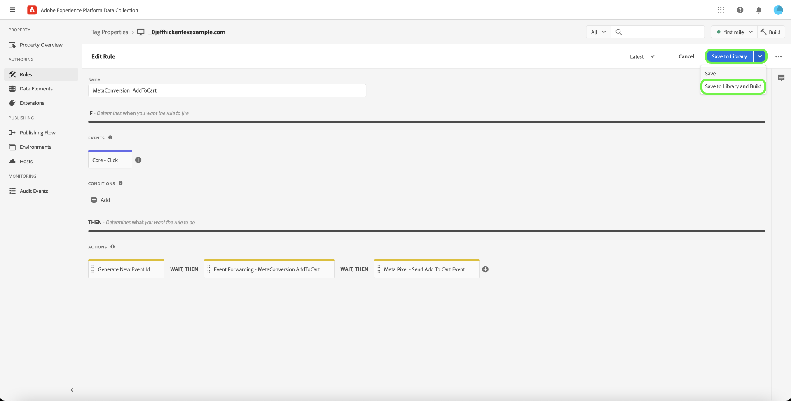

# [!DNL Meta Conversions API] visão geral da extensão

A variável [[!DNL Meta Conversions API]](https://developers.facebook.com/docs/marketing-api/conversions-api/) permite conectar seus dados de marketing do lado do servidor ao [!DNL Meta] para otimizar o direcionamento de seus anúncios, reduzir o custo por ação e medir os resultados. Os eventos estão vinculados a um [[!DNL Meta Pixel]](https://developers.facebook.com/docs/meta-pixel/) e são processados de maneira semelhante aos eventos do lado do cliente.

Usar o [!DNL Meta Conversions API] você pode aproveitar os recursos da API em sua [encaminhamento de eventos](../../../ui/event-forwarding/overview.md) regras para enviar dados para [!DNL Meta] da Rede de borda da Adobe Experience Platform. Este documento aborda como instalar a extensão e usar seus recursos em um encaminhamento de eventos [regra](../../../ui/managing-resources/rules.md).

## Pré-requisitos

É altamente recomendável usar [!DNL Meta Pixel] e a variável [!DNL Conversions API] para compartilhar e enviar os mesmos eventos do lado do cliente e do lado do servidor, respectivamente, pois isso pode ajudar a recuperar eventos que não foram coletados pelo [!DNL Meta Pixel]. Antes de instalar o [!DNL Conversions API] consulte o guia na seção [[!DNL Meta Pixel] extensão](../../client/meta/overview.md) para obter etapas sobre como integrá-la às implementações de tags do lado do cliente.

>[!NOTE]
>
>A seção sobre [desduplicação de eventos](#deduplication) mais adiante neste documento aborda as etapas para garantir que o mesmo evento não seja usado duas vezes, pois pode ser recebido tanto do navegador quanto do servidor.

Para utilizar a variável [!DNL Conversions API] extensão, você deve ter acesso ao encaminhamento de eventos e ter uma [!DNL Meta] conta com acesso a [!DNL Ad Manager] e [!DNL Event Manager]. Você deve copiar a ID de uma ID existente [[!DNL Meta Pixel]](https://www.facebook.com/business/help/952192354843755?id=1205376682832142) (ou [criar um novo [!DNL Pixel]](https://www.facebook.com/business/help/952192354843755) em vez disso), para que a extensão possa ser configurada para sua conta.

>[!INFO]
>
>Se você estiver planejando usar essa extensão com dados do aplicativo móvel ou se também trabalhar com dados do evento offline em seu [!DNL Meta] você precisará criar seu conjunto de dados por meio de um aplicativo existente e selecionar **Criar a partir de uma ID de pixel** quando solicitado. Consulte o artigo [Decida qual opção de criação de conjunto de dados é adequada para sua empresa](https://www.facebook.com/business/help/5270377362999582?id=490360542427371) para obter detalhes. Consulte a [API de conversões para eventos de aplicativo](https://developers.facebook.com/docs/marketing-api/conversions-api/app-events) para todos os parâmetros de rastreamento de aplicativo obrigatórios e opcionais.

## Instalar a extensão

Para instalar o [!DNL Meta Conversions API] , navegue até a interface da Coleção de dados ou a interface do Experience Platform e selecione **[!UICONTROL Encaminhamento de evento]** no painel de navegação esquerdo. Aqui, selecione uma propriedade à qual adicionar a extensão ou crie uma nova propriedade.

Depois de selecionar ou criar a propriedade desejada, selecione **[!UICONTROL Extensões]** na navegação à esquerda, selecione o **[!UICONTROL Catálogo]** guia. Procure por [!UICONTROL API de meta conversões] e selecione **[!UICONTROL Instalar]**.

![A variável [!UICONTROL Instalar] opção selecionada para a variável [!UICONTROL API de meta conversões] na interface da Coleção de dados.](../../../images/extensions/server/meta/install.png)

Na visualização de configuração exibida, você deve fornecer a [!DNL Pixel] ID que você copiou anteriormente para vincular a extensão à sua conta. Você pode colar a ID diretamente na entrada ou usar um elemento de dados.

Também é necessário fornecer um token de acesso para usar o [!DNL Conversions API] especificamente. Consulte a [!DNL Conversions API] documentação sobre [geração de um token de acesso](https://developers.facebook.com/docs/marketing-api/conversions-api/get-started#access-token) para obter etapas sobre como obter esse valor.

Quando terminar, selecione **[!UICONTROL Salvar]**

![A variável [!DNL Pixel] A ID fornecida como um elemento de dados na visualização de configuração de extensão.](../../../images/extensions/server/meta/configure.png)

A extensão é instalada e agora você pode empregar seus recursos nas regras de encaminhamento de eventos.

## Integração com o Meta Business Extension (MBE) {#mbe}

A integração com o aprimoramento Meta Business Extensions (MBE) permite a autenticação rápida em sua conta Meta Business. Em seguida, preenche automaticamente o [!UICONTROL ID de pixel] e a API de meta conversões [!UICONTROL Token de acesso], facilitando a instalação e a configuração da API de metaconversões.

Um prompt da caixa de diálogo para autenticar no MBE é exibido ao instalar o [!UICONTROL API de meta conversões] extensão.

![A variável [!UICONTROL Extensão da API de meta conversões] realce da página de instalação [!UICONTROL Conectar ao Meta].](../../../images/extensions/server/meta/mbe-extension-install.png)

Um prompt da caixa de diálogo para autenticar no MBE também aparece na interface do fluxo de trabalho de início rápido no encaminhamento de eventos.

![Destaque da interface de fluxo de trabalho de início rápido [!UICONTROL Conectar ao Meta].](../../../images/extensions/server/meta/mbe-extension-quick-start.png)

## Integração com a Pontuação de correspondência de qualidade do evento (EMQ) {#emq}

A integração com a Pontuação de correspondência de qualidade do evento (EMQ) permite visualizar facilmente a eficácia da implementação ao mostrar pontuações da EMQ. Essa integração minimiza a alternância de contexto e ajuda a melhorar o sucesso das implementações da API de Meta Conversões. Essas pontuações de evento aparecem na variável [!UICONTROL Extensão da API de meta conversões] tela de configuração.

![A variável [!UICONTROL Extensão da API de meta conversões] realce da página de configuração [!UICONTROL Exibir pontuação EMQ].](../../../images/extensions/server/meta/emq-score.png)

## Integração com o LiveRamp (Alpha) {#alpha}

[!DNL LiveRamp] clientes que têm [!DNL LiveRamp]A Authenticated Traffic Solution (ATS) do implantada em seus sites pode optar por compartilhar RampIDs como um parâmetro de informações do cliente. Trabalhe com o seu [!DNL Meta] equipe de conta para participar do programa Alpha para este recurso.

![O encaminhamento de metadados [!UICONTROL Regra] realce da página de configuração [!UICONTROL Nome do parceiro (alfa)] e [!UICONTROL ID do parceiro (alfa)].](../../../images/extensions/server/meta/live-ramp.png)

## Configurar uma regra de encaminhamento de eventos {#rule}

Esta seção aborda como usar o [!DNL Conversions API] em uma regra de encaminhamento de eventos genérica. Na prática, você deve configurar várias regras para enviar todas as mensagens aceitas [eventos padrão](https://developers.facebook.com/docs/meta-pixel/reference) via [!DNL Meta Pixel] e [!DNL Conversions API]. Para dados de aplicativos móveis, consulte os campos obrigatórios, os campos de dados de aplicativos, os parâmetros de informações do cliente e os detalhes de dados personalizados [aqui](https://developers.facebook.com/docs/marketing-api/conversions-api/app-events).

>[!NOTE]
>
>Os eventos devem ser [enviado em tempo real](https://www.facebook.com/business/help/379226453470947?id=818859032317965) ou o mais próximo possível do tempo real para uma melhor otimização da campanha publicitária.

Comece a criar uma nova regra de encaminhamento de eventos e configure as condições conforme desejado. Ao selecionar as ações para a regra, selecione **[!UICONTROL Extensão da API de meta conversões]** para a extensão e selecione **[!UICONTROL Enviar evento de API de conversões]** para o tipo de ação.

![A variável [!UICONTROL Enviar Exibição de Página] tipo de ação que está sendo selecionado para uma regra na interface da Coleção de dados.](../../../images/extensions/server/meta/select-action.png)

São exibidos controles que permitem configurar os dados do evento que serão enviados para [!DNL Meta] por meio da [!DNL Conversions API]. Essas opções podem ser inseridas diretamente nas entradas fornecidas ou você pode selecionar elementos de dados existentes para representar os valores. As opções de configuração são divididas em quatro seções principais, conforme descrito abaixo.

| Seção de configuração | Descrição |
| --- | --- |
| [!UICONTROL Parâmetros de evento do servidor] | Informações gerais sobre o evento, incluindo o momento em que ocorreu e a ação de origem que o acionou. Consulte a [!DNL Meta] para obter mais informações sobre o [parâmetros de evento padrão](https://developers.facebook.com/docs/marketing-api/conversions-api/parameters/server-event) aceito pelo [!DNL Conversions API].  Se você estiver usando ambos [!DNL Meta Pixel] e a variável [!DNL Conversions API] para enviar eventos, inclua um **[!UICONTROL Nome do evento]** (`event_name`) e **[!UICONTROL ID de evento]** (`event_id`) com cada evento, já que esses valores são usados para [desduplicação de eventos](#deduplication).  Você também tem a opção de **[!UICONTROL Habilitar Uso Limitado De Dados]** para ajudar a estar em conformidade com as opções de não participação do cliente. Consulte a [!DNL Conversions API] documentação sobre [opções de processamento de dados](https://developers.facebook.com/docs/marketing-apis/data-processing-options/) para obter detalhes sobre esse recurso. |
| [!UICONTROL Parâmetros de Informações do Cliente] | Dados de identidade do usuário usados para atribuir o evento a um cliente. Alguns desses valores devem ser transformados em hash antes de serem enviados para a API.  Para garantir uma boa conexão de API comum e alta qualidade de correspondência de evento (EMQ), é recomendável enviar todos [parâmetros de informações de clientes aceitos](https://developers.facebook.com/docs/marketing-api/conversions-api/parameters/customer-information-parameters) juntamente com eventos do servidor. Estes parâmetros devem também ser [priorizados com base em sua importância e impacto na EMQ](https://www.facebook.com/business/help/765081237991954?id=818859032317965). |
| [!UICONTROL Dados personalizados] | Dados adicionais a serem usados para otimização de entrega de anúncios, fornecidos no formato de um objeto JSON. Consulte a [[!DNL Conversions API] documentação](https://developers.facebook.com/docs/marketing-api/conversions-api/parameters/custom-data) para obter mais informações sobre as propriedades aceitas para este objeto.  Se estiver enviando um evento de compra, você deve usar esta seção para fornecer os atributos necessários `currency` e `value`. |
| [!UICONTROL Evento de teste] | Esta opção é usada para verificar se sua configuração está fazendo com que os eventos do servidor sejam recebidos por [!DNL Meta] conforme esperado. Para usar esse recurso, selecione a variável **[!UICONTROL Enviar como evento de teste]** e forneça um código de evento de teste de sua escolha na entrada abaixo. Depois que a regra de encaminhamento de eventos for implantada, se você tiver configurado a extensão e a ação corretamente, verá as atividades que aparecem na **[!DNL Test Events]** exibir em [!DNL Meta Events Manager]. |

{style="table-layout:auto"}

Quando terminar, selecione **[!UICONTROL Manter alterações]** para adicionar a ação à configuração de regra.

![[!UICONTROL Manter alterações] selecionada para a configuração da ação.](../../../images/extensions/server/meta/keep-changes.png)

Quando estiver satisfeito com a regra, selecione **[!UICONTROL Salvar na biblioteca]**. Por fim, publique um novo encaminhamento de eventos [build](../../../ui/publishing/builds.md) para ativar as alterações feitas na biblioteca.

## Desduplicação de eventos {#deduplication}

Tal como mencionado no [seção de pré-requisitos](#prerequisites), é recomendável usar as opções [!DNL Meta Pixel] extensão de tag e o [!DNL Conversions API] extensão de encaminhamento de eventos para enviar os mesmos eventos do cliente e do servidor em uma configuração redundante. Isso pode ajudar a recuperar eventos que não foram coletados por uma extensão ou outra.

Se você estiver enviando tipos de evento diferentes do cliente e do servidor sem sobreposição entre os dois, a desduplicação não será necessária. No entanto, se algum evento for compartilhado por ambos [!DNL Meta Pixel] e a variável [!DNL Conversions API], você deve garantir que esses eventos redundantes sejam desduplicados para que seus relatórios não sejam afetados negativamente.

Ao enviar eventos compartilhados, verifique se você está incluindo uma ID e um nome de evento em cada evento enviado do cliente e do servidor. Quando vários eventos com a mesma ID e o mesmo nome forem recebidos, [!DNL Meta] O emprega automaticamente várias estratégias para desduplicá-las e manter os dados mais relevantes. Consulte a [!DNL Meta] documentação sobre [desduplicação para [!DNL Meta Pixel] e [!DNL Conversions API] events](https://www.facebook.com/business/help/823677331451951?id=1205376682832142) para obter detalhes sobre esse processo.

## Fluxo de trabalho de início rápido: Extensão da API de meta conversões (Beta) {#quick-start}

>[!IMPORTANT]
>
>* O recurso de início rápido está disponível para clientes que compraram o pacote Real-Time CDP Prime e Ultimate. Entre em contato com o representante da Adobe para obter mais informações.
>* Esse recurso é para novas implementações e atualmente não é compatível com a instalação automática de extensões e configurações em tags existentes e propriedades de encaminhamento de eventos.

>[!NOTE]
>
>Qualquer cliente existente pode usar os workflows de início rápido para criar uma implementação de referência que pode ser usada para o seguinte:
>* Use-a como o início de uma implementação totalmente nova.
>* Aproveite-a como uma implementação de referência que pode ser examinada para ver como ela foi configurada e replicar em suas implementações de produção atuais.

O recurso de início rápido ajuda a configurar com facilidade e eficiência a API de Meta Conversões e as extensões Meta Pixel. Essa ferramenta automatiza várias etapas executadas em tags de Adobe e no encaminhamento de eventos, reduzindo significativamente o tempo de configuração.

Esse recurso instala e configura automaticamente a API de metaconversões e as extensões de metapixels em uma propriedade de tags recém-gerada automaticamente e encaminhamento de eventos com as regras e os elementos de dados necessários. Além disso, ele também instala e configura automaticamente o SDK da Web do Experience Platform e o Datastream. Por fim, o recurso de início rápido publica automaticamente a biblioteca no URL designado em um ambiente de desenvolvimento, o que permite a coleta de dados do lado do cliente e o encaminhamento de eventos do lado do servidor em tempo real por meio do encaminhamento de eventos e da Rede de borda do Experience Platform.

O vídeo a seguir fornece uma introdução ao recurso de início rápido.

>[!VIDEO](https://video.tv.adobe.com/v/3416939?quality=12&learn=on)

### Instalar o recurso de início rápido

>[!NOTE]
>
>Esse recurso foi projetado para ajudar você a começar a implementar o encaminhamento de eventos. Ele não fornecerá uma implementação completa e totalmente funcional que acomode todos os casos de uso.

Esta configuração instala automaticamente as extensões Meta Conversions API e Meta Pixel. Essa implementação híbrida é recomendada pelo Meta para coletar e encaminhar conversões de eventos no lado do servidor.
O recurso de configuração rápida foi projetado para ajudar os clientes a começar a usar uma implementação de encaminhamento de eventos, e não tem como objetivo fornecer uma implementação completa e totalmente funcional que acomode todos os casos de uso.

Para instalar o recurso, selecione **[!UICONTROL Introdução]** para **[!DNL Send Conversions Data to Meta]** sobre a coleta de dados do Adobe Experience Platform **[!UICONTROL Início]** página.

Insira seu **[!UICONTROL Domínio]** e selecione **[!UICONTROL Próxima]**. Esse domínio será usado como uma convenção de nomenclatura para suas propriedades geradas automaticamente de Tags e Encaminhamento de eventos, regras, elementos de dados, sequências de dados e assim por diante.

No **[!UICONTROL Configuração inicial]** insira seu **[!UICONTROL ID de Meta Pixel]**, **[!UICONTROL Token de acesso da API de metaconversão]**, e **[!UICONTROL Caminho da camada de dados]** e selecione **[!UICONTROL Próxima]**.

Aguarde alguns minutos para que o processo de configuração inicial seja concluído e selecione **[!UICONTROL Próxima]**.

No **[!UICONTROL Adicionar código ao seu site]** caixa de diálogo copiar o código fornecido usando a cópia  e cole isso na `<head>` do site de origem. Depois de implementado, selecione **[!UICONTROL Iniciar validação]**

A variável [!UICONTROL Resultados da validação] A caixa de diálogo exibe os resultados de implementação da extensão Meta. Selecionar **[!UICONTROL Próxima]**. Você também pode ver resultados adicionais da validação selecionando o **[!UICONTROL Assurance]** link.

A variável **[!UICONTROL Próximas etapas]** A exibição da tela confirma a conclusão da configuração. Aqui, você tem a opção de otimizar sua implementação adicionando novos eventos, que são mostrados na próxima seção.

Se não quiser adicionar mais eventos, selecione **[!UICONTROL Fechar]**.

#### Adição de eventos adicionais

Para adicionar novos eventos, selecione **[!UICONTROL Editar a propriedade das tags na Web]**.

Selecione a regra que corresponde ao metaevento que você deseja editar. Por exemplo, **MetaConversion_AddToCart**.

>[!NOTE]
>
>Se não houver nenhum evento, essa regra não será executada. Isso é verdadeiro para todas as regras, com a variável **MetaConversion_PageView** regra sendo a exceção.

Para adicionar um evento, selecione **[!UICONTROL Adicionar]** no [!UICONTROL Eventos] cabeçalho.

Selecione o [!UICONTROL Tipo de evento]. Neste exemplo, selecionamos a variável [!UICONTROL Clique em] evento e o configurou para ser acionado quando a variável **.add-to-cart-button** está selecionada. Selecione **[!UICONTROL Manter alterações]**.

O novo evento foi salvo. Selecionar **[!UICONTROL Selecionar uma biblioteca de trabalho]** e selecione a biblioteca que deseja criar.

Em seguida, selecione a lista suspensa ao lado de **[!UICONTROL Salvar na biblioteca]** e selecione **[!UICONTROL Salvar na biblioteca e criar]**. Isso publicará a alteração na biblioteca.

Repita essas etapas para qualquer outro evento de meta conversão que deseje configurar.

#### Configuração da camada de dados {#configuration}

>[!IMPORTANT]
>
>A maneira como você atualiza essa camada de dados global depende da arquitetura do site. Um aplicativo de página única será diferente de um aplicativo de renderização do lado do servidor. Também há a possibilidade de que você seja totalmente responsável pela criação e atualização desses dados dentro do produto de Tags. Em todas as instâncias, a camada de dados precisará ser atualizada entre a execução de cada um dos `MetaConversion_* rules`. Se você não atualizar os dados entre as regras, também poderá se deparar com um caso em que esteja enviando dados obsoletos dos últimos `MetaConversion_* rule` no atual `MetaConversion_* rule`.

Durante a configuração, você foi perguntado onde está a camada de dados. Por padrão, seria `window.dataLayer.meta`e dentro do `meta` objeto, seus dados seriam esperados, conforme mostrado abaixo.

Isso é importante para entender como cada `MetaConversion_*` regra usa essa estrutura de dados para transmitir os dados relevantes para a [!DNL Meta Pixel] extensão e para o [!DNL Meta Conversions API]. Consulte a documentação em [eventos padrão](https://developers.facebook.com/docs/meta-pixel/reference#standard-events) para obter mais informações sobre quais dados os diferentes metaeventos exigem.

Por exemplo, se você deseja usar a variável `MetaConversion_Subscribe` regra, seria necessário atualizar `window.dataLayer.meta.currency`, `window.dataLayer.meta.predicted_ltv`, e `window.dataLayer.meta.value` de acordo com as propriedades do objeto descritas na documentação sobre [eventos padrão](https://developers.facebook.com/docs/meta-pixel/reference#standard-events).

Veja abaixo um exemplo do que precisaria ser executado em um site para atualizar a camada de dados antes da execução da regra.

Por padrão, a variável `<datalayerpath>.conversionData.eventId` serão gerados aleatoriamente pela ação &quot;Gerar nova ID de evento&quot; em qualquer uma das `MetaConversion_* rules`.

Para obter uma referência local de como a camada de dados deve ser exibida, você pode abrir o editor de código personalizado no `MetaConversion_DataLayer` elemento de dados na propriedade.

## Próximas etapas

Este guia abordou como enviar dados do evento do lado do servidor para o [!DNL Meta] usando o [!DNL Meta Conversions API] extensão. A partir daqui, é recomendável expandir sua integração conectando mais [!DNL Pixels] e compartilhamento de mais eventos, quando aplicável. Siga qualquer um dos procedimentos a seguir para melhorar ainda mais o desempenho dos seus anúncios:

* Conectar qualquer outro [!DNL Pixels] que ainda não estão conectados a um [!DNL Conversions API] integração.
* Se você estiver enviando determinados eventos exclusivamente por meio do [!DNL Meta Pixel] no lado do cliente, envie esses mesmos eventos para o [!DNL Conversions API] do lado do servidor também.

Consulte a [!DNL Meta] documentação sobre [práticas recomendadas para o [!DNL Conversions API]](https://www.facebook.com/business/help/308855623839366?id=818859032317965) para obter mais orientações sobre como implementar efetivamente sua integração. Para obter mais informações sobre tags e encaminhamento de eventos no Adobe Experience Cloud, consulte o [visão geral das tags](../../../home.md).
