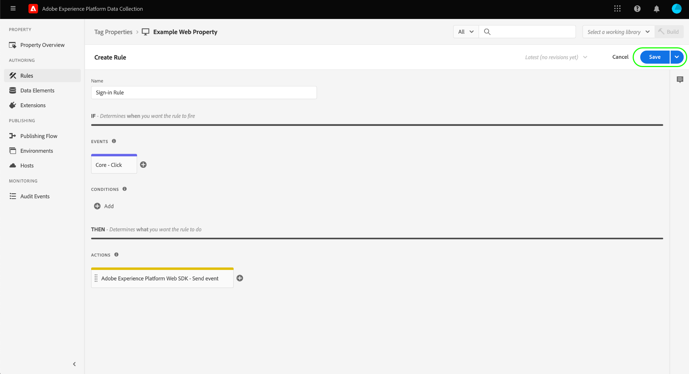

# [!DNL Mixpanel Track Events] Extensão de encaminhamento de eventos de API

[[!DNL Mixpanel]](https://www.mixpanel.com) O é uma ferramenta de análise de produto que permite capturar dados sobre como os usuários interagem com um produto digital. Você pode analisar dados de produtos com relatórios simples e interativos que permitem consultar e visualizar os dados com apenas alguns cliques. [!DNL Mixpanel] criado para tornar as equipes mais eficientes, permitindo que todos analisem os dados do usuário em tempo real para identificar tendências, entender o comportamento do usuário e tomar decisões sobre seu produto.

[!DNL Mixpanel] O emprega um modelo baseado em eventos e centrado no usuário que conecta cada interação a um único usuário. O [!DNL Mixpanel] o modelo de dados é criado com base nos conceitos dos usuários, eventos e propriedades.

>[!NOTE]
>
>Consulte a [!DNL Mixpanel] documentação sobre [gerenciamento de identidade](https://help.mixpanel.com/hc/en-us/articles/360041039771-Getting-Started-with-Identity-Management) para entender como [!DNL Mixpanel] mescla eventos para criar clusters de identidade. Também é recomendável que você revise o documento em [IDs distintas](https://help.mixpanel.com/hc/en-us/articles/115004509426-Distinct-ID-Creation-JavaScript-iOS-Android-) para entender como eles são usados para identificar usuários nos dados do evento.

O [!DNL Mixpanel Track Events] A extensão da API permite aproveitar os dois [encaminhamento de eventos](../../../ui/event-forwarding/overview.md) e [tags](../../../home.md) para capturar informações do evento na rede de borda do Adobe Experience Platform e enviá-las para [!DNL Mixpanel] usando o [[!DNL Track Events] API](https://developer.mixpanel.com/reference/track-event). Este documento aborda os casos de uso da extensão, como instalá-la e como integrar seus recursos ao encaminhamento do evento [regras](../../../ui/managing-resources/rules.md).

## Casos de uso

Essa extensão deve ser usada se você quiser usar dados da Edge Network em [!DNL Mixpanel] para aproveitar seus recursos de análise do produto.

Por exemplo, considere uma organização de varejo que tem uma presença de multicanal (site e dispositivo móvel). A organização captura entrada transacional ou conversacional como dados de evento de suas plataformas e a carrega em [!DNL Mixpanel] usando a extensão de encaminhamento de eventos.

As equipes de análise podem aproveitar [!DNL Mixpanel's] recursos para processar os conjuntos de dados e obter insights de negócios, que podem ser usados para gerar gráficos, painéis ou outras visualizações para informar às partes interessadas da empresa.

Para obter mais informações sobre casos de uso específicos de [!DNL Mixpanel], consulte a seguinte documentação:

* [Novo em [!DNL Mixpanel]](https://help.mixpanel.com/hc/en-us/sections/360008533532-New-to-Mixpanel)
* [O que é [!DNL Mixpanel]?](https://developer.mixpanel.com/docs)
* [12 obrigatoriamente [!DNL Mixpanel] recursos](https://mixpanel.com/blog/12-things-you-probably-didnt-know-you-could-do-with-mixpanel/)

## [!DNL Mixpanel] pré-requisitos {#prerequisites-mixpanel}

Você deve ter um [!DNL Mixpanel] para usar essa extensão. Vá para o [[!DNL Mixpanel] página de registro](https://mixpanel.com/register/) para registrar e criar uma conta, caso ainda não tenha uma.

Certifique-se de que [[!DNL Identity Merge]](https://help.mixpanel.com/hc/en-us/articles/9648680824852-ID-Merge-Implementation-Best-Practices) está ativada para o seu projeto. Navegar para **[!DNL Settings]** > **[!DNL Project Setting]** > **[!DNL Identity Merge]** e alterne a configuração.

<!-- (If these don't apply, do we need to include here at all?)
### API guardrails {#guardrails}

Refer to the [[!DNL Mixpanel] documentation](https://developer.mixpanel.com/reference/import-events#rate-limits) for limits and response codes. As [!DNL Mixpanel] only sends live events these limits should not apply.
-->

### Obter detalhes de configuração necessários {#configuration-details}

Para conectar o Experience Platform ao [!DNL Mixpanel] você deve ter as seguintes entradas:

| Tipo de chave | Descrição | Exemplo |
| --- | --- | --- |
| Token do projeto | O token do projeto associado à sua [!DNL Mixpanel] conta. Consulte a [!DNL Mixpanel] documentação sobre [encontrar o token do projeto](https://help.mixpanel.com/hc/en-us/articles/115004502806-Find-Project-Token-) para orientação. | `25470xxxxxxxxxxxxxxxxxxx1289` |

## Pré-requisitos do Experience Cloud

Esta seção aborda as etapas de pré-requisito no Experience Cloud para todas as implementações. Dependendo das necessidades de implementação individuais, pode ser útil configurar as seguintes construções antes de configurar a extensão:

1. A [schema](../../../../xdm/schema/composition.md) para descrever a estrutura dos dados que você está assimilando no Experience Cloud
1. A [datastream](https://experienceleague.adobe.com/docs/platform-learn/data-collection/event-forwarding/set-up-a-datastream.html) para rotear os dados recebidos para os aplicativos apropriados do Adobe Experience Cloud
1. A [conjunto de dados](https://experienceleague.adobe.com/docs/platform-learn/tutorials/data-ingestion/create-datasets-and-ingest-data.html?lang=pt-BR) para armazenar os dados coletados

Para todas as implementações, o seguinte é obrigatório no Experience Cloud:

1. [Criar um segredo](#create-a-secret)
1. [Configurar propriedades da tag](#set-up-tag-properties)
1. [Adicionar elementos de dados nas propriedades da tag](#add-data-elements-within-tag-properties)
1. [Adicionar regras nas propriedades de tags](#add-rules-within-tag-properties)

### Criar um segredo

Crie um novo [segredo de encaminhamento de evento](../../../ui/event-forwarding/secrets.md) e defina o valor como [[!DNL Mixpanel] token do projeto](#configuration-details). Isso será usado para autenticar a conexão com sua conta enquanto mantém o valor protegido.

### Configurar propriedades da tag

[Criar uma propriedade de tag](https://experienceleague.adobe.com/docs/platform-learn/implement-in-websites/configure-tags/create-a-property.html?lang=en) ou escolha uma propriedade existente para editar. Essa propriedade será configurada para coletar as estruturas de dados necessárias para [!DNL Mixpanel] como são trazidos para a Rede de borda antes de serem enviados usando o encaminhamento de eventos.

### Adicionar elementos de dados nas propriedades da tag

Se seu site usar a variável [[!DNL Mixpanel] SDK](https://developer.mixpanel.com/docs/nodejs), você deve [criar um elemento de dados](../../../ui/managing-resources/data-elements.md) que usa a variável **[!UICONTROL Cookie]** tipo (fornecido pelo [[!UICONTROL Núcleo] extensão de tag](../../client/core/overview.md)) para que a variável [!DNL Mixpanel] `distinct_id` pode ser lido do cookie.

O **[!UICONTROL Nome do cookie]** deve corresponder ao valor [!DNL Mixpanel] nome do cookie do site. O nome deve ter um formato semelhante a `mp_{MIXPANEL_PROJECT_TOKEN_FOR_WEBSITE}_mixpanel`. Selecione **[!UICONTROL Salvar]** ao concluir.

>[!IMPORTANT]
>
>O nome do elemento de dados acima (`distinctId` neste exemplo) deve corresponder ao nome usado para o mesmo campo no esquema . Isso também se aplica ao elemento de dados de encaminhamento do evento que será criado posteriormente.

Para o segundo elemento de dados, defina o tipo como **[!UICONTROL Objeto XDM]** (do [Extensão do Adobe Experience Platform Web SDK](../../client/sdk/overview.md)) e a mapeie para o schema criado anteriormente. À medida que você mapeia os dados, certifique-se de que o valor da variável `distinct_id` elemento de dados (que contém a variável [!DNL Mixpanel] `distinct_id` do cookie) é referenciado como um valor em um dos campos do esquema.

>[!NOTE]
>
>Se o site não estiver executando o [!DNL Mixpanel] SDK, uma Adobe Experience Cloud ID (ECID) será usada como fallback `distinct_id` valor a ser transmitido com o evento enviado para [!DNL Mixpanel].

Dependendo do seu cenário, pode ser necessário criar outro elemento de dados que possa ser usado para mapear para o nome do evento no esquema. Isso pode ser feito usando o **[!UICONTROL Atributo DOM]** tipo fornecido pelo [!UICONTROL Núcleo] extensão.

### Adicionar regras nas propriedades de tags

Depois que os elementos de dados forem configurados, você poderá começar a criar regras que determinem quais eventos resultarão no envio de dados para o [!DNL Mixpanel].

Comece criando uma regra que é acionada para o evento de identificação do usuário. Isso pode representar logons, inscrições, registros ou qualquer outro evento que você deseja usar para a identificação do usuário.

Em **[!UICONTROL Eventos]**, adicione uma condição (específica ao seu site) que acionará o evento de identificação . Um exemplo de acionamento da regra de logon em um clique do usuário é mostrado abaixo:

Selecionar **[!UICONTROL Manter alterações]** para adicionar o evento à regra.

Em seguida, em **[!UICONTROL Ações]**, adicione as ações resultantes que deseja que a regra execute quando for acionada. Dentre estas ações deve estar **[!UICONTROL Enviar evento]** fornecido pela extensão SDK da Web da plataforma, que envia o evento para a Rede de borda, onde pode ser obtido por extensões de encaminhamento de eventos como [!DNL Mixpanel].

Ao configurar a ação, em **[!UICONTROL Dados XDM]** selecione o [elemento de dados criado anteriormente](#add-data-elements-within-tag-properties) que contém a variável `distinct_id` valor.

Selecionar **[!UICONTROL Manter alterações]** para adicionar o evento à regra, selecione **[!UICONTROL Salvar]** para adicionar a regra à biblioteca de tags. Daqui, você pode [criar uma nova criação e implantá-la em seu site](../../../ui/publishing/overview.md).

## Instalar e configurar o [!DNL Mixpanel] extensão {#install}

Para instalar a extensão, [criar uma propriedade de encaminhamento de evento](../../../ui/event-forwarding/overview.md#properties) ou escolha uma propriedade existente para editar.

Selecionar **[!UICONTROL Extensões]** no painel de navegação esquerdo. No **[!UICONTROL Catálogo]** guia , selecione **[!UICONTROL Instalar]** no cartão para o [!DNL Mixpanel] extensão.

![Instalar o [!DNL Mixpanel] extensão.](../../../images/extensions/server/mixpanel/install-extension.png)

## Configurar elementos de dados do encaminhamento de eventos

Depois de instalar a extensão, a próxima etapa é criar elementos de dados de encaminhamento de evento que capturarão as construções de dados necessárias que serão enviadas para o [!DNL Mixpanel].

### Crie um `distinctId` elemento de dados

Adicione elementos de dados em encaminhamento de evento. Se o site estiver configurado com a variável [[!DNL Mixpanel] SDK](https://developer.mixpanel.com/docs/nodejs) o [elemento de dados da propriedade de tag](#setup-tag-properties-data-element) teriam sido definidas. Para o elemento de dados de encaminhamento do evento, agora você fornecerá um **[!UICONTROL Caminho]** em vez disso.

### Crie um `event_type` elemento de dados

Veja abaixo um exemplo de um elemento de dados que foi definido para um tipo de evento:

### Criar mapeamentos de elementos de dados adicionais

O `distinctId` e `event_type` ambos os elementos de dados são necessários para enviar dados para o [!DNL Mixpanel], mas também é recomendável incluir uma ID de usuário conhecida e um objeto de dados personalizado com cada evento, se disponível. Consulte o guia sobre [[!DNL Mixpanel Track Events] REST API](https://developer.mixpanel.com/reference/track-event) para obter orientações adicionais.

Os mapeamentos de elementos de dados recomendados são descritos abaixo.

>[!IMPORTANT]
>
>Todos os elementos de dados listados abaixo devem usar a variável **[!UICONTROL Caminho]** digite para que possam mapear para campos específicos no esquema, como descrito na **Caminho do esquema** coluna.
>
>Para os caminhos do schema, você deve substituir o `{TENANT_ID}` espaço reservado com sua [ID do locatário](../../../../xdm/api/getting-started.md#know-your-tenant_id), que atua como um namespace para campos personalizados definidos pela organização.

| [!DNL Mixpanel] key | Caminho do esquema | Descrição | Obrigatório |
| --- | --- | --- | --- |
| [!DNL Mixpanel Distinct ID] | `arc.event.xdm._{TENANT_ID}.distinct_id` | `distinct_id` identifica o usuário que realizou o evento. `distinct_id` deve ser especificado em cada evento, pois é crucial para [!DNL Mixpanel] para executar análises de comportamento de maneira correta e eficiente, incluindo usuários únicos, funis, retenção, coortes e muito mais. | Sim |
| [!DNL Event Type] | `arc.event.xdm._{TENANT_ID}.event_type` | Esse é o nome do evento. [!DNL Mixpanel] A recomenda manter o número de nomes de eventos exclusivos relativamente pequeno e usar propriedades para qualquer contexto variável anexado ao evento.  Por exemplo, em vez de rastrear eventos com nomes como &quot;Inscrição paga&quot; e &quot;Inscrição livre&quot;, é recomendável rastrear um evento chamado &quot;Inscrição&quot; e ter uma propriedade chamada &quot;Tipo de conta&quot; com valores potenciais &quot;paga&quot; e &quot;livre&quot;. | Sim |
| [!DNL Known User ID] | `arc.event.xdm._{TENANT_ID}.LoginID` | O email ou a ID de logon do usuário, se disponível. | Não |
| [!DNL Data] | `arc.event.xdm._{TENANT_ID}.properties` | Um objeto JSON que representa todas as propriedades do evento. Os dados são truncados para 255 caracteres. | Não |

{style="table-layout:auto"}

## Configurar regras de encaminhamento de eventos

Depois que todos os elementos de dados estiverem configurados, você poderá começar a criar regras de encaminhamento de eventos que determinam quando e como seus eventos serão enviados para o [!DNL Mixpanel]. No entanto, antes de configurar suas regras, é importante entender como os clusters de identidade funcionam no [!DNL Mixpanel] para que os eventos enviados sejam atribuídos corretamente a usuários individuais.

### Como entender os clusters de identidade em [!DNL Mixpanel]

Em [!DNL Mixpanel], um cluster de identidade contém uma coleção de `distinct_id` que se conectam a um usuário individual. [!DNL Mixpanel] lida com o clustering de identidades de cada usuário, resolvendo um único canônico `distinct_id` de cada cluster a ser usado em relatórios. Também é possível incluir seu próprio identificador (chamado de local `distinct_id`) para eventos anônimos que ocorrem antes de um evento de identificação de usuário.

[!DNL Mixpanel] resolve clusters de identidade por meio de dois métodos:

* **Identificar** : [!DNL Mixpanel] conecta seu identificador escolhido a um anônimo `distinct_id`. Se a variável [!DNL Mixpanel] O SDK está configurado em seu site, a Platform usará a variável `distinct_id` atribuído ao usuário que está conectado no momento.
* **Alias**: [!DNL Mixpanel] mescla dois não-anônimos `distinct_id`s junto se outros critérios de mesclagem forem passados.

>[!NOTE]
>
>Consulte a [!DNL Mixpanel] documento em [gerenciamento de identidade](https://help.mixpanel.com/hc/en-us/articles/360041039771-Getting-Started-with-Identity-Management#user-identification) para obter mais detalhes sobre esses métodos.
>
>Confirme se você ativou a variável [[!DNL Mixpanel] recurso de mesclagem de identidade](#prerequisites-mixpanel) para garantir que os agrupamentos de identidade sejam resolvidos adequadamente.

Assim, o [!DNL Mixpanel] a extensão de encaminhamento de evento é compatível com o **[!UICONTROL Rastrear evento]** tipo de ação para sua configuração de regra.

>[!IMPORTANT]
>
>Para cada regra, independentemente do método de resolução de cluster de identidade usado, uma das ações deve usar o **[!UICONTROL Rastrear evento]** tipo . Sem esse tipo de ação, a regra não enviará eventos de rede do Adobe Experience Edge para [!DNL Mixpanel].

### Criar uma regra de rastreamento de evento

Comece a criar uma nova regra na propriedade de encaminhamento de eventos. Em **[!UICONTROL Ações]**, adicione uma nova ação e defina a extensão para **[!UICONTROL Mixpanel]**. Em seguida, defina o tipo de ação como **[!UICONTROL Rastrear evento]** para enviar eventos de rede do Adobe Experience Edge para [!DNL Mixpanel].

| Entrada | Descrição |
| --- | --- |
| [!UICONTROL Token do projeto] | Este campo deve ser mapeado para o token de projeto associado ao seu [!DNL Mixpanel] conta. |
| [!UICONTROL Tipo de evento] | O nome do evento. |
| [!UICONTROL Hora do evento] | A hora do evento. |
| [!UICONTROL ID distinta do painel misto] | Esse campo deve ser mapeado para a variável `distinctId` elemento de dados criado anteriormente. |
| [!UICONTROL Inserir ID] | Esse campo deve ser mapeado para a variável `insertId` elemento de dados. |
| [!UICONTROL Propriedades do evento] | Selecione entre fornecer JSON bruto ou usar um conjunto simplificado de entradas de valor chave. |

>[!NOTE]
>
>Para obter mais informações sobre os campos padrão de um [!DNL Mixpanel] , consulte [documentação oficial](https://developer.mixpanel.com/reference/import-events#event).

Uma vez [!UICONTROL Rastrear evento] for adicionada à regra, você poderá configurar as condições da regra para que ela seja acionada somente para determinados eventos, ou poderá deixar a seção condições vazia para fazer com que a regra seja acionada para todos os eventos.

>[!IMPORTANT]
>
>Se seu site estiver usando a variável [!DNL Mixpanel] SDK, você pode continuar para a próxima etapa de [como validar seus dados no [!DNL Mixpanel]](#validate). Se você não estiver usando a variável [!DNL Mixpanel] SDK, você deve [criar uma regra de rastreamento de identidade separada](#create-an-identity-tracking-rule) assegurar que os eventos e `distinct_id` são enviados para [!DNL Mixpanel] quando ocorre um evento de identificação de usuário.

### Criar uma regra de rastreamento de identidade

Se você não estiver usando a variável [!DNL Mixpanel SDK], a próxima etapa é criar outra regra. Essa regra garante que, sempre que um evento de identificação de usuário ocorrer no site (como logon, inscrição, registro etc.), os eventos apropriados e `distinct_id` são enviados para [!DNL Mixpanel].

Inicie o processo de criação de uma nova regra. Para o [!UICONTROL Condições] , adicione uma condição que verifique se o evento é um evento de identificação de usuário. No exemplo abaixo, a condição usa um [!UICONTROL Comparação de valores] (do [!UICONTROL Núcleo] extensão) para verificar se o evento de entrada tem um nome de evento igual a `signin`, indicando um evento de logon do usuário.

![Mostrar a configuração de ação para [!DNL Mixpanel] tipos de ação Alias e Identifique.](../../../images/extensions/server/mixpanel/ef-rule-condition.png)

Depois de ter adicionado as condições apropriadas à regra, você deve criar um [!UICONTROL Enviar evento] para enviar eventos de rede do Adobe Experience Edge para [!DNL Mixpanel].

>[!NOTE]
>
>Para obter mais informações sobre identidades em [!DNL Mixpanel], consulte o [documentação oficial](https://developer.mixpanel.com/reference/create-identity).

Depois que a ação tiver sido adicionada à regra, selecione **[!UICONTROL Salvar]** para adicionar a regra à biblioteca de encaminhamento do evento. Daqui, você pode [criar uma nova criação e ativar as alterações](../../../ui/publishing/overview.md).

![Adicionar uma regra de encaminhamento de evento para [!DNL Mixpanel] tipos de ação Alias e Identifique.](../../../images/extensions/server/mixpanel/ef-rule-complete.png)

## Validar dados no [!DNL Mixpanel] {#validate}

Se sua implementação for bem-sucedida e os eventos forem coletados, você verá os eventos no [[!DNL Mixpanel] console](https://help.mixpanel.com/hc/en-us/articles/4402837164948).

Verificar se [!DNL Mixpanel] mesclou os eventos de logon posterior preenchidos com valores de email e os eventos criados ao usar **[!UICONTROL Enviar evento]**. Se implementado corretamente, [!DNL Mixpanel] associá-los a um único [perfil de usuário](https://help.mixpanel.com/hc/en-us/articles/115004501966).

## Próximas etapas

Este guia cobriu como enviar eventos de conversão para o [!DNL Mixpanel] utilizando o encaminhamento de eventos. Essa extensão de encaminhamento de eventos aproveita o [!DNL Mixpanel] SDK e API do JavaScript. Para obter mais informações sobre essas tecnologias subjacentes, consulte a documentação oficial:

* [[!DNL Mixpanel] SDK](https://developer.mixpanel.com/docs/nodejs)
* [[!DNL Mixpanel] API JavaScript](https://developer.mixpanel.com/docs/javascript-full-api-reference#mixpanelidentify)

Para obter mais informações sobre os recursos de encaminhamento de eventos no Experience Platform, consulte o [visão geral do encaminhamento de eventos](../../../ui/event-forwarding/overview.md).
