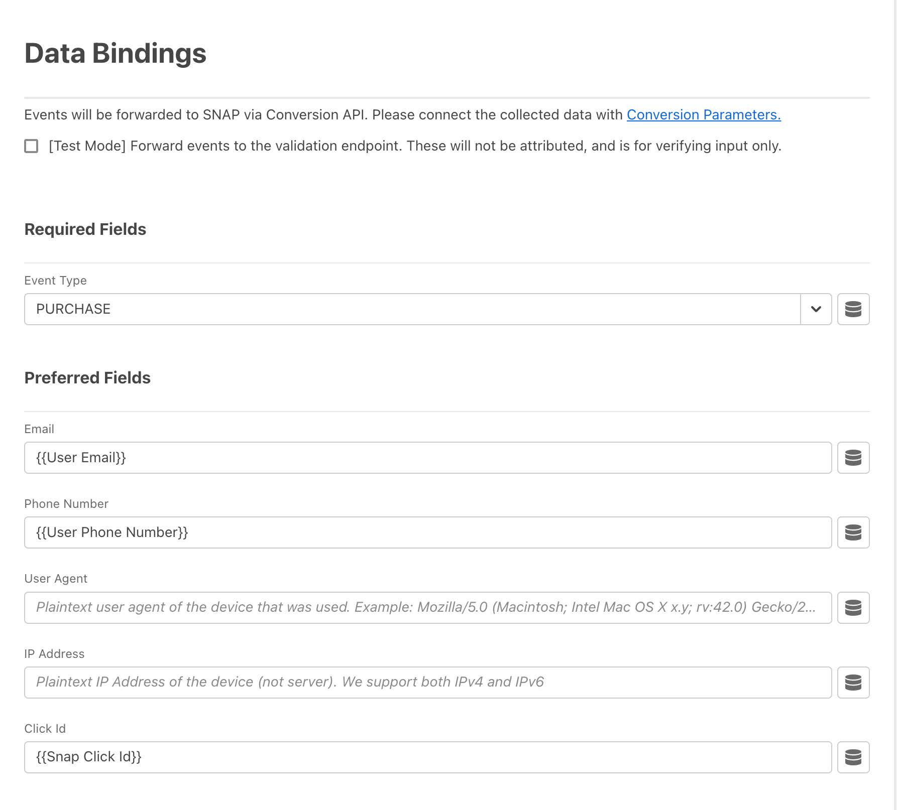

# Visão geral da extensão de API de conversões [!DNL Snapchat]

A Extensão da API de Conversão do [!DNL Snap] é uma interface segura da [API do Edge Network](https://developer.adobe.com/data-collection-apis/docs/) que permite compartilhar informações com o [!DNL Snapchat] diretamente sobre as ações do usuário em seus sites. Você pode aproveitar as regras de encaminhamento de eventos para enviar dados de **[!DNL Adobe Experience Platform Edge Network]** para **[!DNL Snapchat]** usando a extensão de API de Conversão **[!DNL Snap]**.

## [!DNL Snapchat] pré-requisitos {#prerequisites}

Para usar a API de conversões [!DNL Snapchat]:

* Você deve ter uma [propriedade de Encaminhamento de Eventos](/help/tags/ui/event-forwarding/getting-started.md) configurada no Adobe Experience Platform.
* Você também deve ter as [permissões necessárias](/help/collection/permissions.md) para editar a propriedade.

Crie um [Datastream](/help/tags/ui/event-forwarding/getting-started.md) e adicione o [serviço de Encaminhamento de Eventos](/help/tags/ui/event-forwarding/getting-started.md#enable-event-forwarding) a ele.

Uma conta do **[!DNL Snapchat]** [Business Manager](https://business.snapchat.com/) é necessária para usar a API de Conversões. O Business Manager ajuda os anunciantes a integrar os esforços de marketing de **[!DNL Snapchat]** em seus negócios e com parceiros externos. Consulte o **[!DNL Snapchat]** [artigo da central de ajuda](https://businesshelp.snapchat.com/s/article/get-started?language=en_US) sobre como criar uma conta do Business Manager, se você não tiver uma.

Um [[!DNL [Snap Pixel]]](https://businesshelp.snapchat.com/s/article/pixel-website-install?language=en_US) deve ser configurado no Gerenciador de Anúncios do Snapchat e você deve ter acesso para visualizar o `Pixel ID`. O `Pixel ID` pode ser encontrado na seção [[!UICONTROL [Gerenciador de Eventos]]](https://businesshelp.snapchat.com/s/article/events-manager?language=en_US).

Você precisa de um token de API estático de longa duração. Consulte a [[!DNL Snapchat] Documentação da API de conversões](https://developers.snap.com/api/marketing-api/Conversions-API/GetStarted#access-token) para obter este token.

## Instalar e configurar a extensão de API de eventos Web do [!DNL Snapchat] {#install}

Para instalar a extensão, navegue até **[!UICONTROL Coleção de Dados]**>**[!UICONTROL Encaminhamento de Eventos]**. Selecione a propriedade em que deseja instalar a extensão.

Depois que a propriedade desejada for selecionada, siga estas etapas:

1. No painel de navegação esquerdo, selecione **[!UICONTROL Extensões]**.
2. Procure a **[!UICONTROL Extensão da API de Conversão do Snap]** e selecione **[!UICONTROL Instalar]**.

   

3. Na tela de configuração, insira os seguintes valores:

* **[!UICONTROL Id Do Pixel]**
* **[!UICONTROL Token de API]**

Quando terminar, selecione **[!UICONTROL Salvar]**.


<!-- 
![[!DNL Snap] configuration screen for the [!DNL Snap] conversion API extension.](../../../images/extensions/server/snap/configure.png) -->

## Criar elementos de dados {#create-data-elements}

Para enviar dados para a extensão de API de conversões [!DNL Snapchat], crie [elementos de dados](https://experienceleague.adobe.com/pt-br/docs/platform-learn/implement-web-sdk/event-forwarding/setup-event-forwarding#create-an-event-forwarding-data-element) para cada parâmetro de dados. Siga estas etapas:

1. Navegue até **[!UICONTROL Criação]**>**[!UICONTROL Elementos de Dados]** na tela **[!UICONTROL Informações da Propriedade]** da propriedade e selecione **[!UICONTROL Adicionar Elemento de Dados]**.

   

2. Insira um nome para o elemento de dados.

3. Selecione **[!UICONTROL Núcleo]** como a extensão e **[!UICONTROL Caminho]** como o tipo de elemento de dados.

4. No menu suspenso, selecione o item apropriado e preencha o campo [!UICONTROL Caminho] no painel direito para fazer referência aos dados desejados no esquema.

   

Por exemplo, se você estiver criando um elemento de dados que faça referência a `snapClickId` no esquema mostrado abaixo:


Você deve configurar o elemento de dados porque `snapClickId` está localizado em `_snap.inc.exchange` no esquema XDM.


Consulte a [documentação de propriedades do Encaminhamento de Eventos](/help/tags/ui/event-forwarding/overview.md#data-elements) para obter mais detalhes sobre a criação de elementos de dados.

## Criar regras para enviar eventos de conversão ao Snap {#create-snap-rules}

[Regras](https://experienceleague.adobe.com/pt-br/docs/platform-learn/implement-web-sdk/event-forwarding/setup-event-forwarding#create-an-event-forwarding-rule) são usadas para acionar extensões no Experience Platform. Esta seção descreve como criar regras na propriedade de encaminhamento de eventos para enviar eventos de conversão ao Snap usando a extensão de API de conversões.

### Criar uma nova regra

1. Navegue até a propriedade de encaminhamento de eventos e selecione **[!UICONTROL Regras]** no menu Criação. Em seguida, clique em **[!UICONTROL Criar nova regra]**.

   

2. Nomeie a regra e configure uma condição para acionar o evento Snap. Por exemplo, para enviar um evento `PURCHASE` sempre que um evento incluir um número de pedido, defina uma condição para verificar se a interação do usuário contém um número de ordem de compra válido.

   

3. Depois de salvar a condição, adicione uma ação para acionar a API de conversão de snap. No painel do lado esquerdo:

   * Defina o menu suspenso [!UICONTROL Extensão] como [!UICONTROL Extensão da API de Conversões Snap].

   * Defina o menu suspenso [!UICONTROL Tipo de Ação] como [!UICONTROL Conversões de Relatórios da Web].

   * Nomeie a regra de acordo.

   

4. Configure os [valores de parâmetro CAPI](https://developers.snap.com/api/marketing-api/Conversions-API/Parameters) que você deseja enviar para o evento na seção **[!UICONTROL Associações de Dados]** no painel direito. Os campos na extensão são mapeados para parâmetros CAPI, conforme mostrado abaixo. Consulte a [Documentação da API de Conversões do Snapchat](https://developers.snap.com/api/marketing-api/Conversions-API/Parameters) para obter mais informações sobre cada parâmetro.

| Campo de vinculação de dados | Ajustar parâmetro CAPI |
| --- | --- |
| Tipo de evento (obrigatório) | `event_name` |
| Email | `em` |
| Número de telefone | `ph` |
| Agente do usuário | `client_user_agent` |
| Endereço IP | `client_ip_address` |
| ID do clique | `sc_click_id` |
| Cookie1 | `so_cookie1` |
| Nome | `fn` |
| Sobrenome | `ln` |
| Gênero | `ge` |
| Cidade | `ph` |
| Estado | `st` |
| CEP | `zp` |
| País | `country` |
| ID externa | `external_id` |
| ID do parceiro | `partner_id` |
| ID da assinatura | `subscription_id` |
| ID do lead | `lead_id` |
| Item ou Categoria | `content_category` |
| Nome do conteúdo | `content_ids` |
| Tipo de conteúdo | `content_name` |
| Conteúdo | `contents` |
| Descrição | `description` |
| Tag de evento | `event_tag` |
| Número de itens | `num_items` |
| Preço | `value` |
| Currency | `currency` |
| ID da transação | `order_id` (também enviado para `event_id` no lugar de `client dedup idD`) |
| LTV previsto | `predicted_ltv` |
| Pesquisar string | `search_string` |
| Método de inscrição | `sign_up_method` |
| Id De Eliminação De Duplicatas Do Cliente | `event_id` |
| Uso limitado de dados | `data_processing_options` |
| URL da página | `event_source_url` |

{style="table-layout:auto"}

### Campos obrigatórios e opcionais

Cada evento requer `event_source`, que é sempre definido como `WEB.` Para correspondência, pelo menos um dos seguintes campos ou combinações também é necessário:

* E-mail
* Número de telefone
* Endereço IP e Agente do usuário

**Observações adicionais:**

* Para eventos `Purchase`, os campos `Currency` e `Price` são obrigatórios.

* Habilitar a caixa de seleção **[!UICONTROL Modo de teste]** envia eventos como eventos de teste, que aparecem na ferramenta de evento de teste em vez de relatórios padrão. Consulte este [artigo da central de ajuda empresarial](https://businesshelp.snapchat.com/s/article/capi-event-testing?language=en_US#:~:text=Snap&#39;s%20Conversions%20API%20(CAPI)%20Test,being%20processed%20as%20production%20results.) para obter mais detalhes.

* O parâmetro `contents` deve ser uma cadeia de caracteres JSON contendo pelo menos um dos seguintes campos:

   * `id`
   * `item_category`
   * `brand`
   * `delivery_category`
   * `item_price`
   * `quantity`

Exemplo:

```json
{
  "id": "id1",
  "brand": "brand1",
  "delivery_category": "c1",
  "item_price": 2.00,
  "quantity": 2
}
```

Para usar o [valor de conversões personalizadas e o relatório ROAS](https://businesshelp.snapchat.com/s/article/custom-conversions-value-roas?language=en_US), inclua parâmetros relevantes no campo `contents`. Um exemplo de configuração para um evento de compra pode ser semelhante a: `brand`, `item_price`, `id`.

Exemplo de configuração para um evento `Purchase`:



Os campos opcionais podem ser definidos como mostrado:


Depois de definir o nome, a condição e a ação da regra conforme descrito acima, salve a regra e verifique se ela está ativada.


Agora você pode publicar essas alterações na propriedade. Consulte a documentação em [fluxo de publicação](/help/tags/ui/publishing/overview.md) para obter mais informações.

## Solução de problemas {#troubleshoot}

Para solucionar problemas e otimizar sua configuração, reveja as [recomendações de Pontuação de qualidade do evento](https://businesshelp.snapchat.com/s/article/event-quality-score) para garantir que seus eventos atinjam as mais altas taxas de correspondência e resultados de desempenho possíveis.

Se você tiver problemas com sua **Pontuação de qualidade do evento**, saiba mais sobre nossas recomendações para melhorá-la [aqui](https://businesshelp.snapchat.com/s/article/esq-issues-recommendations?language=en_US).

## Próximas etapas {#next-steps}

Este guia abordou como enviar dados de eventos do lado do servidor para o **[!DNL Snap]** usando a extensão **[!DNL Snap Conversions API]**. Para obter mais informações sobre os recursos de encaminhamento de eventos do Experience Platform, consulte a [Visão geral do encaminhamento de eventos](../../../ui/event-forwarding/overview.md).
