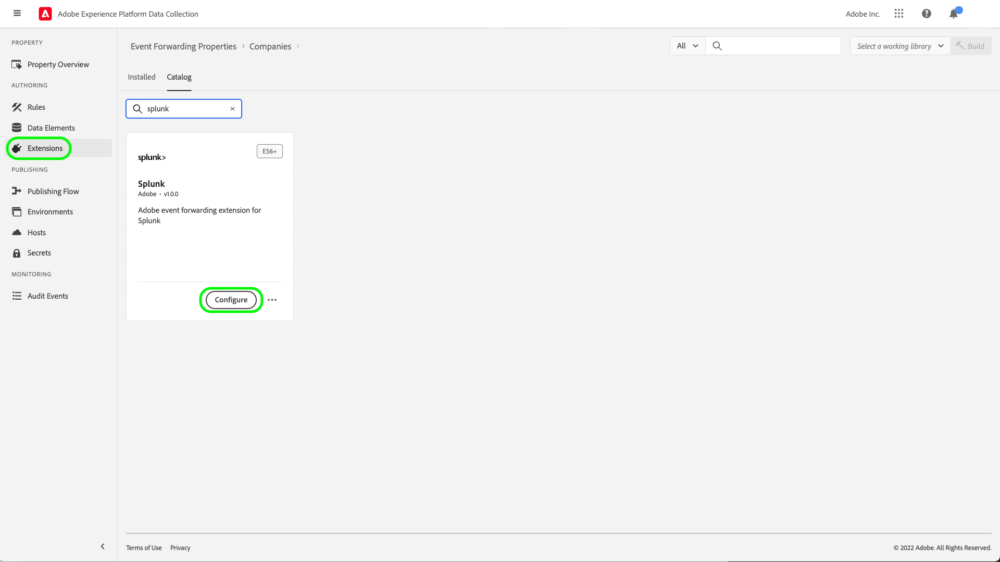

# Visão geral da extensão do Splunk

O [Splunk](https://www.splunk.com) é uma plataforma de observação que fornece pesquisa, análise e visualização para obter insights acionáveis sobre seus dados. A extensão [encaminhamento de eventos](../../../ui/event-forwarding/overview.md) do Splunk aproveita a [API REST do Coletor de Eventos HTTP do Splunk](https://docs.splunk.com/Documentation/Splunk/8.2.5/Data/HECRESTendpoints) para enviar eventos do Adobe Experience Platform Edge Network para o [Coletor de Eventos HTTP do Splunk](https://docs.splunk.com/Documentation/Splunk/8.2.5/Data/UsetheHTTPEventCollector).

O Splunk usa tokens de portador como mecanismo de autenticação para se comunicar com a API do Coletor de Eventos do Splunk.

## Casos de uso {#use-cases}

As equipes de marketing podem usar a extensão para os seguintes casos de uso:

| Caso de uso | Descrição |
| --- | --- |
| Análise de comportamento do cliente | As organizações podem capturar os dados do evento de interação com o cliente de seu site e encaminhar eventos relevantes para o Splunk. As equipes de marketing e análise podem realizar análises subsequentes na plataforma Splunk para entender as principais interações e comportamento do usuário. A plataforma do Splunk pode ser usada para gerar gráficos, painéis ou outras visualizações para informar as partes interessadas de negócios. |
| Pesquisa dimensionável em grandes conjuntos de dados | As organizações podem capturar entradas transacionais ou conversacionais como dados do evento do site e encaminhar eventos para o Splunk. As equipes do Analytics podem aproveitar os recursos de indexação escalável do Splunk para filtrar e processar grandes conjuntos de dados, a fim de obter insights de negócios e tomar decisões informadas. |

{style="table-layout:auto"}

## Pré-requisitos {#prerequisites}

É necessário ter uma conta do Splunk para usar essa extensão. Você pode se registrar para obter uma conta do Splunk na [página inicial do Splunk](https://www.splunk.com/page/sign_up).

>[!NOTE]
>
> A extensão do Splunk é compatível com as instâncias corporativas do Splunk Cloud e do Splunk. Este guia documenta uma implementação usando a [Splunk Cloud](https://www.splunk.com/en_us/products/splunk-cloud-platform.html) como referência. O processo de configuração do [Splunk Enterprise](https://www.splunk.com/en_us/products/splunk-enterprise.html) é semelhante, mas requer orientação específica do administrador do Splunk Enterprise.

Você também deve ter os seguintes valores técnicos para configurar a extensão:

* Um [token de Coletor de Eventos](https://docs.splunk.com/Documentation/Splunk/8.2.5/Data/UsetheHTTPEventCollector#Create_an_Event_Collector_token_on_Splunk_Cloud_Platform). Os tokens normalmente são no formato UUIDv4 como o seguinte: `12345678-1234-1234-1234-1234567890AB`.
* O endereço e a porta da instância da plataforma do Splunk para sua organização. Um endereço e uma porta da instância da plataforma normalmente terão o seguinte formato: `mysplunkserver.example.com:443`.

  >[!IMPORTANT]
  >
  > Os pontos de extremidade de Splunk referenciados no encaminhamento de eventos devem usar somente a porta `443`. Atualmente, as portas não padrão não são suportadas em implementações de encaminhamento de eventos.

## Instalar a extensão do Splunk {#install}

Para instalar a extensão do Coletor de Eventos do Splunk na interface do usuário, navegue até **Encaminhamento de Eventos** e selecione uma propriedade à qual adicionar a extensão ou crie uma nova propriedade.

Depois de selecionar ou criar a propriedade desejada, navegue até **Extensões** > **Catálogo**. Pesquise por &quot;[!DNL Splunk]&quot; e selecione **[!DNL Install]** na Extensão do Splunk.

## Configurar a extensão do Splunk {#configure_extension}

>[!IMPORTANT]
>
>Dependendo das suas necessidades de implementação, talvez seja necessário criar um esquema, elementos de dados e um conjunto de dados antes de configurar a extensão. Revise todas as etapas de configuração antes de começar para determinar quais entidades você precisa configurar para seu caso de uso.

Selecione **Extensões** na navegação à esquerda. Em **Instalado**, selecione **Configurar** na extensão do Splunk.

Para **[!UICONTROL HTTP Event Collector URL]**, insira o endereço e a porta da instância da plataforma Splunk. Em **[!UICONTROL Access Token]**, insira o valor [!DNL Event Collector Token]. Quando terminar, selecione **[!UICONTROL Save]**.

## Configurar uma regra de encaminhamento de eventos {#config_rule}

Comece a criar uma nova regra de encaminhamento de eventos [regra](../../../ui/managing-resources/rules.md) e configure suas condições conforme desejado. Ao selecionar as ações para a regra, selecione a extensão [!UICONTROL Splunk] e o tipo de ação [!UICONTROL Create Event]. Controles adicionais são exibidos para configurar ainda mais o evento do Splunk.

A próxima etapa é mapear as propriedades do evento Splunk para os elementos de dados criados anteriormente. Os mapeamentos opcionais compatíveis com base nos dados do evento de entrada que podem ser configurados são fornecidos abaixo. Consulte a [documentação do Splunk](https://docs.splunk.com/Documentation/Splunk/8.2.5/Data/FormateventsforHTTPEventCollector#Event_metadata) para obter mais detalhes.

| Nome do campo | Descrição |
| --- | --- |
| [!UICONTROL Event]  **(OBRIGATÓRIO)** | Indique como você deseja fornecer os dados do evento. Os dados do evento podem ser atribuídos à chave `event` no objeto JSON na solicitação HTTP ou podem ser texto bruto. A chave `event` está no mesmo nível no pacote de eventos JSON que as chaves de metadados. Dentro das chaves de valor-chave `event`, os dados podem estar em qualquer forma que você exigir (como uma sequência, um número, outro objeto JSON e assim por diante). |
| [!UICONTROL Host] | O hostname do cliente do qual você está enviando dados. |
| [!UICONTROL Source Type] | O tipo de origem a ser atribuído aos dados do evento. |
| [!UICONTROL Source] | O valor de origem a ser atribuído aos dados do evento. Por exemplo, se estiver enviando dados de um aplicativo que está desenvolvendo, defina essa chave como o nome do aplicativo. |
| [!UICONTROL Index] | O nome do índice dos dados do evento. O índice especificado aqui deve estar dentro da lista de índices permitidos se o token tiver o parâmetro index definido. |
| [!UICONTROL Time] | A hora do evento. O formato de hora padrão é UNIX time (no formato `<sec>.<ms>`) e depende do fuso horário local. Por exemplo, `1433188255.500` indica 1433188255 segundos e 500 milissegundos após a época, ou segunda-feira, 1 de junho de 2015, às 19h55 GMT.:50: |
| [!UICONTROL Fields] | Especifique um objeto JSON bruto ou um conjunto de pares de valores chave que contenham campos personalizados explícitos a serem definidos no momento do índice.  A chave `fields` não se aplica a dados brutos.  As solicitações que contêm a propriedade `fields` devem ser enviadas para o ponto de extremidade `/collector/event` ou não serão indexadas. Para obter mais informações, consulte a documentação do Splunk em [extrações de campos indexados](https://docs.splunk.com/Documentation/Splunk/8.2.5/Data/IFXandHEC). |

### Validar dados no Splunk {#validate}

Depois de criar e executar a regra de encaminhamento de eventos, valide se o evento enviado para a API do Splunk é exibido conforme esperado na interface do Splunk. Se a coleção de eventos e a integração do Experience Platform tiverem sido bem-sucedidas, você verá eventos no console do Splunk da seguinte maneira:

## Próximas etapas

Este documento abordou como instalar e configurar a extensão de encaminhamento de eventos do Splunk na interface do usuário do. Para obter mais informações sobre como coletar dados do evento no Splunk, consulte a documentação oficial:

* [Configurar e usar o Coletor de Eventos HTTP na Web do Splunk](https://docs.splunk.com/Documentation/Splunk/8.2.5/Data/UsetheHTTPEventCollector)
* [Configurar autenticação com tokens](https://docs.splunk.com/Documentation/Splunk/8.2.5/Security/Setupauthenticationwithtokens#Prerequisites_for_activating_tokens)
* [Solução de Problemas do Coletor de Eventos HTTP](https://docs.splunk.com/Documentation/Splunk/8.2.5/Data/TroubleshootHTTPEventCollector) (também lista um compêndio de [possíveis códigos de erro](https://docs.splunk.com/Documentation/Splunk/8.2.5/Data/TroubleshootHTTPEventCollector#Possible_error_codes))
