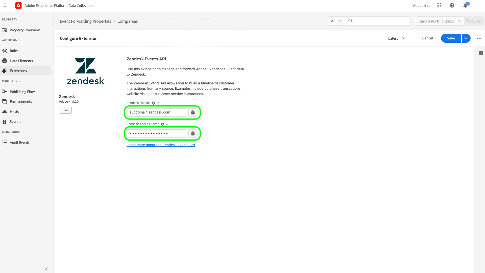

# [!DNL Zendesk] Visão geral da extensão de API de eventos

[Zendesk](https://www.zendesk.com) O é uma solução de atendimento ao cliente e uma ferramenta de vendas. O Zendesk [encaminhamento de eventos](../../../ui/event-forwarding/overview.md) a extensão utiliza o [[!DNL Zendesk Events API]](https://developer.zendesk.com/api-reference/custom-data/events-api/events-api/) para enviar eventos da Adobe Experience Platform Edge Network para o Zendesk para processamento adicional. Você pode usar a extensão para coletar interações de perfil do cliente para uso na análise e na ação de downstream.

Este documento aborda como instalar e configurar a extensão na interface do usuário do.

## Pré-requisitos

Você deve ter uma conta do Zendesk para usar essa extensão. Você pode se registrar para uma conta do Zendesk no [Site do Zendesk](https://www.zendesk.com/register/).

Você também deve coletar os seguintes detalhes para sua configuração do Zendesk:

| Tipo de chave | Descrição | Exemplo |
| --- | --- | --- |
| Subdomain | Durante o processo de registro, um único **subdomínio** é criado especificamente para a conta. Consulte a [Documentação do Zendesk](https://developer.zendesk.com/documentation/ticketing/working-with-oauth/creating-and-using-oauth-tokens-with-the-api/) para obter mais informações. | `xxxxx.zendesk.com` (onde `xxxxx` é o valor fornecido durante a criação da conta) |
| Token de API | O Zendesk usa tokens de portador como um mecanismo de autenticação para se comunicar com a API do Zendesk. Depois de fazer logon no portal Zendesk, gere um token de API. Consulte a [Documentação do Zendesk](https://support.zendesk.com/hc/en-us/articles/4408889192858-Generating-a-new-API-token) para obter mais informações. | `cwWyOtHAv12w4dhpiulfe9BdZFTz3OKaTSzn2QvV` |

{style="table-layout:auto"}

Por fim, você deve criar um segredo de encaminhamento de eventos para o token da API. Defina o tipo de segredo como **[!UICONTROL Token]** e defina o valor para o token da API que você coletou da configuração do Zendesk. Consulte a documentação em [segredos no encaminhamento de eventos](../../../ui/event-forwarding/secrets.md) para obter mais detalhes sobre a configuração de segredos.

## Instalar a extensão {#install}

Para instalar a extensão do Zendesk na interface do usuário, acesse **Encaminhamento de evento** e selecione uma propriedade à qual adicionar a extensão ou crie uma nova propriedade.

Depois de selecionar ou criar a propriedade desejada, navegue até **Extensões** > **Catálogo**. Pesquisar por &quot;[!DNL Zendesk]&quot; e selecione **[!DNL Install]** sobre a extensão do Zendesk.

## Configurar a extensão {#configure}

>[!IMPORTANT]
>
>Dependendo das suas necessidades de implementação, talvez seja necessário criar um esquema, elementos de dados e um conjunto de dados antes de configurar a extensão. Revise todas as etapas de configuração antes de começar para determinar quais entidades você precisa configurar para seu caso de uso.

Selecionar **Extensões** no painel de navegação esquerdo. Em **Instalado**, selecione **Configurar** na extensão do Zendesk.

Em **[!UICONTROL Domínio do Zendesk]**, insira o valor para o subdomínio do Zendesk. Em **[!UICONTROL Token do Zendesk]**, selecione o segredo criado anteriormente que contém o token da API.

## Configurar uma regra de encaminhamento de eventos

Começar a criar uma nova regra de encaminhamento de eventos [regra](../../../ui/managing-resources/rules.md) e configure suas condições conforme desejado. Ao selecionar as ações para a regra, selecione a variável [!UICONTROL Zendesk] e selecione a [!UICONTROL Criar evento] tipo de ação.

Ao configurar a configuração da ação, você é solicitado a atribuir elementos de dados às várias propriedades que serão enviadas para o Zendesk.

Esses elementos de dados devem ser mapeados conforme referenciado abaixo.

### `event` chaves

`event` é um objeto JSON que representa o evento acionado pelo usuário. Consulte o documento do Zendesk no [anatomia de um evento](https://developer.zendesk.com/documentation/custom-data/events/anatomy-of-an-event/) para obter detalhes sobre as propriedades capturadas pelo `event` objeto.

As seguintes chaves podem ser referenciadas no `event` ao mapear para elementos de dados:

| `event` key | Tipo | Caminho da plataforma | Descrição | Obrigatório | Limites |
| --- | --- | --- | --- | --- | --- |
| `source` | String | `arc.event.xdm._extconndev.event_source` | O aplicativo que enviou o evento. | Sim | Não usar `Zendesk` como um valor, pois é um nome de origem protegido para eventos padrão do Zendesk. Tentar usá-lo resultará em um erro. O valor não deve exceder 40 caracteres. |
| `type` | String | `arc.event.xdm._extconndev.event_type` | Nome do tipo de evento. Você pode usar esse campo para indicar diferentes tipos de eventos para uma determinada fonte. Por exemplo, você pode criar um conjunto de eventos para logons de usuário e outro para carrinhos de compras. | Sim | O valor não deve exceder 40 caracteres. |
| `description` | String | `arc.event.xdm._extconndev.description` | Uma descrição para o evento. | Não | (N/D) |
| `created_at` | String | `arc.event.xdm.timestamp` | Um carimbo de data e hora ISO-8601 que reflete a hora em que o evento foi criado. | Não | (N/D) |
| `properties` | Objeto | `arc.event.xdm._extconndev.EventProperties` | Um objeto JSON personalizado com detalhes sobre o evento. | Sim | (N/D) |

{style="table-layout:auto"}

>[!NOTE]
>
>Consulte a [[!DNL Zendesk Events API] documentação](https://developer.zendesk.com/api-reference/custom-data/events-api/events-api/) para obter orientação adicional sobre as propriedades do evento.

### `profile` chaves

`profile` é um objeto JSON que representa o usuário que acionou o evento. Consulte o documento do Zendesk no [anatomia de um perfil](https://developer.zendesk.com/documentation/custom-data/profiles/anatomy-of-a-profile/) para obter detalhes sobre as propriedades capturadas pelo `profile` objeto.

As seguintes chaves podem ser referenciadas no `profile` ao mapear para elementos de dados:

| `profile` key | Tipo | Caminho da plataforma | Descrição | Obrigatório | Limites |
| --- | --- | --- | --- | --- | --- |
| `source` | String | `arc.event.xdm._extconndev.profile_source` | O produto ou serviço associado ao perfil, como `Support`, `CompanyName`ou `Chat`. | Sim | (N/D) |
| `type` | String | `arc.event.xdm._extconndev.profile_type` | Um nome para o tipo de perfil. Você pode usar esse campo para criar diferentes tipos de perfis para uma determinada fonte. Por exemplo, você pode criar um conjunto de perfis de empresa para clientes e outro para funcionários. | Sim | O tipo de perfil não deve exceder 40 caracteres. |
| `name` | String | `arc.event.xdm._extconndev.name` | O nome da pessoa do perfil | Não | (N/D) |
| `user_id` | String | `arc.event.xdm._extconndev.user_id` | A ID de usuário da pessoa no Zendesk. | Não | (N/D) |
| `identifiers` | Matriz | `arc.event.xdm._extconndev.identifiers` | Uma matriz contendo pelo menos um identificador. Cada identificador consiste em um tipo e um valor. | Sim | Consulte a [Documentação do Zendesk](https://developer.zendesk.com/api-reference/custom-data/profiles_api/profiles_api/#identifiers-array) para obter mais informações sobre o `identifiers` matriz. Todos os campos e valores devem ser exclusivos. |
| `attributes` | Objeto | `arc.event.xdm._extconndev.attrbutes` | Um objeto que contém propriedades definidas pelo usuário sobre a pessoa. | Não | Consulte a [Documentação do Zendesk](https://developer.zendesk.com/documentation/custom-data/profiles/anatomy-of-a-profile/#attributes) para obter mais informações sobre atributos de perfil. |

{style="table-layout:auto"}

## Validar dados no Zendesk {#validate}

Se a coleção de eventos e a integração do Adobe Experience Platform forem bem-sucedidas, os eventos no console do Zendesk deverão aparecer conforme mostrado abaixo. Isso indica uma integração bem-sucedida.

Perfis:

Eventos:

## Limites de solicitação {#limits}

Com base no tipo de conta, o Zendesk [!DNL Events API] O pode lidar com o seguinte número de solicitações por minuto:

| [!DNL Account Type] | Solicitações por minuto |
| --- | --- |
| [!DNL Team] | 250 |
| [!DNL Growth] | 250 |
| [!DNL Professional] | 500 |
| [!DNL Enterprise] | 750 |
| [!DNL Enterprise Plus] | 1000 |

{style="table-layout:auto"}

Consulte a [Documentação do Zendesk](https://developer.zendesk.com/api-reference/ticketing/account-configuration/usage_limits/#:~:text=API%20requests%20made%20by%20Zendesk%20apps%20are%20subject,sources%20for%20the%20account%2C%20including%20internal%20product%20requests.) para obter mais informações sobre esses limites.

## Erros e solução de problemas {#errors-and-troubleshooting}

Ao usar ou configurar a extensão, os erros abaixo podem ser retornados pela API de eventos do Zendesk:

| Código de erro | Descrição | Resolução | Exemplo |
|---|---|---|---|
| 400 | **Comprimento de perfil inválido:** Esse erro ocorre quando o comprimento de um atributo de perfil contém mais de 40 caracteres. | Limite o comprimento dos dados do atributo de perfil a no máximo 40 caracteres. | `{"error": [{"code":"InvalidProfileTypeLength","title": "Profile type length > 40 chars"}]}` |
| 401 | **Rota não encontrada:** Este erro ocorre quando um domínio inválido é fornecido. | Verifique se um domínio válido é fornecido no seguinte formato: `{subdomain}.zendesk.com` | `{"error": [{"description": "No route found for host {subdomain}.zendesk.com","title": "RouteNotFound"}]}` |
| 401 | **Autenticação Inválida ou Ausente:** Esse erro ocorre quando o acesso ao token é inválido, ausente ou expirou. | Verifique se o token de acesso é válido e se não expirou. | `{"error": [{"code":"MissingOrInvalidAuthentication","title": "Invalid or Missing Authentication"}]}` |
| 403 | **Permissões insuficientes:** Esse erro ocorre quando não são fornecidas permissões suficientes para acessar o recurso. | Valide se as permissões necessárias foram fornecidas. | `{"error": [{"code":"PermissionDenied","title": "Insufficient permisssions to perform operation"}]}` |
| 429 | **Muitas solicitações:** Esse erro ocorre quando o limite de registro do objeto de ponto de extremidade é excedido. | Consulte a seção acima em [limites de solicitação](#limits) para obter detalhes sobre limites por limite. | `{"error": [{"code":"TooManyRequests","title": "Too Many Requests"}]}` |

{style="table-layout:auto"}

## Próximas etapas

Este documento abordou como instalar e configurar a extensão de encaminhamento de eventos do Zendesk na interface do usuário do. Para obter mais informações sobre como coletar dados do evento no Zendesk, consulte a documentação oficial:

* [Introdução aos eventos](https://developer.zendesk.com/documentation/custom-data/events/getting-started-with-events/)
* [API de eventos do Zendesk](https://developer.zendesk.com/api-reference/custom-data/events-api/events-api/)
* [Sobre a API de eventos](https://developer.zendesk.com/documentation/custom-data/events/about-the-events-api/)
* [Anatomia de um evento](https://developer.zendesk.com/documentation/custom-data/events/anatomy-of-an-event/)
* [API de perfis do Zendesk](https://developer.zendesk.com/api-reference/custom-data/events-api/events-api/#profile-object)
* [Sobre a API de perfis](https://developer.zendesk.com/documentation/custom-data/profiles/about-the-profiles-api/)
* [Anatomia de um perfil](https://developer.zendesk.com/documentation/custom-data/profiles/anatomy-of-a-profile/)
