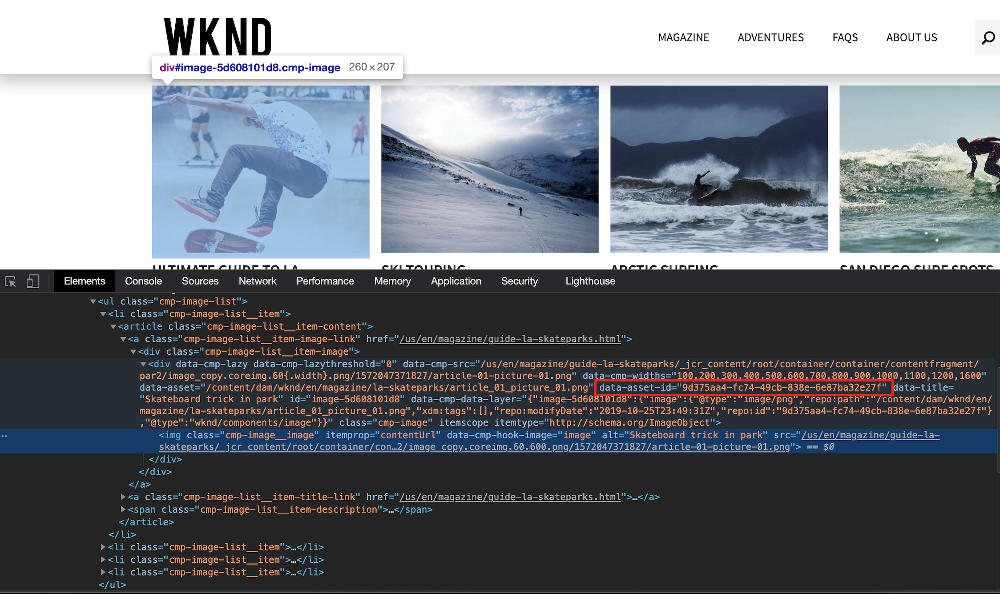
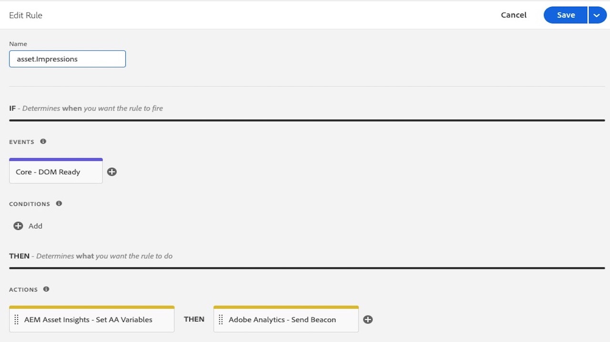
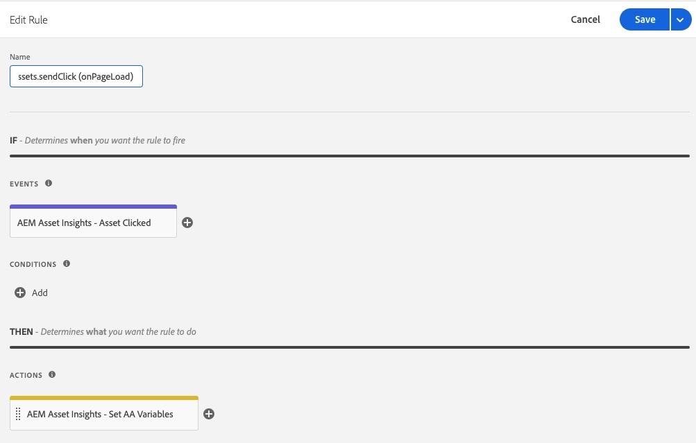

# Visão geral da extensão do AEM Asset Insights

>[!NOTE]
>
>O Adobe Experience Platform Launch está sendo reformulado como um conjunto de tecnologias de coleção de dados na Experience Platform. Como resultado, várias alterações de terminologia foram implementadas na documentação do produto. Consulte o seguinte [documento](../../../term-updates.md) para obter uma referência consolidada das alterações de terminologia.

Esta extensão deve ser usada juntamente com o [AEM Asset Insights](https://experienceleague.adobe.com/docs/experience-manager-65/assets/managing/configure-asset-insights.html?lang=pt-BR). Mais especificamente, ela substitui o processo “pageTracker” e o código incorporado. Quando configurada, essa extensão envia as métricas *Impressão* e *Clique* do ativo para o Adobe Analytics, depois elas são importadas para os relatórios do AEM Asset Insights. As métricas do ativo podem ser informadas usando o AEM Asset Insights ou o Adobe Analytics Project Workspaces.

## Pré-requisitos da extensão

### Analytics

Os relatórios do AEM Asset no Analytics contêm três dimensões do AEM:

* ID do ativo
* Origem do ativo
* Ativo clicado

Há também duas métricas:
* Impressões do ativo
* Cliques em ativos.

Esses relatórios devem ser ativados usando o Administrador do Analytics (clique em **[!UICONTROL Analytics] > [!UICONTROL  Administrador] > [!UICONTROL Conjuntos de relatórios] > `<report suite>` > [!UICONTROL Editar configurações] > [!UICONTROL AEM] > [!UICONTROL Relatórios do AEM Assets]**) para que eles possam ser preenchidos usando essa extensão.

A extensão de tag &quot;*Adobe Analytics*&quot; para o Adobe Experience Platform deve ser instalada na mesma propriedade da Web.

### Adobe Experience Manager (AEM)

1. Ative o [AEM Asset Insights](https://experienceleague.adobe.com/docs/experience-manager-65/assets/managing/touch-ui-configuring-asset-insights.html). No AEM, selecione **[!UICONTROL Ferramentas > Ativos]** e abra o painel **[!UICONTROL Configuração do Insights]**.

1. Desative o rastreamento de UUID.

   >[!IMPORTANT]
   >
   >Essa extensão *não* funcionará se a configuração do AEM Assets **[!UICONTROL Desativar rastreamento de UUID]** estiver marcada. Ela está desmarcada por padrão.

   

## Configurar o Adobe Experience Manager (AEM)

Esta seção descreve como configurar AEM com tags no Adobe Experience Platform, como ativar o Asset Insight no AEM e como ativar o rastreamento de UUID para Ativos.

### Integrar AEM com tags

A integração recomendada do [Platform ](https://experienceleague.adobe.com/docs/experience-manager-learn/sites/integrations/experience-platform-launch/overview.html?lang=pt-BR) com o Adobe Experience Manager é feita via Adobe I/O.

1. [Conecte AEM com tags usando o Adobe I/O](https://experienceleague.adobe.com/docs/experience-manager-learn/sites/integrations/experience-platform-launch/connect-aem-launch-adobe-io.html?lang=pt-BR).

2. [Crie uma configuração de Cloud Service Adobe Experience Platform](https://experienceleague.adobe.com/docs/experience-manager-learn/sites/integrations/experience-platform-launch/create-launch-cloud-service.html?lang=pt-BR).

### Ativar o Asset Insight no AEM

Para obter instruções sobre como ativar o Asset Insights, consulte o [Guia do usuário do Experience Manager 6.5](https://experienceleague.adobe.com/docs/experience-manager-65/assets/managing/touch-ui-configuring-asset-insights.html).

### Ativar o rastreamento de UUID para o Assets

Rastrear ativos no Analytics usando a UUID do ativo no AEM.

Para habilitar o rastreamento com a UUID do ativo, abra o console de política do componente do modelo editável e desmarque a propriedade “Desabilitar rastreamento UUID”. (Por padrão, essa propriedade é verificada para o componente de imagem OOTB.)

Depois de ativar o UUID, você deve ver o elemento de dados “data-asset-id” que está preenchido com a UUID do ativo. O Analytics rastreia o clique ou impressão do ativo com essa UUID.

## Uso de extensão

Essa extensão tem dois eventos e uma ação.

* **Ativo clicado:** um _evento_ que é acionado quando o visitante seleciona um AEM Asset que está ativado para rastreamento e tem um destino (atributo href).

* **Ativo clicado (sem destino):** um _evento_ que é acionado quando o visitante seleciona um AEM Asset que está ativado para rastreamento e não tem um destino (nenhum atributo href).

* **Definir variáveis AA:** uma _ação_ que define as variáveis do Analytics reservadas para o AEM Assets (variáveis de dados de contexto `a.assets.source`, `a.assets.idlist` e `a.asset.clickedid`) dependendo de qual evento foi usado e como o evento e a ação são configurados. Essa extensão não usa eventos, props ou eVars do Analytics.

### Impressões do ativo

Adicione a ação &quot;Definir variáveis AA&quot; a uma regra de tag nova ou existente que é acionada em cada página e envia uma solicitação de imagem do Analytics. A ação “Definir variáveis AA” deve aparecer **antes** da ação “Adobe Analytics - Enviar beacon”. Ações adicionais podem ser adicionadas, conforme necessário.

Na página de configuração **[Definir variáveis AA]**, selecione a opção **[Ativos visualizados]** (padrão). Essa ação definirá somente o evento de impressões para ativos que são realmente vistos pelo visitante.

>[!NOTE]
>
>Embora não seja recomendado, a ação “Definir variáveis AA” também aceita uma opção “carregada”, que envia impressões de ativos para cada ativo na página, independentemente de o visitante os ter visto ou não.

### Cliques no ativo

Configure uma segunda regra usando o evento “Ativo clicado” e a ação “Definir variáveis AA”. O evento “Ativo clicado” deve ser configurado para que a “Solicitação de imagem de ativo clicado” seja definida como “No carregamento da página” (padrão). Esta regra não requer nenhuma ação do Adobe Analytics (como Enviar beacon) porque a ID do ativo será salva em `sessionStorage` e enviada pela próxima regra de impressões.

O evento “Ativo clicado” também oferece suporte à configuração “Solicitação de imagem de ativo clicado” de “No clique”. Essa configuração envia a métrica de clique para o Analytics imediatamente e exige uma ação “Enviar beacon” do Analytics.

Configure uma terceira regra que será acionada quando houver Ativos nas páginas que não têm um destino (nenhum atributo `href`). No mínimo, a nova regra precisa usar o evento “Ativo clicado (Sem destino)”, bem como as ações “Definir variáveis AA” e “Adobe Analytics - Enviar beacon”. Condições e ações adicionais podem ser adicionadas, conforme necessário.

### Dicas de teste de extensão

Configure três regras conforme descrito acima:

* Impressões do ativo
* Cliques no ativo
* Cliques no ativo sem destino

**Impressões**

1. Acesse uma página que contém AEM Assets.

1. Se não houver ativos visíveis no navegador, role a página até que você possa ver pelo menos um ativo e selecione-o ou navegue para outra página.

1. Examine a solicitação de imagem do Analytics.

   Se `a.assets.idlist` contiver as IDs de ativo que estavam visíveis na página anterior, a regra está funcionando corretamente.

   Se `a.assets.idlist` não estiver na solicitação de imagem, é provável que isso aconteça por um dos dois motivos:

   * Nunca houve um ativo na área de visualização do navegador

   * Não havia ativos na página configurada com o [Asset Insights](https://experienceleague.adobe.com/docs/experience-manager-65/assets/managing/touch-ui-configuring-asset-insights.html) habilitado no AEM.

**Cliques**

1. Acesse uma página que contém AEM Assets.

1. Selecione um dos ativos.

Na solicitação de imagem resultante do Analytics (da próxima página), se `a.assets.idlist` tiver as IDs de ativo na página de destino e `a.assets.clickedid` tiver a ID do ativo que foi selecionado na página de origem, isso indicará que a regra está funcionando corretamente.

Se `a.assets.clickedid` não está na solicitação de imagem, é provável que o ativo que foi selecionado não tenha o [Asset Insights](https://experienceleague.adobe.com/docs/experience-manager-65/assets/managing/touch-ui-configuring-asset-insights.html) habilitado no AEM.

**Cliques sem destino**

1. Acesse uma página que contenha pelo menos um AEM Assets que não tenha destino (nenhum atributo `href`).

1. Selecione esse ativo.

Na solicitação de imagem resultante do Analytics, se `a.assets.clickedid` tiver a ID do ativo, a regra está funcionando corretamente.

Se `a.assets.clickedid` não está na solicitação de imagem, é provável que o ativo que foi selecionado não tenha o [Asset Insights](https://experienceleague.adobe.com/docs/experience-manager-65/assets/managing/touch-ui-configuring-asset-insights.html) habilitado no AEM.
