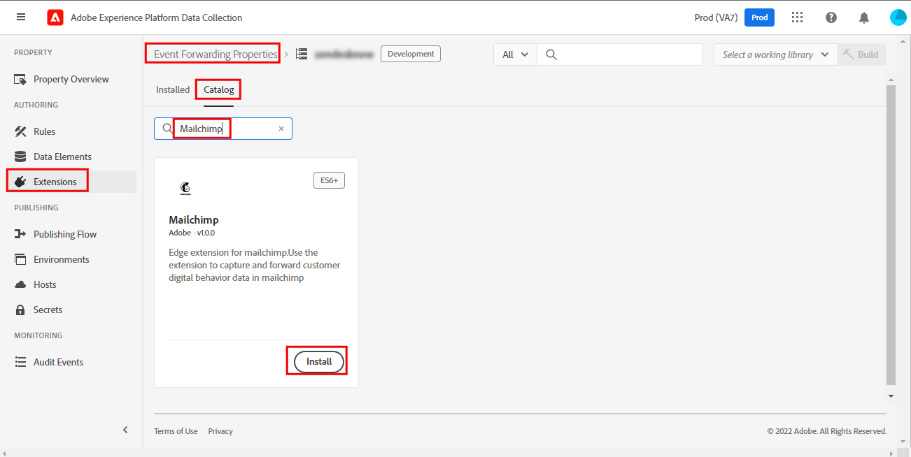

# Visão geral da extensão de encaminhamento de eventos de mailchimp

>[!NOTE]
>  
>A Adobe Experience Platform Launch foi reformulada como um conjunto de tecnologias de coleta de dados no Adobe Experience Platform. Como resultado, várias alterações de terminologia foram implementadas na documentação do produto. Consulte o seguinte [documento](https://experienceleague.adobe.com/docs/experience-platform/tags/term-updates.html) para obter uma referência consolidada das alterações de terminologia.

O Mailchimp [encaminhamento de eventos](../../../ui/event-forwarding/overview.md) A extensão envia eventos para a API de marketing Mailchimp que pode acionar emails para campanhas de marketing, jornadas ou transações do Mailchimp.

Este documento aborda como configurar a extensão e configurar as regras usando a ação Adicionar evento.

## Pré-requisitos

Este documento pressupõe que você esteja familiarizado com os produtos relevantes do Mailchimp aproveitados pela extensão. Para obter mais informações, consulte a documentação de ajuda do Mailchimp para [campanhas](https://mailchimp.com/help/getting-started-with-campaigns/), [jornada](https://mailchimp.com/help/about-customer-journeys/)e [transações](https://mailchimp.com/help/transactional/).

É necessária uma conta Mailchimp para usar esta extensão. Você pode se inscrever em uma conta [here](https://login.mailchimp.com/signup/). No painel de conta Mailchimp, anote os seguintes valores para uso neste guia:

- Seu prefixo de domínio Mailchimp
- Sua chave de API
- A ID de público-alvo
- O endereço de email padrão &quot;de&quot;

Dependendo do seu plano de conta Mailchimp, você pode ter acesso limitado às ferramentas de Jornada do cliente Mailchimp.

>[!TIP]
>  
>Se você estiver usando automações de Mailchimp, como emails transacionais ou Jornadas do cliente, as etapas e telas podem ser um pouco diferentes das listadas aqui. No entanto, você ainda precisa das mesmas informações para usar essa extensão, conforme descrito acima. Consulte a [Central de ajuda do Mailchimp](https://mailchimp.com/help/) para obter detalhes sobre cada um desses valores para sua conta e plano específicos.

### Prefixo do domínio

Depois de fazer logon no Mailchimp e acessar a exibição do Painel, a barra de endereços do navegador deve exibir um URL como `https://us11.admin.mailchimp.com` ou apenas `us11.admin.mailchimp.com`. Neste exemplo, o prefixo `us11` é apenas um espaço reservado e seu valor será diferente. Registre seu URL com seu prefixo para uma etapa posterior.

### Chave de API

Para encontrar a chave da API para sua conta, selecione o ícone do perfil na interface do usuário do Mailchimp e selecione **Perfil**. Você deve ver um URL como `https://us11.admin.mailchimp.com/account/profile/` mas com **your** prefixo em vez de `us11`.

Selecionar **Extras**, em seguida **Chaves da API**:

Em **Suas chaves de API**, é possível escolher uma chave existente ou selecionar **Criar Uma Chave** para criar um novo. Você pode criar uma nova chave para usar especificamente com essa extensão. Copie a chave de API e salve-a para uma etapa posterior. Para obter mais detalhes, consulte a documentação do Mailchimp sobre como [gerar sua chave de API](https://mailchimp.com/developer/marketing/guides/quick-start/#generate-your-api-key).

### ID de público-alvo e endereço de origem

Selecionar **Público** na navegação à esquerda, em seguida **Painel de público**. Em seguida, selecione o público-alvo que pretende usar com esta extensão. Para saber mais, consulte o documento Mailchimp em [criação de um público-alvo](https://mailchimp.com/help/create-audience/).

Com seu público-alvo criado e selecionado, selecione o **Gerenciar público-alvo** e escolha **Configurações**. Esta tela mostra várias configurações para seu público-alvo.

Na parte inferior da tela Configurações, você deve ver `Unique id for audience [audience name]` em que `[audience name]` é o nome do público-alvo real. Copie a ID de público-alvo e salve-a para uma etapa posterior.

Selecionar **Nome e padrões do público-alvo** e confirme que **Padrão Do endereço de email** O tem o valor correto para suas campanhas. Observe que a ID de público-alvo também está listada na parte superior desta página e tem o mesmo valor copiado na última etapa.

## Automações de mailchimp

Dependendo do seu plano de Mailchimp e se você usa emails transacionais, Jornadas do cliente ou outros automatizamentos de Mailchimp, suas configurações de jornada específicas podem variar.

>[!IMPORTANT]
>  
>O nome do evento escolhido para acionar a automação ou a jornada no Mailchimp é o mesmo nome de evento que você deve enviar com essa extensão. Observe o nome do evento na sua automação do Mailchimp e salve-o para uma etapa posterior.

## Instalação e configuração

Esta seção lista as etapas para instalar e configurar a extensão. Para salvar com segurança a chave da API Mailchimp, você deve usar o encaminhamento de eventos [segredos](../../../ui/event-forwarding/secrets.md).

### Criar um segredo e um elemento de dados

Em uma propriedade de encaminhamento de evento, [crie um [!UICONTROL Token] segredo](../../../ui/event-forwarding/secrets.md#token) chamado `Mailchimp API Key`.

Em seguida, [criar um elemento de dados](../../../ui/managing-resources/data-elements.md#create-a-data-element) usando o [!UICONTROL Núcleo] e uma [!UICONTROL Segredo] tipo de elemento de dados para fazer referência ao `Mailchimp API Key` segredo que você acabou de criar. Enter `Mailchimp Token` como o nome do elemento de dados.

### Instalação e configuração da extensão do 

Na mesma propriedade de encaminhamento de eventos, selecione **[!UICONTROL Extensões],** then **[!UICONTROL Catálogo]** para exibir as extensões disponíveis para instalação. Aqui, procure a extensão Mailchimp e selecione **[!UICONTROL Instalar]**.

A tela de configuração é exibida. Em **[!UICONTROL Nome de Domínio Prefixo do Servidor de Correio]**, insira o domínio que você copiou anteriormente de sua conta do Mailchimp, incluindo seu prefixo de domínio exclusivo.

>[!IMPORTANT]
>
>Não incluir `http://` ou `https://` neste campo.

Em **[!UICONTROL Token de mailchimp]**, selecione o ícone do elemento de dados e escolha o `Mailchimp Token` elemento de dados criado anteriormente. Selecionar **[!UICONTROL Salvar]** para salvar as alterações.

A extensão agora é instalada e configurada para uso na propriedade.

## Coleta de dados

Ao usar essa extensão em um [regra](../../../ui/managing-resources/rules.md), há vários valores de dados que a extensão envia para o Mailchimp com cada evento. Para uma implementação típica, você pode configurar a variável [Extensão do Adobe Experience Platform Web SDK](../sdk/overview.md) para enviar esses dados para [!DNL Platform Edge Network] para uso pela extensão na propriedade de encaminhamento do evento.

Os dados necessários para essa extensão podem ser enviados do SDK da Web como dados XDM ou não XDM. Consulte a documentação para saber mais sobre [envio de dados XDM](../../../../edge/fundamentals/tracking-events.md#sending-non-xdm-data).

Por exemplo, se um cliente fizer uma compra ou se registrar em um evento em seu site, você poderá enviar um email de confirmação por meio do Mailchimp com essa extensão. Depois de enviar as informações necessárias do SDK da Web para a Edge Network, a extensão aciona o email com o Mailchimp.

### Elementos de dados

A captura de tela da seção anterior mostra os dados que você pode enviar com cada evento desta extensão para o Mailchimp. Depois de configurar o SDK da Web para enviar esses dados para a Edge Network, você pode criar elementos de dados na propriedade de encaminhamento do evento para que a extensão possa acessar esses valores.

A tabela abaixo fornece mais detalhes para cada valor possível.

| Nome | Exemplo de caminho | Tipo | Descrição | Obrigatório | Limites |
|:---|:---:|:---:|:---|:---:|:---|
| `email` | `arc.event.xdm._tenant.emailId`  ou  `arc.event.data._tenant.emailId` | String | O endereço que recebe o email | **Sim** | Deve existir no público-alvo Mailchimp |
| `listId` | `arc.event.xdm._tenant.listId`  ou  `arc.event.data._tenant.listid` | String | ID de público-alvo | **Sim** | Deve corresponder a uma ID de público-alvo existente |
| `name` | `arc.event.xdm._tenant.name`  ou  `arc.event.data._tenant.name` | String | O nome do evento | **Sim** | 2-30 caracteres de comprimento |
| `properties` | `arc.event.xdm._tenant.properties`  ou  `arc.event.data._tenant.properties` | Objeto | Uma lista opcional de propriedades no formato JSON com detalhes sobre o evento | Não |  |
| `isSyncing` | `arc.event.xdm._tenant.isSyncing`  ou  `arc.event.data._tenant.isSyncing` | booleano | Eventos criados com `is_syncing` defina como `true` **não** acionar automações | Não |  |
| `occurredAt` | `arc.event.xdm._tenant.occuredAt`  ou `arc.event.data._tenant.occuredAt` | String | Um carimbo de data e hora ISO 8601 de quando o evento ocorreu | Não |  |

{style=&quot;table-layout:auto&quot;}

>[!IMPORTANT]
>  
>O **Exemplo de caminho** os valores acima são apenas exemplos. Os nomes de campo e [caminhos](../../../ui/event-forwarding/overview.md#data-element-path) referenciados nesses elementos de dados podem ser diferentes em sua propriedade, dependendo de como você nomeou e configurou o SDK da Web nas etapas acima.

Na propriedade de encaminhamento do evento, é possível criar um elemento de dados para cada um dos campos descritos acima. Depois de criados, você pode fazer referência aos elementos de dados no [!UICONTROL Adicionar evento] ação desta extensão.

Agora você pode usar essa extensão e a ação Adicionar evento para acionar emails de mailchimp para seus públicos-alvo.

## Validação de dados

Ao trabalhar com extensões de encaminhamento de eventos, a variável [Adobe Experience Platform Debugger](https://chrome.google.com/webstore/detail/adobe-experience-platform/bfnnokhpnncpkdmbokanobigaccjkpob) é muito útil. Na seção Logs , em Registros de borda , é possível ver as solicitações feitas pelas regras de encaminhamento de eventos depois de serem acionadas. As capturas de tela a seguir mostram uma solicitação que está sendo feita para a API Mailchimp pela extensão .

No painel Mailchimp, na exibição Feed de atividade do seu Público-alvo ou Membro de público-alvo, é fornecida uma lista de eventos para esse Público-alvo ou Membro de público-alvo. Isso deve corresponder aos eventos enviados pela extensão e mostrar os dados opcionais enviados, juntamente com o email ou a campanha recebida. Consulte a [Guias de ajuda da Automação de mailchimp](https://mailchimp.com/help/automation/) para obter mais detalhes.
