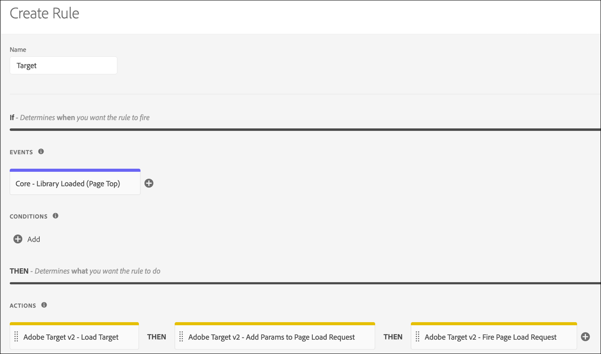

# Visão geral da extensão do Adobe Target v2

>[!NOTE]
>
>O Adobe Experience Platform Launch está sendo reformulado como um conjunto de tecnologias de coleção de dados na Experience Platform. Como resultado, várias alterações de terminologia foram implementadas na documentação do produto. Consulte o seguinte [documento](../../../term-updates.md) para obter uma referência consolidada das alterações de terminologia.

Use essa referência para obter informações sobre as opções disponíveis ao usar esta extensão para criar uma regra.

## Configurar a extensão do Adobe Target v2

>[!IMPORTANT]
>
>A extensão do Adobe Target exige at.js 2.x.

Se a extensão do Adobe Target ainda não estiver instalada, abra a propriedade, selecione **[!UICONTROL Extensões > Catálogo]**, passe o mouse sobre a extensão do Target e selecione **[!UICONTROL Instalar]**.

Para configurar a extensão, abra a guia Extensões, passe o mouse sobre a extensão e selecione **[!UICONTROL Configurar]**.


### configurações do at.js

Todas as configurações da at.js, com exceção do Tempo limite, são recuperadas automaticamente da configuração da at.js na interface do usuário do Target. A extensão recupera apenas as configurações da interface do usuário do Target quando adicionada pela primeira vez para que todas as configurações sejam gerenciadas na interface do usuário da coleta de dados se forem necessárias atualizações adicionais.

As opções de configuração disponíveis são as seguintes:

#### Código do cliente

O código de cliente é o identificador de conta do Target. Isso deve ser quase sempre deixado como o valor padrão. Ele pode ser alterado usando elementos de dados.

#### ID da organização

Essa ID vincula sua implementação à sua conta da Adobe Experience Cloud. Isso deve ser quase sempre deixado como o valor padrão. Ele pode ser alterado usando elementos de dados.

#### Domínio do servidor

O domínio do servidor se refere ao domínio em que as solicitações do Target são enviadas. Isso deve ser quase sempre deixado como o valor padrão.

#### Aceitação do GDPR

Quando ativado, o Adobe Target fornece a funcionalidade de “aceitar” para auxiliar na estratégia de gerenciamento de consentimento. A funcionalidade de aceitar permite que os clientes controlem como e quando a tag do Target é acionada. Para obter mais informações sobre a aceitação em produtos Adobe, consulte [Privacidade e Regulamento Geral sobre a Proteção de Dados (GDPR)](https://experienceleague.adobe.com/docs/target/using/implement-target/before-implement/privacy/cmp-privacy-and-general-data-protection-regulation.html?lang=pt-BR).

#### Tempo limite (ms)

Se a resposta do Target não for recebida dentro do período definido, a solicitação expirará e o conteúdo padrão será exibido. Ainda há tentativas de solicitações adicionais durante a sessão do visitante. O padrão é 3000 ms, que pode ser diferente do tempo limite configurado na interface do usuário do Target.

Para obter mais informações sobre como funciona a configuração de Tempo limite, consulte a [ajuda do Adobe Target](https://experienceleague.adobe.com/docs/target/using/implement-target/client-side/deploy-at-js/implementing-target-without-a-tag-manager.html?lang=pt_BR).

## Tipos de ação da extensão do Target

Esta seção descreve os tipos de ação disponíveis na extensão do Target.

A extensão do Target fornece as seguintes ações no trecho Then de uma regra:

### Carregar Target

Adicione esta ação à sua regra de tags, onde fizer sentido carregar o Target no contexto de sua regra. Isso carrega a biblioteca do at.js na página. Na maioria das implementações, o Target deve ser carregado em todas as páginas do site. A Adobe recomenda usar a ação Laod Target somente se ela for precedida por uma chamada do Target. Caso contrário, você poderá enfrentar problemas como atraso na chamada do Analytics.

Nenhuma configuração é necessária.

### Carregar o Target com Decisão no dispositivo

Adicione esta ação à sua regra de tags, onde fizer sentido carregar o Target com [no dispositivo de decisão](https://experienceleague.adobe.com/docs/target/using/implement-target/client-side/at-js-implementation/on-device-decisioning/on-device-decisioning.html?lang=pt-BR) ativada no contexto da regra. Isso carrega a biblioteca da at.js com a decisão no dispositivo ativada na página. Na maioria das implementações, o Target deve ser carregado em todas as páginas do site. A Adobe recomenda usar a ação Carregar destino com decisão no dispositivo apenas se for precedida por uma chamada do Target. Caso contrário, você poderá enfrentar problemas como atraso na chamada do Analytics.

Nenhuma configuração é necessária.

### Adicionar params a todas as solicitações

Esse tipo de ação permite que os parâmetros sejam adicionados a todas as solicitações do Target. A ação Carregar Target deve ser usada anteriormente.

1. Especifique o nome e o valor de qualquer parâmetro que desejar adicionar.
1. Selecione o ícone adicionar para adicionar parâmetros.

### Adicionar params à solicitação de carregamento de página

Esse tipo de ação permite que parâmetros sejam adicionados especificamente às solicitações de carregamento de página. A ação Carregar Target deve ser usada anteriormente.

1. Especifique o nome e o valor de qualquer parâmetro que desejar adicionar.
1. Selecione o ícone adicionar para adicionar parâmetros.

### Acionar solicitação de carregamento de página

Esse tipo de ação permite que o Target acione uma solicitação quando a página carregar. A ação Carregar Target deve ser usada anteriormente.

Você deve especificar se deseja ativar a ocultação do corpo para evitar oscilações e o estilo usado ao ocultar o elemento do corpo. As opções disponíveis são as seguintes:

* **Ocultação de corpo:** você pode ativar ou desativar essa configuração. O valor padrão é Ativado, o que significa que o HTML BODY está oculto.
* **Estilo com corpo oculto:** o valor padrão é body{opacity: 0}. Esse valor pode ser alterado para algo diferente, como body{display:none}.

Para obter mais informações, consulte a [documentação de ajuda online do Target](https://experienceleague.adobe.com/docs/target/using/implement-target/client-side/mbox-implement/advanced-mboxjs-settings.html?lang=pt_BR).

### Acionar visualização

A ação Trigger View pode ser chamada sempre que uma nova página for carregada ou quando um componente em uma página for renderizado novamente. A exibição de Acionador deve ser implementada para Aplicativos de página única.

1. Especifique o nome da visualização que deve ser acionada.
1. Especifique se o acionamento da visualização deve ser atribuído a uma impressão para relatórios ao marcar a caixa de seleção Página. Se a exibição estiver relacionada a um componente renderizado novamente e não estiver relacionada a uma impressão para relatórios, deixe a caixa de seleção Página desmarcada.

Para obter mais informações sobre como acionar uma exibição, consulte a [`triggerView()`documentação de ajuda](https://experienceleague.adobe.com/docs/target/using/implement-target/client-side/functions-overview/adobe-target-triggerview-atjs-2.html?lang=pt-BR).

## Implantação básica do Adobe Target

Depois que a extensão do Target estiver instalada, crie pelo menos uma regra para implantá-la corretamente. Primeiro, é preciso carregar a biblioteca do Target (at.js), especificar os parâmetros que você deseja usar com a solicitação de carregamento de página e acionar a solicitação de carregamento de página.

Uma regra do Target com esta implementação básica parece com o seguinte:



Depois de salvar essa regra, será necessário adicioná-la a uma Biblioteca e criá-la/implantá-la para testar o comportamento.

## Extensão do Adobe Target com uma implantação assíncrona

As tags podem ser implantadas de forma assíncrona. Se você estiver carregando a biblioteca de tags de forma assíncrona com o Target nela, o Target também será carregado de forma assíncrona. Esse cenário é totalmente suportado, mas há uma consideração adicional que deve ser tratada.

Nas implantações assíncronas, é possível que a página conclua a renderização do conteúdo padrão antes que a biblioteca do Target seja totalmente carregada e tenha realizado a troca de conteúdo. Isso pode levar ao que é conhecido como &quot;oscilação&quot;, em que o conteúdo padrão é exibido brevemente antes de ser substituído pelo conteúdo personalizado especificado pelo Target. Caso deseje evitar essa oscilação, sugerimos usar um trecho de pré-ocultação e carregar o pacote de tags de forma assíncrona para evitar qualquer oscilação de conteúdo.

Estas são algumas coisas que devem ser lembradas ao usar o trecho pré-ocultação:

* O trecho deve ser adicionado antes de carregar o código incorporado do cabeçalho da tag.
* Esse código não pode ser gerenciado por tags, portanto, deve ser adicionado diretamente à página.
* A página é exibida quando os seguintes eventos ocorrem:
   * Quando a resposta de carregamento da página for recebida
   * Quando a solicitação de carregamento de página expira
   * Quando o trecho atingir o tempo limite
* A ação “Acionar solicitação de carregamento de página” deve ser usada em todas as páginas que usam o trecho pré-ocultação para minimizar a duração da pré-ocultação.
* A ocultação de corpo também deve estar ativada na ação Solicitação de carregamento de página na regra de Carregamento de página que você usa para o Target na interface do usuário da coleta de dados; caso contrário, todos os carregamentos de página permanecerão ocultos pelo período limite.

O trecho de código de pré-ocultação é o seguinte e pode ser minimizado. As opções configuráveis estão no final:

```js
;(function(win, doc, style, timeout) {
  var STYLE_ID = 'at-body-style';

  function getParent() {
    return doc.getElementsByTagName('head')[0];
  }

  function addStyle(parent, id, def) {
    if (!parent) {
      return;
    }

    var style = doc.createElement('style');
    style.id = id;
    style.innerHTML = def;
    parent.appendChild(style);
  }

  function removeStyle(parent, id) {
    if (!parent) {
      return;
    }

    var style = doc.getElementById(id);

    if (!style) {
      return;
    }

    parent.removeChild(style);
  }

  addStyle(getParent(), STYLE_ID, style);
  setTimeout(function() {
    removeStyle(getParent(), STYLE_ID);
  }, timeout);
}(window, document, "body {opacity: 0 !important}", 3000));
```

Por padrão, o trecho oculta previamente todo o HTML BODY. Em alguns casos, você pode querer ocultar previamente apenas certos elementos de HTML e não a página inteira. Você pode conseguir isso personalizando o parâmetro de estilo. Substitua por algo que oculta apenas regiões específicas da página.

Por exemplo, você tem duas regiões identificadas por IDs, contêiner-1 e contêiner-2, o estilo poderá ser substituído pelo seguinte:

```css
#container-1, #container-2 {opacity: 0 !important}
```

Em vez do padrão:

```css
body {opacity: 0 !important}
```

Por padrão, o trecho expira em 3000 ms ou 3 segundos. Esse valor pode ser personalizado.
