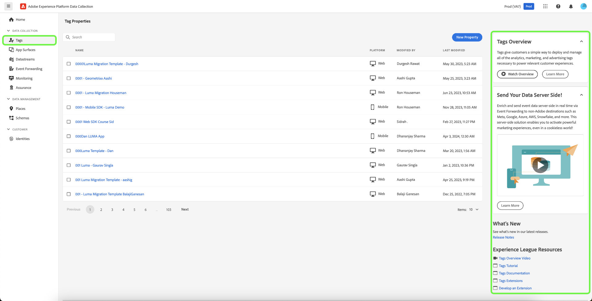

# Visão geral das tags

As tags na Adobe Experience Platform (antes conhecidas como Adobe Experience Platform Launch) são a próxima geração de recursos de gerenciamento de tags da Adobe. As tags oferecem aos clientes uma forma simples de implantar e gerenciar todas as tags de análise, de marketing e de anúncios necessárias para potencializar experiências de cliente relevantes.

As tags capacitam qualquer pessoa a criar e manter suas próprias integrações, chamadas de *extensões*. Essas extensões estão disponíveis para os clientes do [!DNL Adobe Experience Cloud] em uma experiência de loja de aplicativos, para que possam instalar, configurar e implantar tags com rapidez.

As tags são oferecidas aos [!DNL Adobe Experience Cloud] clientes como um recurso incluso com valor agregado.

## Principais benefícios {#key-benefits}

* Retorno do valor mais rápido.
* Dados confiáveis por meio de coleção, organização e entrega centralizadas com o uso de elementos de dados
* Experiências atraentes por meio da integração da tecnologia de marketing e de dados com o uso do construtor de regras.

## Recursos principais {#key-features}

Use a na ajuda do produto, no painel direito, para saber mais sobre tags e visualizar recursos adicionais disponíveis.

### Extensões {#extensions}

Uma extensão é um pacote de código (JavaScript, HTML e CSS) que estende a funcionalidade das tags. Crie, gerencie e atualize suas integrações usando uma interface de autoatendimento virtual. Pense nas extensões como aplicativos usados para realizar as tarefas.

### Catálogo de extensões {#extension-catalog}

Navegue, configure e implante ferramentas de marketing e de anúncios programadas e mantidas por fornecedores de software independentes.

### Construtor de regras {#rule-builder}

Crie regras robustas que combinam vários eventos, sequenciados de forma determinada com o uso da lógica if/then com condições e exceções. As regras fornecem opções para:

* Eventos
* Condições
* Exceções
* Ações

O construtor de regras inclui verificação de erros em tempo real e realce de sintaxe para seu código personalizado.

Quando os critérios definidos nas regras são cumpridos e as condições são atendidas, as ações definidas são executadas em ordem.

### Elementos de dados {#data-elements}

Colete, organize e forneça dados em todas as tecnologias de anúncios e de marketing com base na Web.

### Publicação para empresas {#enterprise-publishing}

O processo de publicação permite que as equipes publiquem o código nas páginas. Pessoas diferentes podem criar uma implementação, aprová-la e publicá-la em suas páginas.

* Alterações no código são encapsuladas em bibliotecas definidas por você.
* Especifique onde e quando quer seu código implantado.
* É possível diferentes equipes criarem várias bibliotecas em paralelo.
* Ambientes de desenvolvimento ilimitados.
* Um processo deliberado e baseado em permissão para mesclar bibliotecas.

### APIs abertas {#open-apis}

Automatize implementações de tecnologias individuais ou de um grupo de tecnologias.

* As tags interagem com a API do Reactor.
* É possível automatizar as implantações por meio de APIs.
* Integre as APIs do a seus próprios sistemas internos.
* Se desejar, você poderá criar sua própria interface do usuário.

### Tag contêiner modular e leve {#modular-tag}

O conteúdo do container é minimizado, incluindo o código personalizado. Tudo é modular. Se você não precisar de um item, ele não será incluído na biblioteca. O resultado é uma implementação rápida e compacta. Consulte [Minificação](./ui/publishing/builds.md).

## Outros destaques {#other-highlights}

As tags oferecem várias melhorias com relação a sistemas similares, incluindo:

* Nenhum uso do `document.write ()`, onde o Chrome não permite seu uso.
* As regras de parte superior e inferior da página são agrupadas na biblioteca principal para minimizar chamadas HTTP desnecessárias.
* É possível carregar scripts de ação personalizados em paralelo dentro de uma regra, mas eles são executados sequencialmente.
* Se evitar regras de parte superior e inferior da página, o código é em sua maioria assíncrono, podendo se tornar totalmente assíncrono.
