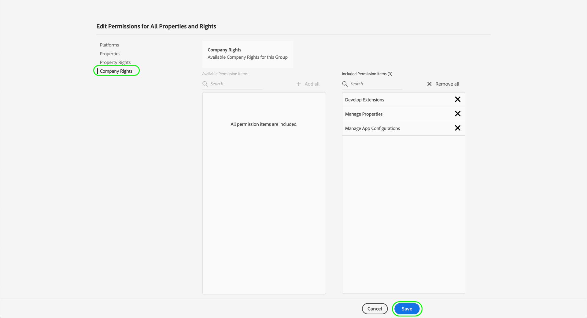

# Gerenciar permissões para tags

>[!NOTE]
>
>A Adobe Experience Platform Launch foi reformulada como um conjunto de tecnologias de coleta de dados no Adobe Experience Platform. Como resultado, várias alterações de terminologia foram implementadas na documentação do produto. Consulte o seguinte [documento](../../term-updates.md) para obter uma referência consolidada das alterações de terminologia.

Para usar tags no Adobe Experience Platform, você deve ter acesso a pelo menos um produto Adobe Experience Cloud por meio do Adobe Admin Console. Além disso, você também deve receber permissões para tags no nível do perfil do produto para executar determinadas ações quando conectado à interface do usuário da coleta de dados.

Este guia aborda como conceder essas permissões a usuários usando o Admin Console.

>[!NOTE]
>
>Para obter informações detalhadas sobre os diferentes tipos de permissões de tag disponíveis mencionados neste guia, consulte a [visão geral de permissões do usuário](./user-permissions.md).

## Obter direitos de administrador para um perfil de produto de tags

Para gerenciar permissões de usuário para tags, você deve ser pelo menos um administrador de perfil de produto para tags no Adobe Admin Console. Os administradores de sistema e administradores de produto também podem gerenciar permissões para um perfil de produto de tags.

Consulte o documento do Admin Console em [adminstrações](https://helpx.adobe.com/enterprise/admin-guide.html/enterprise/using/admin-roles.ug.html) para obter mais informações sobre os diferentes níveis de administrador e como gerenciar essas funções em sua organização.

## Selecione um perfil de produto para gerenciar permissões para

Depois de ter direitos de administrador, entre no Admin Console e selecione **[!UICONTROL Products]** na navegação superior. Na lista de produtos exibidos, selecione **[!UICONTROL Adobe Experience Platform Launch]**.

Uma lista de perfis de produto é exibida. Um perfil de produto é uma construção que vincula um grupo de permissões a um grupo de usuários. Aqui, você pode criar um novo perfil para configurar, ou selecionar um perfil de produto existente na lista para editar (supondo que você tenha direitos de administrador para esse perfil).

### Criar um perfil de produto

>[!NOTE]
>
>Se você selecionou um perfil existente para editar, pule para a [próxima seção](#permissions).

Para criar um novo perfil de produto, selecione **[!UICONTROL Novo perfil]**.

Uma caixa de diálogo é exibida, permitindo que você forneça um nome e uma descrição opcional para o perfil. Você também pode alternar se os usuários devem receber emails quando são adicionados ou removidos desse perfil. Quando terminar, selecione **[!UICONTROL Save]**.

## Configurar permissões para o perfil do produto {#permissions}

A página de detalhes do perfil do produto é exibida. Usando as guias fornecidas, você pode gerenciar os usuários atribuídos ao perfil e configurar as propriedades e direitos específicos que o perfil concederá a esses usuários.

As etapas sobre como adicionar usuários são fornecidas [posteriormente neste guia](#users). Por enquanto, selecione **[!UICONTROL Permissões]**.

A próxima tela mostra uma visão geral do número de plataformas, propriedades e direitos atribuídos ao perfil no momento. Selecione **[!UICONTROL Editar]** ao lado de uma das linhas para começar a configurar as permissões do perfil.

A tela [!UICONTROL Editar permissões] é exibida, o que permite adicionar e remover permissões do perfil de produto. Na seção **[!UICONTROL Platforms]**, é possível ver que todas as plataformas foram adicionadas ao perfil por padrão.

### Atribuir propriedades

Para atribuir propriedades a esse perfil, selecione **[!UICONTROL Properties]** no painel de navegação esquerdo.

Por padrão, um novo perfil de produto recebe automaticamente acesso a todas as propriedades que estão disponíveis para a sua organização. Isso inclui propriedades que estão disponíveis no momento e quaisquer propriedades feitas no futuro.

Se desejar limitar as propriedades disponíveis, selecione a opção **[!UICONTROL Incluir automaticamente]**. Isso permite adicionar e remover manualmente as propriedades da propriedade, dependendo de suas necessidades.

Se a inclusão automática estiver desativada, todas as propriedades disponíveis no momento serão listadas à esquerda. Você pode adicionar propriedades ao perfil selecionando o ícone de adição (**+**) ao lado da propriedade em questão na coluna esquerda. Para remover uma propriedade, selecione o ícone **X** ao lado da propriedade em questão na coluna direita.

>[!IMPORTANT]
>
>Desativar o recurso de inclusão automática significa que todas as propriedades criadas no futuro devem ser adicionadas manualmente ao perfil do produto para que ele tenha acesso a elas.

### Atribuir direitos

Por padrão, todos os direitos são desativados em um perfil de produto e devem ser adicionados manualmente para serem ativados. Se você pertencer a um perfil de produto que inclui automaticamente propriedades, mas não tem direitos de leitura, você terá acesso somente a todas as propriedades.

>[!NOTE]
>
>Um usuário pode pertencer a vários perfis de produto no Admin Console, mas os direitos desses perfis não são combinados em um conjunto de permissões principal. Esse usuário ainda tem os direitos atribuídos explicitamente por cada grupo.
>
>Por exemplo, se o Grupo 1 conceder acesso à Propriedade A com o direito de desenvolvimento e o Grupo 2 conceder acesso à Propriedade B com o direito de publicação, os direitos de desenvolvimento e publicação não serão combinados para a Propriedade A e a Propriedade B. Você só pode desenvolver na Propriedade A e publicar na Propriedade B.

Selecione **[!UICONTROL Direitos de propriedade]** no painel de navegação esquerdo. Assim como nas propriedades, você pode selecionar o ícone de adição (**+**) ao lado de uma propriedade, ao lado do direito de adicioná-lo ao perfil. Se quiser adicionar todos os direitos de propriedade ao perfil, também poderá selecionar **[!UICONTROL Add all]**.

Em seguida, selecione **[!UICONTROL Direitos da empresa]** no painel de navegação esquerdo. Adicione ou remova os direitos necessários e, uma vez terminado, selecione **[!UICONTROL Save]**.

## Atribuir usuários ao perfil {#users}

Para atribuir usuários ao perfil do produto, selecione a guia [!UICONTROL Usuários] e selecione [!UICONTROL Adicionar usuário].

Na caixa de diálogo exibida, digite o nome, o grupo de usuários ou o endereço de email dos usuários que deseja adicionar ao perfil. Se um usuário fizer parte de sua organização, suas informações serão exibidas em uma lista suspensa de preenchimento automático, que poderá ser selecionada para preencher os detalhes. Se eles não fizerem parte da organização, você poderá inserir manualmente as informações.

Quando terminar, selecione **[!UICONTROL Save]** para adicionar os usuários especificados ao perfil do produto.

Depois que os usuários são adicionados ao perfil, eles recebem um email informando que agora têm direitos para a interface do usuário da coleta de dados.

## Próximas etapas

Este documento cobriu como gerenciar propriedades e direitos da interface do usuário da Coleta de dados usando o Adobe Admin Console. Para obter mais informações sobre as permissões disponíveis e as funcionalidades às quais elas concedem acesso, consulte a visão geral em [permissões de usuário](./user-permissions.md).
