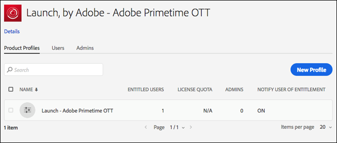

# Permissões de usuário

>[!NOTE]
>
>A Adobe Experience Platform Launch foi reformulada como um conjunto de tecnologias de coleta de dados no Adobe Experience Platform. Como resultado, várias alterações de terminologia foram implementadas na documentação do produto. Consulte o seguinte [documento](../../term-updates.md) para obter uma referência consolidada das alterações de terminologia.

## Tipos de permissão

Há duas permissões de usuário a serem compreendidas para uso com tags no Adobe Experience Platform:

* **Permissões da Experience Cloud:** encontradas no Admin Console no nível da empresa, as permissões do [!DNL Experience Cloud] regulam quem pode controlar permissões de grupo e a associação a grupos para todos os produtos da [!DNL Experience Cloud].
* **Permissões para tags:** as permissões para tags estão localizadas no Admin Console no nível do Perfil do produto. Essas permissões regulam quais usuários podem realmente executar determinadas ações quando conectadas à interface do usuário da coleta de dados.

Este artigo examina detalhadamente esses diferentes tipos de permissões.

### Permissões da Experience Cloud

Esta seção discute fatores importantes no uso do Platform. Consulte [Funções administrativas no Guia de usuário Enterprise](https://helpx.adobe.com/pt/enterprise/using/admin-roles.html) para obter uma visão abrangente das permissões do [!DNL Experience Cloud].

#### Administrador de organização

Os administradores de organização geralmente são chamados de Org Admins. A função principal do Org Admin é atribuir permissões a outros usuários. Eles fazem isso criando Perfis (ou grupos) de produto que contêm um conjunto específico de direitos em um produto específico e, em seguida, atribuindo aos usuários, existentes ou novos, o Perfil do produto.

Os Org Admins do Enterprise não herdam quaisquer direitos para tags na Platform. Eles devem se adicionar a um perfil de produto que tenha as permissões apropriadas se quiserem fazer alguma coisa na interface do usuário da coleta de dados.

#### Administrador de produto

Um Administrador de produto (ou Admin de produto) é semelhante a um Org Admin, mas é mais limitado em termos de escopo. Um Administrador de produto só tem permissão para modificar Perfis de produto para um produto específico do [!DNL Adobe], em vez de poder modificar todos os produtos do [!DNL Adobe] aos quais a empresa tem acesso.

### Permissões para tags

No [!DNL Experience Cloud], nenhum direito ou permissão é atribuído a usuários individuais. Eles são atribuídos a um Perfil de produto (consulte “Permissões da Experience Cloud” acima). Os usuários individuais são designados a um ou mais Perfis de produto.

Em um Perfil de produto, as permissões para tags são divididas em quatro dimensões.

1. Plataformas
1. Propriedades
1. Direitos de propriedade
1. Direitos da empresa

#### Plataformas

Cada propriedade tem uma plataforma. Atualmente, existem duas plataformas que podem ser usadas para tags: *Web* e *Mobile*. Você pode usar esse tipo de permissão para restringir ou conceder acesso a um tipo específico de propriedade. A permissão pode ser útil quando a equipe que gerencia os aplicativos móveis for diferente da que gerencia os sites.

#### Propriedades

Esta é uma lista de todas as Propriedades que existem na sua empresa. Você pode usar esse tipo de permissão para restringir ou conceder acesso a propriedades existentes específicas (por nome).

#### Direitos de propriedade

Todas as propriedades criadas na interface do usuário da coleta de dados ficam disponíveis no Admin Console para que você atribua permissões. Se um determinado Perfil de produto não tiver acesso à Propriedade A1, os usuários que pertencem a esse perfil não poderão ver nem modificar nenhuma configuração na Propriedade A1.

Supondo que um usuário pertença a um perfil com acesso à Propriedade A1, o que o usuário pode fazer dentro da Propriedade A1 é determinado pelos direitos que foram concedidos pelo grupo de permissão. Os usuários com permissões para a Propriedade A1, mas sem direitos atribuídos, têm acesso para somente leitura.

As permissões disponíveis neste grupo são:

* **Desenvolver:** permite criar regras e elementos de dados. Você também pode criar bibliotecas e criá-las em ambientes de desenvolvimento existentes. Você pode enviar uma biblioteca para aprovação quando estiver pronta. A maioria das tarefas diárias na interface do usuário da Coleta de dados requer esse direito.
* **Aprovar:** isso permite pegar uma biblioteca enviada e criar no ambiente de preparo temporário. Você também pode aprovar uma biblioteca para publicação depois que o teste for concluído.
* **Publicar:** permite publicar bibliotecas aprovadas no ambiente de produção.
* **Gerenciar extensões:** isso concede as capacidades de instalar novas extensões em uma propriedade, de modificar a configuração da extensão para uma extensão já instalada e de excluir uma extensão. Consulte a documentação de visão geral das extensões para obter [mais informações sobre extensões](../managing-resources/extensions/overview.md). Normalmente, essa função pertence aos setores de TI ou de Marketing, dependendo de como funciona a sua organização.
* **Gerenciar ambientes:** isso permite criar e modificar ambientes. Consulte a [documentação de ambientes](../publishing/environments.md) para obter mais informações. Normalmente, essa função pertence ao grupo de TI.

#### Direitos da empresa

Os direitos da empresa se aplicam às permissões que abrangem várias propriedades. Atualmente, há três:

* **Gerenciar propriedades:** isso permite criar novas propriedades na interface do usuário da Coleta de dados e modificar os metadados e as configurações no nível da propriedade. Também é possível excluir propriedades. Leia a [documentação de propriedades](companies-and-properties.md) para obter mais informações. São administradores que normalmente executam essa função.
* Concede a capacidade de criar novas propriedades e modificar os metadados e as configurações no nível da propriedade. Também é possível excluir propriedades. Leia mais sobre as propriedades [aqui](companies-and-properties.md). São administradores que normalmente executam essa função.
* **Desenvolver extensões:** concede a capacidade de criar e modificar pacotes de extensão da empresa, incluindo versões privadas e solicitações de lançamento de versão pública.
* **Gerenciar configurações do aplicativo:** está disponível apenas para clientes que possuem o Adobe Journey Optimizer licenciadado ou alguma outra solução que ofereça acesso a mensagens móveis no aplicativo e por push.  Isso permite gerenciar os aplicativos que o Experience Cloud conhece, juntamente com as credenciais de push necessárias para se comunicar com o serviço Firebase Cloud Messaging e o serviço de notificação por push da Apple.

### Total de permissões de usuário

O total de permissões de um usuário individual é determinado pelo total de associações a diferentes perfis de produto. Se um usuário pertencer a vários perfis de produto, as permissões de cada perfil serão adicionadas juntas, em vez de serem multiplicadas.

Por exemplo: o Perfil de produto A concede a Henry o direito de desenvolvimento para a Propriedade 1. O Perfil do produto B concede a Henry o direito de publicação para a Propriedade 2. O Henry pode desenvolver na propriedade 1 e publicar na propriedade 2, mas ele não pode publicar na Propriedade 1 ou desenvolver na propriedade 2, pois não recebeu direitos explícitos para isso.

## Cenários de concedimento de direitos

Empresas diferentes têm necessidades diferentes ao criar novos perfis de produtos. Essas necessidades variam com base no tamanho da empresa, estrutura de empresa, número de sites, número de pessoas envolvidas no gerenciamento de tags e assim por diante.

Abaixo estão alguns cenários comuns e um ponto de partida recomendado conforme você pensa em criar perfis de produtos e adicionar usuários a eles.

### Uma pessoa controla tudo

Se você comanda uma pequena empresa com uma pessoa responsável por tudo, conceda a esse usuário permissão a todas as propriedades e atribua a ele todos os direitos listados acima.

### Separação de tarefas

Muitas pessoas estão envolvidas na criação de tags. Você tem um conjunto de pessoas (talvez um consultor externo) que cria regras e elementos de dados, mas não quer que eles tenham acesso ao ambiente de produção. Certifique-se de que ninguém vai implantar em produção, com exceção da equipe de TI.

1. Crie uma conta para seus consultores e conceda a eles apenas o direito de desenvolver.
1. O consultor cria e faz testes dentro dos limites definidos.
1. Se o consultor quiser uma nova extensão, ou se uma estiver pronta para ser ativada, um representante da sua organização (com os direitos apropriados) realiza essas ações.

### Empresarial

Uma empresa com assinatura Empresarial pode ter vários sites divididos geograficamente, com equipes diferentes responsáveis por cada local. Nessas equipes, indivíduos diferentes desenvolvem e publicam.

Isso é semelhante à &quot;Separação de tarefas&quot; mencionada acima, mas é organizado por áreas geográficas.

* América do Norte
   * Grupo de desenvolvimento
   * Grupo de publicação
* Europa
   * Grupo de desenvolvimento
   * Grupo de publicação
* ...
   * Grupo de desenvolvimento
   * Grupo de publicação

## Exemplos

Alguns exemplos dos tipos de funções que você pode ter em sua organização e quais permissões você deve atribuir a ele podem ajudar a esclarecer esse conceito.

Aqui estão algumas descrições de diferentes funções que podem ser aplicadas em sua organização, além de uma matriz para mostrar as permissões necessárias para executar a tarefa.

* O gerente: quer ver o que está acontecendo, mas não deve poder fazer alterações.
* O profissional de marketing: pode instalar extensões e configurar novas tags para propriedades existentes, mas não pode publicar nos ambientes de armazenamento temporário ou de produção.
* O desenvolvedor do aplicativos móveis: é responsável pela implementação das soluções da Adobe e de terceiros dentro de um aplicativo móvel nativo.
* A equipe de TI: não modifica nenhuma tag realmente, mas tem total controle sobre os ambientes de armazenamento temporário e de produção e o que está neles.
* Usuário versátil: faz de tudo.

| Função | Propriedades | Direitos da empresa | Direitos de propriedade |
|--- |--- |--- |--- |
| O gerente | Incluir automaticamente |  |  |
| O profissional de marketing | Incluir automaticamente | Gerenciar propriedades | Desenvolver gerenciar extensões |
| O desenvolvedor de aplicativos móveis | Incluir automaticamente | Gerenciar propriedades Gerenciar configurações do aplicativo | Desenvolver gerenciar extensões |
| A equipe de TI | Incluir automaticamente | Aprovar publicar gerenciar ambientes |
| O usuário versátil | Incluir automaticamente | Gerenciar propriedades | Desenvolver aprovar publicar gerenciar extensões gerenciar ambientes |
| O desenvolvedor de extensões | Incluir automaticamente | Gerenciar propriedades desenvolver extensões | Desenvolver |

## Atribuição de permissões de usuário

As etapas abaixo guiarão você pelo processo de atribuição de permissões. Você também pode visualizar esse processo [em vídeo](https://www.youtube.com/watch?v=ba28BHX8cwU).

As etapas 1 a 3 abaixo podem ser ignoradas navegando diretamente para o [Adobe Admin Console](https://adminconsole.adobe.com/enterprise/products). Se você pertencer a mais de uma organização, selecione a organização correta no início da navegação, à direita.

### 1. Faça logon na Experience Cloud

Faça logon em [https://experiencecloud.adobe.com/](https://experiencecloud.adobe.com/) com sua Adobe ID e escolha a organização a ser usada na interface do usuário da coleta de dados no menu [!UICONTROL Navegação].

Abra o seletor de soluções clicando no ícone com nove pontos no menu [!UICONTROL Navegação] e selecione **[!UICONTROL Administração]**.

Se você não conseguir ver esse link, ambas as condições a seguir serão verdadeiras:

* Você não é um Org Admin.
* Você não é um administrador de produto para nenhum produto da [!DNL Experience Cloud].

Em qualquer um dos casos, peça a um Org Admin que execute essas etapas, ou que torne você um administrador de produto para tags, para que você possa fazer isso sozinho.

>[!NOTE]
>
>Caso não saiba quem é o Org Admin, entre em contato com o atendimento ao cliente.

### 2. Abrir o Admin Console

Selecione **Admin Console**.

Selecione o cartão **[!DNL Experience Platform Launch]-`Company Name`**.

<!-- Scott, update above image. Rebranding. -->

Você também pode clicar em **[!UICONTROL Produtos]** na navegação superior e selecionar **[!DNL Experience Platform Launch]-`Company Name`** na navegação à esquerda.

Caso não veja um cartão [!DNL Experience Platform Launch] e/ou se [!DNL Experience Platform Launch] não for exibido na lista, você não é um Org Admin, mas sim um administrador de produto para outros produtos da Experience Cloud. Como você não é um administrador do Experience Platform Launch, é necessário encontrar um Org Admin que possa realizar essas etapas para você ou que possa fazer com que você se torne um administrador de produto do [!DNL Platform Launch].

Depois de selecionar o Platform Launch, uma lista de perfis de produto é exibida. Pense nesses perfis como grupos de permissão. Um perfil é criado para você e é nomeado como &quot;[!DNL Platform Launch] - `Company Name`&quot;.

### 3. Criar seu perfil de produto

Se você estiver editando um perfil de produto existente, pule esta etapa.

Escolha editar esse perfil de produto ou criar um novo.

Para criar um novo perfil de produto, selecione **[!UICONTROL Novo perfil]**.

Dê um nome e uma descrição ao novo perfil, configure se os usuários devem receber emails quando são adicionados ou removidos desse perfil e selecione **[!UICONTROL Concluído]**.

### 4. Editar o perfil de produto

Selecione o perfil de produto na lista e abra a guia **[!UICONTROL Permissões]**. Você pode atribuir permissões em duas dimensões: propriedades e direitos.

Para atribuir propriedades a essa definição de grupo, abra a seção **[!UICONTROL Propriedades]**.

Uma lista mostra as propriedades da tag.

Por padrão, novas configurações de produto incluem propriedades automaticamente. Isso significa que todas as propriedades (presentes e futuras) estão incluídas na definição do grupo.

Se a Inclusão automática estiver desativada, todas as propriedades disponíveis no momento estarão listadas à esquerda. Você pode mover propriedades para essa definição de grupo selecionando **[!UICONTROL Adicionar]**.

Selecione **[!UICONTROL Salvar]** ao concluir.

### 5. Atribuir direitos

Atribua os direitos que você deseja que façam parte da definição do grupo. Abra a seção **[!UICONTROL Direitos]**.

Os direitos não são incluídos automaticamente. Você deve atribuir cada direito ao seu perfil. Você pode adicionar todos os direitos a esse perfil rapidamente usando o botão [!UICONTROL + Adicionar tudo] ou atribuir direitos individuais usando os botões + (adicionar) individuais. Para obter mais informações sobre quais permissões estão associadas a cada direito, consulte [Cenários de concedimento de direitos](#rights-scenarios). Selecione **[!UICONTROL Salvar]** ao concluir. Se [!UICONTROL Salvar] não estiver disponível, nenhuma alteração será feita e você não receberá novos direitos.

Primeiro, atribua os direitos de propriedade:

Em seguida, atribua os direitos da empresa:

Algumas observações importantes a ter em mente sobre a atribuição de direitos:

* A falta de direitos significa acesso para somente leitura. Se você pertencer a uma configuração de produto com inclusão automática de propriedades e sem direitos, você terá acesso para somente leitura a todas as propriedades de tags.
* Se você não atribuir as Propriedades corretamente, não poderá adicionar nenhuma propriedade ao fazer logon.
* Um usuário pode pertencer a vários grupos, mas os direitos desses grupos não são combinados em um conjunto de permissões superiores. Esse usuário ainda tem os direitos atribuídos explicitamente por cada grupo.

   Por exemplo, se o Grupo 1 conceder acesso à Propriedade A com o direito de desenvolvimento e o Grupo 2 conceder acesso à Propriedade B com os direitos de publicação, os direitos de desenvolvimento e publicação não serão combinados na Propriedade A nem na Propriedade B. Você só pode desenvolver na Propriedade A e publicar na Propriedade B.

### 6. Atribuir usuários a grupos

Para designar usuários para fazerem parte do seu grupo, abra a guia [!UICONTROL Usuários] e selecione [!UICONTROL Adicionar usuário].

Selecione as reticências (...) para opções adicionais, como operações de usuários em massa.

>[!NOTE]
>
>Ser um Org Admin ou um administrador de produto não concede direitos dentro do produto da tag. Você deve pertencer a pelo menos um perfil de produto.

Procure pelo usuário que você deseja adicionar ao grupo. Você pode pesquisar por nome ou por endereço de email. Isso é preenchido automaticamente com os usuários existentes na organização. Depois de encontrar o usuário que você deseja, selecione o nome dele.

Após adicionar usuários, eles receberão um email informando que eles agora têm direitos. Para fazer logon, siga o link para a [Interface do usuário da coleta de dados](https://launch.adobe.com).

>[!NOTE]
>
>Se o usuário não existir, basta digitar todo o endereço de email e fornecer um nome e sobrenome. O novo usuário recebe um email e, quando ele cria uma ID do [!DNL Adobe] a partir desse convite, ele é atrelado à conta de usuário criada para ele. Se você estiver atribuindo permissões a si mesmo, você não terá esse problema.

## Problemas comuns

### Erro ao carregar a conta

Ao fazer logon na interface do usuário da Coleta de dados, você receberá uma mensagem dizendo &quot;Erro ao carregar a conta&quot;.

Resolução: Seu usuário não pertence a nenhum perfil de produto de tag. Consulte as etapas acima para criar um perfil, atribuir direitos a ele, e designar um usuário a um perfil.

### Botão de Propriedade acinzentado

Após fazer logon, não é possível adicionar nenhuma propriedade.

Solução: a sua conta de usuário não pertence a uma configuração de produto com direito de gerenciar propriedades. Volte para a Etapa 5 acima.
