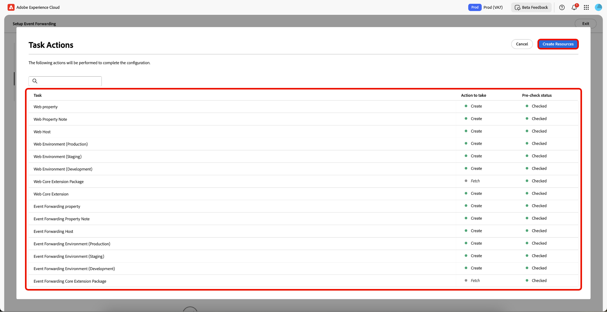
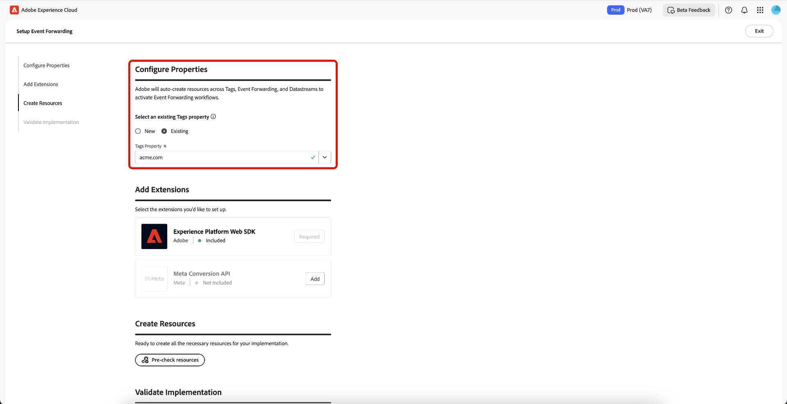

# Visão geral da configuração guiada do encaminhamento de eventos

>[!IMPORTANT]
>
>O recurso de configuração guiada está disponível para clientes que compraram o pacote do Real-Time CDP Prime e Ultimate. Entre em contato com o representante da Adobe para obter mais informações.

>[!NOTE]
>
>Qualquer cliente existente pode usar os workflows de configuração guiados para criar uma implementação de referência que pode ser usada para o seguinte:
>
>* Use-a como o início de uma implementação totalmente nova.
>* Aproveite-a como uma implementação de referência que pode ser examinada para ver como ela foi configurada e replicar em suas implementações de produção atuais.

O recurso de configuração guiada ajuda a configurar com facilidade e eficiência. Essa ferramenta automatiza várias etapas executadas nas tags da Adobe e no encaminhamento de eventos, reduzindo significativamente o tempo de configuração.

Esta configuração pode instalar extensões automaticamente. Esta implementação híbrida é recomendada pelo [!DNL Meta] para coletar e encaminhar conversões de eventos no lado do servidor. O recurso de configuração guiada foi projetado para ajudar você a começar a usar uma implementação de encaminhamento de eventos e não tem como objetivo fornecer uma implementação completa e totalmente funcional que acomode todos os casos de uso.

## Introdução à configuração guiada {#guided-setup}

Para começar a usar o recurso, selecione **[!UICONTROL Get Started]** na interface das Coleções de Dados **[!UICONTROL Event Forwarding]**.

>[!INFO]
>
>Você também pode acessar a configuração guiada diretamente na página inicial das Coleções de dados.

### Criar uma nova propriedade de tags {#new-property}

Na seção Configurar Propriedades, selecione **[!UICONTROL New]** e insira os novos detalhes de **[!UICONTROL Property Domain]**.

Selecione **[!UICONTROL Add]** para [!DNL Meta Conversion API] na seção Adicionar extensões. Na página Configurar Informações do [!DNL Meta], você tem a opção de inserir manualmente o **[!UICONTROL Meta Pixel ID]**, **[!UICONTROL Meta System User Access Token]** e **[!UICONTROL Data Layer Path]** ou pode usar a opção **[!UICONTROL Connect to Meta]**.

#### Conecte-se a [!DNL Meta] usando suas credenciais {#meta-credentials}

Selecione **[!UICONTROL Connect to Meta]**, insira suas credenciais de [!DNL Meta], selecione **[!UICONTROL Log in]** e selecione **[!UICONTROL Next]**.

Você será solicitado a **Criar portfólio comercial**. Insira o **[!UICONTROL Business portfolio name]** e selecione **[!UICONTROL Next]**.

Selecione seu portfólio comercial na lista e, em seguida, selecione **[!UICONTROL Next]**. Você pode ver as configurações para Portfolio Comercial, Conta de Anúncio e [!DNL Meta Pixel]. Selecione **[!UICONTROL Continue]** para confirmar as configurações e selecione **[!UICONTROL Next]**.

Aguarde alguns minutos para que o processo de instalação seja concluído e selecione **[!UICONTROL Done]**.

Os **[!UICONTROL Meta Pixel ID]**, **[!UICONTROL Meta System User Access Token]** e **[!UICONTROL Data Layer Path]** serão preenchidos automaticamente. Selecione **[!UICONTROL Save]**.

#### Criar recursos para a nova propriedade de tags {#create-resources}

Na seção Criar Recursos, selecione **[!UICONTROL Pre-check resources]** para verificar a organização e as propriedades em busca de colisões ou recursos necessários existentes para a implementação.

A página Ações da Tarefa exibe uma lista de tarefas e ações. Selecione **[!UICONTROL Create Resources]** para criar essas tarefas.

Aguarde alguns minutos para que as regras, os elementos de dados, as extensões, as bibliotecas, os SDKs e assim por diante necessários sejam concluídos a instalação. A seção Criar recursos fornece links para as propriedades e os recursos criados.

#### Validar sua implementação {#validate-implementation}

A seção Validar implementação fornece o link incorporado que você pode usar em seu site. O **[!UICONTROL Start Validation]** executa o teste em sua sessão atual do navegador nesta página de configuração guiada. Se a validação for bem-sucedida aqui, a mesma implementação deverá funcionar ao implantar o link incorporado no site.

Selecione **[!UICONTROL Send PageView Event]** para enviar um evento de teste por meio do Adobe Experience Platform Edge Network. Ele é então encaminhado pelo lado do servidor para [!DNL Meta]. Selecione **[!UICONTROL Finished Validation]** para concluir a instalação.

>[!NOTE]
>
>Se ocorrer alguma falha durante o processo de validação, selecione o link **[!UICONTROL Assurance]** para revisar os eventos que podem ter falhado.

### Usar uma propriedade de tags existente {#existing-property}

Na seção Configurar Propriedades, selecione **[!UICONTROL Existing]** e, em seguida, selecione sua propriedade de tags no menu suspenso. O sistema tenta encontrar a propriedade de encaminhamento de eventos já anexada a essa propriedade por meio dos fluxos de dados. Agora você pode continuar a reconfigurar o [!DNL Meta Conversion API] e, em seguida, pré-verificar e criar recursos.

Se a propriedade de tags selecionada não estiver conectada a uma propriedade de encaminhamento de eventos ou se os fluxos de dados estiverem ausentes, eles serão criados automaticamente.

Para configurar seu [!DNL Meta Conversion API], siga o processo destacado acima em [Conectar-se a [!DNL Meta] usando suas credenciais](#meta-credentials).

Agora que você gerou **[!UICONTROL Meta Pixel ID]**, **[!UICONTROL Meta System User Access Token]** e **[!UICONTROL Data Layer Path]**, selecione **[!UICONTROL Pre-Check resources]** para criar o fluxo de trabalho de encaminhamento de eventos.

Como você está usando uma propriedade de tags existente, o processo de configuração é um pouco diferente do fluxo de trabalho da nova propriedade. Você pode ver que o sistema ignorará a criação da propriedade da Web, do host e do ambiente, pois eles já existem. Finalmente, selecione **[!UICONTROL Create Resources]** para criar as tarefas que ainda não estão disponíveis.

>[!INFO]
>
>A configuração guiada adiciona notas automaticamente às propriedades que são atualizadas durante o processo. É possível visualizá-las na seção Notas, no painel direito da propriedade tags, no modo de edição. Você pode ver quando a propriedade foi atualizada ou criada pela ferramenta de configuração guiada. Essa trilha de auditoria ajuda a rastrear modificações feitas pelo recurso de configuração guiada.

Aguarde alguns minutos para que as regras, os elementos de dados, as extensões, as bibliotecas, os SDKs e assim por diante necessários sejam concluídos a instalação. A seção Criar recursos fornece links para as propriedades e os recursos criados.

A seção Validar implementação fornece o link incorporado que você pode usar em seu site. O **[!UICONTROL Start Validation]** executa o teste em sua sessão atual do navegador nesta página de configuração guiada. Se a validação for bem-sucedida aqui, a mesma implementação deverá funcionar ao implantar o link incorporado no site.

Selecione **[!UICONTROL Send PageView Event]** para enviar um evento de teste por meio do Adobe Experience Platform Edge Network. Ele é então encaminhado pelo lado do servidor para [!DNL Meta]. Selecione **[!UICONTROL Finished Validation]** para concluir a instalação.

>[!NOTE]
>
>Se ocorrer alguma falha durante o processo de validação, selecione o link **[!UICONTROL Assurance]** para revisar os eventos que podem ter falhado.

## Próximas etapas {#next-steps}

Este guia abordou como usar a ferramenta de instalação guiada para criar e configurar propriedades para o [!DNL Meta Conversions API].

Consulte a documentação do [!DNL Meta] sobre [práticas recomendadas para o [!DNL Conversions API]](https://www.facebook.com/business/help/308855623839366?id=818859032317965) para obter mais orientações sobre como implementar efetivamente sua integração. Para obter mais informações sobre tags e encaminhamento de eventos no Adobe Experience Cloud, consulte a [visão geral das tags](../../home.md).
