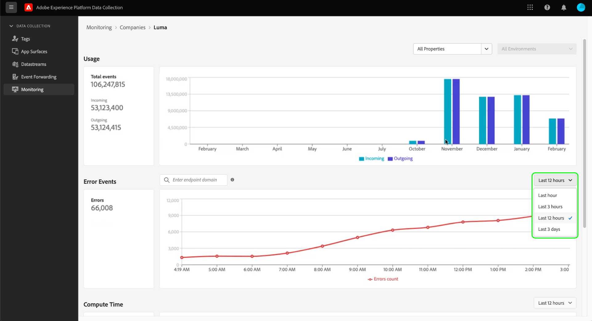

# Monitorar atividades no encaminhamento de eventos (Beta)

>[!IMPORTANT]
>
>No momento, esse recurso está na versão beta e sua organização pode não ter acesso a ele. A funcionalidade e a documentação estão sujeitas a alterações.

O **[!UICONTROL Monitoramento]** na interface do usuário da Coleta de dados, é possível monitorar padrões de uso, erros e o tempo de computação das propriedades de encaminhamento do evento. Este guia fornece uma visão geral de alto nível de como visualizar e entender os relatórios mostrados na guia .

## Pré-requisitos

Este guia presume que você tenha comprado o encaminhamento de eventos e que você tem uma compreensão funcional de como o encaminhamento de eventos funciona. Consulte a [visão geral do encaminhamento de eventos](./overview.md) para obter mais informações.

## Seleção de propriedades e ambientes

É possível visualizar métricas em um ambiente e propriedade individuais, ou em todas as propriedades e ambientes de sua organização.

Para mostrar métricas para uma única propriedade, selecione o menu suspenso de propriedades e escolha a propriedade de interesse na lista. Depois de escolher uma propriedade, você também pode usar a lista suspensa de ambientes para selecionar um ambiente de interesse.

## [!UICONTROL Uso]

O **[!UICONTROL Uso]** mostra chamadas recebidas e enviadas para um determinado período de tempo. Chamadas recebidas representam dados enviados para o encaminhamento do evento. Chamadas de saída representam dados enviados do encaminhamento do evento. O **[!UICONTROL Total de eventos]** no painel esquerdo é a soma das chamadas recebidas e enviadas para o período de tempo especificado.

## [!UICONTROL Eventos de erro]

O **[!UICONTROL Eventos de erro]** mostra erros na agregação e divididos pelo código de resposta HTTP ao passar o cursor sobre o gráfico de linha. Os erros exibidos são de chamadas de saída e os códigos de resposta são do endpoint com o qual o encaminhamento de eventos está interagindo.

Os erros são mostrados para um determinado período, que pode ser ajustado no menu suspenso fornecido.

A caixa de pesquisa do evento de erro permite consultar o encaminhamento de eventos para compreender os erros de um determinado domínio de ponto de extremidade. Você deve inserir o domínio exato, pois o recurso de pesquisa não aceita aproximações ou correspondências &quot;difusas&quot;. Depois de fornecer um domínio exato para o qual há dados de erro de saída, pressione Enter e o relatório será atualizado para mostrar erros de saída para esse domínio. Por exemplo, para ver erros do ponto de extremidade da API de conversões do Facebook, o domínio deve ser gravado como `https://graph.facebook.com`.

## [!UICONTROL Tempo de computação]

O **[!UICONTROL Tempo de computação]** mostra o tempo de computação de todas as regras em servidores de encaminhamento de eventos.

>[!NOTE]
>
>Os horários exibidos não representam a latência de ponta a ponta. O encaminhamento de eventos tem uma limitação de tempo de computação de 50 milissegundos. Se esse limite for excedido, os dados relacionados serão descartados.

Os seguintes fatores afetam o tempo de computação:

1. O número de regras
2. A complexidade das regras, normalmente impulsionada pela quantidade de JavaScript personalizado que está sendo executado

Por exemplo, se uma ação no encaminhamento de eventos atingir um endpoint e esse endpoint levar dois segundos para responder, essa latência de dois segundos não contará em relação ao tempo de computação, pois o encaminhamento de eventos está aguardando e não está computando nada ativamente. O tempo de resposta não pode ser superior a 30 segundos; caso contrário, os dados serão descartados.
