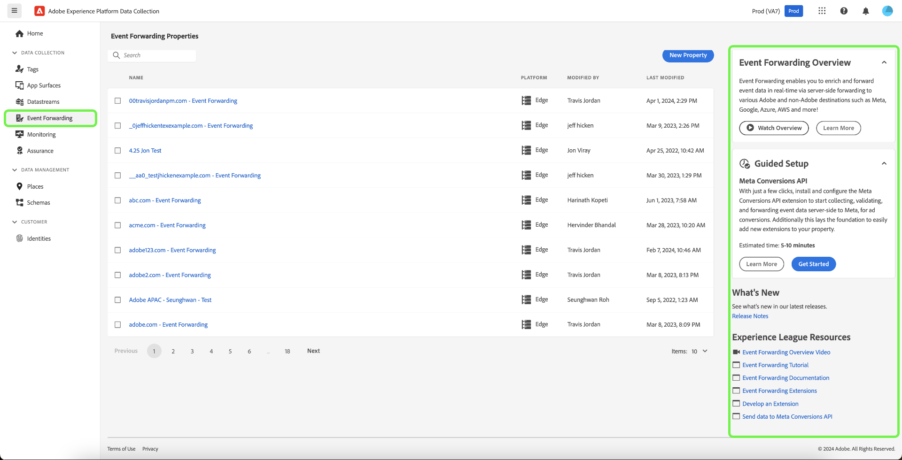

# Visão geral do encaminhamento de eventos

>[!NOTE]
>
>O encaminhamento de eventos é um recurso pago incluído como parte das ofertas de Conexões da Adobe Real-Time Customer Data Platform, Prime ou Ultimate.

O encaminhamento de eventos no Adobe Experience Platform (antes conhecido como lado do servidor do Adobe Experience Platform Launch) permite enviar dados de eventos coletados para um destino para processamento no lado do servidor. O encaminhamento de eventos diminui o peso da página da Web e do aplicativo usando o Adobe Experience Platform Edge Network para executar tarefas normalmente realizadas no cliente. Implementadas de maneira semelhante às tags, as regras de encaminhamento de eventos podem transformar e enviar dados para novos destinos, mas em vez de enviar esses dados de um aplicativo cliente como um navegador da Web, eles são enviados dos servidores da Adobe.

Este documento fornece uma visão geral de alto nível do encaminhamento de eventos no Experience Platform.

>[!NOTE]
>
>Para obter informações sobre como o encaminhamento de eventos se encaixa no ecossistema de coleta de dados da Experience Platform, consulte a [visão geral da coleta de dados](/help/collection/home.md).

O encaminhamento de eventos, combinado com a [Web SDK](/help/collection/js/js-overview.md) e a [SDK Móvel](https://experienceleague.adobe.com/docs/platform-learn/data-collection/mobile-sdk/overview.html) da Adobe Experience Platform, oferece os seguintes benefícios:

**Desempenho**:

* Fazer uma única chamada de uma página que contém uma carga de dados que é federada no lado do servidor para reduzir o tráfego de rede do lado do cliente e fornecer uma experiência mais rápida aos clientes.
* Diminuir o tempo de carregamento das páginas da Web para melhorar o desempenho do site.
* Diminua o número de tecnologias necessárias do lado do cliente para fornecer sua experiência e enviar dados para muitos destinos.

**Governança de dados**:

* Aumentar a transparência e o controle sobre quais dados são enviados e para onde, em todas as propriedades.

## Diferenças entre o encaminhamento de eventos e as tags {#differences-from-tags}

Em termos de configuração, o encaminhamento de eventos usa muitos dos mesmos conceitos que as marcas, como [regras](../managing-resources/rules.md), [elementos de dados](../managing-resources/data-elements.md) e [extensões](../managing-resources/extensions/overview.md). A principal diferença entre os dois pode ser resumida da seguinte forma:

* As marcas **coletam** dados do evento de um site ou aplicativo móvel nativo e os enviam para o Experience Platform Edge Network.
* O encaminhamento de eventos **envia** dados de eventos de entrada do Experience Platform Edge Network para um ponto de extremidade que representa um destino final ou um ponto de extremidade que fornece dados com os quais você deseja enriquecer a carga original.

Embora as tags coletem dados do evento diretamente do seu site ou aplicativo móvel nativo usando os SDKs da Web e móvel da Experience Platform, o encaminhamento de eventos exige que os dados do evento já sejam enviados pelo Experience Platform Edge Network para encaminhá-los aos destinos. Em outras palavras, você deve implementar o Experience Platform Web ou o Mobile SDK na sua propriedade digital (por meio de tags ou usando código bruto) para usar o encaminhamento de eventos.

### Propriedades {#properties}

O encaminhamento de eventos mantém seu próprio armazenamento de propriedades separado das marcas, que podem ser visualizadas na interface do usuário do Experience Platform ou na interface da Coleção de dados selecionando **[!UICONTROL Event Forwarding]** na navegação à esquerda.

>[!TIP]
>
>Use a na ajuda do produto, no painel direito, para saber mais sobre o encaminhamento de eventos e visualizar os recursos adicionais disponíveis.

Todas as propriedades de encaminhamento de eventos listam **[!UICONTROL Edge]** como sua plataforma. Eles não fazem distinção entre Web ou dispositivos móveis porque processam apenas dados recebidos do Experience Platform Edge Network, que pode receber dados de evento de plataformas da Web e móveis.

### Extensões {#extensions}

O encaminhamento de eventos tem seu próprio catálogo de extensões compatíveis, como a extensão [Core](../../extensions/server/core/overview.md) e a extensão [Adobe Cloud Connector](../../extensions/server/cloud-connector/overview.md). Você pode exibir as extensões disponíveis para propriedades de encaminhamento de eventos na interface selecionando **[!UICONTROL Extensions]** na navegação à esquerda, seguido de **[!UICONTROL Catalog]**.

Você pode ver recursos adicionais disponíveis para saber mais sobre este recurso selecionando  no painel direito.

### Elementos de dados {#data-elements}

Os tipos de elementos de dados disponíveis no encaminhamento de eventos estão limitados ao catálogo de [extensões](#extensions) compatíveis que os fornecem.

Embora os elementos de dados em si sejam criados e configurados da mesma forma no encaminhamento de eventos que para tags, há algumas diferenças de sintaxe importantes quando se trata de como eles fazem referência a dados do Experience Platform Edge Network.

#### Referência a dados do Experience Platform Edge Network {#data-element-path}

Para referenciar dados do Experience Platform Edge Network, você deve criar um elemento de dados que forneça um caminho válido para esses dados. Ao criar o elemento de dados na interface do usuário, selecione **[!UICONTROL Core]** para a extensão e **[!UICONTROL Path]** para o tipo.

O valor **[!UICONTROL Path]** do elemento de dados deve seguir o padrão `arc.event.{ELEMENT}` (por exemplo: `arc.event.xdm.web.webPageDetails.URL`). Esse caminho deve ser especificado corretamente para que os dados sejam enviados.

Você pode ver recursos adicionais disponíveis para saber mais sobre este recurso selecionando  no painel direito.

### Regras {#rules}

A criação de regras nas propriedades do encaminhamento de eventos funciona de maneira semelhante às tags, com a principal diferença sendo que não é possível selecionar eventos como componentes de regra. Em vez disso, uma regra de encaminhamento de eventos processa todos os eventos que recebe da [sequência de dados](/help/datastreams/overview.md) e encaminha esses eventos para destinos se determinadas condições forem atendidas.

Além disso, há um tempo limite de 30 segundos que se aplica a um único evento, pois ele é processado em todas as regras (e, portanto, todas as ações) em uma propriedade de encaminhamento de eventos. Isso significa que todas as regras e ações para um único evento devem ser concluídas nesse período.

Você pode ver recursos adicionais disponíveis para saber mais sobre este recurso selecionando  no painel direito.

#### Tokenização do elemento de dados {#tokenization}

Nas regras de marcas, os elementos de dados são tokenizados com um `%` no início e no fim do nome do elemento de dados (por exemplo: `%viewportHeight%`). Nas regras de encaminhamento de eventos, os elementos de dados são tokenizados com `{{` no início e `}}` no fim do nome do elemento de dados (por exemplo: `{{viewportHeight}}`).

Você pode ver recursos adicionais disponíveis para saber mais sobre este recurso selecionando  no painel direito.

#### Sequência de ações de regras {#action-sequencing}

A seção [!UICONTROL Actions] de uma regra de encaminhamento de eventos é sempre executada sequencialmente. Por exemplo, se uma regra tiver duas ações, a segunda ação não iniciará a execução até que a ação anterior seja concluída (e nos casos em que uma resposta é esperada de um endpoint, esse endpoint respondeu). Certifique-se de que a ordem das ações esteja correta ao salvar uma regra. Essa sequência de execução não pode ser executada de forma assíncrona como com as regras de tag.

## Segredos {#secrets}

O encaminhamento de eventos permite criar, gerenciar e armazenar segredos que podem ser usados para autenticação nos servidores para os quais você está enviando dados. Consulte o guia em [segredos](./secrets.md) sobre os diferentes tipos de segredos disponíveis e como eles são implementados na interface do usuário.

## Visão geral do vídeo {#video}

O vídeo a seguir tem como objetivo ajudá-lo a entender melhor o Encaminhamento de eventos e as conexões do Real-Time CDP.

>[!VIDEO](https://video.tv.adobe.com/v/3429308)

## Próximas etapas

Este documento forneceu uma introdução de alto nível ao encaminhamento de eventos. Para obter mais informações sobre como configurar este recurso para sua organização, consulte o [guia de introdução](./getting-started.md).
